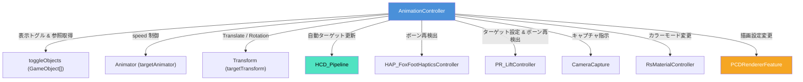

# キーボード操作対応表 (AnimationControls) 仕様書

> 📂 **親ノード**: [Wiki.md](./Wiki.md) | 🏷️ **種類**: 📖 リファレンスガイド  
> [RealTimeOcclusion Wiki (ポータル)](./Wiki.md) に戻る

本ドキュメントでは、デモや実験撮影時の操作を効率化するために `AnimationController` に実装されているキーボードショートカット、3D移動操作、および関連コンポーネント自動バインド仕様について解説します。

---

## 1. 概要

`AnimationController` は、キーボード入力に応じてターゲットオブジェクトの表示切り替え、アニメーション停止、実験画像の撮影、提案手法の個別・一括パラメータ切り替え、カラーモード変更、および視点追従移動などの主要操作をインゲームで即座に実行するデバッグ・実験制御スクリプトです。

### 主な特徴

* **ワンキー操作環境**: `Tab` キーによる表示対象の切り替え、`Space` キーによるアニメーションの一時停止・再開、`Enter` キーによるマルチマップデバッグ撮影を即座に実行可能です。
* **Ablation Study 対応**: 提案オクルージョン手法（タグスキップ、密度計算補正、ソフトフェード、穴埋め補完）を一括 (`M` キー) または個別 (`1`〜`4` キー) にオン/オフ切り替え可能です。
* **関連コンポーネント自動連動**: 表示オブジェクト切り替え時に `HCD_Pipeline` (接触判定)、`HAP_FoxFootHapticsController` (足部触覚)、および `PR_LiftController` (持ち上げ動作) の参照とターゲットボーンを自動検出・更新します。
* **インタラクティブ Transform 移動**: ターゲットオブジェクトを 3D 空間内で自由にキーボード移動 (`WASD` / `Q` / `E`) させ、カメラ視点への自動追従 (`F` キー) をトグル制御可能です。

---

## 2. 設計思想・アーキテクチャ

本コンポーネントは、管理オブジェクト（`Main Camera` や `GameManager` 等）にアタッチして使用し、インスペクター上で登録された `toggleObjects` のアクティブ状態に連動して各種プロセッサや描画設定へターゲット参照を動的アサインします。

### 2.1 生成ファイル・ディレクトリ構成

```text
Assets/Features/Animation/
├── Material/                          # アニメーション用マテリアル
├── Prefabs/                           # アニメーション用プレハブアセット
└── Scripts/
    ├── AnimationController.cs         # キーボード操作・デバッグ撮影・連携統括コントローラー
    ├── PR_Controller.cs              # 物理パラメータ動的切り替えコントローラー
    ├── PR_HcdBoneApplier.cs          # HCD判定ボーン自動割り当て補助
    ├── PR_LiftController.cs          # 持ち上げ追従移動コントローラー
    └── Editor/                        # Editor拡張スクリプト配置ディレクトリ
```

### 2.2 クラス相関図



### 2.3 処理・バインド自動更新フロー

```text
UpdateActiveTargetReferences()
  │
  ├── 1. toggleObjects[currentActiveIndex] から Transform と Animator を再取得
  │
  ├── 2. autoUpdateCollisionTarget == true の場合:
  │       └─ HCD_Pipeline.distanceProcessor に SkinnedMesh / MeshFilter / Transform を自動割り当て
  │
  ├── 3. HAP_FoxFootHapticsController の rootTransform 更新 & AutoDetectBones() 実行
  │
  └── 4. PR_LiftController の targetTransform 更新 & AutoDetectBones() 実行
```

---

## 3. セットアップ・使用方法

### 3.1 クイックスタート手順

#### Step 1: コンポーネントのアタッチと参照設定

シーン内の管理用 GameObject（例: `Main Camera` または `GameManager`）に `AnimationController` をアタッチし、インスペクターで必要な参照を設定します。

| 設定項目 | 型 | 既定値 | 説明 |
|---|---|---|---|
| `toggleObjects` | `GameObject[]` | `None` | `Tab` キーで順番に切り替える表示対象オブジェクトの配列 |
| `cameraCapture` | `CameraCapture` | `None` | キャプチャ撮影用スクリプトの参照 |
| `materialController` | `RsMaterialController` | `None` | 点群カラーモード切り替え用コントローラー |
| `HCDPipeline` | `HCD_Pipeline` | `None` | 接触判定対象を自動更新するパイプライン（`null` 時は自動検索） |
| `liftController` | `PR_LiftController` | `None` | 持ち上げ追従コントローラー（`null` 時は自動検索） |
| `autoUpdateCollisionTarget` | `bool` | `true` | 表示オブジェクト切り替え時に HCD の判定対象を自動更新するか |
| `moveSpeed` | `float` | `1.0f` | キーボード操作時の移動速度 (m/s) |
| `lookAtCamera` | `bool` | `true` | オブジェクトが自動でカメラ（視点）方向を向くか (`F` キーでトグル) |
| `lookAtSpeed` | `float` | `5.0f` | カメラ方向へ向きを変える回転補間速度 |

#### Step 2: シーン配置と動作確認

1. Play モードに入ります。
2. `Tab` キーを押して表示オブジェクトが切り替わり、ログに選択されたオブジェクト名が表示されることを確認します。
3. `Space` キーでアニメーションの一時停止・再開が切り替わることを確認します。
4. `W` / `A` / `S` / `D` / `Q` / `E` キーで現在アクティブなターゲットが移動することを確認します。

---

## 4. 仕様・パラメータ詳細

### 4.1 キーボードショートカット一覧

| アクション | キー (Key) | 詳細・影響パラメータ |
|:---|:---|:---|
| **デバッグ撮影 / カメラ保存** | `Enter` / `Return` | `PCDRendererFeature` の各種 DebugMap (`OcclusionDebugMap`, `PixelTagMap`, `IntegratedDepthMap`, `NeighborhoodMap`, `NeighborCountMap`) の出力フラグを ON にし、`CameraCapture` を実行して視点映像を保存 |
| **表示オブジェクト切り替え** | `Tab` | `toggleObjects` 配列の要素を順次トグル切り替えし、アクティブターゲットの参照を更新 |
| **アニメーション再生/一時停止** | `Space` | `Animator.speed` を `0f` と `1f` でトグル切り替え |
| **提案手法の一括切り替え** | `M` | 提案手法（①〜④）をまとめて ON / OFF 切替（Ablation Study 用） |
| **① タグスキップ最適化** | `1` / `Alpha1` | `PCDRendererFeature.settings.enableTagBasedOptimization` をトグル切替 |
| **② 密度計算補正** | `2` / `Alpha2` | `PCDRendererFeature.settings.enableTypeAwareDensity` をトグル切替 |
| **③ ソフトフェード** | `3` / `Alpha3` | `PCDRendererFeature.settings.enableSoftOcclusionFade` をトグル切替 |
| **④ 穴埋め手法切り替え** | `4` / `Alpha4` | `holeFillingMethod` を順次ローテーション (`None` → `JointBilateral` → `PullPush` → `Morphology_OC` → `Morphology_CO` → `None`) |
| **ソフトフェード幅切り替え** | `T` | `occlusionFadeWidth` を `0.0f` (くっきり) と `0.2f` (滑らか) でトグル切替 |
| **点群カラーモード切り替え** | `C` | `materialController.ChangeColorMode()` を呼び出しカラーモード (`Skin`, `Black`, `Blue`, `Custom` 等) をローテーション |
| **視点追従トグル** | `F` | `lookAtCamera` (カメラ方向への自動回転) の ON / OFF 切替 |
| **PixelTag Map トグル** | `P` | `PCDRendererFeature.settings.enablePixelTagMap` の表示をトグル切替 |
| **Occlusion Map トグル** | `O` | `PCDRendererFeature.settings.enableOcclusionMap` の表示をトグル切替 |
| **カーネル関数切り替え** | `L` | `PCD_OcclusionKernel` (`Bouchiba`, `Exponential`, `Linear` 等) をローテーション |
| **評価モード切り替え** | `K` | `PCD_OcclusionEvaluationMode` をローテーション |
| **最低遮蔽セクター数変更** | `J` | `PCDRendererFeature.settings.minOccludedSectors` の値を `1`〜`8` で順次インクリメント |
| **ゲーム終了** | `Esc` | Unity Editor 再生停止、またはビルド後のアプリケーションを終了 (`Application.Quit()`) |

### 4.2 オブジェクト Transform 移動仕様

アクティブなターゲット `Transform` (`targetTransform`) が割り当てられている場合、以下のキーで 3D 空間内を移動可能です。

* `W` / `↑`: 奥へ移動 (Forward)
* `S` / `↓`: 手前へ移動 (Backward)
* `A` / `←`: 左へ移動 (Left)
* `D` / `→`: 右へ移動 (Right)
* `E`: 上へ移動 (Up)
* `Q`: 下へ移動 (Down)

> [!NOTE]
> `lookAtCamera` が `true` の場合、オブジェクトは Y 軸周りのみカメラ（`Camera.main`）の方向を `lookAtSpeed` の補間速度で自動的に向くよう制御されます。

### 4.3 連動コンポーネント・自動割り当て仕様

`Tab` キーにより切り替えが行われると、`UpdateActiveTargetReferences()` が呼び出され、以下の自動アサイン処理が順次実行されます。

1. **HCD パイプライン (`HCD_Pipeline`)**:
   - `autoUpdateCollisionTarget` が `true` の場合、対象オブジェクトの子要素からメッシュ情報を自動検出します。
   - `SkinnedMeshRenderer` を所持: `DetectionMode.SkinnedMeshRenderer` に設定。
   - `MeshFilter` を所持: `DetectionMode.MeshFilter` に設定。
   - 上記いずれも所持しない場合: `DetectionMode.TransformOnly` に設定。
2. **足部触覚コントローラー (`HAP_FoxFootHapticsController`)**:
   - `rootTransform` を新しいアクティブオブジェクトに変更し、`AutoDetectBones()` により 4 足および尻尾のボーン参照を自動再検出します。
3. **持ち上げ追従コントローラー (`PR_LiftController`)**:
   - `targetTransform` を更新し、`AutoDetectBones()` により足部ボーンと持ち上げ対象の追従関係を再検出します。

---

## 5. デバッグ・留意事項

### 5.1 留意事項

* **HCD 設定の競合防止**: `autoUpdateCollisionTarget` が有効な間は、競合を防ぐため `HCD_Pipeline` 側の手動ターゲット設定 Inspector UI が制御されます。特定オブジェクトを固定して実験検証したい場合は、`autoUpdateCollisionTarget` のチェックを外してください。
* **コンポーネント未アタッチ時の動作**: `cameraCapture`, `HCDPipeline`, `liftController` などが Inspector で未割り当ての場合、`FindFirstObjectByType` による自動検索が実行されます。シーン内に該当コンポーネントが存在しない場合は、警告ログが出力され処理が安全にスキップされます。

### 5.2 統制ログシステム (AppLogManager) との同期

`AnimationController` 内で発生する各種トグル操作やコンポーネント自動バインド処理のログには、ログプレフィックス `[AnimationController]` が付与されます。

* `[AnimationController] オブジェクトのActiveを ... に切り替えました。`
* `[AnimationController] アニメーション: 再生 / 停止`
* `[AnimationController] 手法切り替え: 提案手法 (全てON) / 従来手法 (全てOFF)`
* `[AnimationController] オクルージョン関連DebugMapの出力をリクエストしました`

統制ログシステムの詳細アーキテクチャおよび共通運用ルールについては [Logging.md](./Logging.md) を参照してください。
