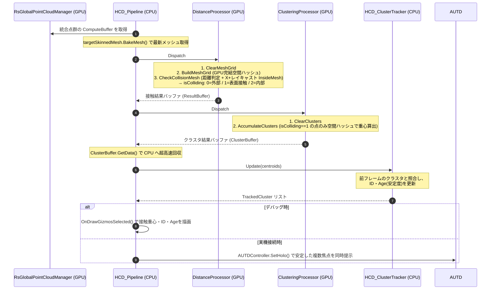

# RealTimeOcclusion 空中超音波ハプティクス（触覚提示）システム設計思想・アルゴリズム詳細

本ドキュメントは、センサー（Intel RealSense など）から取得され統合されたリアルタイム点群（Point Cloud）と、Unity 上の仮想オブジェクト（手の動的アニメーションモデル等）との間で超高速な物理的接触判定を行い、クラスタリングを経て空中超音波触覚ディスプレイ（AUTD3 等）と連携する「ハプティクス衝突検出システム（HCD: Haptics Collision Detectors）」の設計思想、データフロー、および GPU Compute Shader アルゴリズムの詳細を網羅したテクニカルリファレンスです。

---

## 🔗 統合プロジェクトポータル

本システムは、プロジェクトのメインポータルである **[RealTimeOcclusion システム統合 Wiki (Wiki.md)](../Wiki.md)** の「ハプティクス（触覚提示）ノード」として位置づけられており、視覚的なレンダリングシステムから完全に独立して設計されています。

---

## 1. ハプティクス提示システム概要（HCD パイプライン）

本システムは、10万点に及ぶ点群データと、数千ポリゴンのアニメーションメッシュとの接触判定を、**CPU帯域幅を一切圧迫することなく、完全なGPU完結アーキテクチャ** で 0.05ms という爆速で処理するシステムです。

旧仕様（`HapCollisionDetectors` 単体）から大幅なリアーキテクチャが行われ、複数のプロセッサを連結する `HCD_Pipeline` 構造へ進化しました。

```text
[リアルタイム統合点群バッファ] (RsGlobalPointCloudManager)
               │ (GPU ComputeBuffer 直接参照)
               ▼
[HCD_Pipeline] (パイプライン・オーケストレーター)
               │
               ├─▶ 1. [HCD_DistanceProcessor] 
               │      (GPU Voxel Grid構築 & Point-to-Triangle 距離判定 + Möller-Trumbore InsideMesh判定)
               │
               ├─▶ 2. [HCD_SpatialClusteringProcessor]
               │      (接触した点群を空間ハッシュでクラスタリングし、単一フレームの接触重心リストを計算)
               │
               ├─▶ 3. [HCD_ClusterTracker] (CPU)
               │      (前フレームのクラスタと照合し、安定したIDと生存期間(Age)を付与)
               │
               └─▶ 4. [HCD_Pipeline (Gizmo)] または [AUTD3連携クラス]
                      (安定したクラスタ情報を元に描画や焦点生成を実行)
```

### 提供価値
- **GPU Voxel Grid による超高速枝切り**: 10万点 × 3,450ポリゴンの「総当たり計算（3億回）」を廃止し、毎フレームGPU上で瞬時に空間グリッドを構築。計算時間を 3.0ms から **0.05ms** へと約60倍に高速化しました。
- **Point-to-Triangle 最短距離 ＋ Möller-Trumbore InsideMesh 判定**: 簡易的な頂点距離ではなく、三角形の表面への最短距離に加え、**X+ 方向レイキャスト（奇偶判定）** でメッシュの内外を厳密に判別します。これにより「表面を撫でている接触」・「内部への貫通」をそれぞれ `isColliding = 1 / 2` として区別し、クラスタリングは表面接触（1）の点のみを使用します。
- **Spatial Clustering による複数接触の同時処理**: 手のひらや5本の指が同時に触れた場合でも、空間ハッシュを用いた GPU クラスタリングにより、それぞれの接触点の重心をリアルタイムに分離・抽出します（Acoustic Holography 対応）。

---

## 2. システム構成とファイル構造

HCD（Haptics Collision Detectors）パイプラインは、複数の C# スクリプトと GPU コンピュートシェーダーで構成されています。

```text
Assets/Scripts/HapticsCollision/
 ├── HCD_Pipeline.cs                   # 各プロセッサの実行順序やバッファを管理・仲介するオーケストレーター
 ├── IHCD_Processor.cs                 # 各プロセッサが実装すべき共通インターフェース
 ├── HCD_DistanceProcessor.cs          # [GPU] ボクセル構築と Point-to-Triangle 最短距離・めり込み判定
 ├── HCD_SpatialClusteringProcessor.cs # [GPU] 空間ハッシュによる接触点のグループ化と単一フレームの重心算出
 └── HCD_ClusterTracker.cs             # [CPU] フレーム間のクラスタ追跡とID・寿命管理
 (Gizmo描画機能は HCD_Pipeline 内部に統合されています)

Assets/Shader&Material/Shader/ComputeShader/Collision/
 ├── HCD_Distance.compute              # └─ 実際の並列計算を行う Compute Shader
 └── HCD_SpatialClustering.compute     # └─ 実際の並列計算を行う Compute Shader
```

---

## 3. モジュール別アルゴリズム詳細

### A. HCD_DistanceProcessor (距離・接触判定モジュール)

アニメーション等で動的に変形する `SkinnedMeshRenderer` の全ポリゴン表面と、点群バッファとの間の物理的な侵入を厳密に判定します。

#### ① 固定長 GPU Voxel Grid の構築（`BuildMeshGrid`）
CPUでのLBVH構築やメモリ割り当てによるキャッシュ汚染を回避するため、完全にGPU内で動作する空間ハッシュアルゴリズムを採用しています。
- **事前準備**: GPUメモリ上に固定長（例: `8 x 8 x 8 = 512` ボクセル、各ボクセル最大31ポリゴン保持可能）の超軽量バッファ（約65KB）を確保します。
- **グリッド構築**: メッシュの三角形（3,450枚）を並列処理し、各三角形の座標から「自分が属するボクセル」を算出し、`InterlockedAdd` によって瞬時にグリッドへインデックスを登録します。

#### ② Point-to-Triangle 距離計算と InsideMesh 判定（`CheckCollisionMesh`）
10万点の点群に対して、メッシュ表面との最短距離およびメッシュ内外の厳密な判定を行います。計算コストを最小限に抑えるため、以下の段階的なアプローチを取ります。

1. **AABB 事前フィルタ（Early Return）**:
   対象メッシュの BoundingBox (`MeshBoundsMin/Max`) による AABB チェックを最初に行います。AABB 外の点群は絶対にメッシュと接触・貫通していないため、追加コストほぼゼロで直ちに `isColliding = 0` (外部) として処理を終了（early return）します。

2. **Narrow-Phase 距離計算**:
   AABB 内部に入った点群（メッシュ周辺の点のみ）は、自身が属するボクセル空間に登録されている少数の三角形に対してのみ、Point-to-Triangle アルゴリズムを用いて最短距離を計算します。

3. **Möller-Trumbore レイキャストによる内外判定（X+ 方向・奇偶判定）**:
   点からポリゴン表面への単なる「距離」だけでは、対象オブジェクトの表面を撫でているのか、内部に深くめり込んでいる（貫通している）のか、あるいは凹形状のくぼみにいるだけなのかを区別できません。
   そのため、各点から **X+ 方向へ仮想的なレイ（Ray）を飛ばし、Möller-Trumbore アルゴリズムを用いてメッシュの三角形との交差回数をカウント** します。
   - **偶数回交差**: メッシュの外部
   - **奇数回交差**: メッシュの内部（InsideMesh）
   ※ Voxel Grid の性質上、同じ三角形が複数のセルにまたがって登録される場合の重複カウントを防ぐため、カーネル内で `visitedTris` 配列を用いて一度交差判定した三角形を除外しています。

#### 💡 [判定基準] `isColliding` (0, 1, 2) の分類
算出した「最短距離」と「レイキャストによる内外判定」を組み合わせ、各点の状態を3値に分類します。

- **`0` (外部)**: 
  レイキャストが偶数回（メッシュ外）であり、かつメッシュ表面からの距離が閾値よりも遠い状態。
- **`1` (表面接触)**: 
  メッシュの外部または内部に関わらず、表面からの距離が `surfaceDistanceThreshold` または `backfaceDistanceThreshold` の範囲内にあり、接触が成立している状態。ハプティクス提示（クラスタリング）の対象となります。
- **`2` (内部・貫通)**: 
  レイキャストが奇数回（メッシュ内）であり、かつ表面からの距離が `backfaceDistanceThreshold` よりも深くめり込んでいる状態。完全に貫通しているとみなし、ハプティクス提示の対象外（除外）とします。

このアルゴリズムにより、従来の法線ベクトル内積近似による「凹形状での誤検出」が解消され、追加バッファ不要で正確な接触・貫通判定が高速に行われます。

---

### B. HCD_SpatialClusteringProcessor (空間クラスタリングモジュール)

接触判定によって抽出された多数の点群（衝突点）をグループ化し、接触箇所の重心（指先など）を計算します。

#### ボクセルベース空間ハッシュ (`AccumulateClusters`)
- `isColliding == 1`（表面接触）の点のみを対象に、各点群の座標を指定した分解能（例: `cellSize = 0.05m`）で量子化（グリッド化）します。
- 3Dグリッド座標から1次元のハッシュキー（`MurmurHash3` などの軽量ハッシュ関数ベース）を生成し、固定長のクラスタバッファ（最大1024個など）にマッピングします。
- 同一のハッシュキー（同じボクセル空間）に該当する点群は、`InterlockedAdd` を用いて「要素数」と「座標の合計値」を並列に足し合わせます。
- 最終的に `合計座標 / 要素数` を計算することで、その接触エリアにおける高精度な「重心座標」が得られます。

#### ボクセルサイズと重心計算の特性（Cluster Resolution）
このアルゴリズムは、空間を「指定したサイズのサイコロ（ボクセル）」に分割し、同じサイコロに入った点群の座標を **平均化** して重心を求めます。
- **メリット**: 数万〜数十万点の「接触パッチ（指先全体など）」の中心を、GPUの `InterlockedAdd` を使って一瞬で算出できます（ソート計算が必要な「中央値」を求める手法に比べて圧倒的に高速でリアルタイム処理に適しています）。
- **デメリット（指間の重心問題）**: ボクセルサイズが `0.05` (5cm) など大きすぎる場合、2本の指（例：人差し指と中指）が数センチに接近した際に **偶然同じボクセルに入ってしまう** ことがあります。すると両方の指の座標が平均化され、結果として「指と指の間の空っぽの空間」に重心が出力されてしまう欠陥が生じます。
- **解決策**: Inspectorから `Cluster Resolution` を **`0.02` (2cm) や `0.03` (3cm)** に設定してください。サイコロが2〜3cm四方になれば、どんなに接近した指でも物理的に別のボクセルに分離されるため、各指の真ん中に正確に別々のフォーカス（重心）が割り当てられるようになります。

#### MaxClusters（空間バケツの最大数）について
GPUは動的なメモリ確保（リストの動的拡張など）が苦手なため、クラスタリング用の空間ハッシュ配列を「あらかじめ固定長のバケツ」として確保しておく必要があります。このバケツの総数が `MaxClusters`（デフォルト `1024`）です。

- **小さすぎる場合（例: 10）**: 
  「右手の人差し指」と「左手の小指」など、全く離れた場所にある複数の接触点が、偶然同じバケツに割り当てられてしまう確率（ハッシュ衝突）が跳ね上がります。衝突すると座標が平均化され、何もない空中に重心が誤認識されるバグが発生します。
- **大きすぎる場合（例: 1,000,000）**: 
  ハッシュ衝突は起きませんが、毎フレーム100万個のバケツを「ゼロクリア」する処理が走るため、GPUの計算負荷とメモリ帯域を無駄に消費します。
- **なぜ `1024` なのか？**: 
  人間の両手（最大10本の指や手のひら）が2〜3cm単位のグリッドで接触して発生するクラスタは、多く見積もっても数十個程度です。そのため `1024` や `2048` という値は、「ハッシュ衝突の事故をほぼゼロに抑えつつ、GPUのメモリやクリア負荷（たった約16KB）も全く気にならない、最も安全で余裕のあるベストな設定値」となります。

---

### C. HCD_ClusterTracker (フレーム間トラッキングモジュール)

`HCD_SpatialClusteringProcessor` が「現在の1フレームのみ」の情報から多数の点の重心を計算するのに対し、このモジュールは**過去のフレームの情報と照らし合わせて時間的な連続性を担保**します。

#### 最近傍マッチング（Greedy アルゴリズム）
GPUからCPUに回収された「今のフレームの重心リスト」と、「前フレームまで追跡していたクラスタ」を距離ベースで照合します。
- **IDの固定化**: 同じ指の接触であれば、フレームが変わっても同じ `Id` を維持します。AUTD3などのハードウェアは「突然現れたり消えたりする焦点」や「フレームごとのIDの入れ替わり」に弱いため、IDの固定化は非常に重要です。
- **Age（生存期間）の管理**: 接触が継続しているフレーム数（`Age`）をカウントします。例えば「`Age` が 5 以上のクラスタのみ提示する」といったフィルタリングにより、ノイズによる一瞬のちらつきを排除できます。
- **欠損の許容**: センサーのオクルージョン（遮蔽）などで1〜2フレームだけ重心が見えなくなっても、すぐにはクラスタを消滅させず（`MissingFrames`）、一定猶予（`maxMissingFrames`）を持たせることで安定したトラッキングを実現します。

計算コストは `O(N × M)`（N=現フレームのクラスタ数、M=追跡中のクラスタ数）ですが、人間の指の本数（最大10〜20）を上限とするため、数百バイトのメモリと 0.001ms 程度のCPU時間で完了する極めて軽量な処理です。

---

### D. 重心の出力と連携 (HCD_Pipeline / 連携クラス)

トラッキングされ、安定化したクラスタ情報（ID, 重心, Age 等）を利用して、実際のハードウェアやデバッグ表示へ連携します。

- **Gizmo デバッグ描画 (HCD_Pipeline)**:
  生存期間（Age）やIDなどのメタデータを持ったマゼンタ（安定）や黄色（新規）の球体（Gizmo）を描画し、Unityのシーンビュー上で「どこに接触しているか」を視覚的にフィードバックします。
- **AUTD3 (GSPAT) 連携**:
  安定したクラスタの重心座標とIDを空中超音波デバイス（AUTD Controller）へ送信します。複数の重心が抽出された場合は、Acoustic Holography アルゴリズム（GSPAT等）を用いて、複数の音響焦点を空中に同時生成します。

---

## 4. 全体アーキテクチャとデータフロー



---

## 5. 動作検証 (Verification Plan)

### A. パフォーマンス・検証
- プロファイラー上で、10万点の点群に対する `DistanceProcessor` の実行時間が、旧アーキテクチャの `3.0ms` から **`0.05ms`** 前後に劇的に短縮されていることを確認します。
- CPUメモリの割り当て（GC Alloc）が毎フレーム発生しておらず、帯域幅に負荷がかかっていないことを確認します。

### B. 実機・動的検証
- 複数の指を同時にアニメーションメッシュに接触させた際、指ごとにクラスタリングされたマゼンタ色の Gizmo が正確に追従して描画されることをテストします。
- 手がメッシュ内部に貫通した際、`isColliding = 2`（InsideMesh）として判定され、クラスタリングから除外されることを確認します。表面接触（`isColliding = 1`）のマゼンタ Gizmo がメッシュ表面付近の点群に限定されることを目視で検証します。
- 凹形状メッシュ（くぼみのある形状）で、旧 `backfaceDistanceThreshold` 近似では誤検出していた箇所が正しく「外部」と判定されることを確認します。
