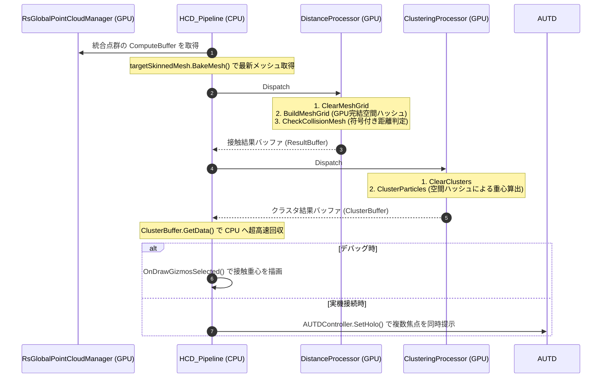

# RealTimeOcclusion 空中超音波ハプティクス（触覚提示）システム設計思想・アルゴリズム詳細

本ドキュメントは、センサー（Intel RealSense など）から取得され統合されたリアルタイム点群（Point Cloud）と、Unity 上の仮想オブジェクト（手の動的アニメーションモデル等）との間で超高速な物理的接触判定を行い、クラスタリングを経て空中超音波触覚ディスプレイ（AUTD3 等）と連携する「ハプティクス衝突検出システム（HCD: Haptics Collision Detectors）」の設計思想、データフロー、および GPU Compute Shader アルゴリズムの詳細を網羅したテクニカルリファレンスです。

---

## 🔗 統合プロジェクトポータル

本システムは、プロジェクトのメインポータルである **[RealTimeOcclusion システム統合 Wiki (Wiki.md)](../Wiki.md)** の「ハプティクス（触覚提示）ノード」として位置づけられており、視覚的なレンダリングシステムから完全に独立して設計されています。

---

## 1. ハプティクス提示システム概要（HCD パイプライン）

本システムは、10万点に及ぶ点群データと、数千ポリゴンのアニメーションメッシュとの接触判定を、**CPU帯域幅を一切圧迫することなく、完全なGPU完結アーキテクチャ** で 0.05ms という爆速で処理するシステムです。

旧仕様（`HapCollisionDetectors` 単体）から大幅なリアーキテクチャが行われ、複数のプロセッサを連結する `HCD_Pipeline` 構造へ進化しました。

```text
[リアルタイム統合点群バッファ] (RsGlobalPointCloudManager)
               │ (GPU ComputeBuffer 直接参照)
               ▼
[HCD_Pipeline] (パイプライン・オーケストレーター)
               │
               ├─▶ 1. [HCD_DistanceProcessor] 
               │      (GPU Voxel Grid構築 ＆ Point-to-Triangle 符号付き距離判定)
               │
               ├─▶ 2. [HCD_SpatialClusteringProcessor]
               │      (接触した点群を空間ハッシュでクラスタリングし、複数指の重心を計算)
               │
               └─▶ 3. [HCD_Pipeline (Gizmo)] または [AUTD3連携クラス]
                      (重心座標をCPUへ高速回収し、描画や焦点生成を実行)
```

### 提供価値
- **GPU Voxel Grid による超高速枝切り**: 10万点 × 3,450ポリゴンの「総当たり計算（3億回）」を廃止し、毎フレームGPU上で瞬時に空間グリッドを構築。計算時間を 3.0ms から **0.05ms** へと約60倍に高速化しました。
- **Point-to-Triangle と符号付き距離 (Signed Distance) の厳密判定**: 簡易的な頂点距離ではなく、三角形の表面への最短距離および法線ベクトルの内積を利用することで、「表面を撫でている接触」と「内部へのめり込み」を正確に判別します。
- **Spatial Clustering による複数接触の同時処理**: 手のひらや5本の指が同時に触れた場合でも、空間ハッシュを用いた GPU クラスタリングにより、それぞれの接触点の重心をリアルタイムに分離・抽出します（Acoustic Holography 対応）。

---

## 2. システム構成とファイル構造

HCD（Haptics Collision Detectors）パイプラインは、複数の C# スクリプトと GPU コンピュートシェーダーで構成されています。

```text
Assets/Scripts/HapticsCollision/
 ├── HCD_Pipeline.cs                   # 各プロセッサの実行順序やバッファを管理・仲介するオーケストレーター
 ├── IHCD_Processor.cs                 # 各プロセッサが実装すべき共通インターフェース
 ├── HCD_DistanceProcessor.cs          # [GPU] ボクセル構築と Point-to-Triangle 最短距離・めり込み判定
 └── HCD_SpatialClusteringProcessor.cs # [GPU] 空間ハッシュによる接触点のグループ化と重心算出
 (Gizmo描画機能は HCD_Pipeline 内部に統合されています)

Assets/Shader&Material/Shader/ComputeShader/Collision/
 ├── HCD_Distance.compute              # └─ 実際の並列計算を行う Compute Shader
 └── HCD_SpatialClustering.compute     # └─ 実際の並列計算を行う Compute Shader
```

---

## 3. モジュール別アルゴリズム詳細

### A. HCD_DistanceProcessor (距離・接触判定モジュール)

アニメーション等で動的に変形する `SkinnedMeshRenderer` の全ポリゴン表面と、点群バッファとの間の物理的な侵入を厳密に判定します。

#### ① 固定長 GPU Voxel Grid の構築（`BuildMeshGrid`）
CPUでのLBVH構築やメモリ割り当てによるキャッシュ汚染を回避するため、完全にGPU内で動作する空間ハッシュアルゴリズムを採用しています。
- **事前準備**: GPUメモリ上に固定長（例: `8 x 8 x 8 = 512` ボクセル、各ボクセル最大31ポリゴン保持可能）の超軽量バッファ（約65KB）を確保します。
- **グリッド構築**: メッシュの三角形（3,450枚）を並列処理し、各三角形の座標から「自分が属するボクセル」を算出し、`InterlockedAdd` によって瞬時にグリッドへインデックスを登録します。

#### ② Point-to-Triangle 符号付き距離計算（`CheckCollisionMesh`）
10万点の点群は、自分の座標周辺にあるボクセル空間（最大8個程度）だけを参照します。
- **Narrow-Phase**: 点群は自身が属するボクセルに登録されている少数の三角形（数枚〜数十枚）とだけ距離計算を行います。
- **最短距離と法線の計算**: 数学的な Point-to-Triangle アルゴリズムを用いて、点から三角形の面・辺・頂点への最短距離を計算し、対象三角形の法線ベクトルを取得します。

#### 💡 [数学解説] 内積（Dot Product）を用いた表裏・めり込み判定（Signed Distance）
点からポリゴン表面への単なる「距離」だけでは、対象オブジェクトの表面を撫でているのか、それともメッシュ内部に深くめり込んでいるのかを区別できません。そのため、**法線ベクトルと最短ベクトルの内積（Dot）** を用いて符号付き距離（Signed Distance）を計算します。

1. **ベクトル定義**: 
   - 衝突点の座標を $\mathbf{P}$、三角形ポリゴン上で最も $\mathbf{P}$ に近い点を $\mathbf{C}$ とします。
   - 点から表面に向かう最短ベクトルは $\mathbf{V}_{shortest} = \mathbf{P} - \mathbf{C}$ となります。
   - 対象ポリゴンの表面が外側を向く正規化された法線ベクトルを $\mathbf{N}$ とします。
   
2. **内積（Dot）の計算**:
   ```math
   \mathbf{Distance} = \mathbf{V}_{shortest} \cdot \mathbf{N}
   ```
   
3. **符号（Sign）による状態判定**:
   - **$\mathbf{Distance} > 0$（プラス）の場合**:
     点 $\mathbf{P}$ はポリゴンの**外側**にあります。$\mathbf{Distance} \le \text{surfaceDistanceThreshold}$ であれば「表面に接触している」と判定します。
   - **$\mathbf{Distance} < 0$（マイナス）の場合**:
     点 $\mathbf{P}$ はポリゴンの**内側（裏側）**にめり込んでいます。$\mathbf{Distance} \ge -\text{backfaceDistanceThreshold}$ であれば「内部にめり込んで接触している」と判定します。
     （※閾値を超えて深くめり込みすぎた場合は、貫通したとみなして判定を除外します）

このアルゴリズムにより、指がモデルの中に食い込んだ場合でも、めり込み量に応じた正確な接触判定を継続できます。

---

### B. HCD_SpatialClusteringProcessor (空間クラスタリングモジュール)

接触判定によって抽出された多数の点群（衝突点）をグループ化し、接触箇所の重心（指先など）を計算します。

#### ボクセルベース空間ハッシュ (`ClusterParticles`)
- 接触している各点群の座標を、指定した分解能（例: `clusterResolution = 0.05m`）で量子化（グリッド化）します。
- 3Dグリッド座標から1次元のハッシュキー（`MurmurHash3` などの軽量ハッシュ関数ベース）を生成し、固定長のクラスタバッファ（最大1024個など）にマッピングします。
- 同一のハッシュキー（同じボクセル空間）に該当する点群は、`InterlockedAdd` を用いて「要素数」と「座標の合計値」を並列に足し合わせます。
- 最終的に `合計座標 / 要素数` を計算することで、その接触エリアにおける高精度な「重心座標」が得られます。

#### MaxClusters（空間バケツの最大数）について
GPUは動的なメモリ確保（リストの動的拡張など）が苦手なため、クラスタリング用の空間ハッシュ配列を「あらかじめ固定長のバケツ」として確保しておく必要があります。このバケツの総数が `MaxClusters`（デフォルト `1024`）です。

- **小さすぎる場合（例: 10）**: 
  「右手の人差し指」と「左手の小指」など、全く離れた場所にある複数の接触点が、偶然同じバケツに割り当てられてしまう確率（ハッシュ衝突）が跳ね上がります。衝突すると座標が平均化され、何もない空中に重心が誤認識されるバグが発生します。
- **大きすぎる場合（例: 1,000,000）**: 
  ハッシュ衝突は起きませんが、毎フレーム100万個のバケツを「ゼロクリア」する処理が走るため、GPUの計算負荷とメモリ帯域を無駄に消費します。
- **なぜ `1024` なのか？**: 
  人間の両手（最大10本の指や手のひら）が3cm単位のグリッドで接触して発生するクラスタは、多く見積もっても数十個程度です。そのため `1024` や `2048` という値は、「ハッシュ衝突の事故をほぼゼロに抑えつつ、GPUのメモリやクリア負荷（たった約16KB）も全く気にならない、最も安全で余裕のあるベストな設定値」となります。

---

### C. 重心の回収と出力 (HCD_Pipeline / 連携クラス)

計算された重心座標をCPU側に引き戻し（非常に小さな配列のため高速）、実際のハードウェアやデバッグ表示へ連携します。

- **Gizmo デバッグ描画 (HCD_Pipeline)**:
  クラスタリングされて求まった重心座標にマゼンタの球体（Gizmo）を描画し、Unityのシーンビュー上で「どこに接触しているか」を視覚的にフィードバックします。インスペクタからオブジェクトを選択中のみ描画されます。
- **AUTD3 (GSPAT) 連携**:
  重心座標を空中超音波デバイス（AUTD Controller）へ送信します。複数の重心が抽出された場合は、Acoustic Holography アルゴリズム（GSPAT等）を用いて、複数の音響焦点を空中に同時生成します。

---

## 4. 全体アーキテクチャとデータフロー



---

## 5. 動作検証 (Verification Plan)

### A. パフォーマンス・検証
- プロファイラー上で、10万点の点群に対する `DistanceProcessor` の実行時間が、旧アーキテクチャの `3.0ms` から **`0.05ms`** 前後に劇的に短縮されていることを確認します。
- CPUメモリの割り当て（GC Alloc）が毎フレーム発生しておらず、帯域幅に負荷がかかっていないことを確認します。

### B. 実機・動的検証
- 複数の指を同時にアニメーションメッシュに接触させた際、指ごとにクラスタリングされたマゼンタ色の Gizmo が正確に追従して描画されることをテストします。
- 手がメッシュ内部にめり込んだ際も、`backfaceDistanceThreshold` によって接触が正しく維持される（内側に抜けない）ことを確認します。
