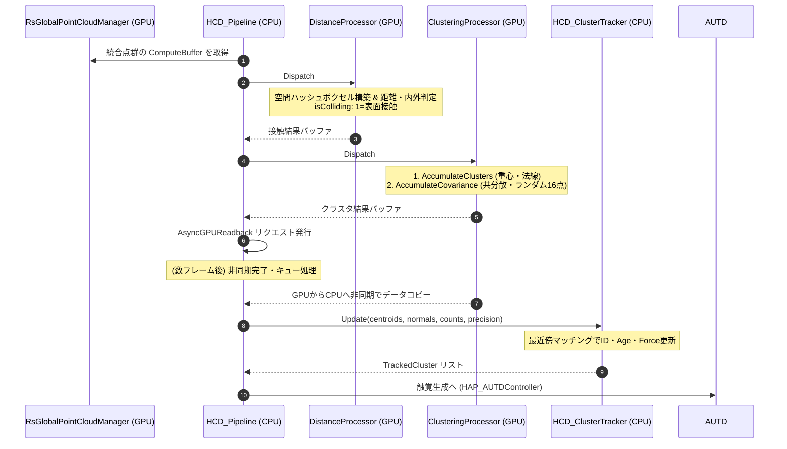

# 衝突判定・クラスタリングシステム (HCD Pipeline)

> 📂 **親ノード**: [Wiki.md (ポータル)](./Wiki.md) | 🏷️ **種類**: 🏗️ システム設計書
>
> [RealTimeOcclusion Wiki (ポータル)](./Wiki.md) に戻る
>
> 📎 **関連ドキュメント**: [CollisionAlgorithmComparison.md](./CollisionAlgorithmComparison.md)

---

## 1. ハプティクス提示システム概要（HCD パイプライン）

本システムは、10万点に及ぶ点群データと、数千ポリゴンのアニメーションメッシュとの接触判定を、**CPU帯域幅を一切圧迫することなく、完全なGPU完結アーキテクチャ** で 0.05ms という爆速で処理するシステムです。

旧仕様（`HapCollisionDetectors` 単体）から大幅なリアーキテクチャが行われ、複数のプロセッサを連結する `HCD_Pipeline` 構造へ進化しました。

> 💡 **ネイティブアルゴリズムとの比較について**
> 元のC++実装（PointCloudAnalyzer等）との数学的・構造的なアルゴリズムの違い（Union-Findと空間ハッシュの違い、トラッキング手法の最適化など）については、詳細ドキュメント **[CollisionAlgorithmComparison.md](./CollisionAlgorithmComparison.md)** を参照してください。本アーキテクチャはハプティクス向けにGPU完結で極限まで最適化されていますが、抽出されるクラスタやトラッキングの挙動はネイティブ版とおおむね同等となるよう設計されています。

```text
[リアルタイム統合点群バッファ] (RsGlobalPointCloudManager)
               │ (GPU ComputeBuffer 直接参照)
               ▼
[HCD_Pipeline] (パイプライン・オーケストレーター)
               │
               ├─▶ 1. [HCD_DistanceProcessor] 
               │      (GPU Voxel Grid構築 & Point-to-Triangle 距離判定 + Möller-Trumbore InsideMesh判定)
               │
               ├─▶ 2. [HCD_SpatialClusteringProcessor]
               │      (接触した点群を空間ハッシュでクラスタリングし、単一フレームの接触重心・16点のランダムサンプルリストを計算)
               │
               ├─▶ 3. [HCD_ClusterTracker] (CPU)
               │      (前フレームのクラスタと照合し、安定したIDと生存期間(Age)を付与)
               │
               └─▶ 4. [HCD_Pipeline (Gizmo)] または [AUTD3連携クラス]
                      (安定したクラスタ情報を元に描画や焦点生成を実行)
```

### 提供価値
- **GPU Voxel Grid による超高速枝切り**: 10万点 × 3,450ポリゴンの「総当たり計算（3億回）」を廃止し、毎フレームGPU上で瞬時に空間グリッドを構築。計算時間を 3.0ms から **0.05ms** へと約60倍に高速化しました。
- **Point-to-Triangle 最短距離 ＋ Möller-Trumbore InsideMesh 判定**: 簡易的な頂点距離ではなく、三角形の表面への最短距離に加え、**X+ 方向レイキャスト（奇偶判定）** でメッシュの内外を厳密に判別します。
- **Spatial Clustering による複数接触の同時処理**: 手のひらや5本の指が同時に触れた場合でも、空間ハッシュを用いた GPU クラスタリングにより、それぞれの接触点の重心とランダムサンプルをリアルタイムに分離・抽出します。
- **AsyncGPUReadback による完全非同期化**: GPU処理結果の読み戻し時に発生していたCPUの同期待ちを、キューを用いた非同期読み込みに書き換え、メインスレッドのブロックを完全に解消しました。

---

## 2. システム構成とファイル構造

HCD（Haptics Collision Detectors）パイプラインは、複数の C# スクリプトと GPU コンピュートシェーダーで構成されています。

```text
Assets/Features/HapticsCollision/Scripts/
 ├── HCD_Pipeline.cs                   # 各プロセッサの実行順序やバッファを管理・仲介するオーケストレーター
 ├── IHCD_Processor.cs                 # 各プロセッサが実装すべき共通インターフェース
 ├── HCD_DistanceProcessor.cs          # [GPU] ボクセル構築と Point-to-Triangle 最短距離・めり込み判定
 ├── HCD_SpatialClusteringProcessor.cs # [GPU] 空間ハッシュによる接触点のグループ化、重心・共分散・16ランダム点の算出
 └── HCD_ClusterTracker.cs             # [CPU] フレーム間のクラスタ追跡とID・寿命管理
 (Gizmo描画機能は HCD_Pipeline 内部に統合されています)

Assets/Features/HapticsCollision/ComputeShaders/
 ├── HCD_Distance.compute              # └─ 実際の並列計算を行う Compute Shader
 └── HCD_SpatialClustering.compute     # └─ 実際の並列計算を行う Compute Shader
```

---

## 3. モジュール別アルゴリズム詳細

### A. HCD_DistanceProcessor (距離・接触判定モジュール)

通常のアニメーションメッシュ表面と点群バッファ間の侵入を判定します。

#### ① 固定長 GPU Voxel Grid の構築（`BuildMeshGrid`）
CPUでのLBVH構築を避け、GPU内で空間ハッシュを構築します。メッシュの全三角形を並列処理し、ボクセルに対して `InterlockedAdd` を用いて瞬時にグリッドへ登録します。

#### ② Point-to-Triangle 距離計算と InsideMesh 判定（`CheckCollisionMesh`）
1. **AABB 事前フィルタ**: BoundingBox外の点群は即座に除外（early return）。
2. **Narrow-Phase 距離計算**: AABB内の点群は、周辺のボクセルに登録された少数三角形に対して Point-to-Triangle 計算を行い、符号付き最短距離を特定します。
3. **Möller-Trumbore レイキャスト**: 点からX+方向へレイを飛ばし、三角形との交差回数をカウント（奇数回＝内部、偶数回＝外部）。これにより表面接触と内部貫通を区別します。

---

### B. HCD_SpatialClusteringProcessor (TactileClustering モジュール)

接触点群をグループ化し、重心・法線方向・および「共分散」「ランダム点」を算出します。

#### TactileClustering（位置＋法線ハイブリッド・空間ハッシュ）
表と裏の接触点が混ざらないよう、座標と法線方向の両方を用いてハッシュ値を計算します。

1. **空間座標の量子化**: 座標を分解能 (`cellSize = 0.02m`) で量子化。
2. **法線方向の量子化**: 法線を6軸に分類。
3. **ハイブリッド・ハッシュ**: 座標と法線を組み合わせてバッファインデックスを決定。
4. **並列蓄積 (`AccumulateClusters`)**: `InterlockedAdd` により並列に座標と法線を蓄積。
5. **重心と平均法線の算出**: 要素数で除算し、重心 $\mathbf{C}$ と平均法線 $\mathbf{N}_{avg}$ を算出。

#### 💡 Precision Mode (精密モード) における追加計算 (GPU Reservoir Sampling)
精密な触覚生成のため、第2・第3のパスで追加データを算出します。
1. **共分散行列（Covariance Matrix）の計算**:
   各クラスタの重心からの差分から共分散行列を蓄積します。のちにCPU側で主成分分析(PCA)を行うことで、接触領域の楕円形状（Ellipse）を推定します。
2. **16点のランダム・サンプリング（Reservoir近似）**:
   GPUのハッシュ値を利用したReservoirサンプリングにより、クラスタ内から一様に16個の点を抽出します（`ClusterPrecisionDataRaw`）。これにより、CPU側での重い探索なしに、即座に不規則なノイズ状の触覚（Random STM）を生成可能になります。

---

### C. HCD_ClusterTracker (フレーム間トラッキングモジュール)

GPUで抽出された現フレームの重心と、前フレームのクラスタを最近傍マッチング（Greedyアルゴリズム）で照合します。
- **IDとAgeの管理**: 接触が続く限りIDを固定し、生存期間（Age）をカウント。
- **欠損の許容**: 一時的な遮蔽によるロストを防ぐため、`maxMissingFrames` の猶予を持たせます。
- **ContactForceReduction**: 接触点数（面積）からベース振幅 $F_{raw}$ を線形補間し、指数移動平均で滑らかにフェードイン・フェードアウトさせます。

---

### D. 重心の出力と連携 (HCD_Pipeline)
トラッキングされたクラスタ情報は、HAP_AUTDController へ送信され、GSPAT 等を用いた音響ホログラフィの焦点データとして使用されます。デバッグ時は Gizmo により色や法線ベクトルとして可視化されます。

---

## 4. 全体アーキテクチャとデータフロー


