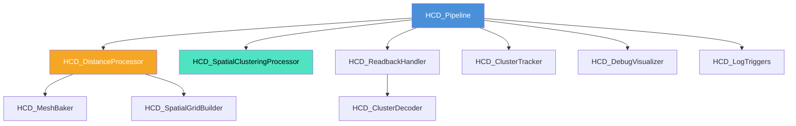

# 衝突判定・クラスタリングシステム (HCD Pipeline) 仕様書

> 📂 **親ノード**: [Wiki.md](./Wiki.md) | 🏷️ **種類**: 🏗️ システム設計書  
> [RealTimeOcclusion Wiki (ポータル)](./Wiki.md) に戻る  
> 📎 **関連ドキュメント**: [CollisionAlgorithmComparison.md](./CollisionAlgorithmComparison.md)

本ドキュメントでは、10万点に及ぶ点群データとアニメーションメッシュとの接触判定を、CPU を一切圧迫することなく完全 GPU 完結アーキテクチャで高速処理する `HCD_Pipeline` (Haptics Collision Detection) システムの設計思想、モジュール構成、使用手順、数理モデル、パラメータ詳細およびデバッグ方法について解説します。

---

## 1. 概要

本システムは、リアルタイム統合点群バッファと仮想 3D メッシュ（`SkinnedMeshRenderer` や `MeshFilter`）との接触判定・クラスタリング・トラッキングをリアルタイムに実行する仕組みです。

旧仕様 (`HapCollisionDetectors`) から大幅なリアーキテクチャが行われ、プロセッサをパイプライン状に連結する `HCD_Pipeline` 構造へ進化しました。また、God Class（肥大化クラス）化を防ぐため **`partial` クラスを一切使わず**、単一責任原則に基づき **`Core` / `Processors` / `Debug` / `Editor`** の 4 階層へ完全に役割分離・軽量化されています。

### 主な特徴

* **完全 GPU パラレル処理**: 10 万点の点群とアニメーションメッシュの頂点距離計算、ボクセル格子構築、およびクラスタリングを Compute Shader で並列処理します。
* **非同期 AsyncGPUReadback**: GPU から CPU へのデータ回収に非同期 readback キューを挟むことで、メインスレッドの同期待ちフリーズを完全に排除します。
* **責務分離階層構造**: コアマネージャー、プロセッサ群、デバッグ描画、エディタ拡張を厳密に分離し、保守性と拡張性を高めています。
* **統制ログシステム完全統合**: `AppLogManager` 上で 4 つのサブトリガー (`Summary & Readback`, `Mesh & Bounds Debug`, `Clustering Debug`, `Cluster Tracking Info`) を個別にトグル制御可能です。

---

## 2. 設計思想・アーキテクチャ

### 2.1 生成ファイル・ディレクトリ構成

```text
Assets/Features/HapticsCollision/Scripts/
├── Core/                               # コア基盤モジュール
│   ├── HCD_Pipeline.cs                 # パイプライン統括コアマネージャー
│   ├── HCD_ReadbackHandler.cs          # 非同期 AsyncGPUReadback キュー監視
│   ├── HCD_ClusterDecoder.cs           # GPUバイナリ構造体のデコード処理
│   └── HCD_Processor.cs                # IHCD_Processor インターフェース定義
├── Processors/                         # プロセッサ処理群
│   ├── HCD_DistanceProcessor.cs         # 距離判定オーケストレーター
│   ├── HCD_MeshBaker.cs                 # メッシュ結合・Bake・World Bounds算出
│   ├── HCD_SpatialGridBuilder.cs       # GPU 8x8x8 空間グリッド構築
│   ├── HCD_SpatialClusteringProcessor.cs # 空間ハッシュクラスタリング計算
│   └── HCD_ClusterTracker.cs            # フレーム間クラスタ追跡・Force計算
├── Debug/                              # デバッグ・ログ専用モジュール
│   ├── HCD_DebugVisualizer.cs          # Scene ビュー Gizmos & Handles 描画
│   └── HCD_LogTriggers.cs              # AppLogManager 連動サブトリガー登録
└── Editor/                             # エディタ拡張
    └── HCD_PipelineEditor.cs           # カスタム Inspector エディタ
```

### 2.2 クラス相関図



### 2.3 データパイプラインフロー

```text
[リアルタイム統合点群バッファ] (RsGlobalPointCloudManager)
               │ (GPU ComputeBuffer 直接参照)
               ▼
[HCD_Pipeline] (コアマネージャー)
               │
               ├─▶ 1. [HCD_DistanceProcessor] 
               │      ├── [HCD_MeshBaker] (SkinnedMesh/MeshFilter の Bake & Bounds算出)
               │      └── [HCD_SpatialGridBuilder] (GPU 8x8x8 Voxel Grid構築 & Dispatch)
               │
               ├─▶ 2. [HCD_SpatialClusteringProcessor]
               │      (接触点を空間ハッシュでクラスタリングし重心・共分散を計算)
               │
               ├─▶ 3. [HCD_ReadbackHandler] (GPU AsyncReadback キュー監視)
               │      └── [HCD_ClusterDecoder] (GPU固定小数点数バイナリの Vector3 デコード)
               │
               ├─▶ 4. [HCD_ClusterTracker] (CPU)
               │      (前フレームのクラスタと照合し安定ID・Age・Forceを付与)
               │
               └─▶ 5. [HCD_DebugVisualizer] & [AppLogManager]
                      (Scene ビュー Gizmos 描画 & サブログ別トグル制御)
```

---

## 3. セットアップ・使用方法

### 3.1 クイックスタート手順

#### Step 1: コンポーネントのアタッチ

シーン内の管理オブジェクトに `HCD_Pipeline` をアタッチします。アタッチ時に `HCD_DebugVisualizer` と `HCD_LogTriggers` が自動配置されます。

#### Step 2: インスペクターパラメータ設定

| 設定項目 | 型 | 既定値 | 説明 |
|---|---|---|---|
| `detectionTarget` | `Transform` | `null` | 接触判定を行わせたい仮想オブジェクトの Transform |
| `detectionMode` | `DetectionMode` | `SkinnedMeshRenderer` | 判定モード (`SkinnedMeshRenderer`, `MeshFilter`, `TransformOnly`) |
| `distanceThreshold` | `float` | `0.03f` | 接触とみなす距離閾値 (m) |
| `cellSize` | `float` | `0.02f` | 空間クラスタリングのボクセルサイズ (m) |
| `maxClusters` | `int` | `16` | 最大追跡クラスタ数上限 |

#### Step 3: Play モードでの確認

Play モードを開始すると、`HCD_DebugVisualizer` により Scene ビュー上にクラスタ重心、法線ベクトル、接触強度 `F` が描画されます。

---

## 4. 仕様・パラメータ詳細

### 4.1 パラメータ・プロセッサ仕様

* **`HCD_DistanceProcessor`**: メッシュ頂点と点群の最短距離を GPU ボクセル格子で計算。
* **`HCD_SpatialClusteringProcessor`**: 接触判定された点群を空間ハッシュで束ね、重心・分散を算出。
* **`HCD_ClusterTracker`**: フレーム間で重心位置を最近傍照合し、接触強度 $F$ の EMA 平滑化を実施。

### 4.2 数式モデル・理論的背景

<details>
<summary><b>📐 GPU 衝突判定・空間ハッシュ・固定小数点アキュムレーションの数理モデル（クリックで展開）</b></summary>

#### A. Möller-Trumbore 貫通・レイキャスト判定モデル

点群の点 $\mathbf{p}$ からのレイ $\mathbf{r}(t) = \mathbf{p} + t \mathbf{d}$ と、メッシュの三角形頂点 $\mathbf{v}_0, \mathbf{v}_1, \mathbf{v}_2$ との交点パラメータ $(t, u, v)$ は、以下の連立方程式（Möller-Trumbore 法）により高解像度に判定されます。

$$
\begin{pmatrix} t \\ u \\ v \end{pmatrix} = \frac{1}{\mathbf{p}_1 \cdot \mathbf{e}_1} \begin{pmatrix} \mathbf{q}_2 \cdot \mathbf{e}_2 \\ \mathbf{p}_1 \cdot \mathbf{t} \\ \mathbf{q}_2 \cdot \mathbf{d} \end{pmatrix}
$$

$$
\mathbf{e}_1 = \mathbf{v}_1 - \mathbf{v}_0, \quad \mathbf{e}_2 = \mathbf{v}_2 - \mathbf{v}_0, \quad \mathbf{t} = \mathbf{p} - \mathbf{v}_0, \quad \mathbf{p}_1 = \mathbf{d} \times \mathbf{e}_2, \quad \mathbf{q}_2 = \mathbf{t} \times \mathbf{e}_1
$$

| 記号 | 説明 | 単位 / 型 |
|---|---|---|
| $\mathbf{p}$ | 検査対象の点群 3D 空間座標 | `Vector3` |
| $\mathbf{d}$ | レイキャストの方向ベクトル | `Vector3` |
| $\mathbf{v}_0, \mathbf{v}_1, \mathbf{v}_2$ | 三角形メッシュの頂点座標 | `Vector3` |
| $u, v$ | 三角形平面上の重心座標 ($u \ge 0, v \ge 0, u+v \le 1$) | `float` |

#### B. GPU ボクセル格子 (Voxel Grid) インデックス計算

バウンディングボックス最小点 $\mathbf{b}_{\min}$ およびボクセルサイズ $S_{\text{cell}}$ に対し、点群 $\mathbf{p}_i$ のボクセル座標 $\mathbf{g}_i$ と 1 次元格子インデックス $\text{CellIndex}$ は次式で算出されます。

$$
\mathbf{g}_i = \left\lfloor \frac{\mathbf{p}_i - \mathbf{b}_{\min}}{S_{\text{cell}}} \right\rfloor
$$

$$
\text{CellIndex}(\mathbf{g}_i) = g_{x,i} + g_{y,i} \cdot N_x + g_{z,i} \cdot N_x N_y
$$

#### C. GPU 固定小数点並列アキュムレーション (Fixed-Point Accumulation)

`ComputeShader` 内での `InterlockedAdd` によるアトミック加算の浮動小数点精度落ちを防ぐため、実数値 $x$ はスケーリングファクター $K_{\text{fixed}} = 100,000.0$ により整数化されて蓄積されます。

$$
I_{\text{fixed}} = \text{int}\left( x \cdot K_{\text{fixed}} \right)
$$

$$
x_{\text{decoded}} = \frac{I_{\text{accumulated}}}{K_{\text{fixed}}}
$$

#### D. クラスタ重心・接触強度 $F$ の計算

接触距離 $d_i$ に応じた重み $w_i$ と、クラスタ重心 $\mathbf{C}_h$ の計算式：

$$
w_i = \text{clamp}\left( \left( \text{saturate}\left( 1 - \frac{d_i}{d_{\text{thresh}}} \right) \right)^p, \, 0.05, \, 1.0 \right)
$$

$$
\mathbf{C}_h = \frac{\sum_{k=1}^{N_h} w_k \mathbf{x}_k}{\sum_{k=1}^{N_h} w_k}
$$

| 記号 | 説明 | 単位 / 型 |
|---|---|---|
| $d_i$ | 点群とメッシュ表面の距離 | $\mathrm{m}$ (`float`) |
| $d_{\text{thresh}}$ | 接触閾値 (`distanceThreshold`) | $\mathrm{m}$ (`float`) |
| $p$ | 距離減衰パラメータ | `float` |

</details>

---

## 5. デバッグ・留意事項

### 5.1 留意事項

* **AsyncGPUReadback のフレーム遅延**: 非同期リードバックを採用しているため、1〜2 フレームのデータ更新ラグが存在します。
* **高ポリゴンメッシュ対策**: メッシュのポリゴン数が極めて多い場合は、判定専用の簡易プロキシメッシュをアサインすることを推奨します。

### 5.2 統制ログシステム (AppLogManager) との同期

HCD モジュールは `AppLogManager` の統制ログに対応しており、以下の 4 サブトリガーで個別ミュート可能です。

| サブトリガー表示名 | タグ (`subTag`) | 主な出力内容 |
|---|---|---|
| **`[HCD_Pipeline] Summary & Readback`** | `HCD_Pipeline` | 検出クラスタ数、追跡数、リードバック状態 |
| **`[HCD_DistanceProcessor] Mesh & Bounds Debug`** | `HCD_DistanceProcessor` | ターゲット Transform・頂点数・World Bounds |
| **`[HCD_SpatialClusteringProcessor] Clustering Debug`** | `HCD_SpatialClusteringProcessor` | ボクセル CellSize・集約モード・距離減衰 |
| **`[HCD_ClusterTracker] Cluster Tracking Info`** | `HCD_ClusterTracker` | 生存・追跡中クラスタ数 |

詳細な共通ログ仕様については [Logging.md](./Logging.md) を参照してください。
