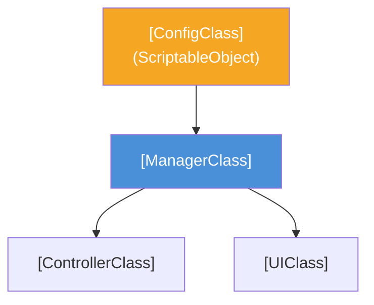

# ドキュメント規約 (Documentation Policy)

> 📂 **親ノード**: [Wiki.md](./Wiki.md) | 🏷️ **種類**: 📜 開発規約  
> [RealTimeOcclusion Wiki (ポータル)](./Wiki.md) に戻る

本ドキュメントは、RealTimeOcclusion プロジェクトにおけるすべての技術文書・機能仕様書・設計書・README 等が維持すべき**標準フォーマット、記述ルール、表記規約**を定義します。  
本プロジェクト内のすべてのドキュメントは、[Experiments.md](./Experiments.md) を標準モデルケースとし、本規約に厳密に従って作成・改訂しなければなりません。

---

## 1. 適用範囲

本規約は、以下のすべての文書に例外なく適用します。

* `README.md`
* `Docs/` 配下の全 Markdown 文書
* Wiki 同期対象の Markdown 文書
* 機能説明、設計説明、使用手順、仕様説明、注意事項を含む文書

---

## 2. 基本方針

ドキュメントは、次の優先順位に従って作成・更新します。

1. **一貫性** (構造・フォーマット・用語の統一)
2. **正確性** (仕様・コード・パラメータ・数式モデルの正確な記述)
3. **可読性** (視覚化・折りたたみ構造・見出し・表の活用)
4. **簡潔性** (冗長な説明の排除)

文書は、読み手が「どのファイルを見れば何が分かるか」を迷わない構成にします。  
同一の概念、用語、表記、記述順序は、全ドキュメントで統一します。  
すべての機能ドキュメントは、[Experiments.md](./Experiments.md) のフォーマットおよび本規約で定義される標準構造に完全に準拠させます。

---

## 3. 文体・表記ルール

ドキュメント本文は、原則として以下を遵守します。

* 文体は**丁寧体（「〜します」「〜です」）**で統一する
* 口語表現、感嘆表現、曖昧表現を避ける
* 同一文書内で文体を混在させない
* 主観的表現よりも、事実・仕様・手順・数式モデルを優先して記述する
* 省略や暗黙の前提に依存しない

### 推奨表現
* 「〜します」「〜です」
* 「〜である」よりも、文書全体で統一された丁寧体を優先する
* 「可能です」「推奨します」「必須です」「不要です」を使い分ける

### 禁止表現
* 「たぶん」「おそらく」「とりあえず」などの曖昧語
* 「なんとなく」「いい感じに」などの非仕様的表現
* 口頭メモのような断片的記述

---

## 4. 用語統一

同一の概念には、必ず同一の用語を使用します。

* 用語の揺れを禁止する
* 略称は初出時に正式名称を併記する
* 略称・英語名・日本語名の対応を文書内で固定する
* 新しい略称を追加する場合は、既存の略称体系と衝突しないことを確認する

**記述例:**
* Point Cloud Viewer (`PCV`)
* Point Cloud Display (`PCD`)
* Haptics Collision Detection (`HCD`)
* Airborne Ultrasound Tactile Display (`AUTD`)

---

## 5. ナビゲーションヘッダー・セパレータ規約

すべての Markdown 文書の先頭（タイトル `#` 直下）には、必ず引用ブロック (`>`) を用いた**ナビゲーションヘッダー**を配置します。

### 5.1 必須ヘッダー構造

```markdown
# [機能名 / 文書名] 仕様書

> 📂 **親ノード**: [Wiki.md](./Wiki.md) | 🏷️ **種類**: <絵文字> <分類名>  
> [RealTimeOcclusion Wiki (ポータル)](./Wiki.md) に戻る

[本ドキュメントの概要・目的を簡潔にまとめたリード文]

---
```

* **親ノード**: 原則として `[Wiki.md](./Wiki.md)` または上位機能ドキュメントへの相対パスリンクを記述。
* **種類タグ**: 適切な絵文字（例: 🧪 実験, ⚙️ 機能, 🎨 描画, 🖐️ 触覚, 📝 ログ, 📜 規約）と分類名を明記。
* **ポータルリンク**: `[RealTimeOcclusion Wiki (ポータル)](./Wiki.md) に戻る` を必ず含める。
* **水平線セパレータ**: リード文の直後およびすべての章 (`##`) の直前には、必ず `---` を挿入して視覚的に区切る。

---

## 6. ファイル構成ルール (固定5大章)

機能ドキュメントは、**原則として以下の5つの大章（章番号付き `## 1.`〜`## 5.`）で構成**し、[Experiments.md](./Experiments.md) に倣った必須コンテンツ要素を含めます。

1. `## 1. 概要`
2. `## 2. 設計思想・アーキテクチャ`
3. `## 3. セットアップ・使用方法`
4. `## 4. 仕様・パラメータ詳細`
5. `## 5. デバッグ・留意事項`

この順序は、特別な理由がない限り変更しません。  
必要な項目が存在しない場合でも、節見出しを削除せず、「該当なし」または「未実装」と明記します。

### 6.1 章別必須・推奨コンテンツ要素

#### 1. 概要 (`## 1. 概要`)
* 構築目的とシステムにおける役割を記述。
* **`### 主な特徴`** 節を設け、主要機能を箇条書き + 強調表示（ボールド）で整理する。

#### 2. 設計思想・アーキテクチャ (`## 2. 設計思想・アーキテクチャ`)
以下の **3段階の構造表現** を必ず順に含めます。
* **`### 2.1 生成ファイル・ディレクトリ構成`**: 関連ファイル群を ASCII テキストツリー形式で網羅。
* **`### 2.2 クラス相関図`**: `mermaid` コードブロック (`graph TD` 等) による依存関係ダイアグラム。
* **`### 2.3 [主要処理・フロー・コルーチン等の仕組み]`**: 試行サイクルやデータフローのテキスト/Mermaid図。

#### 3. セットアップ・使用方法 (`## 3. セットアップ・使用方法`)
* **`### 3.1 クイックスタート手順`**: `#### Step 1: ...`, `#### Step 2: ...` などの段階的手順。
* 設定パラメータは Markdown の表 (`| 設定項目 | 説明 |`) で整理し、C# スクリプト等の実装例を掲載する。

#### 4. 仕様・パラメータ詳細 (`## 4. 仕様・パラメータ詳細`)
* **`### 4.1 出力データ形式・保存先`** または **`### 4.1 パラメータ・API詳細`**:
  * 保存先パス（`Application.persistentDataPath` 等）を明記。
  * データ構造（CSV / JSON カラム一覧、Enum 定義、パラメータ表等）を意味・型・既定値・説明を含めた表で整理する。
* **`### 4.2 数式モデル・理論的背景 (折りたたみ形式)`**:
  * 物理計算、衝突判定アルゴリズム、距離計算、触覚フィードバックモデル等の数式が必要な場合は、**`<details><summary>` タグを用いた折りたたみ形式**で可読性を損なわずに詳細数式（LaTeX）を記述する（詳細は第 14 節参照）。

#### 5. デバッグ・留意事項 (`## 5. デバッグ・留意事項`)
* **`### 5.1 ...` / `### 5.2 ...`**: Play モード時の動作、デバッグ表示モード等の切り替え手順を記述。
* **`### 5.3 留意事項`**: 依存関係（`TextMeshPro` 等）、継承制約、メモリ管理の注意事項。
* **`### 5.4 統制ログシステム (AppLogManager) との同期`**:
  * `AppLogger` のグループ名、トグル制御可能なサブトリガータグ一覧を明記。
  * 共通ログ仕様への参照として `[Logging.md](./Logging.md)` へのリンクを必ず記載する。

---

## 7. 見出し規則

見出しは以下を遵守します。

* 文書タイトルは `#` を **1つだけ** 使用する
* 章見出しは `## 1.`, `## 2.` ... とナンバリングする
* 節見出しは `### 2.1`, `### 2.2` ... とナンバリングする
* 見出しレベルを飛ばさない（階層スキップ禁止）
* 同一階層の見出しは、同じ粒度で記述する
* 見出し名は、内容を具体的に表すものにする
* **すべての `##` 大章の直前には、必ず `---`（水平線）を配置する**

### 禁止事項
* 同一文書内に複数のタイトル `#` を置くこと
* 意味の薄い見出し名を使うこと
* 章構造を不規則にすること

---

## 8. 文章粒度ルール

各節では、以下の順で記述することを原則とします。

1. **結論**
2. **補足説明**
3. **実装・設定詳細**
4. **注意事項**

* 1つの段落で複数の目的を混在させない。
* 1文は原則として1つの論点に絞る。
* 冗長な説明は避けるが、前提条件の省略はしない。

---

## 9. 箇条書きルール

箇条書きは、次の場合にのみ使用します。

* 手順を列挙するとき
* 条件を列挙するとき
* 仕様項目を一覧化するとき
* 注意事項を明示するとき

箇条書きの各項目は、できるだけ同じ文法構造にそろえます。  
同一階層の項目は、同一粒度で記述します。

---

## 10. 参照表記ルール

識別子は、必ずインラインコード（バッククォート `` ` ``）で囲みます。

**対象:**
* クラス名
* メソッド名
* プロパティ名
* フィールド名
* ファイル名
* パス
* シェーダー名
* キーワード名
* 設定値のキー

**記述例:**
* `PCDContextBuilder`
* `serializedObject.ApplyModifiedProperties()`
* `Assets/Features/PCD/Scripts/`

---

## 11. コードブロック規則

コードを掲載する場合は、以下を遵守します。

* 必ず言語指定（`csharp`, `json`, `csv`, `mermaid`, `text` 等）を付ける
* コードブロック内に説明文を混在させない
* コードはそのまま貼り付け可能な形を維持する
* 省略する場合は、省略箇所を明示する（例: `// ...`）

---

## 12. 表・一覧の規則

表は、仕様の比較やパラメータ整理が必要な場合のみ使用します。  
表の各列は、名称、型、既定値、説明のように意味が固定された項目に限ります。

表を使う場合は、次を満たすこと。
* 列名の意味を明確にする
* 同じ列に異なる種類の情報を混在させない
* 数値単位を明記する
* 省略項目は `-` で統一する

---

## 13. 仕様記述ルール

仕様を記述する場合は、曖昧な説明ではなく、以下を明示します。
* 対象 / 条件 / 動作 / 入力 / 出力 / 既定値 / 制約 / 例外

可能な限り、以下の語を使い分けます。
* `必須` / `推奨` / `任意` / `未対応` / `非推奨`

---

## 14. 折りたたみ構造 (`<details><summary>`) と数式表記規則

ドキュメントの可読性（メインフローの読みやすさ）を向上させるため、詳細な説明、補助的なコード、大規模なデータ列挙、数式モデル等は、**折りたたみ形式 (`<details><summary>`)** を積極的に活用します。

### 14.1 折りたたみ構造の推奨活用シーン
以下のような箇所以外にも、本文の流れを阻害しがちな詳細情報・補足コンテンツは柔軟に折りたたんで記述します。

* **数式モデル・理論的背景**: 長文の物理計算、衝突検出アルゴリズム、理論的証明（LaTeX 表記）
* **補助コード・サンプル実装**: 15 行を超える実装例、アセット設定コード、シェーダー補助関数
* **詳細なデータ形式・ログ例**: CSV/JSON/TSV の具体的な出力サンプル、長大なテーブルやパラメータ一覧
* **詳細なデバッグ手順・トラブルシューティング**: 環境構築の特殊ケース対応、エラーログと処置フロー

### 14.2 折りたたみタグの記述ルール
* `<summary>` 内には、見出しを分かりやすく表す**絵文字**と**ボールド強調 `<b>`**、および「（クリックで展開）」等の誘導文を必ず記述します。
* 例:
  * 📐 `<b>📐 アルゴリズム・数式モデルの詳細（クリックで展開）</b>`
  * 📜 `<b>📜 詳細な実装サンプルコード（クリックで展開）</b>`
  * 📊 `<b>📊 サンプルデータ構造とログ出力例（クリックで展開）</b>`
  * 🔍 `<b>🔍 トラブルシューティングと詳細なエラー処置（クリックで展開）</b>`

### 14.3 数式表記記法 (LaTeX)
* インライン数式は `\(...\)` または `$ ... $` を使用します。
* ディスプレイ数式（独立行数式）は `$$ ... $$` を使用します。
* 数式内で使用する全パラメータ・変数記号は、直下に Markdown 表形式で記号・意味・単位を明確に提示します。

**記述例（折りたたみ形式）:**

```html
<details>
<summary><b>📐 距離減衰とオクルージョン遮蔽力の計算式（クリックで展開）</b></summary>

#### 物理遮蔽パラメータの導出

点群位置 $\mathbf{p}_i$ と触覚提示位置 $\mathbf{x}$ の距離 $d_i = \|\mathbf{p}_i - \mathbf{x}\|$ に基づくガウス重み付け遮蔽力 $W(\mathbf{x})$ は次式で定義されます。

$$
W(\mathbf{x}) = \sum_{i=1}^{N} \exp\left( -\frac{\|\mathbf{p}_i - \mathbf{x}\|^2}{2\sigma^2} \right)
$$

| 記号 | 定義・説明 | 単位 / 型 |
|---|---|---|
| $\mathbf{p}_i$ | 第 $i$ 点群の3次元空間座標 | $\mathrm{m}$ (`Vector3`) |
| $\mathbf{x}$ | 触覚フォーカス点の3次元空間座標 | $\mathrm{m}$ (`Vector3`) |
| $\sigma$ | ガウス分布の標準偏差（影響半径） | $\mathrm{m}$ (`float`) |

</details>
```

---

## 15. ドキュメント更新ルール

既存文書を修正する場合は、次の順で行います。

1. 既存の章構成を確認する
2. 用語と表記の揺れを確認する
3. 必要最小限の差分で更新する
4. 更新後に全体の整合性を確認する

部分修正であっても、文書全体の用語・表記・構成との不整合を残さない。

---

## 16. Wiki 同期ルール

`Docs/` 配下の Markdown を変更・追加・削除した場合は、`.github/workflows/sync-wiki.yml` の対応関係および [Wiki.md](./Wiki.md) を必ず確認・更新します。

* 新規ファイル追加時: 同期対象の設定を確認する
* ファイル名変更時: マッピングの破綻がないことを確認する
* 削除時: 残存参照がないことを確認する

---

## 17. 品質基準

文書は、少なくとも以下を満たすこと。

* 読み手が手順を再現できる
* 用語が文書内で統一されている
* 見出し構造が明確である
* 仕様と説明が混在していない
* 省略によって誤解が生じない
* 先頭のナビゲーションヘッダーおよび大章前の水平線 `---` が正しく配置されている
* 数式モデルが含まれる場合、`<details><summary>` による折りたたみ形式で提供されている

---

## 18. 禁止事項

以下は禁止します。

* 文書ごとに見出し構成を勝手に変えること
* 同じ概念に対して別名を使い分けること
* 実装メモと仕様書を同一段落に混在させること
* 暫定案を確定仕様のように記述すること
* 文書内で推測や未確認情報を断定すること

---

## 19. 例外

以下の場合のみ、例外を認めます。

* 研究メモ
* 一時的な作業記録
* PR 用の説明文
* 解析ログ
* 明示的に暫定文書として扱う場合

ただし、この場合でも、可能な限り本規約に準拠します。

---

## 20. 標準ドキュメントテンプレート (Standard Document Template)

新規ドキュメント作成時や既存ドキュメントの大幅改訂時は、以下のテンプレート骨組みをコピーして使用し、フォーマットを維持してください。

````markdown
# [機能名] 仕様書

> 📂 **親ノード**: [Wiki.md](./Wiki.md) | 🏷️ **種類**: ⚙️ 機能仕様  
> [RealTimeOcclusion Wiki (ポータル)](./Wiki.md) に戻る

本ドキュメントでは、[機能の概要と目的]について解説します。

---

## 1. 概要

[概要の本文記述]

### 主な特徴
* **[特徴1]**: [説明]
* **[特徴2]**: [説明]
* **[特徴3]**: [説明]

---

## 2. 設計思想・アーキテクチャ

[設計思想の本文記述]

### 2.1 生成ファイル・ディレクトリ構成

```
Assets/Features/[FeatureName]/Scripts/
├── Data/
│   └── [DataClass].cs                 # [説明]
├── Core/
│   ├── [ManagerClass].cs              # [説明]
│   └── [ControllerClass].cs           # [説明]
├── UI/
│   └── [UIClass].cs                   # [説明]
└── Editor/
    └── [EditorClass].cs               # [説明]
```

### 2.2 クラス相関図



### 2.3 [処理フロー・仕組み]

```
[ManagerClass].Run()
  │
  ├── [Condition Check]
  │   └── [Execute Step 1]
  └── [Completion]
```

---

## 3. セットアップ・使用方法

### 3.1 クイックスタート手順

#### Step 1: [アセット/コンポーネントの作成・準備]

| 設定項目 | 説明 |
|---|---|
| `[parameter1]` | [パラメータの説明] |
| `[parameter2]` | [パラメータの説明] |

#### Step 2: [実装例・コードの記述]

```csharp
public class ExampleController : MonoBehaviour
{
    // [実装例コード]
}
```

#### Step 3: [シーン配置と実行]
1. [手順1]
2. [手順2]
3. [手順3]

---

## 4. 仕様・パラメータ詳細

### 4.1 パラメータ・データ形式

| 項目名 | 型 | 既定値 | 説明 |
|---|---|---|---|
| `[field1]` | `float` | `1.0f` | [説明] |
| `[field2]` | `bool` | `false` | [説明] |

### 4.2 数式モデル・理論的背景

<details>
<summary><b>📐 アルゴリズム・数式モデルの詳細（クリックで展開）</b></summary>

#### [計算モデル・理論名]

本機能では、以下の物理モデル・計算式に基づいて処理を行っています。

$$
f(\mathbf{x}) = \sum_{i=1}^{N} w_i \cdot \phi(\|\mathbf{x} - \mathbf{p}_i\|)
$$

| 記号 | 説明 | 単位 / 型 |
|---|---|---|
| $\mathbf{x}$ | [計算対象ベクトル] | `Vector3` |
| $\mathbf{p}_i$ | [参照点座標] | `Vector3` |
| $w_i$ | [重み係数] | `float` |

</details>

---

## 5. デバッグ・留意事項

### 5.1 [デバッグ機能・操作]
* [デバッグ手順や操作キーに関する記述]

### 5.2 留意事項
* **[前提条件]**: [注意事項テキスト]
* **[制限事項]**: [注意事項テキスト]

### 5.3 統制ログシステム (AppLogManager) との同期

`[FeatureName]` モジュールの全デバッグログは `AppLogger` 経由に統一されており、`AppLogManager` の "[FeatureName]" グループ配下に以下のサブトリガーが自動登録されます。

* `[[TAG_1]]` ([ステート＆フロー遷移ログ])
* `[[TAG_2]]` ([データ処理結果ログ])

詳細なアーキテクチャおよび共通仕様については [Logging.md](./Logging.md) を参照してください。
````

---

## 21. 最終原則

迷った場合は、以下の順で判断します。

1. **用語の統一**
2. **構造の統一** (`Experiments.md` 準拠)
3. **表記の統一**
4. **仕様の明確化** (数式モデルの明確な提示)
5. **最小限の修正**
