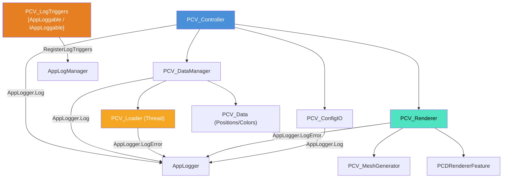

# PCV デバッグビューア (PointCloudViewer) 仕様書

> 📂 **親ノード**: [Wiki.md](./Wiki.md) | 🏷️ **種類**: 🏗️ システム設計書  
> [RealTimeOcclusion Wiki (ポータル)](./Wiki.md) に戻る

本ドキュメントは、点群（Point Cloud）データのリアルタイム可視化と確認をサポートする「デバッグビューア (PointCloudViewer / `PCV`)」の設計思想、モジュール構成、ファイルフォーマット、パラメータ詳細および使用方法をまとめたテクニカルリファレンスです。

---

## 1. 概要

本システムは、三次元点群空間を Unity シーンビューおよびゲームビューで即座にプレビューし、位置合わせ（キャリブレーション姿勢補正）や色・サイズのビジュアル確認を行うためのデバッグ基盤です。

不要な空間検索や複雑なフィルタリング機能を削減し、シンプルかつ軽量な PLY / TXT ファイルの非同期ロードと描画に特化しています。

### 主な特徴

* **マルチフォーマット非同期ロード**: PLY (ASCII/Binary) および TXT 点群ファイルをバックグラウンドスレッドで非同期ロードし、メインスレッドのフレームフリーズを回避します。
* **姿勢アライメント補正機能**: `PCV_Controller` によるワンタッチ補正 (`ApplyTransformCorrection`) で、点群のスケール・回転・位置姿勢を最適化します。
* **軽量 Mesh 生成 & PCD パイプライン連携**: `PCV_MeshGenerator` による `Topology: Points` の Unity Mesh 生成、および URP `PCDRendererFeature` への点群バッファ引き渡しに両対応しています。

---

## 2. 設計思想・アーキテクチャ

### 2.1 生成ファイル・ディレクトリ構成

```text
Assets/Features/Debug/Scripts/PointCloudViewer/
├── PCV_Controller.cs                  # PCV デバッグ全体の統括・姿勢補正・ソース切り替え
├── PCV_DataManager.cs                 # 点群メモリ保持 & OnDataUpdated イベント発火
├── PCV_Data.cs                        # 頂点・カラー配列のメモリデータコンテナ
├── PCV_Loader.cs                      # PLY / TXT マルチスレッド非同期ファイルパース
├── PCV_Renderer.cs                    # 点群メッシュ描画 & PCDバッファ供給
├── PCV_MeshGenerator.cs               # Unity Mesh (Points topology) 動的生成
├── PCV_Settings.cs                    # インスペクター設定・プロファイルデータコンテナ
├── PCV_ConfigIO.cs                    # JSON プロファイル保存・読み込み
└── PCV_LogTriggers.cs                # AppLogManager 連動用ログトリガー登録コンポーネント
```

### 2.2 クラス相関図



### 2.3 データロード＆描画フロー

```text
[PCV_Controller] (ロード指示)
       │
       ▼
[PCV_Loader] (バックグラウンドスレッドで PLY/TXT パース)
       │
       ▼
[PCV_DataManager] ──► OnDataUpdated イベント発火 
       │
       ├──► [PCV_MeshGenerator] ──► Unity SceneView 点群描画
       │
       └──► [PCDRendererFeature] ──► URP オクルージョン計算バッファ共有
```

---

## 3. セットアップ・使用方法

### 3.1 クイックスタート手順

#### Step 1: コンポーネントのアタッチ

デバッグ表示を行いたいシーンオブジェクトに `PCV_Controller` をアタッチします。

#### Step 2: パラメータ設定とファイル指定

| 設定項目 | 型 | 既定値 | 説明 |
|---|---|---|---|
| `pointCloudFilePath` | `string` | `""` | 読み込む PLY または TXT ファイルのパス |
| `autoLoadOnStart` | `bool` | `true` | 起動時に自動ロードを実行するか |
| `pointSize` | `float` | `0.05f` | 点群の表示サイズ |
| `useGlobalBuffer` | `bool` | `false` | RealSense リアルタイム点群ソースと切り替えるか |

#### Step 3: 実行と姿勢補正

1. Play モードに入ると、指定ファイルが非同期に読み込まれ点群が表示されます。
2. インスペクターの **Apply Transform Correction** ボタンを押下すると、対象オブジェクトの姿勢アライメントが同期補正されます。

---

## 4. 仕様・パラメータ詳細

### 4.1 主要モジュールの役割・パラメータ

* `PCV_Controller`: 設定ファイルの変更検知、姿勢補正 (`ApplyTransformCorrection`)、描画ソース切り替えの統括制御。
* `PCV_DataManager` & `PCV_Loader`: PLY / TXT ファイルの非同期ロードと `PCV_Data` 構造体への格納、および `OnDataUpdated` イベント発火。
* `PCV_Renderer`: `PCV_MeshGenerator` を用いたシーンビュー描画と、URP 用 `PCDRendererFeature` への点群バッファ供給 (`SetPointCloudData` / `SetUseGlobalBuffer`)。

---

## 5. デバッグ・留意事項

### 5.1 留意事項

* **描画ソースのワンタップ切り替え**: PCV デバッグファイル描画と RealSense カメラのリアルタイム点群描画は、`PCV_Controller` 上でワンタップ切り替え可能です。
* **大容量点群ファイルのメモリ対策**: 巨大な PLY ファイルを読み込む際は、非同期ロード時のメモリ割り当てスパイクを防ぐため、事前に点群をダウンサンプリングすることを推奨します。

### 5.2 統制ログシステム (AppLogManager) との同期

PCV モジュールの全デバッグログは `AppLogger` 経由に統一されており、`PCV_LogTriggers` ヘルパーを介して `AppLogManager` の **`PCV (PointCloudViewer)`** グループ配下に以下の 5 つの機能別サブトリガーが自動登録されます。

| サブトリガー名 (Tag) | 監視・制御対象クラス | 主なログ出力内容 |
|---|---|---|
| `PCV_Controller` | `PCV_Controller` | 描画ソース切り替え（RealSense / PCV File）、姿勢アライメント補正適用結果、コンポーネント未アタッチ警告 |
| `PCV_DataManager` | `PCV_DataManager` | 点群データのロード完了・頂点数再構築通知、点群データ不存在警告 |
| `PCV_Loader` | `PCV_Loader` | PLY / TXT ファイル非同期読み込みエラー、ASCII非対応エラー、ファイル非存在エラー |
| `PCV_Renderer` | `PCV_Renderer` | メッシュ描画初期化エラー、MeshFilter / MeshRenderer 欠損警告 |
| `PCV_ConfigIO` | `PCV_ConfigIO` | JSON プロファイル設定ファイルの保存・読み込み結果およびエラー |

詳細な共通ログ規則については [Logging.md](./Logging.md) を参照してください。
