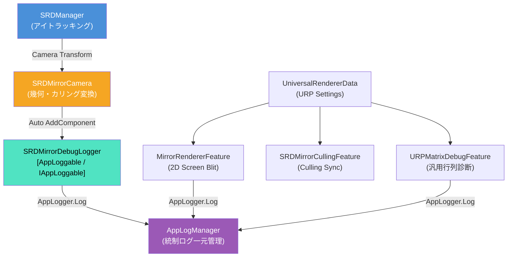

# 3D立体視・ハーフミラー制御設計思想 仕様書

> 📂 **親ノード**: [Wiki.md](./Wiki.md) | 🏷️ **種類**: 🏗️ システム設計書  
> [RealTimeOcclusion Wiki (ポータル)](./Wiki.md) に戻る

本ドキュメントでは、Sony Spatial Reality Display (SRDisplay) 等の空間再現ディスプレイにおける運動視差（アイトラッキング）技術と、仮想カメラ再構築・ハーフミラー鏡像補正を統括する「3D立体視・ハーフミラー制御モジュール」の設計思想、数理モデル、各種再構築モード、URP パイプライン統合仕様、およびトラブルシューティングについて解説します。

---

## 1. 概要

本モジュールは、Sony SRDisplay SDK が提供するアイトラッキング視差情報を維持しつつ、ハーフミラー設置時の光学反転や運動視差のテストを行うため、**「仮想カメラによる視点再構築」**および**「URP レンダリングパイプラインとの自動連携」**を実現する堅牢なアーキテクチャを採用しています。

実カメラ（`LeftEyeCamera_0` / `RightEyeCamera_0`）のトランスフォームと投影行列（Frustum）から仮想カメラ（`VirtualLeftEyeCamera` / `VirtualRightEyeCamera`）を動的に生成し、反転投影行列（$m_{00} < 0$）に伴うポリゴンカリング崩れを防ぎながら、PCD（視覚オクルージョン）システムへ精密な深度およびカラー情報を共有します。

```text
  [SRDManager (アイトラッキング)]
                 │
                 ├─► [SRDMirrorCamera (実カメラ鏡像幾何変換)]
                 │      └─► [SRDMirrorDebugLogger (デバッグログ独立出力)]
                 │
                 ├─► [SRDMirrorCullingFeature (URP CullingMatrix 同期)]
                 ├─► [MirrorRendererFeature (2D Screen-space 鏡像 Blit)]
                 │
                 ▼
       [UniversalRendererData (URP Pipeline)]
                 │
                 ├─► [URPMatrixDebugFeature (汎用 URP 行列診断)]
                 ▼
       [PCDContextBuilder (URP RenderGraph)]
                 │ (VirtualDepthTex / LastPixelCount 検出)
                 ▼
       [PCDRenderPass (オクルージョン合成描画)]
```

### 主な特徴

* **単一責任の原則に基づく完全な責務分離**: 鏡像視点・カリング計算を担当する `SRDMirrorCamera` と、デバッグ監視・表示を担当する `SRDMirrorDebugLogger` を完全に分離構成しています。
* **多様な Frustum 再構築モード**: ディスプレイ四隅からの計算（`CustomProjectionFromCorners`）、行列分解・境界反転（`FrustumDeconstructAndMirror` / `FrustumDeconstructSwapLR`）、物理寸法幾何計算（`PhysicalDisplayBounds`）など、実験条件に応じた 6 種類の再構築モードをサポートします。
* **Vector3.Reflect による完全 3D 鏡面反射**: 回転反転モード（`MirrorRotation`）により、ディスプレイ法線および右方向ベクトルに対する完全な 3D 姿勢鏡面反射を適用します。
* **URP カメラコンポーネント自動同期**: 仮想カメラ生成時に URP 固有コンポーネント（`UniversalAdditionalCameraData`）を動的アタッチし、`requiresDepthOption = On` / `requiresColorOption = On` を強制して PCD 用の深度バッファを 100% 保証します。
* **カリング自動補正 (`SRDMirrorCullingFeature` & `GL.invertCulling`)**: 投影行列の $m_{00} < 0$（左右反転）を検知し、URP Culling ステージおよび仮想カメラのラスタライズ描画サイクル内で自動的に `GL.invertCulling = true` および `cullingMatrix` 同期を適用してメッシュのカリング消失を防ぎます。

---

## 2. 設計思想・アーキテクチャ

### 2.1 生成ファイル・ディレクトリ構成

```text
Assets/ThirdParty/SRDisplayUnityPlugin/
├── Runtime/
│   ├── SRDMirrorCamera.cs            # 鏡像視点・カリング行列変換コンポーネント (純粋機能)
│   ├── SRDManager.cs                 # Sony SRDisplay SDK 統括コンポーネント
│   ├── MirrorRendererFeature.cs      # URP 2D Screen-space 鏡像 Blit RenderFeature
│   ├── SRDMirrorCullingFeature.cs   # URP CullingMatrix 強制同期 RenderFeature
│   ├── Debug/
│   │   ├── SRDMirrorDebugLogger.cs  # 独立デバッグログ出力・監視コンポーネント
│   │   └── SRD_LogTriggers.cs       # 互換性維持用ラッパー
│   └── Unity.jp.co.sony.srd.asmdef   # アセンブリ定義 (Universal.Runtime / Core.Logging 参照)
Assets/Core/Scripts/Debug/
└── URPMatrixDebugFeature.cs         # 汎用 URP 行列・パイプライン診断 RenderFeature
```

### 2.2 クラス相関図



### 2.3 処理フロー

1. **実カメラレンダリング開始割り込み (`OnBeginCameraRendering`)**:
   `SRDMirrorCamera` が `RenderPipelineManager.beginCameraRendering` を受け取り、`Case B Mirrored Basis` に従って `worldToCameraMatrix` と `cullingMatrix` を鏡像変換更新。
2. **デバッグ視差・行列監視 (`SRDMirrorDebugLogger`)**:
   `SRDMirrorDebugLogger` が `RenderPipelineManager` イベントを個別監視し、`AppLogManager` の `[SRD_MirrorCamDebug]` および `[SRD_ProjDetCheck]` サブトリガー状態に基づいて診断ログを `AppLogger` 経由で独立出力。
3. **URP Culling 同期 (`SRDMirrorCullingFeature`)**:
   URP の Culling ステージ直前 (`BeforeRenderingPrePasses`) にて `ScriptableCullingParameters.cullingMatrix` を `projectionMatrix * worldToCameraMatrix` へ一致させ、カメラ視野外オブジェクトの誤破棄を抑止。
4. **画面空間Blit鏡像処理 (`MirrorRendererFeature`)**:
   ポストエフェクト描画完了直後 (`AfterRenderingPostProcessing`) にて `ScreenSpaceMirror.shader` を適用し、画面全体を水平反転して出力。

---

## 3. セットアップ・使用方法

### 3.1 クイックスタート手順

#### Step 1: コンポーネント配置

1. シーン内に `SRDManager` を配置します。
2. `SRDManager` またはその子要素のカメラに `SRDMirrorCamera` をアタッチします。(`SRDMirrorDebugLogger` が自動配置されます)

#### Step 2: URP RendererFeature の設定

1. 使用中の `UniversalRendererData` アセットを選択します。
2. `MirrorRendererFeature` および必要に応じて `SRDMirrorCullingFeature`, `URPMatrixDebugFeature` を追加します。

#### Step 3: モードおよびパラメータ調整

インスペクターから `enableMirror` を目的に合わせて設定します。

| 設定項目 | 型 | 既定値 | 説明 |
|---|---|---|---|
| `enableMirror` | `bool` | `true` | 鏡像座標系変換および RenderTexture 水平反転の有効化 |

---

## 4. 仕様・パラメータ詳細

### 4.1 再構築モード仕様 (`ProjectionReconstructMode`)

| モード名 | 数理仕様・特徴 | 用途 |
|---|---|---|
| `CustomProjectionFromCorners` | ディスプレイ四隅のワールド座標と `vCam` 位置から幾何学的に完全な Off-axis Projection を再構築 | 標準・推奨モード |
| `FrustumDeconstructAndMirror` | SDK 出力行列から $(l, r, b, t)$ を分解し、$l' = -r, r' = -l$ で X 軸境界を完全反転 | 行列境界抽出テスト |
| `FrustumDeconstructSwapLR` | SDK 出力行列から $(l, r)$ を抽出後、符号反転せずに直接 Swap ($l' = r, r' = l$) して再構築 | 視差反転実験用 |
| `PhysicalDisplayBounds` | ディスプレイの物理サイズ (BodyBounds) と視点ローカル位置から直接 Frustum を計算 | SDK 行列非依存テスト |
| `SDKWithM02Invert` | SDK 出力行列の $m_{02}$（X 軸シフティング成分）のみ符号反転 | 簡易反転モード |
| `SDKUnmodified` | SDK 出力行列を無加工で適用 | デバッグ・比較基準 |

### 4.2 数式モデル・理論的背景

<details>
<summary><b>📐 Off-axis Frustum 分解・再構築と鏡面反射の数理モデル（クリックで展開）</b></summary>

#### A. 透視投影行列からの Frustum 6 要素抽出式

一般的な Off-axis 透視投影行列 $\mathbf{P}$ における近クリップ面 $N$ 上の境界 $(l, r, b, t)$ は、行列の要素 $m_{00}, m_{11}, m_{02}, m_{12}$ から以下のように逆算抽出されます。

$$
r = \frac{N}{m_{00}}(1 + m_{02}), \quad l = \frac{N}{m_{00}}(m_{02} - 1)
$$

$$
t = \frac{N}{m_{11}}(1 + m_{12}), \quad b = \frac{N}{m_{11}}(m_{12} - 1)
$$

`FrustumDeconstructSwapLR` モードでは、反転された境界 $l' = r, r' = l$ を用いて `Matrix4x4.Frustum(l', r', b, t, N, F)` を再構築することで、符号を維持したまま左右の Frustum 平面を入れ替えます。

#### B. Vector3.Reflect による 3D 鏡面回転反射

ディスプレイの右方向ベクトル $\mathbf{n}_{\text{right}}$ に対する視線方向 $\mathbf{f}$ および上方向 $\mathbf{u}$ の鏡面反射は、次式で決定されます。

$$
\mathbf{f}' = \mathbf{f} - 2(\mathbf{f} \cdot \mathbf{n}_{\text{right}})\mathbf{n}_{\text{right}}
$$

$$
\mathbf{u}' = \mathbf{u} - 2(\mathbf{u} \cdot \mathbf{n}_{\text{right}})\mathbf{n}_{\text{right}}
$$

最終的な仮想カメラの回転姿勢は $\mathbf{R}' = \text{LookRotation}(\mathbf{f}', \mathbf{u}')$ として適用されます。

</details>

---

## 5. デバッグ・留意事項

### 5.1 留意事項

* **アセンブリ参照 (`Unity.jp.co.sony.srd.asmdef`)**:
  `SRDMirrorCamera` および `SRDMirrorDebugLogger` で URP 固有データおよびログ基盤を扱うため、`Unity.jp.co.sony.srd.asmdef` の `"references"` に `"Unity.RenderPipelines.Universal.Runtime"` および `"Core.Logging"` が含まれている必要があります。
* **二重反転の回避**:
  カメラの Projection 行列の $m_{00}$ が負（$m_{00} < 0$）の時、PCD パス（`PCDContextBuilder`）側で $m_{00}$ の符号を手動で正に反転させると、ラスタライザ描画と Compute Shader 投影の向きが一致しなくなる「二重反転」が発生します。`PCDContextBuilder` にはカメラの Projection 行列を無加工で渡す必要があります。

### 5.2 統制ログシステム (AppLogManager) との同期

SRD 表示および鏡像関連のデバッグログは、`AppLogManager` のインスペクター上の **`📂 SRD Display (PCD/SRD)`** および **`📂 URP / RenderPipelines`** カテゴリから個別にコントロール可能です。

| サブトリガー名 | 担当クラス | 説明 |
|---|---|---|
| `[SRD_NativeLog]` | `SRDCorePlugin` / `SRDMirrorDebugLogger` | Sony SRDisplay C++ Native DLL コールバックデバッグログ (`[oz-debug-log]`) |
| `[SRD_MirrorCamDebug]` | `SRDMirrorDebugLogger` | 鏡像視点 View/Proj 行列の分解診断および視差誤差計算 |
| `[SRD_ProjDetCheck]` | `SRDMirrorDebugLogger` | 投影行列式(Det)および非対称性の検証ログ |
| `[SRD_MirrorPassDebug]` | `MirrorRendererFeature` | 2D 画面空間 Blit パスの実行ログおよび視差ズレ検証 |
| `[URP_MatrixDebug]` | `URPMatrixDebugFeature` | 汎用 URP パイプライン状態・View/Proj/CullingMatrix 全要素比較診断 |

統制ログ仕様の詳細については [Logging.md](./Logging.md) および [OcclusionRendering.md](./OcclusionRendering.md) を参照してください。
