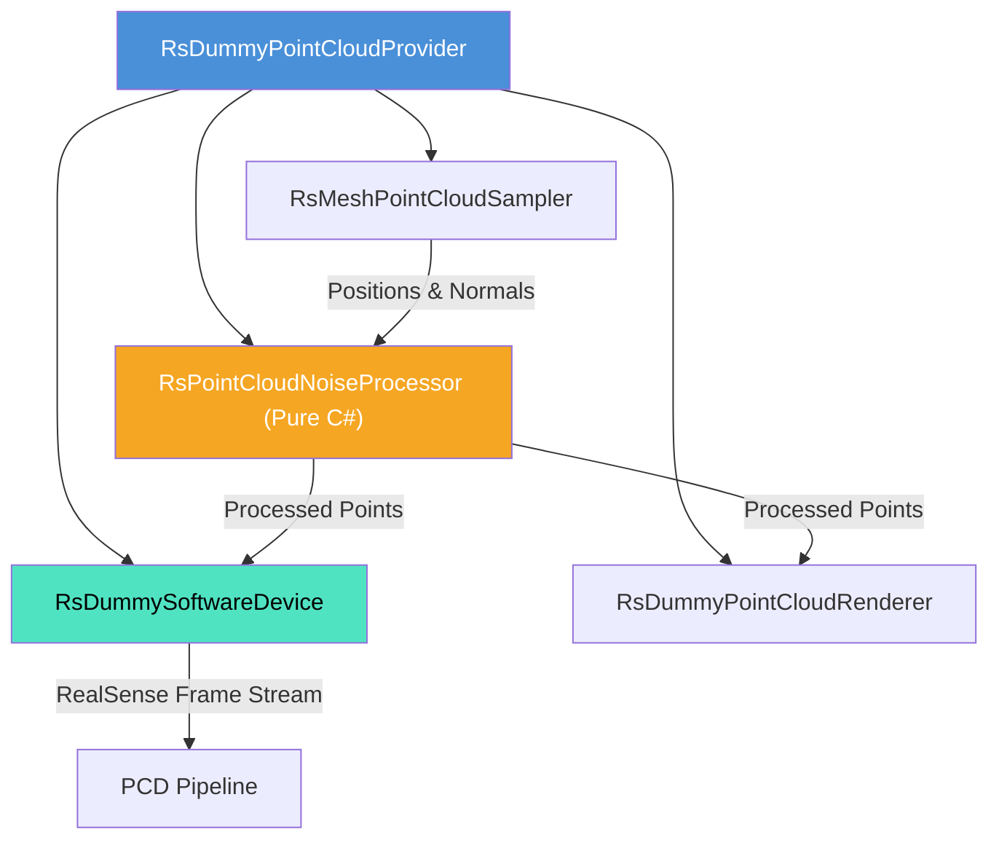

# ダミー点群生成・ノイズ付加システム (Dummy Point Cloud System) 仕様書

> 📂 **親ノード**: [Wiki.md](./Wiki.md) | 🏷️ **種類**: 🏗️ システム設計書  
> [RealTimeOcclusion Wiki (ポータル)](./Wiki.md) に戻る

本ドキュメントでは、Unity 上の 3D オブジェクト（`MeshFilter` または `SkinnedMeshRenderer`）から物理密度および色を指定して実測点群をリアルタイム生成し、さらにメッシュ法線方向のノイズや外れ値（Outliers）を付加する**ダミー点群生成・ノイズ付加システム**（`DPC`: Dummy Point Cloud System）の仕様・構造・使用方法について解説します。

---

## 1. 概要

本システムは、実機の RealSense カメラが接続されていない開発環境やテスト環境において、RealSense 互換の点群ストリーム (`RsFrameProvider` / `SoftwareDevice`) を提供し、オクルージョン描画 (`PCD`) や触覚衝突判定 (`HCD`) などの後続パイプラインの動作検証を可能にします。

### 主な特徴

* **メッシュ面・頂点リアルタイムサンプリング**: 三角ポリゴン表面積に応じたランダムサンプリングにより、高精度なワールド座標 `Positions` とワールド法線 `Normals` を生成します。
* **物理ノイズ & 外れ値モデリング**: ガウス分布／一様分布に基づくメッシュ法線方向オフセットノイズ、および一定割合で離脱する外れ値（Outliers）を付与可能です。
* **RealSense ソフトウェアデバイス互換**: RealSense SDK の `SoftwareDevice` 経由で `DepthFrame` ストリームを発行し、実機カメラと完全に同一のインターフェースを提供します。
* **アロケーションフリー & GPU 高速描画**: `RsPointCloudNoiseProcessor` の内部バッファ再利用による GC フリー設計と、Procedural Instancing レンダラーによる高速描画を実現しています。

---

## 2. 設計思想・アーキテクチャ

### 2.1 生成ファイル・ディレクトリ構成

```text
Assets/Features/DummyPointCloud/
├── Prefabs/                           # ダミー点群プロバイダープレハブ
├── Shaders/                           # Instancing 描画用 Shader
└── Scripts/
    ├── Core/
    │   ├── RsDummyPointCloudProvider.cs # サンプリング・ノイズ統括プロバイダー
    │   ├── RsMeshPointCloudSampler.cs   # メッシュ三角形面サンプリング
    │   └── RsPointCloudNoiseProcessor.cs # 法線ノイズ・外れ値付加 (Pure C#)
    ├── Device/
    │   └── RsDummySoftwareDevice.cs     # RealSense SoftwareDevice フレーム発行
    ├── Rendering/
    │   └── RsDummyPointCloudRenderer.cs # GPU Procedural Instancing 描画
    └── Debug/
        └── DPC_LogTriggers.cs           # AppLogManager 連動用トリガー
```

### 2.2 クラス相関図



### 2.3 データパイプラインフロー

```text
[Unity 3D Objects (MeshFilter / SkinnedMeshRenderer)] 
       │
       ▼
[RsMeshPointCloudSampler] ──(メッシュ面/頂点サンプリング & ワールド法線抽出)
       │
       ▼
[RsPointCloudNoiseProcessor] ──(法線方向ノイズ / 外れ値付加: Pure C#)
       │
       ├──► [RsDummySoftwareDevice] ──► RealSense SDK DepthFrame / Pipeline
       │
       └──► [RsDummyPointCloudRenderer] ──► Dirty-based GPU Single-Buffer 描画
```

---

## 3. セットアップ・使用方法

### 3.1 クイックスタート手順

#### Step 1: プロバイダーの配置

1. Scene 上の任意の GameObject に `RsDummyPointCloudProvider` をアタッチします。
2. `Target 3D Objects` リストに、点群化させたい 3D オブジェクト（例: 手のメッシュ、モデル等）を登録します。

#### Step 2: インスペクターパラメータ設定

| パラメータ名 | 型 | 既定値 | 説明 |
|---|---|---|---|
| `targetObjects` | `List<GameObject>` | `[]` | 点群化の対象となる 3D オブジェクトのリスト |
| `densityUnit` | `PointDensityUnit` | `PointsPerCm2` | 点群密度の指定単位 (`PointsPerCm2`, `PointsPerMm2`, `PointSpacingMm`, `TotalPointCount`) |
| `densityValue` | `float` | `1.0f` | 密度の数値設定 |
| `maxPointLimit` | `int` | `100000` | 生成する点群数の最大上限キャップ |
| `colorMode` | `PointColorMode` | `SolidColor` | 点群のカラー指定モード (`SolidColor`, `MaterialColor`, `VertexColor`) |

#### Step 3: ノイズおよび外れ値の調整

1. `RsDummyPointCloudProvider` の **[Noise & Outliers Settings]** を開きます。
2. `Enable Noise` を `true` にし、`Noise Amount Mm` (ノイズ振幅, mm単位) や `Noise Type` (`Gaussian` / `Uniform`) を調整します。
3. `Enable Outliers` を `true` にし、`Outlier Ratio` (発生割合) および `Outlier Distance Mm` (離脱距離, mm単位) を調整します。

---

## 4. 仕様・パラメータ詳細

### 4.1 パラメータ・データ形式

* `RsPointCloudNoiseSettings` パラメータ仕様:

| パラメータ名 | 型 | 既定値 | 説明 |
|---|---|---|---|
| `updateMode` | `NoiseUpdateMode` | `Dynamic` | ノイズの更新モード (`Dynamic`: フレームごと動的 / `Static`: 初回パターン固定) |
| `enableNoise` | `bool` | `false` | メッシュ法線方向へのノイズ移動を有効化 |
| `noiseAmountMm` | `float` | `2.0f` | 法線方向への移動ノイズ量 (mm) |
| `noiseType` | `NoiseDistributionType` | `Gaussian` | ノイズの確率分布 (`Gaussian`: 正規分布 / `Uniform`: 一様分布) |
| `enableOutliers` | `bool` | `false` | 外れ値（飛び値）の生成を有効化 |
| `outlierRatio` | `float` | `0.02f` | 全点群に対する外れ値の発生割合 (0.01 = 1%) |
| `outlierDistanceMm` | `float` | `50.0f` | 外れ値の移動離脱距離 (mm) |
| `outlierUseRandomDirection` | `bool` | `false` | `true`: 全方向ランダム / `false`: メッシュ法線方向に離脱 |

### 4.2 数式モデル・理論的背景

<details>
<summary><b>📐 法線方向ノイズおよび外れ値生成の数理モデル（クリックで展開）</b></summary>

#### A. 法線オフセットノイズ計算式

メッシュ面上の点 $\mathbf{p}_i$ に対し、ワールド単位法線ベクトル $\mathbf{n}_i$ 方向へ付与される移動後座標 $\mathbf{p}'_i$ は次式で表されます。

$$
\mathbf{p}'_i = \mathbf{p}_i + \left( \delta_i \cdot \mathbf{n}_i \right)
$$

ここで、ガウス分布ノイズ $\delta_i \sim \mathcal{N}(0, \sigma^2)$ の場合、Box-Muller 変換により 2 つの一様乱数 $u_1, u_2 \sim U(0, 1)$ から次のように生成されます。

$$
\delta_i = A_{\text{noise}} \cdot \sqrt{-2 \ln u_1} \cdot \cos(2\pi u_2)
$$

| 記号 | 説明 | 単位 / 型 |
|---|---|---|
| $\mathbf{p}_i$ | サンプリング点の初期ワールド座標 | `Vector3` |
| $\mathbf{n}_i$ | メッシュのワールド単位法線ベクトル | `Vector3` |
| $A_{\text{noise}}$ | ノイズ振幅 (`noiseAmountMm`) | $\mathrm{mm}$ (`float`) |
| $\delta_i$ | 法線方向移動スカラー量 | $\mathrm{mm}$ (`float`) |

#### B. 外れ値 (Outlier) 生成モデル

確率 $P_{\text{outlier}} = \text{outlierRatio}$ で生成される外れ値座標 $\mathbf{p}_{\text{outlier}}$ は以下の処理で決定されます。

$$
\mathbf{p}_{\text{outlier}} = \begin{cases}
\mathbf{p}_i + D_{\text{outlier}} \cdot \mathbf{d}_{\text{random}} & (\text{outlierUseRandomDirection} = \text{true}) \\
\mathbf{p}_i + D_{\text{outlier}} \cdot \mathbf{n}_i & (\text{outlierUseRandomDirection} = \text{false})
\end{cases}
$$

| 記号 | 説明 | 単位 / 型 |
|---|---|---|
| $D_{\text{outlier}}$ | 外れ値離脱距離 (`outlierDistanceMm`) | $\mathrm{mm}$ (`float`) |
| $\mathbf{d}_{\text{random}}$ | 単位球面上の全方向ランダムベクトル | `Vector3` |

</details>

---

## 5. デバッグ・留意事項

### 5.1 パフォーマンスおよび GC に関する留意事項

* **アロケーションフリー設計**: `RsPointCloudNoiseProcessor` は内部配列バッファを再利用するため、毎フレームのノイズ処理実行時に GC Alloc が発生しません。
* **静止時描画最適化**: `RsDummyPointCloudRenderer` は `DataVersion` を保持し、オブジェクトおよびノイズに変化がない場合は GPU への `SetData` を回避して 0ms レンダリングを行います。

### 5.2 統制ログシステム (AppLogManager) との同期

本モジュールの動作ログは `AppLogManager` の **`[DummyPointCloud]`** グループで一元管理されます。

* `DPC_Provider`: 点群ストリームの開始・停止およびデータ更新ログを出力します。
* `DPC_Renderer`: GPU ComputeBuffer への転送および描画実行ログを出力します。
* `DPC_NoiseProcessor`: ノイズおよび外れ値の適用結果（処理点数、パラメータ状態）を出力します。

詳細なログ仕様については [Logging.md](./Logging.md) を参照してください。
