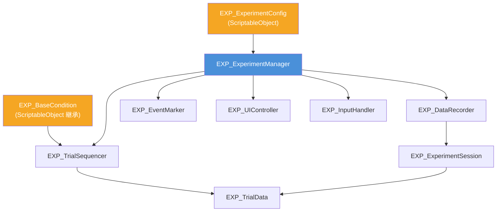

# 被験者実験フレームワーク (Subject Experiment Framework) 仕様書

> 📂 **親ノード**: [Wiki.md](./Wiki.md) | 🏷️ **種類**: 🧪 実験フレームワーク  
> [RealTimeOcclusion Wiki (ポータル)](./Wiki.md) に戻る

本ドキュメントでは、心理物理学実験（2AFC, ABX, 単一刺激法, 調整法）を Unity 上で標準化・効率化し、被験者への教示から物理刺激提示、応答収集、およびデータ出力（CSV / JSON）までを統括する**被験者実験フレームワーク**について解説します。

---

## 1. 概要

本フレームワークは、視覚・触覚相互作用や触覚錯覚（保持触覚等）の心理物理実験を厳密かつ再現性高く実施するために構築されました。

### 主な特徴
* **多種心理物理パラダイム対応**: 2AFC（二選択強制選択）、ABX（3段階同種識別）、SingleStimulus（検出 / 評価）、Adjustment（調整法 / PSE探索）をサポート。
* **自動進行と倫理手続き対応**: 未開始・同意（Informed Consent）・説明（Instruction）・練習・本試行・休憩のフェーズ管理。
* **物理数値と結果の一貫出力**: 試行データ（CSV / JSON）およびイベントログ（TSV）の自動追記保存。
* **ブラインドモードとデバッグUI**: 被験者への数値露出バイアスを防ぐブラインドモードと、実験者用 EditorWindow パネルの提供。

---

## 2. 設計思想・アーキテクチャ

### 2.1 生成ファイル・ディレクトリ構成

```
Assets/Features/Experiment/Scripts/
├── Enums/
│   └── EXP_Enums.cs                     # 列挙型定義
├── Data/
│   ├── EXP_SessionSettings.cs           # 実験設定データ（Foldable 構造体）
│   ├── EXP_InstructionTextConfig.cs     # 教示・同意・説明文章アセット (ScriptableObject)
│   ├── EXP_TrialData.cs                 # 1試行のデータ構造
│   └── EXP_ExperimentSession.cs         # セッション実行時情報
├── Paradigms/                           # 実験パラダイムの抽象基底クラス群
│   ├── EXP_BaseCondition.cs             # 実験条件の全共通最上位基底
│   ├── EXP_BaseHapticsCondition.cs      # 触覚制御を伴う条件の共通中間基底 (バイパス自動管理)
│   ├── EXP_Base2AFCCondition.cs         # パラダイム1: 2AFC 抽象基底
│   ├── EXP_BaseSingleStimulusCondition.cs # パラダイム2: 単一刺激 抽象基底
│   ├── EXP_BaseABXCondition.cs            # パラダイム3: ABX 抽象基底
│   └── EXP_BaseAdjustmentCondition.cs     # パラダイム4: 調整法 抽象基底
├── Core/
│   ├── EXP_ExperimentManager.cs        # 実験ステート＆コンポーネント統括マネージャー
│   ├── EXP_ExperimentFlowController.cs # 実験全体フロー制御 (教示・本試行コルーチン)
│   ├── EXP_TrialRunner.cs              # 1試行実行サイクル
│   ├── EXP_TrialSequencer.cs           # 試行シーケンス管理
│   ├── EXP_DataRecorder.cs             # CSV / JSON 保存
│   ├── EXP_EventMarker.cs              # タイムスタンプ付きイベントログ
│   └── EXP_InputHandler.cs             # キーボード / ゲームパッド入力
├── UI/
│   ├── EXP_ControlPanelDrawer.cs       # GUI 描画統括オーケストレーター
│   ├── EXP_StatusPanelDrawer.cs        # ステータス・進捗描画
│   ├── EXP_ControlInputPanelDrawer.cs  # 条件・操作ボタン描画
│   ├── EXP_PanelElementDrawers.cs       # 共通 UI 要素描画
│   ├── EXP_MetadataTranslator.cs        # メタデータ日本語ローカライズ
│   └── EXP_InGameControlPanel.cs       # Build 後用インゲームコントロールパネル
├── Conditions/                         # 具体的実験条件アセット (ScriptableObject)
│   ├── EXP_OppositeOffsetCondition.cs # 2AFC: OppositeOffset Y 値の知覚比較
│   └── EXP_STMFrequencyCondition.cs   # 2AFC: STM 周波数の知覚比較
├── Debug/
│   └── EXP_LogTriggers.cs             # AppLogManager 連動ログトリガー登録ヘルパー
└── Editor/
    └── EXP_ExperimentControlWindow.cs # Editor 用コントロールウィンドウ
```

### 2.2 クラス相関図



### 2.3 StimulusCoroutine（コルーチン刺激提示）の仕組み

```
EXP_ExperimentManager.RunTrial()
  │
  ├── condition.StimulusCoroutine() が null でない場合
  │   └── yield return StimulusCoroutine()   ← 2AFC 用コルーチンが実行
  │       ├── Interval 1（ハプティクス起動 → 待機 → 停止）
  │       ├── ISI（無刺激待機）
  │       └── Interval 2（ハプティクス起動 → 待機 → 停止）
  │
  └── null の場合（通常条件）
      └── condition.Apply()                  ← 単純な同期適用
```

---

## 3. セットアップ・使用方法

### 3.1 クイックスタート手順

#### Step 1: `ExperimentConfig` アセットの作成
Project ウィンドウで右クリック → **Create → EXP → ExperimentConfig** を選択します。

| 設定項目 | 説明 |
|---|---|
| `participantId` | 参加者 ID（ファイル名に使用） |
| `trialsPerBlock` | 1 ブロックの試行数 |
| `responseKeys` | キーボード応答キー（例: `Z`, `X`） |
| `gamepadButtons` | ゲームパッドボタン名（例: `buttonSouth`） |
| `dataFormat` | `Both`（CSV + JSON 両方保存） |

#### Step 2: 実験条件クラスの実装（例）

```csharp
[CreateAssetMenu(menuName = "EXP/Conditions/STMFrequencyCondition")]
public class EXP_STMFrequencyCondition : EXP_Base2AFCCondition
{
    [Header("Frequency Candidates")]
    public float referenceFrequency = 80f;
    public float[] candidateFrequencies = new float[] { 20f, 40f, 60f, 80f, 100f, 120f, 140f, 160f };

    protected override float GetReferenceValue() => referenceFrequency;
    protected override float GetFixedComparisonValue() => 120f;
    protected override float[] GetCandidateValues() => candidateFrequencies;

    protected override void ApplyValueToController(HAP_HapticsIllusionFoxFootController ctrl, float value)
    {
        ctrl.stmFrequency = value;
    }

    protected override void ResetValueOnTrialEnd(HAP_HapticsIllusionFoxFootController ctrl)
    {
        ctrl.stmFrequency = 80f;
    }

    protected override string FormatValueForDebug(float value) => $"{value:F0} Hz";
}
```

#### Step 3: シーンへの配置と実行
1. シーン上に空の GameObject を作成し、名前を `ExperimentManager` とします。
2. `EXP_ExperimentManager` をアタッチ（必要なコンポーネントが自動追加されます）。
3. `config` に Step 1 の ScriptableObject をアサインし、`EXP_TrialSequencer` の `conditions` に条件アセットを追加します。
4. Play モードで **Space キー** を押すと実験が開始されます（**Escape キー** で安全に中断・保存）。

---

## 4. 仕様・パラメータ詳細

### 4.1 出力データ形式・保存先

保存先ディレクトリ: `Application.persistentDataPath/ExperimentData/`  
（Windows: `%USERPROFILE%\AppData\LocalLow\<Company>\<Product>\ExperimentData\`）

| ファイル種別 | 記述フォーマット |
|---|---|
| `Trial_P001_YYYYMMDD_HHMMSS.csv` | 試行データ（1試行ごとに逐次追記） |
| `Trial_P001_YYYYMMDD_HHMMSS.json` | セッション全体の構造化 JSON |
| `Events_A1B2C3D4_YYYYMMDD_HHMMSS.tsv` | タイムスタンプ付きイベントログ |

#### CSV 出力カラム一覧

```csv
blockIndex,trialIndex,isPractice,paradigmType,responseValue,stimulusVal1,stimulusVal2,isCorrect,conditionName,trialStartTime,stimulusOnsetTime,responseTime,reactionTime,responseType,comparisonDetail,metadata
```

| カラム名 | 型 | 説明・出力例 |
|---|---|---|
| `blockIndex` | `int` | ブロック番号（0始まり） |
| `trialIndex` | `int` | 試行番号（0始まり） |
| `isPractice` | `bool` | 練習試行フラグ (`true` / `false`) |
| `paradigmType` | `string` | パラダイム種別 (`"2AFC"`, `"ABX"`, `"SingleStimulus"`, `"Adjustment"`) |
| `responseValue` | `string` | 選択した物理数値 (例: `1.2500`) |
| `stimulusVal1` | `double` | 第 1 刺激 / 基準値等の物理パラメータ値 |
| `stimulusVal2` | `double` | 第 2 刺激 / 比較値等の物理パラメータ値 |
| `isCorrect` | `bool?` | 正誤判定結果 (`True` / `False` / `N/A`) |
| `conditionName` | `string` | 条件アセットの識別名 |
| `trialStartTime` | `double` | 試行開始時刻 [秒] |
| `stimulusOnsetTime` | `double` | 刺激提示開始時刻 [秒] |
| `responseTime` | `double` | 参加者の応答完了時刻 [秒] |
| `reactionTime` | `double` | 反応時間 [秒] (`responseTime - stimulusOnsetTime`) |
| `responseType` | `enum` | 応答ステータス (`None`, `Correct`, `Incorrect`, `Timeout`) |
| `comparisonDetail` | `string` | 比較内容サマリー |
| `metadata` | `string` | 追加詳細キーバリューペア |

### 4.2 実装済み実験条件（2AFC）

2AFC 条件 (`EXP_STMFrequencyCondition` / `EXP_OppositeOffsetCondition`) では、Inspector の `afcMode` で以下の構成モードを選択できます。

| 構成モード (`afcMode`) | 説明 | 用途 |
|---|---|---|
| `RandomPair` (推奨) | 候補リストから重複しない2つの刺激をランダム選出 | 一対比較法・知覚マップ |
| `ReferenceVsComparison` | 固定の基準刺激 vs ランダム選出された比較刺激 | 弁別閾 (JND)・PSE 測定 |
| `FixedPair` | 指定した固定基準値 vs 指定比較値の単一ペア | 特定ペアの検証 |

---

## 5. デバッグ・留意事項

### 5.1 Play モード時のフォーカス継続対策

`EXP_InputHandler` の `runInBackground` を `true` に設定することで `Application.runInBackground = true;` が有効になり、Editor 内で他ウィンドウをクリックした場合でもキー入力・フレーム更新が停止しません。

### 5.2 本番ブラインドモードとデバッグ表示

* **本番モード (`isDebugMode = false`, 既定値)**:
  * 被験者画面には `【 第 1 刺激 】` / `【 第 2 刺激 】` とのみ表示し、物理数値や正答率を隠蔽して主観評価バイアスを防ぎます。
* **デバッグ表示モード (`isDebugMode = true`)**:
  * コントロールパネルの `🐞 デバッグ表示モード` にチェックを入れると、動作確認用に詳細物理数値（`80 Hz` や `-2.0 cm`）および正答率が表示されます。

### 5.3 留意事項

* **TextMeshPro の必須依存**: `EXP_UIController` は `TMP_Text` を参照しています。シーン内に TextMeshPro パッケージがインポートされている必要があります。
* **条件クラスの継承設計**: 触覚制御を伴う実験条件を作成する場合は `EXP_BaseHapticsCondition` を継承してください。試行開始・終了時の `SetHapticsBypass` および刺激停止処理が自動化されます。
* **EditorWindow**: Menu **Tools → EXP → Experiment Control Panel** から独立操作パネルを開くことができます。

### 5.4 統制ログシステム (`AppLogManager`) との同期

`Experiment` モジュールの全デバッグログは `AppLogger` 経由に統一されており、`EXP_LogTriggers` ヘルパーを介して `AppLogManager` の "Experiment" グループ配下に以下の 6 つの機能別サブトリガーが自動登録されます。

* `[EXP_Manager]` (ステート＆フロー遷移ログ)
* `[EXP_FlowController]` (メインループ・全試行完了ログ)
* `[EXP_TrialSequencer]` (シーケンス生成・条件警告ログ)
* `[EXP_InputHandler]` (キー入力・レスポンス応答ログ)
* `[EXP_EventMarker]` (タイムスタンプイベント記録ログ)
* `[EXP_DataRecorder]` (CSV / JSON 保存結果ログ)

`AppLogManager` インスペクター上でこれらのサブトリガーを個別に ON/OFF トグル制御できます。詳細なアーキテクチャおよび共通仕様については [Logging.md](./Logging.md) を参照してください。