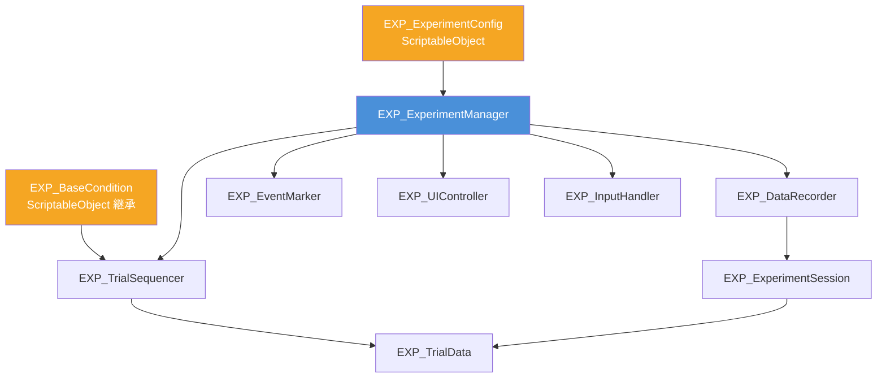

# 被験者実験フレームワーク

## 生成ファイル構成

```
Assets/Features/Experiment/Scripts/
├── Enums/
│   └── EXP_Enums.cs              ← 列挙型定義
├── Data/
│   ├── EXP_ExperimentConfig.cs   ← 実験設定 (ScriptableObject)
│   ├── EXP_BaseCondition.cs      ← 実験条件の基底 (abstract ScriptableObject)
│   ├── EXP_TrialData.cs          ← 1試行のデータ構造
│   └── EXP_ExperimentSession.cs  ← セッション実行時情報
└── Core/
    ├── EXP_ExperimentManager.cs  ← 実験ステートマシン（司令塔）
    ├── EXP_TrialSequencer.cs     ← 試行シーケンス管理
    ├── EXP_DataRecorder.cs       ← CSV / JSON 保存
    ├── EXP_EventMarker.cs        ← タイムスタンプ付きイベントログ
    ├── EXP_UIController.cs       ← 被験者向け UI 制御
    └── EXP_InputHandler.cs       ← キーボード / ゲームパッド入力
```

---

## クラス相関図



---

## クイックスタート（セットアップ手順）

### Step 1: ExperimentConfig を作成
Project ウィンドウで右クリック → **Create → EXP → ExperimentConfig**

| 設定項目 | 説明 |
|---|---|
| `participantId` | 参加者 ID（ファイル名に使用） |
| `trialsPerBlock` | 1ブロックの試行数 |
| `responseKeys` | キーボード応答キー（例: Z, X） |
| `gamepadButtons` | ゲームパッドボタン名（例: buttonSouth） |
| `dataFormat` | `Both`（CSV + JSON 両方保存） |

### Step 2: 実験条件クラスを作成

```csharp
// 例: ハプティクス強度を変える条件
[CreateAssetMenu(menuName = "EXP/Conditions/HapticsCondition")]
public class HapticsCondition : EXP_BaseCondition
{
    [Header("Haptics")]
    public float intensity = 5000f;
    public HAP_AUTDHapticsController hapticsController = null!;

    public override void Apply(EXP_TrialData trial)
    {
        // 刺激を適用
        hapticsController.focusIntensityPascal = intensity;
        trial.metadata["intensity"] = intensity.ToString("F0");
    }

    public override bool? EvaluateResponse(EXP_TrialData trial)
    {
        // 正解キーを Z に設定する場合
        return trial.responseValue == "Z";
    }

    public override void OnTrialEnd(EXP_TrialData trial)
    {
        // 刺激を止める
        hapticsController.bypassHaptics = true;
    }
}
```

### Step 3: シーン設定

1. 空の GameObject を作成 → 名前: **ExperimentManager**
2. `EXP_ExperimentManager` をアタッチ（自動で他コンポーネントも追加されます）
3. `config` に Step 1 で作成した ScriptableObject をアサイン
4. `EXP_TrialSequencer` の `conditions` に条件アセットを追加

### Step 4: 実行
- Play Mode で **Space キー** を押すと実験開始
- **Escape キー** で中断（ここまでのデータは保存されます）

---

## 出力ファイル

保存先: `Application.persistentDataPath/ExperimentData/`
（Windows: `%USERPROFILE%\AppData\LocalLow\<Company>\<Product>\ExperimentData\`）

| ファイル | 内容 |
|---|---|
| `Trial_P001_20250723_143022.csv` | 試行データ（1試行ごと逐次追記） |
| `Trial_P001_20250723_143022.json` | セッション全体の JSON |
| `Events_A1B2C3D4_20250723_143022.tsv` | タイムスタンプ付きイベントログ |

---

## 拡張ポイント

### 試行データに列を追加する
```csharp
public class MyTrialData : EXP_TrialData
{
    public float hapticIntensity;

    public static new string GetCSVHeader()
        => EXP_TrialData.GetCSVHeader() + ",hapticIntensity";

    public override string ToCSVRow()
        => base.ToCSVRow() + $",{hapticIntensity}";
}
```

### LSL マーカーを送信する
```csharp
experimentManager.GetComponent<EXP_EventMarker>().OnEventMarked +=
    (label, time) => LSLMarkerStream.Push(label); // 任意の LSL 実装
```

### 応答後に何か処理する
```csharp
experimentManager.OnResponseReceived += trial =>
{
    Debug.Log($"応答: {trial.responseValue}, RT: {trial.reactionTime:F3}s");
};
```

---

## 設計上の注意点

> [!NOTE]
> **TextMeshPro** が必要です。`EXP_UIController` が `TMP_Text` を参照しています。
> TMP が不要な場合は `TMP_Text` を `UnityEngine.UI.Text` に置き換えてください。

> [!TIP]
> **ゲームパッド対応**には Unity の新しい Input System パッケージ（`com.unity.inputsystem`）が必要です。
> インストールしていない場合、キーボード入力のみ使用できます（コンパイルエラーは出ません）。

> [!IMPORTANT]
> `EXP_BaseCondition` を継承した条件クラスでは `Apply()` メソッドを必ずオーバーライドしてください。
> `EvaluateResponse()` は正誤判定が不要な実験では `return null;` のままで構いません。
