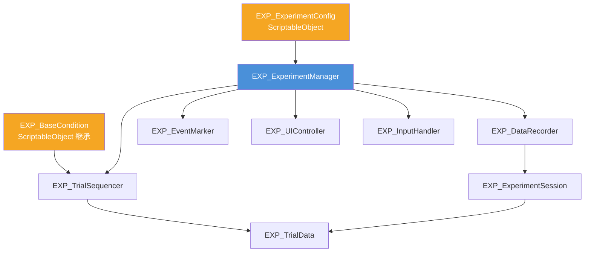

# 被験者実験フレームワーク

## 生成ファイル構成

```
Assets/Features/Experiment/Scripts/
├── Enums/
│   └── EXP_Enums.cs              ← 列挙型定義
├── Data/
│   ├── EXP_SessionSettings.cs            ← 実験設定データ（Foldable 構造体）
│   ├── EXP_InstructionTextConfig.cs      ← 教示・同意・説明文章アセット (ScriptableObject)
│   ├── EXP_TrialData.cs                  ← 1試行のデータ構造
│   └── EXP_ExperimentSession.cs          ← セッション実行時情報
├── Paradigms/                            ← 実験パラダイムの抽象基底クラス群
│   ├── EXP_BaseCondition.cs              ← 実験条件の全共通最上位基底
│   ├── EXP_BaseHapticsCondition.cs       ← 触覚制御伴う全条件の共通中間基底 (リセット・バイパス自動管理)
│   ├── EXP_Base2AFCCondition.cs          ← パラダイム1: 2AFC（二選択強制選択）抽象基底
│   ├── EXP_BaseSingleStimulusCondition.cs ← パラダイム2: 単一刺激（Detection / Rating）抽象基底
│   ├── EXP_BaseABXCondition.cs             ← パラダイム3: ABX（3段階同種識別）抽象基底
│   └── EXP_BaseAdjustmentCondition.cs      ← パラダイム4: 調整法（Method of Adjustment / PSE探索）抽象基底
├── Core/
│   ├── EXP_ExperimentManager.cs         ← 実験ステート＆コンポーネント統括マネージャー
│   ├── EXP_ExperimentFlowController.cs  ← 実験全体フロー制御（教示・練習・本試行・休憩コルーチン）
│   ├── EXP_TrialRunner.cs               ← 1試行実行サイクル（ITI・刺激・応答・判定・記録）
│   ├── EXP_TrialSequencer.cs            ← 試行シーケンス管理
│   ├── EXP_DataRecorder.cs              ← CSV / JSON 保存
│   ├── EXP_EventMarker.cs               ← タイムスタンプ付きイベントログ
│   └── EXP_InputHandler.cs              ← キーボード / ゲームパッド入力
├── UI/
│   ├── EXP_ControlPanelDrawer.cs    ← GUI描画統括オーケストレーター
│   ├── EXP_StatusPanelDrawer.cs     ← ステータス・進捗・バッジ描画
│   ├── EXP_ControlInputPanelDrawer.cs ← 条件・操作ボタン・応答入力描画
│   ├── EXP_PanelElementDrawers.cs    ← バッジ・進捗バー共通描画
│   ├── EXP_MetadataTranslator.cs     ← メタデータ日本語ローカライズ
│   └── EXP_InGameControlPanel.cs    ← Build後用 インゲームコントロールパネル
├── Conditions/                          ← ★ 具体的実験条件 (ScriptableObject)
│   ├── EXP_OppositeOffsetCondition.cs  ← 2AFC: OppositeOffset Y 値の知覚比較
│   └── EXP_STMFrequencyCondition.cs    ← 2AFC: STM 周波数の知覚比較
└── Editor/
    └── EXP_ExperimentControlWindow.cs  ← Editor用 ウィンドウ (Drawerを呼び出す超軽量実装)
```

---

## クラス相関図



---

## クイックスタート（セットアップ手順）

### Step 1: ExperimentConfig を作成
Project ウィンドウで右クリック → **Create → EXP → ExperimentConfig**

| 設定項目 | 説明 |
|---|---|
| `participantId` | 参加者 ID（ファイル名に使用） |
| `trialsPerBlock` | 1ブロックの試行数 |
| `responseKeys` | キーボード応答キー（例: Z, X） |
| `gamepadButtons` | ゲームパッドボタン名（例: buttonSouth） |
| `dataFormat` | `Both`（CSV + JSON 両方保存） |

### Step 2: 実験条件クラスを作成

```csharp
// 例: ハプティクス周波数を変える条件 (2AFC)
[CreateAssetMenu(menuName = "EXP/Conditions/STMFrequencyCondition")]
public class EXP_STMFrequencyCondition : EXP_Base2AFCCondition
{
    [Header("Frequency Candidates")]
    public float referenceFrequency = 80f;
    public float[] candidateFrequencies = new float[] { 20f, 40f, 60f, 80f, 100f, 120f, 140f, 160f };

    protected override float GetReferenceValue() => referenceFrequency;
    protected override float GetFixedComparisonValue() => 120f;
    protected override float[] GetCandidateValues() => candidateFrequencies;

    protected override void ApplyValueToController(HAP_HapticsIllusionFoxFootController ctrl, float value)
    {
        // 刺激パラメータの適用（基底クラス EXP_BaseHapticsCondition がバイパスON/OFFやOnTrialEndを自動管理）
        ctrl.stmFrequency = value;
    }

    protected override void ResetValueOnTrialEnd(HAP_HapticsIllusionFoxFootController ctrl)
    {
        // 試行終了時の後片付け・デフォルト値復元
        ctrl.stmFrequency = 80f;
    }

    protected override string FormatValueForDebug(float value) => $"{value:F0} Hz";
}
```

### Step 3: シーン設定

1. 空の GameObject を作成 → 名前: **ExperimentManager**
2. `EXP_ExperimentManager` をアタッチ（自動で他コンポーネントも追加されます）
3. `config` に Step 1 で作成した ScriptableObject をアサイン
4. `EXP_TrialSequencer` の `conditions` に条件アセットを追加

### Step 4: 実行
- Play Mode で **Space キー** を押すと実験開始
- **Escape キー** で中断（ここまでのデータは保存されます）

---

## 出力ファイル

保存先: `Application.persistentDataPath/ExperimentData/`
（Windows: `%USERPROFILE%\AppData\LocalLow\<Company>\<Product>\ExperimentData\`）

| ファイル | 内容 |
|---|---|
| `Trial_P001_20250723_143022.csv` | 試行データ（1試行ごと逐次追記） |
| `Trial_P001_20250723_143022.json` | セッション全体の JSON |
| `Events_A1B2C3D4_20250723_143022.tsv` | タイムスタンプ付きイベントログ |

### CSV / JSON データ列構成と出力順序

`EXP_TrialData` は以下の標準順序でデータを出力します。独立カラムとして直接数値やサマリーを出力するため、Python/R や Excel での集計・解析が容易です。

```csv
blockIndex,trialIndex,isPractice,paradigmType,responseValue,stimulusVal1,stimulusVal2,isCorrect,conditionName,trialStartTime,stimulusOnsetTime,responseTime,reactionTime,responseType,comparisonDetail,metadata
```

| カラム名 | 型 | 説明・出力例 |
|---|---|---|
| `blockIndex` | `int` | ブロック番号（0始まり） |
| `trialIndex` | `int` | 試行番号（0始まり） |
| `isPractice` | `bool` | 練習試行フラグ (`true` / `false`) |
| `paradigmType` | `string` | パラダイム種別 (`"2AFC"`, `"ABX"`, `"SingleStimulus"`, `"Adjustment"`) |
| **`responseValue`** | `string` | **選択した実際の刺激物理数値**（例: 2AFC/ABXで選択した方の数値 `1.2500` / Adjustment確定値 `8.5000`） |
| `stimulusVal1` | `double` | 第1刺激/基準値等の物理パラメータ値 |
| `stimulusVal2` | `double` | 第2刺激/比較値等の物理パラメータ値 |
| `isCorrect` | `bool?` | 正誤判定結果 (`True` / `False` / `N/A`) |
| `conditionName` | `string` | 条件アセットの識別名 (`EXP_BaseCondition.conditionName`) |
| `trialStartTime` | `double` | 試行開始時刻 [秒] |
| `stimulusOnsetTime` | `double` | 刺激提示開始時刻 [秒] |
| `responseTime` | `double` | 参加者の応答完了時刻 [秒] |
| `reactionTime` | `double` | 反応時間 [秒] (`responseTime - stimulusOnsetTime`) |
| `responseType` | `enum` | 応答ステータス (`None`, `Correct`, `Incorrect`, `Timeout`) |
| `comparisonDetail` | `string` | 比較内容サマリー（例: `"Interval1: 1.0000 (Ref) vs Interval2: 1.5000 (Cmp)"`） |
| `metadata` | `string` | 追加詳細キーバリューペア（`selectedInterval`, `selectedStimulus`, `rawKey` など） |

---

## 拡張ポイント

### 試行データに列を追加する
```csharp
public class MyTrialData : EXP_TrialData
{
    public float hapticIntensity;

    public static new string GetCSVHeader()
        => EXP_TrialData.GetCSVHeader() + ",hapticIntensity";

    public override string ToCSVRow()
        => base.ToCSVRow() + $",{hapticIntensity}";
}
```

### LSL マーカーを送信する
```csharp
experimentManager.GetComponent<EXP_EventMarker>().OnEventMarked +=
    (label, time) => LSLMarkerStream.Push(label); // 任意の LSL 実装
```

### 応答後に何か処理する
```csharp
experimentManager.OnResponseReceived += trial =>
{
    Debug.Log($"選択物理値: {trial.responseValue}, RT: {trial.reactionTime:F3}s");
};
```

---

## 設計上の注意点

> [!NOTE]
> **TextMeshPro** が必要です。`EXP_UIController` が `TMP_Text` を参照しています。
> TMP が不要な場合は `TMP_Text` を `UnityEngine.UI.Text` に置き換えてください。

> [!TIP]
> **ゲームパッド対応**には Unity の新しい Input System パッケージ（`com.unity.inputsystem`）が必要です。
> インストールしていない場合、キーボード入力のみ使用できます（コンパイルエラーは出ません）。

> [!IMPORTANT]
> **条件クラスの基底構造 (継承設計)**:
> 触覚制御を伴う実験条件を作成する場合、全パラダイム基底クラス (`EXP_Base2AFCCondition`, `EXP_BaseABXCondition`, `EXP_BaseSingleStimulusCondition`, `EXP_BaseAdjustmentCondition`) は共通中間基底 **`EXP_BaseHapticsCondition`** を継承しています。
> これにより、触覚コントローラー (`HAP_HapticsIllusionFoxFootController`) の自動取得・保持、刺激提示時の `SetHapticsBypass(ctrl, false)` (照射ON)、および刺激提示終了時・試行終了時の `StopHaptics(ctrl)` / `OnTrialEnd` での `ResetValueOnTrialEnd()` 実行 ＋ `SetHapticsBypass(ctrl, true)` (無音停止) が自動的に管理されます。

> [!NOTE]
> **実験中の custom モード背景信号自動制御とフラグの役割分離**:
> `EXP_ExperimentManager` の `suppressCustomHapticsOnExperiment` (デフォルト ON) により、実験開始 (`StartExperiment`) 時に `HAP_AUTDHapticsController.bypassHaptics` を `true` に変更して背景の custom 触覚信号を自動一時停止し、実験終了・中断時に自動復元します。
> なお、実験条件クラスによる刺激の ON/OFF 制御は `HAP_BaseObjectHapticsController.experimentStimulusSuppressed` という独立したフラグで行われるため、背景の `bypassHaptics` グローバル設定と競合せず、ISI・応答受付中・教示中などの非刺激フェーズで不要な超音波出力が発生しないよう安全に設計されています。

> [!TIP]
> **EditorWindow フォーカス時の入力受け取り (`EXP_InputHandler`)**:
> Unity Editor の `EXP_ExperimentControlWindow` などの IMGUI ウィンドウにフォーカスがある時でも、`EXP_InputHandler` が `OnGUI()` 内で `Event.current` を使ってキーボード入力を確実に拾うように設計されています。

---

## 実装済み実験条件（2AFC 刺激ペア構成）

2AFC 条件（`EXP_STMFrequencyCondition` / `EXP_OppositeOffsetCondition`）では、Inspector の **`afcMode`** で 3 つのペア構成モードを選択できます：

| 構成モード (`afcMode`) | 説明 | 用途 |
|---|---|---|
| **`RandomPair` (推奨・デフォルト)** | 候補リストから**重複しない異なる2つの刺激（A vs B）を完全ランダム選出** | 一対比較法・知覚マップ・全ペアの相対比較 |
| **`ReferenceVsComparison`** | 固定の**基準刺激 (Reference)** vs 候補リストからランダム選出した**比較刺激 (Comparison)** | 基準値に対する弁別閾 (JND) や主観的等価点 (PSE) 測定 |
| **`FixedPair`** | 指定した固定の基準値 vs 指定の比較値の単一ペア | 特定ペアのみの検証 |

---

### 実験1: OppositeOffset Y 値の知覚重さ比較（2AFC）

`EXP_OppositeOffsetCondition` を使用します。

#### パラダイム

```
[ITI] → [Interval 1: Y値 A] → [ISI] → [Interval 2: Y値 B] → [応答: どちらが重い？]
```

- `candidateOffsetsY`: 試行ごとに選ばれる Y オフセット候補リスト（例: `-0.04m 〜 0.02m`）
- 提示順序はカウンターバランスにより自動シャッフルされ、`metadata` に記録されます。

---

### 実験2: STM 周波数の知覚重さ比較（2AFC）

`EXP_STMFrequencyCondition` を使用します。

#### パラダイム

```
[ITI] → [Interval 1: 周波数 A] → [ISI] → [Interval 2: 周波数 B] → [応答: どちらが重い？]
```

- `candidateFrequencies`: 試行ごとに選ばれる周波数候補リスト（例: `20, 40, 60, 80, 100, 120, 140, 160` Hz）
- 実際の超音波ハードウェア (`HAP_AUTDHapticsController`) にも試行毎に即時適用されます。

| キー | 内容 |
|---|---|
| `referenceFrequency` | 基準刺激の周波数 [Hz] |
| `comparisonFrequency` | 比較刺激の周波数 [Hz] |
| `refFirst` | `True` = 第1インターバルが基準刺激 |
| `interval1Frequency` / `interval2Frequency` | 実際の提示順序 |

---

### 2AFC 実験の共通設定

`EXP_ExperimentConfig` で以下を設定してください:

| 設定 | 推奨値 | 説明 |
|---|---|---|
| `responseKeys` | `[Z, X]` | Z = 第1インターバルが重い、X = 第2インターバルが重い |
| `stimulusDuration` | `0` | コルーチン側で制御するため 0 に設定 |
| `responseTimeout` | `5.0` | 刺激終了後の応答制限時間 |
| `showFeedback` | `false` | 閾値推定では正誤フィードバック不要 |
| `itiDuration` | `1.0` | 試行間間隔 |

---

## StimulusCoroutine（コルーチン刺激）の仕組み

```
EXP_ExperimentManager.RunTrial()
  │
  ├── condition.StimulusCoroutine() が null でない場合
  │   └── yield return StimulusCoroutine()    ← 2AFC 用コルーチンが走る
  │       ├── Interval 1（ハプティクス起動 → 待機 → 停止）
  │       ├── ISI（無刺激待機）
  │       └── Interval 2（ハプティクス起動 → 待機 → 停止）
  │
  └── null の場合（通常条件）
      └── condition.Apply()                   ← 単純な同期適用
```

---

## Play モード時のフォーカス停止対策・外部ボタン操作

Build せずに Unity Editor の Play モードで実験を行う場合、画面のフォーカスが外れると一時停止・フレームレート停止することがあります。以下の機能を提供しています。

### 1. フォーカスが外れても背景で Play を継続させる (`runInBackground`)

`EXP_InputHandler` の `runInBackground` を `true` に設定（デフォルトで `true`）にすることで、Unity の `Application.runInBackground = true;` が有効になり、別ウィンドウをクリックしても Play モードのフレーム更新やキー入力受付が停止しません。

### 2. インフォームド・コンセント（同意）➔ 実験教示の 2 段階倫理手続き

被験者実験の安全・倫理的手続きに準拠し、以下の 2 段階の確認ステップで進行します。

1. **未開始パネル**: `☑ 実験手続きに同意し、開始する` ボタンを押して開始。
2. **ステップ 1: 同意文章提示 (`Informed Consent`)**: 被験者画面に同意事項（目的・匿名化・任意参加）を提示 ➔ `☑ 同意して進む` ボタン（Space キー）を押す ➔ `ConsentGiven` イベントがログに刻印。
3. **ステップ 2: 実験説明提示 (`Instruction`)**: 被験者画面に具体的なタスクと操作ガイドを提示 ➔ `👉 次へ進む` ボタンで練習試行 / 本試行へ。

### 3. Editor 用外部コントロールパネル (`EXP_ExperimentControlWindow`)

Unity Editor のメニュー **Tools → EXP → Experiment Control Panel** から開くことができます。

- Play モード中に別ウィンドウ（独立パネル）としてドラッグしてデスクトップ上やサブモニターに配置可能。
- 実験者が手元でキー入力や別ウィンドウクリックをして操作したい場合に便利です。

### 3. 全 4 大パラダイムの入力＆ダイナミック UI 自動対応

コントロールパネルおよび `EXP_InputHandler` は、実行中の試行パラメータからパラダイム種別を自動識別し、最適な選択・操作UIボタンを動的に表示します。

- **2AFC パラダイム**: `【 1 】 第 1 刺激が重い (Z)` / `【 2 】 第 2 刺激が重い (X)`
- **SingleStimulus (Yes/No) パラダイム**: `【 1 】 はい (感知あり) (Z)` / `【 2 】 いいえ (感知なし) (X)`
- **ABX パラダイム**: `【 1 】 刺激 A と同じ (Z)` / `【 2 】 刺激 B と同じ (X)`
- **Adjustment (調整法) パラダイム**: `【 ▲ 値を上げる (Up/W) 】` / `【 ▼ 値を下げる (Down/S) 】` / `【 🟢 調整値を確定する (Space/Enter) 】`

### 4. 本番ブラインドモードとデバッグ表示モード (`isDebugMode`)

被験者への数値（Hz や cm）や正答率の露出・バイアスを防ぐため、**デフォルト（本番モード）では数値を完全に伏せるブラインドモード**になっています。

- **本番モード (`isDebugMode = false`, デフォルト)**:
  - 被験者画面: `【 第 1 刺激 】` / `【 第 2 刺激 】`（物理数値非表示）
  - パネル表示: 物理数値パラメータおよび正答率表示を非表示（主観評価バイアス防止）
- **デバッグ表示モード (`isDebugMode = true`)**:
  - パネル最上部の `🐞 デバッグ表示モード (DebugPlay)` にチェックを入れると、動作確認用に被験者画面やパネルに詳細物理数値（`80 Hz` や `-2.0 cm`）および正答率が表示されます。