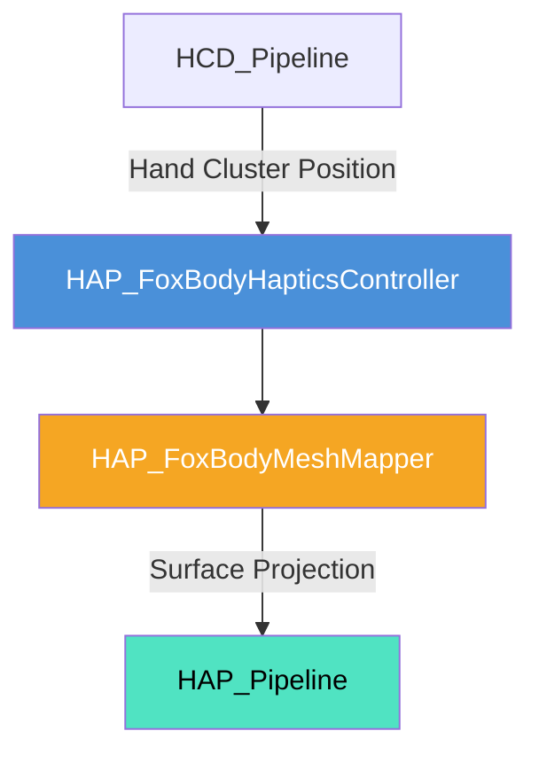

# 狐キャラクター胴体部触覚制御 (FoxBodyHaptics) 仕様書

> 📂 **親ノード**: [Haptics.md](./Haptics.md) | 🏷️ **種類**: ⚙️ 機能仕様書  
> [RealTimeOcclusion Wiki (ポータル)](./Wiki.md) に戻る

本ドキュメントでは、狐キャラクターの背中・胴体領域に対する「撫で動作」や手の接近に反応して、胴体表面に沿った触覚フィードバックを生成する `HAP_FoxBodyHapticsController` の仕様、アルゴリズムおよびパラメータについて解説します。

---

## 1. 概要

本コンポーネントは、ユーザーの手（点群）が狐キャラクターの背中や胴体近傍に接近・なぞる動作を検出した際に、胴体のメッシュ形状に合わせた面状・楕円 STM 触覚刺激を出力する機能です。

### 主な特徴

* **胴体曲面マップアライメント**: 狐モデルの Spine / Chest ボーンに沿った円筒・楕円メッシュ座標系を自動構築します。
* **撫で速度対応変調**: ユーザーの手の移動速度に応じて、刺激の波長・強度を動的エフェクト変化させます。
* **HCD パイプライン即時連動**: `HCD_Pipeline` のクラスタ重心から胴体表面への最近接投影点を即座に算出してフィードバックします。

---

## 2. 設計思想・アーキテクチャ

### 2.1 生成ファイル・関連構造

```text
Assets/Features/Haptics/Scripts/
└── Fox/
    ├── HAP_FoxBodyHapticsController.cs # 胴体撫で触覚判定
    └── HAP_FoxBodyMeshMapper.cs       # 胴体曲面座標変換
```

### 2.2 クラス相関図



---

## 3. セットアップ・使用方法

### 3.1 クイックスタート手順

#### Step 1: コンポーネントのアタッチ

狐モデルのオブジェクトに `HAP_FoxBodyHapticsController` をアタッチします。

#### Step 2: パラメータ設定

| 設定項目 | 型 | 既定値 | 説明 |
|---|---|---|---|
| `spineBone` | `Transform` | `null` | 背骨 (Spine) ボーンの Transform |
| `strokingSensitivity` | `float` | `1.5f` | 撫で動作に対する感度 |
| `bodyStrokingIntensity` | `float` | `1.0f` | 胴体触覚の最大強度 |

---

## 4. 仕様・パラメータ詳細

### 4.1 胴体曲面投影仕様

背骨ボーン `spineBone` を軸とする円筒座標系を構築し、手（点群）の位置を最寄りの背中表面へ正射影して Focus / 楕円 STM 位置を決定します。

---

## 5. デバッグ・留意事項

### 5.1 留意事項

* `spineBone` がアサインされていない場合、自動的にルート Transform を代用軸としてアライメントします。

### 5.2 統制ログシステム (AppLogManager) との同期

動作ログには `[FoxBodyHaptics]` プレフィックスが付与されます。詳細については [Logging.md](./Logging.md) を参照してください。
