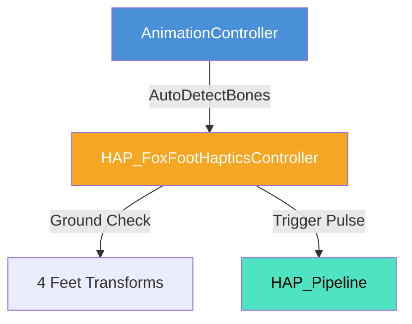

# 狐キャラクター足部触覚制御 (FoxFootHaptics) 仕様書

> 📂 **親ノード**: [Haptics.md](./Haptics.md) | 🏷️ **種類**: ⚙️ 機能仕様書  
> [RealTimeOcclusion Wiki (ポータル)](./Wiki.md) に戻る

本ドキュメントでは、歩行・走調アニメーションを行う狐キャラクターの 4 足部（前後左右の足ボーン）と地面・点群との接触をリアルタイムに検出し、足音・着地に連動した触覚フィードバックを提示する `HAP_FoxFootHapticsController` の仕様、動作フローおよびパラメータについて解説します。

---

## 1. 概要

本コンポーネントは、アニメーション中または移動中の狐キャラクター（Fox）の足部ボーン位置をトラッキングし、着地瞬間や接地状態に応じた触覚刺激を空中超音波アレイ経由でリアルタイム提示する機能です。

### 主な特徴

* **4足ボーン自動検出機能**: ルート Transform を与えることで、`frontLeftFoot`, `frontRightFoot`, `backLeftFoot`, `backRightFoot` および `tailBone` を自動検索・再検出します。
* **着地インパルス刺激**: 足の上下運動・速度変化を検知し、着地瞬間にパルス状の強い触覚刺激を生成します。
* **`AnimationController` 自動バインド連動**: ターゲットオブジェクト切り替え (`Tab` キー) 時に `AnimationController` から自動的に参照が更新されます。

---

## 2. 設計思想・アーキテクチャ

### 2.1 生成ファイル・関連構造

```text
Assets/Features/Haptics/Scripts/
└── Fox/
    ├── HAP_FoxFootHapticsController.cs # 足部触覚判定・自動ボーン検出
    └── HAP_FoxFootVisualizer.cs       # 4足接地状態の Scene ビュー Gizmos 描画
```

### 2.2 クラス相関図



---

## 3. セットアップ・使用方法

### 3.1 クイックスタート手順

#### Step 1: シーンへのアタッチ

狐モデルを管理する GameObject に `HAP_FoxFootHapticsController` をアタッチします。

#### Step 2: パラメータ設定

| 設定項目 | 型 | 既定値 | 説明 |
|---|---|---|---|
| `rootTransform` | `Transform` | `null` | 狐モデルのルート Transform |
| `groundThreshold` | `float` | `0.02f` | 接地とみなす Y 軸閾値 (m) |
| `footPulseIntensity` | `float` | `1.0f` | 着地時の触覚パルス強度 |

---

## 4. 仕様・パラメータ詳細

### 4.1 4 足ボーン自動検索仕様 (`AutoDetectBones`)

`rootTransform` の下位階層から名前に `foot`, `paw`, `leg`, `tail` を含む Transform を正規表現検索し、自動的に各足部フィールドへバインドします。

---

## 5. デバッグ・留意事項

### 5.1 留意事項

* 手動で特定の足ボーンを固定指定したい場合は、Inspector 上で手動アサインし `autoDetect` フラグを解除します。

### 5.2 統制ログシステム (AppLogManager) との同期

動作ログには `[FoxFootHaptics]` プレフィックスが付与されます。

* `[FoxFootHaptics] AutoDetectBones: 4足ボーンの自動アサイン完了`

詳細については [Logging.md](./Logging.md) を参照してください。
