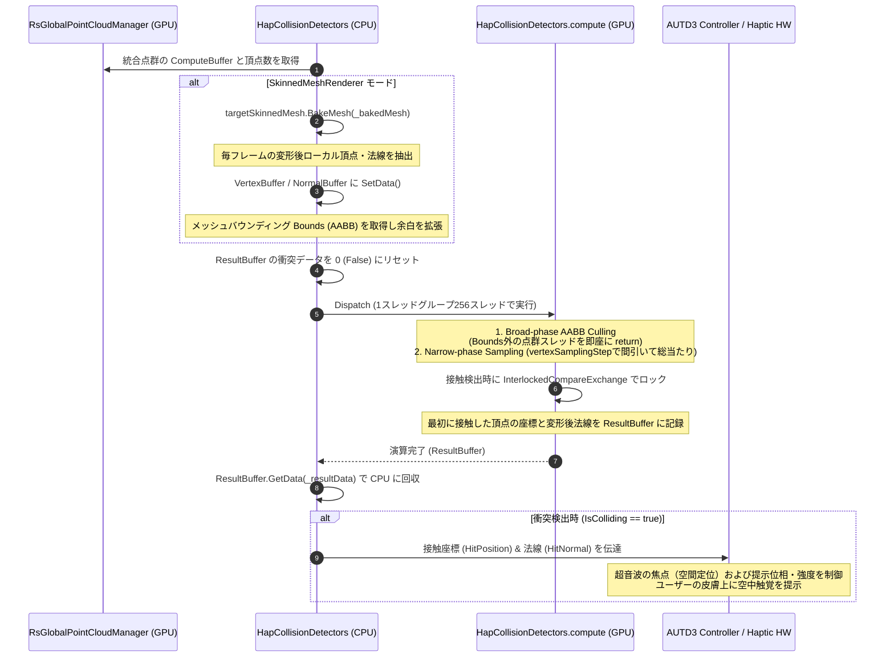

# RealTimeOcclusion 空中超音波ハプティクス（触覚提示）システム設計思想・関数仕様ドキュメント

本ドキュメントは、センサー（Intel RealSense など）から取得され統合されたリアルタイム点群（Point Cloud）と、Unity 上の仮想オブジェクト（または手の動的アニメーションモデル等）との間で高速な物理的接触判定を行い、空中超音波触覚ディスプレイ（AUTD3 等）と連携してリアルタイムにリアルな空中触覚フィードバックを提示する「ハプティクス衝突検出システム」の設計思想、データフロー、および GPU Compute Shader アルゴリズムの詳細を網羅したテクニカルリファレンスです。

---

## 🔗 統合プロジェクトポータル

本システムは、プロジェクトのメインポータルである **[RealTimeOcclusion システム統合 Wiki (WIKI.md)](./WIKI.md)** の「ハプティクス（触覚提示）ノード」として位置づけられており、視覚的なレンダリングシステムから完全に独立して設計されています。

---

## 1. ハプティクス提示システム概要

本システムは、点群として表現される現実世界の「手や物体」が、Unity 内の仮想オブジェクトに接触した際の接触判定、接触位置、および接触面の法線ベクトルをリアルタイムに計算し、空中超音波触覚ディスプレイ（AUTD3 等）へデータを同期する仕組みです。

```
[リアルタイム統合点群バッファ] (RsGlobalPointCloudManager)
               │ (GPU ComputeBuffer 直接参照)
               ▼
   [HapCollisionDetectors] <─── [仮想オブジェクト / SkinnedMesh (BakeMesh)]
               │ (GPU ゼロコピー転送 / Broad-Phase 枝切り)
               ▼
[HapCollisionDetectors.compute] (GPU Narrow-Phase 並列総当たり判定)
               │ 
               ▼ (アトミック衝突フラグ・接触座標・法線記録)
[ResultBuffer.GetData()] (CPUへの高速回収)
               │ 
               ▼
[触覚提示コントローラー (AUTD3 / Haptics Controller)] ──> 手のひらへの空中触覚フィードバック
```

### 提供価値
- **GPU 並列による `O(N * M)` 接触演算**: 数万点に及ぶ点群（`N`）と、数百〜数千ポリゴンの複雑なアニメーションメッシュ（`M`）との間の接触計算を、GPU のスレッド並列処理によってフレームレートを落とさずに、実時間数ミリ秒以内で実行します。
- **BakeMesh による動的変形への追従**: ボーンアニメーションやシェイプキーによって毎フレーム変形する `SkinnedMeshRenderer` の最新の形状情報を CPU 側でキャプチャし、GPU 上で正確な衝突判定を行います。
- **AABB バウンディングボックスによる Broad-Phase の枝切り**: 判定対象オブジェクトのバウンディング情報を基に、衝突の可能性が皆無な大半の点群を `O(1)` で高速に排除し、狭帯域（Narrow-Phase）の接触演算負荷を最小限に抑えます。
- **スレッドセーフなアトミック衝突調停**: 複数のスレッドで同時に衝突が検出された場合でも、アトミック操作を用いて「最初に接触した点」の座標と法線を一意かつ安全に記録します。

---

## 2. 全体アーキテクチャとデータフロー

ハプティクス衝突検出におけるデータおよびバッファのライフサイクルは、センサー側で統合されたグローバル点群と、CPU でベイクされた変形メッシュ情報を GPU Compute Shader に送り、結果を高速に CPU へ回収する一連の流れです。



---

## 3. データソース：グローバル点群マネージャー (RsGlobalPointCloudManager)

ハプティクス衝突検出システムが処理する点群データは、[RsGlobalPointCloudManager.cs](./Assets/Scripts/RealSense/PointCloud/RsGlobalPointCloudManager.cs) によって GPU 上で一元管理されています。

### 1. 共有頂点データ構造 (PointData)
点群バッファ内の各要素は、以下の 28バイト（`STRIDE = 28`）のアライメントを持つ `PointData` 構造体として定義され、GPU 上で保持されます。
```hlsl
struct PointData
{
    float3 pos;   // 3D 空間上の座標 (12 bytes)
    float3 col;   // カラー RGB (12 bytes)
    uint type;    // 頂点属性フラグ (4 bytes)
};
```

### 2. GPU上でのゼロコピー共有
1. 複数カメラの点群データは、`RsGlobalPointCloudManager.Merge.cs` の `MergePoints` カーネルによって、GPUメモリ内で直接 `_globalBuffer` にマージされます（CPU-GPU間の往復転送を一切行わないゼロコピー設計）。
2. `HapCollisionDetectors.cs` は毎フレーム `RsGlobalPointCloudManager.Instance.GetGlobalBuffer()` を通じて、この統合バッファの参照（`ComputeBuffer`）と現在の有効点群数 `CurrentTotalCount` を取得し、衝突判定 Compute Shader へダイレクトにバインドします。

---

## 4. 主要クラスの設計思想と関数仕様
### `HapCollisionDetectors`

- **設計思想**:
  統合点群バッファと仮想ターゲットオブジェクトとの衝突を検知し、ハプティクスハードウェアへとパラメータを受け渡すオーケストレーターです。インスペクター上で単一オブジェクト基準（`TransformOnly`）と詳細メッシュ基準（`SkinnedMeshRenderer`）を動的に切り替えることができます。
- **メモリ・GC 対策**:
  - `BakeMesh` 用の Mesh オブジェクトを毎フレーム `new` せず、`_bakedMesh` 参照をキャッシュして再利用します。
  - SkinnedMesh の頂点数が増減しない限り、頂点・法線用の `ComputeBuffer`（`_meshVerticesBuffer`, `_meshNormalsBuffer`）を再生成せず、`SetData` によるデータ更新のみを行います。これによって毎フレームのヒープ確保と GC Spike を排除しています。
- **主要関数**:
  - `Start()`:
    Compute Shader から各カーネル（`CheckCollision`, `CheckCollisionMesh`）のインデックスを取得し、28バイト（`isColliding` (4) + `hitPoint` (12) + `hitNormal` (12)）の `_resultBuffer` を初期確保。
  - `Update()`:
    毎フレーム実行される衝突検知ループ。
    1. 前フレームの衝突フラグを `0` にリセット。
    2. モードに応じてパラメータ（点群数、判定半径の二乗、座標、バウンディング境界等）を設定。
    3. `collisionComputeShader.Dispatch` を実行して衝突判定処理を GPU に委託。
    4. 実行結果を CPU 側に `GetData` で回収し、判定状態（`IsColliding`, `HitPosition`, `HitNormal`）を更新。
  - `OnDestroy()`:
    メモリリークを防ぐため、確保されたすべての `ComputeBuffer`（結果、頂点、法線）を `Release()` し、ベイク用メッシュインスタンスを明示的に破棄します。

---

## 5. Compute Shader 衝突検出カーネル仕様
`HapCollisionDetectors.compute` に実装されている2つの判定カーネルの内部動作およびアルゴリズムの詳細です。

---

### A. `CheckCollision` (単一座標判定)
- **判定対象**: 単一の Transform（`TargetPosition`）から `collisionRadius` 以内に点群が侵入したかを高速判定します。
- **動作フロー**:
  1. **スレッド境界チェック**: スレッドIDが総点群数 `PointsCount` を超えている場合は処理を終了します。
  2. **早期リターン判定**: すでに他のスレッドで衝突が検知されている（`Result[0].isColliding > 0`）場合は、不必要な計算をスキップして即座に終了します。
  3. **侵入距離の二乗比較**:
     平方根計算（`sqrt`）は GPU 負荷が高いため、距離の二乗（ドット積）を用い、半径の二乗（`RadiusSqr`）と比較します。

      ```math
      \mathbf{d} = \mathbf{p}_{\text{point}} - \mathbf{p}_{\text{target}}
      ```

      ```math
      \text{distSq} = \text{dot}(\mathbf{d}, \mathbf{d})
      ```

      ```math
      \text{if } (\text{distSq} \le \text{RadiusSqr})
      ```

  4. **アトミック衝突フラグ書き換えと情報記録**:
     競合（レースコンディション）を防止するため、アトミック関数 `InterlockedCompareExchange` を用い、衝突フラグをスレッドセーフに `1` に書き換えます。
     
     ```hlsl
     InterlockedCompareExchange(Result[0].isColliding, 0, 1, originalValue);
     ```
     
     `originalValue == 0`（自身が最初に書き込みに成功したスレッド）である場合のみ、Result 構造体の `hitPoint` に点群座標を格納し、`hitNormal` にターゲットから点群への正規化方向（$\text{normalize}(\mathbf{d})$）を記録します。

---

### B. `CheckCollisionMesh` (詳細メッシュ判定)
- **判定対象**: ボーンアニメーション等で動的に変形する `SkinnedMeshRenderer` の全ポリゴン表面と、点群バッファとの間の物理的な侵入を判定します。
```
[GPU スレッドID (点群の1点)]
            │
            ▼
 1. Broad-phase AABB Culling
 └─ 点群座標がメッシュ Bounds (Min/Max) の外か？ ──(Yes: 衝突なし) ──> [Return (即座に終了)]
            │ (No: バウンディング内に存在)
            ▼
 2. Narrow-phase Sampling
 └─ メッシュ頂点バッファを走査 (VertexSubstep ごとに間引き)
      ├─ ローカル頂点をワールド座標へ射影 (LocalToWorldMatrix)
      ├─ 距離の二乗 ≦ 半径の二乗か？ ──(Yes: 接触検出)
      │                                    │
      ▼                                    ▼
                                   3. アトミック調停 & 情報記録
                                   ├─ InterlockedCompareExchange でロック獲得
                                   └─ ワールド頂点座標とワールド法線をResultに書き込み
      ▼                                    ▼
 [次の点群頂点へ]                     [Return (処理完了)]
```

- **詳細動作仕様**:
  1. **Broad-Phase AABB Culling (空間枝切り)**:
     スレッドに割り当てられた点群頂点 `p_point = (x_p, y_p, z_p)^T` が、拡張されたメッシュ全体のバウンディングボックス `b_min = (x_min, y_min, z_min)^T`、`b_max = (x_max, y_max, z_max)^T` の外にあるかを判定します。
     
     以下のいずれか1つでも満たす場合、衝突の可能性はありません。

      ```math
      x_p < x_{\text{min}} \quad \text{or} \quad x_p > x_{\text{max}}
      ```

      ```math
      y_p < y_{\text{min}} \quad \text{or} \quad y_p > y_{\text{max}}
      ```

      ```math
      z_p < z_{\text{min}} \quad \text{or} \quad z_p > z_{\text{max}}
      ```
     
     この条件に一致した場合、即座に早期リターン（`return`）します。これにより、各頂点に対する Narrow-Phase の距離総当たりループを `O(1)` でスキップし、演算コストをほぼゼロに削減します。
  2. **Narrow-Phase Sampling (詳細総当たり判定)**:
     バウンディングボックス内に進入した点群のみ、メッシュ頂点バッファ `MeshVerticesBuffer` を走査します。
     - **VertexSubstep による間引き**:
       計算負荷を調整するため、`VertexSubstep`（例: 10頂点おき）のステップ幅 `S` で検証する頂点をスキップします。

       ```math
       \text{Index}_i = i \times S \quad (i = 0, 1, 2, \dots)
       ```

     - **ワールド空間への座標投影**:
       BakeMesh によって得られた頂点はローカル座標系であるため、毎フレーム更新される `4 * 4` 行列 `M_LocalToWorld` を用いてワールド座標へ射影します。

       ```math
       \mathbf{p}_{\text{world}} = \mathbf{M}_{\text{LocalToWorld}} \cdot \begin{pmatrix} \mathbf{p}_{\text{local}} \\ 1 \end{pmatrix}
       ```

       (ここで `p_local` は BakeMesh から得られたローカル頂点座標を表します)
     - **距離比較とアトミック記録**:
       ワールド頂点と点群頂点の距離の二乗が `RadiusSqr` 以下である場合、アトミック関数で排他的に書き込みロックを確立。
       最初に書き込みに成功したスレッドが、BakeMesh から得られたローカル法線 `n_local` をワールド空間法線 `n_world` に変形して記録します。

       ```math
       \mathbf{n}_{\text{world}} = \text{normalize}\left( \mathbf{M}_{\text{LocalToWorld, 3x3}} \cdot \mathbf{n}_{\text{local}} \right)
       ```
       
       衝突した頂点情報と法線は以下のように記録されます：
       ```hlsl
       Result[0].hitPoint = p_world;
       Result[0].hitNormal = n_world;
       ```

---

## 6. 空中超音波ハプティクス（AUTD3）連携インターフェース概念

本システムで検出された衝突情報（`HitPosition`, `HitNormal`）は、空中超音波触覚ディスプレイ（例: AUTD3）を用いた空中触覚フィードバックへと直結します。

### 1. 座標系のアライメント
- **Unity 空間とデバイス空間のマッピング**:
  Unity 上のワールド座標 `HitPosition` は、あらかじめキャリブレーションされた変換行列を介して、AUTD3 のデバイス座標系（超音波振動子アレイの中心を原点とする空間座標）へと変換されます。

### 2. 音響焦点（Acoustic Focus）の動的定位
- **焦点の生成**:
  変換された接触座標に対し、超音波の位相を制御して波を干渉させ、局所的な「高音圧の焦点（音響焦点）」を 1点、精密に生成します。
- **力覚と方向補正**:
  衝突法線 `HitNormal` を考慮し、手のひらの表面に対して垂直に近い角度で超音波が放射されるよう、振動子アレイのフェーズ制御を最適化し、提示エネルギーの伝達効率を高めます。

### 3. 音圧変調と触覚受容器の刺激
- **振幅変調 (Amplitude Modulation)**:
  人間の皮膚感覚受容器（特にマイスナー小体やパチニ小体）は、持続的な圧力よりも低周波数（例: 100Hz〜200Hz）の振動に高い感度を示します。
- システムは、衝突フラグ（`IsColliding`）がオンの間、超音波キャリア波（40kHz）を特定周波数でパルスまたは正弦波変調し、空中での「物理的な振動感」を生成します。

---

## 7. 動作検証 (Verification Plan)

### A. 静的検証
- `HAPTICS.md` に記載されている `HitResult` 構造体のアライメント（28バイト）およびメンバ変数の定義が、[HapCollisionDetectors.cs](./Assets/Scripts/Haptics/HapCollisionDetectors.cs) の定義と完全一致していることを確認します。
- Compute Shader カーネル名（`CheckCollision`, `CheckCollisionMesh`）のディスパッチ指定が整合していることを確認します。

### B. 実機・動的検証
- 判定オブジェクトを点群領域に接近させた際、インスペクター上の `debugCollisionStatus` が `🔥 COLLIDING! (接触中)` に切り替わり、シーンビューで赤色の Gizmo および衝突位置にマゼンタの球体と衝突面の法線 Ray が正しく描画されることをテストします。
- アセンブリリロード時およびプレイモードの終了時に、`OnDestroy` を通じて `_resultBuffer` やメッシュが漏れなく確実に解放され、メモリリークが発生しないことを検証します。
