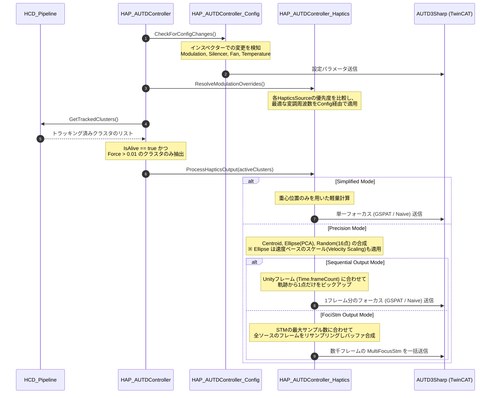

# 空中超音波ハプティクス（AUTD制御）システム

> 📂 **親ノード**: [Wiki.md (ポータル)](./Wiki.md) | 🏷️ **種類**: 🏗️ システム設計書
>
> [RealTimeOcclusion Wiki (ポータル)](./Wiki.md) に戻る
>
> 📎 **関連ドキュメント**: [HapticsAlgorithmComparison.md](./HapticsAlgorithmComparison.md) | [FoxFootHaptics.md](./FoxFootHaptics.md) | [FoxBodyHaptics.md](./FoxBodyHaptics.md) | [HapticsIllusion.md](./HapticsIllusion.md) | [HowToUseHaptics.md](./HowToUseHaptics.md) | [AUTD3_SDK_Transition.md](./AUTD3_SDK_Transition.md)

本モジュールは、`Collision.md`（接触判定およびクラスタリング）から出力された高精度な接触重心や法線、および接触強度（Force）データを受け取り、実際にハードウェア（AUTD3: Airborne Ultrasound Tactile Display）を駆動して空中超音波による触覚フィードバックを提示します。

## 1. モジュールの役割と位置づけ

システム全体におけるハプティクス処理は、責務分離 of 観点から「判定」と「出力」の2段階に分かれています。

1. **Haptics Collision (Collision.md)**:
   仮想オブジェクトと点群の衝突判定、クラスタリング（位置・法線）、トラッキング、および接触面積に基づく Force 計算までを担当します（「どこに」「どの程度の強さで」触れているかの推定）。
2. **Haptics AUTD Controller (本ドキュメント)**:
   Collision モジュールから確定したトラッキングデータを受け取り、それを音響ホログラフィ（GSPAT等）のソルバーに流し込み、TwinCAT 経由で物理的な超音波フェーズドアレイデバイスを駆動します。

> 💡 **ネイティブアルゴリズムとの比較について**
> 詳細ドキュメント **[HapticsAlgorithmComparison.md](./HapticsAlgorithmComparison.md)** を参照してください。

---

## 2. コアコンポーネント

### `AUTD3Device.cs`
物理的な AUTD3 デバイスの配置（トランスフォーム）と管理用IDを表すシンプルなマーカーコンポーネントです。
Unityシーン内に配置されたこのオブジェクトの位置と回転が、そのまま音響シミュレーションにおける超音波振動子の基準座標系となります。

### コントローラー構造（解体・役割分離設計）
神クラス化および多重 Serialize 参照を防ぐため、コントローラーは役割ごとに**通信・ハードウェア制御**と**触覚演算パイプライン**の2つの独立した `MonoBehaviour` コンポーネントに物理分割されています。

#### `HAP_AUTDHardwareController.cs`
物理接続およびデバイスの環境設定、手動操作 API を管理するコンポーネントです。
- **機能**: デバイス物理接続（TwinCAT / SOEM / Simulator）、ファン・環境温度設定、変調 (Modulation)、サイレンサー (Silencer) の維持適用。
- **手動 API**: `SetFocus()`, `SetHolo()`, `SetFan()`, `SetNull()`, `Send()` などの操作インターフェースを提供。
- **内部設計**: 通信およびパラメータ適用ロジックは非MonoBehaviourな純粋 C# サービスクラス（`HAP_AUTDLinkService`, `HAP_AUTDModulationService`）に隠蔽カプセル化されており、Inspector の肥大化や余計なコンポーネント参照を防いでいます。

#### HAP_AUTDHapticsController.cs
リアルタイム触覚信号のオーケストレーションと照射制御を担当するパイプラインコンポーネントです。
- **機能**: ターゲットソース（AutoHCD, ObjectTarget, Manual）の切り替え、HCD_Pipeline やオブジェクト部位ターゲットから集約した焦点の受け取り、GSPAT（Acoustic Holography）・STM（Spatio-Temporal Modulation）の計算・送信指示。HAP_AUTDHardwareController 経由で超音波を出力。

#### HAP_AUTDTransformLoader.cs
シーン上の AUTD3 デバイス群の配置（位置・回転）を JSON ファイルに保存・復元するコンポーネントです。
- **機能**: デバイス配置データの保存/読み込み、不足デバイスの自動プレハブ生成。
- **キャリブレーション Offset 管理**: デバイスアレイの基準原点と Unity 空間の位置補正用パラメータ offset (Vector3) を管理します。

#### HAP_HCDFociSettings.cs
HCD (Hand Contact Detection) クラスタから焦点（Foci）をどのようなアルゴリズムで生成するかを管理する設定コンポーネントです。
- **機能**: generationMode (Simplified / Precision) および「重心 (Centroid)」「形状楕円 (Ellipse)」「ランダム点 (Random)」などの各表現ソース設定を独立保持。HCD_Pipeline にアタッチして使用されます。

#### 純粋 C# サービスクラス (POCO Services)
- `HAP_AUTDLinkService.cs`: 通信ライフサイクル（Open/Close）、`Client`/`Geometry`/`Controller` の所有、送信ロック（`SendLock`）の管理を担当。
- `HAP_AUTDModulationService.cs`: 変調・サイレンサー・ファン・温度設定の差分変更を監視し、変更時のみデバイスへパラメータ送信を適用。

また、接触データから実際のフォーカス（焦点）を生成する処理や、デバイスへの割り当て処理は以下のクラスが担当します。
- `HAP_FociGenerator.cs`: 手・接触クラスタデータから焦点（Centroid/Ellipse/Random）を生成
- `HAP_ObjectFociGenerator.cs`: オブジェクト部位（足、尻尾、関節等）のターゲットから焦点およびシーケンシャルSTM（FociSTM / GainSTM）を生成
- `HAP_BaseObjectHapticsController.cs`: オブジェクト部位のハプティクス制御抽象基底クラス（`HAP_ObjectFociGenerator` へ委譲し、純粋な判定・トランスフォーム管理を担当）
- `HAP_GSPATDeviceAllocator.cs`: 空間的な指向性や距離、デバイスIDに基づいて、最適なデバイスグループへ焦点を割り当て

### `HAP_GizmoVisualizer` とデバッグ支援機能
エディタ上での開発・検証をサポートするため、以下のコンポーネントが用意されています。
- `HAP_GizmoVisualizer.cs` / `HAP_GizmoVisualizer_Surface.cs`: デバイスの配置、グループ化された色分け、および仮想オブジェクト表面への照射割り当て状況をGizmoとして可視化します。mmスケールの極小メッシュモデルにも対応しています。
- `HAP_AUTDDebugDisabler.cs`: 接続順序（Index）ではなく物理的なデバイスIDをキーとして、特定デバイスの出力およびGizmo描画を個別に無効化（Null出力）する機能を提供します。多台数環境でのトラブルシューティングに役立ちます。

#### ターゲットソースと直交する3軸アーキテクチャ (3-Axis Architecture)
`HAP_AUTDHapticsController` の動作設定は、以下の3つの独立した軸に整理されています。

| 軸 | 設定項目 (`Enum`) | 選択肢 | 概要と役割 |
|---|---|---|---|
| **軸 1: ターゲットデータソース** | **`sourceMode`** | • **`AutoHCD`**<br>• **`ObjectTarget`**<br>• **`Manual`** | **目標焦点（出力座標）の生成元を指定**<br>- `AutoHCD`: 手の接触クラスタ (`HCD_Pipeline`) から動的生成<br>- `ObjectTarget`: 登録された `objectHapticsControllers` リストから自動取得（各コントローラー内で接触判定等を内部評価）<br>- `Manual`: 外部API呼出による手動操作 |
| **軸 2: 空間ソルバー** | **`holoAlgorithm`** | • **`GSPAT`**<br>• **`Naive`** | **複数の焦点を空間的にどう合成計算するか**<br>- `GSPAT`: 多焦点向けの反復最適化計算（高精度）<br>- `Naive`: 単一焦点向け直接位相計算（軽量） |
| **軸 3: 時間・STM駆動方式** | **`stmMode`** | • **`FociSTM`**<br>• **`GainSTM`** | **時間変化（変調軌跡）をどうデバイスに送るか**<br>- `FociSTM`: ハードウェアFPGA単焦点軌跡（強制的に内部はNaive計算、`stmFrequency`再生速度を指定）<br>- `GainSTM`: ソフトウェア多焦点パターン列（軸2のSolverを使用） |

#### ターゲットデータソースモード (Source Mode)

- **AutoHCD (手接触自動追従モード)**
  毎フレーム `HCD_Pipeline.GetTrackedClusters()` を呼び出し、手とオブジェクトの接触点群に対して自動で音響ホログラフィ（GSPAT / Naive）やSTMを用いてマルチフォーカス出力を生成します。
- **ObjectTarget (オブジェクト部位ターゲットモード)**
  `objectHapticsControllers` リストに登録されたカスタムハプティクス制御コンポーネント（キツネの足・尻尾・手持ちオブジェクト等）からターゲット座標を集約して出力します。各コントローラー内設定（`onlyTargetHandContact`）により、手との近接接触判定とも連動可能です。
- **Manual (手動API制御モード)**
  `Update()` での自動出力を停止し、外部スクリプトからの明示的なAPI呼び出し（`SetFocus`, `SetFocusStm` など）を優先します。

#### マルチオブジェクトターゲット制御 (`objectHapticsControllers`)
複数のオブジェクト部位ターゲット（`HAP_BaseObjectHapticsController`）を `objectHapticsControllers` リストに一括登録・管理できます。単一参照 `objectHapticsController` プロパティも後方互換アクセサとして提供されます。

#### ハプティクス生成モード (Generation Mode & HAP_HCDFociSettings)
AutoHCD モードでは、HCD_Pipeline に配置された HAP_HCDFociSettings コンポーネントを通じて、計算負荷と提示の表現力に応じた生成モードを切り替えることができます。

- **Simplified (簡易モード)**
  抽出された接触クラスタの「重心座標」に対して、単一の焦点（Focus）を生成する最速・最軽量のモードです。従来の単純な接触提示と同等に動作します。
- **Precision (精密モード)**
  クラスタごとにGPUで計算された「共分散行列」や「16点のランダムサンプル」を利用し、以下の高度なハプティクスソース (HapticsSources) を組み合わせて、面やノイズ感を表現する複雑な STM または Sequential 出力を合成します。

#### 触覚表現の拡張 (HapticsSources)
`Precision` モードでは、以下の3つのソース（Source）を組み合わせて触覚をデザインできます。各ソースは独立して有効/無効を切り替えられます。
1. **Centroid Source**: 
   クラスタの重心位置に焦点を提示し、`Force` (接触強度) から振幅(Amplitude)を決定する基本ソースです。`VectorSum` や `MagnitudeSum` など、法線ベクトルや接触点数を加味した多彩な振幅計算モードを備えています。
2. **Ellipse Source**: 
   接触面がどのように広がっているかを示す「共分散行列」からPCA（主成分分析）を行い、接触面の形状（主軸・副軸）にフィットした楕円軌道を描くフレームを生成します。手のひら全体で触れた際の「面をなぞるような感覚」を提示します。速度に応じた周波数・振幅スケーリング（Velocity Scaling）にも対応します。
3. **Random Source**: 
   GPU内でサンプリングされた接触面内のランダムな16個の座標を用いて、不規則に飛び回るフレームを生成します。ザラザラとしたノイズ状の触覚提示に利用できます。

#### 出力モード (Sequential vs FociStm)
Ellipse と Random ソースは、`HapticsOutputMode` によってフレーム生成手法を選択できます。
- **Sequential**: UnityのUpdateフレームごとに1点ずつピックアップして送信します。処理が非常に軽く、他のソースと共存しやすいため推奨設定です。
- **FociStm**: デバイス側のSTMバッファに最大数千フレームの軌跡を一括で流し込みます。非常に滑らかな動きを実現しますが、複数クラスタ存在時の計算負荷が高くなります。

---

## 3. 音響理論と数式モデル

本モジュールが内部で利用している（または AUTD3Sharp に委譲している）超音波制御の主要なアルゴリズムの数式モデルを以下に解説します。

### 3.1 単一焦点 (Focus / Naive)
空間内の特定の目標点 $\mathbf{p} \in \mathbb{R}^3$ に超音波を集束させるための最も基本的なアプローチです。
波長を $\lambda$ （音速 $c \approx 340\,\mathrm{m/s}$ 、周波数 $f = 40\,\mathrm{kHz}$ の場合 $\lambda \approx 8.5\,\mathrm{mm}$ ）、各トランスデューサ（超音波振動子）の位置を $\mathbf{r}_i$ としたとき、目標点で波の位相を揃えるために $i$ 番目のトランスデューサが放射すべき位相 $\phi_i$ は以下のように計算されます：
```math
\phi_i = -\frac{2\pi}{\lambda} \|\mathbf{p} - \mathbf{r}_i\| + \phi_0
```
ここで $\phi_0$ は系全体の基準位相オフセットです。この手法は計算コストが極めて低く、単一の焦点を作るのに適しています。

### 3.2 音響ホログラフィ (GSPAT: GS-PAT algorithm)
複数の目標点 $\mathbf{p}_j \ (j=1, \dots, M)$ に対して同時に指定した音圧振幅 $A_j$ を提示する場合、複雑な干渉波面を設計する必要があります。
空間の伝達関数（伝播による振幅減衰と位相遅れ）を $H_{ji}$ とすると、目標点 $j$ で得られる複素音圧 $p_j$ は以下のように表されます：
```math
p_j = \sum_{i=1}^N H_{ji} q_i \quad \left( H_{ji} = \frac{e^{-jk \|\mathbf{p}_j - \mathbf{r}_i\|}}{\|\mathbf{p}_j - \mathbf{r}_i\|} \right)
```
ここで $q_i = a_i e^{j\phi_i}$ は $i$ 番目のトランスデューサの出力（複素振幅）、 $k = \frac{2\pi}{\lambda}$ は波数です。
GSPAT（Gerchberg-Saxton phased array technique）は、目的の振幅 $|p_j| = A_j$ に近づけるため、固有値問題への帰着と反復計算（位相最適化）を並列処理で行い、高速に最適な位相パターン $\phi_i$ を算出するアルゴリズムです。

### 3.3 カスタム照射モード (Custom / Fox Foot Haptics など)
特定のアプリケーション仕様や追従スクリプトに基づき、照射位置や照射サイクルを動的にカスタマイズする拡張アルゴリズムモードです。
4足歩行モデル (`HAP_FoxFootHapticsController`) や独自の `HAP_BaseObjectHapticsController` と連携し、`HAP_ObjectFociGenerator` 経由で以下の汎用切り替え制御（`stmMode` / `trackMode`）を提供します。
- **FociSTM (ハードウェア単焦点STM / Naive等)**: 接地している有効なターゲット（足や尻尾など）を周回順序で順次切り替えて超音波を照射します（単焦点かつ巡回による時間分割）。ハードウェア側の高速STM機能を利用し、計算負荷が非常に低い `Naive` ソルバー等を用いて動作します。
- **GainSTM (CPU多焦点/PatternStm / GSPAT等)**: `TrackMode.Simultaneous` 時は接地足全てに同時マルチフォーカスGSPATを照射し、`TrackMode.Sequential` 時はCPU計算で1点ずつ高速切り替えを行う柔軟なパターンSTMを生成します。多焦点時は干渉を防ぐ `GSPAT` 最適化演算エンジンを走らせます。

### 3.4 接触強度による動的振幅スケーリング (Dynamic Amplitude Scaling)
HCD_Pipeline から得られる接触強度（Force: $F \in [0, 1]$ ）を用いて、出力音圧を動的に調整します。基準となる最大出力音圧（`focusIntensityPascal`）を $P_{\mathrm{max}}$ としたとき、ターゲット音圧 $P_{\mathrm{target}}$ は線形にスケーリングされます：
```math
P_{\mathrm{target}} = P_{\mathrm{max}} \cdot F
```
これをホログラフィソルバーの目標振幅 $A_j$ として与えることで、物理的な押し込み量に比例した反力を超音波の放射圧として提示します。

### 3.5 振幅変調 (Amplitude Modulation)
$40\,\mathrm{kHz}$ の超音波は人間の皮膚の機械受容器（マイスナー小体やパチニ小体）の応答周波数（数十〜数百Hz）を大きく超えているため、そのままでは何も感じません。そのため、低周波の信号 $M(t)$（例: $150\,\mathrm{Hz}$ のサイン波）を包絡線として振幅変調（AM）をかけます。
出力される波形 $S_i(t)$ は以下のように表されます：
```math
S_i(t) = M(t) \cdot \sin(2\pi f_c t + \phi_i)
```
（ $f_c = 40\,\mathrm{kHz}$ ）
例えばサイン波変調（`SetSine`）の場合、変調信号 $M(t)$ は以下のようになります：
```math
M(t) = \frac{1}{2} (1 + \sin(2\pi f_m t)) \quad (M(t) \in [0, 1])
```

### 3.6 時空間変調 (Spatio-Temporal Modulation: STM)
多数の焦点座標のリストを高い周波数で順次切り替えることで、人間の皮膚の空間分解能と時間分解能の錯覚を利用し、面や線をなぞるような触覚を提示します。
$N$ 個の点からなる軌跡をループ再生する場合、以下のパラメータを用いて周期と変調周波数が決まります。

* 各焦点の座標: $\mathbf{p}_k$
* サンプリング周波数: $f_s$
* 変調周波数: $f_{\mathrm{stm}}$
* 軌跡を1周する周期: $T$

これらを用いて、周期 $T$ と変調周波数 $f_{\mathrm{stm}}$ は次のように計算されます：

```math
T = \frac{N}{f_s} \implies f_{\mathrm{stm}} = \frac{f_s}{N}
```
STMは、前述の振幅変調（AM）とは異なり、焦点そのものが動くことによる皮膚上の摩擦や連続的な刺激（Lateral Modulation）を引き起こす強力な提示手法です。

### 3.7 複数デバイスの指向性ルーティング (Directional Device Grouping)
複数のAUTDデバイスが異なる方向から配置されている場合、仮想オブジェクトの特定の面（クラスタ）に対して、その面に正対しているデバイスだけを選択的に駆動することで効率的な触覚提示を行います。

対象クラスタの面から外側に向かう法線ベクトルを $\mathbf{n}$ 、判定対象のデバイスの正面方向（Forward）ベクトルを $\mathbf{d}$ とします（ともに単位ベクトル）。
デバイスが面に完全に正対しているとき、デバイスの正面ベクトル $\mathbf{d}$ は面の法線 $\mathbf{n}$ とちょうど逆向き、すなわち $-\mathbf{n}$ と一致します。

このとき、デバイスの向き $\mathbf{d}$ と「面の内側に向かうベクトル」 $-\mathbf{n}$ とのなす角 $\theta$ は、ベクトルの内積（Dot Product）を用いて以下のように求められます：
```math
\mathbf{d} \cdot (-\mathbf{n}) = \|\mathbf{d}\| \|-\mathbf{n}\| \cos\theta = \cos\theta
```
したがって、なす角 $\theta$ （度数法）は次式で計算されます：
```math
\theta = \arccos(-\mathbf{d} \cdot \mathbf{n}) \times \frac{180}{\pi}
```
システム設定された許容角度の閾値（`directionalAngleThreshold`）を $\theta_{\text{th}}$ としたとき、以下の条件を満たすデバイス群だけがそのクラスタの担当デバイスとして割り当てられます。
```math
\theta \le \theta_{\text{th}}
```
これにより、横や裏側を向いているデバイスからの無駄な超音波照射を防ぎます。

---

## 4. 全体アーキテクチャとデータフロー

ハプティクスモジュールにおける、設定の適用から実際のデバイス出力までの流れを以下のシーケンス図に示します。



---

## 5. 手動制御 API リファレンス (Manual モード用)

旧ネイティブパッケージが提供していたすべての高度なハプティクス制御機能を、純C#（AUTD3Sharp）で再構築したAPI群です。`OperationMode.Manual` 時の利用を推奨します。

### 基本出力
- `SetNull()` : すべての出力を停止します。
- `SetFocus(Vector3 position, float amplitude)` : 指定座標に単一の焦点を生成します。
- `SetHolo(IEnumerable<Vector3> positions, IEnumerable<float> amplitudes, HoloAlgorithm algorithm)` : 複数の焦点を同時に提示します。

### STM (Spatio-Temporal Modulation)
- `SetFocusStm(IEnumerable<Vector3> positions, float frequency, float amplitude)` : 高速で焦点を移動させることで、軌跡（線状・面状など）を描くような触感を提示します。
- `SetMultiFocusStm(...)` : 複数の焦点が同時に高速移動する高度なアニメーションを実現します。
- `SetGainStm(...)` : フレームごとに全く異なるホログラフィパターン（Gain）を切り替えます。

---

## 6. 関連ファイル構造

本システムに関わるスクリプト群の構造は以下の通りです。

```text
Assets/Features/Haptics/Scripts/
 ├── HAP_AUTDController.cs         # ハプティクス出力のメインオーケストレーター (自動制御・設定反映)
 ├── HAP_AUTDController_Config.cs  # ハードウェア設定反映 (partial)
 ├── HAP_AUTDController_Haptics.cs # HCD_Pipelineからの出力自動生成ロジック (partial)
 ├── HAP_AUTDController_API.cs     # 手動制御・外部操作用API群 (partial)
 ├── HAP_AUTDPerformanceProfiler.cs# ハプティクス全体の処理時間・送信遅延計測プロファイラー
 ├── HAP_BaseObjectHapticsController.cs# オブジェクト部位ハプティクス制御の抽象基底クラス
 ├── HAP_HCDFociSettings.cs        # HCDクラスタからの焦点生成モード(GenerationMode)と精密ソース設定コンポーネント
 ├── HAP_FociGenerator.cs          # 手・接触クラスタからの触覚データ(Focus)生成ロジック
 ├── HAP_ObjectFociGenerator.cs    # オブジェクト部位ターゲットからの焦点・STM生成ロジック
 ├── HAP_GSPATDeviceAllocator.cs   # デバイスとクラスタの指向性・IDに基づく割り当て・データグラム生成
 ├── HAP_GizmoVisualizer.cs        # デバイスグループを描画するユーティリティ (partial)
 ├── HAP_GizmoVisualizer_Surface.cs# 担当面をエディタ上に描画するユーティリティ (partial)
 ├── HAP_AUTDDebugDisabler.cs      # デバイスIDベースでの個別無効化・デバッグコンポーネント
 ├── HAP_AUTDCalibration.cs        # 空間キャリブレーション・デバイス出力テスト用ツール
 ├── HAP_AUTDEnums.cs              # 設定用の列挙型定義 (HoloAlgorithm, ModulationModeなど)
 ├── HAP_HapticsSources.cs         # Centroid / Ellipse / Random の各種ソース定義と形状生成
 ├── HAP_FoxFootHapticsController.cs# キツネの足ボーン追従・疑似STM照射コントローラー
 ├── AUTD3Device.cs                # 空間内のデバイス配置・IDマーカー
 ├── HAP_AUTDTransformLoader.cs    # 複数のデバイス配置（トランスフォーム群）をJSONファイルから自動生成するユーティリティ
 ├── HCD_AutdControllerBridge.cs   # (旧互換用) HCD_PipelineとAUTDControllerを繋ぐブリッジ
 └── Editor/
      ├── HAP_AUTDControllerEditor.cs  # HAP_AUTDController 用カスタムエディタ (GUIレイアウト・表示制御)
      ├── HAP_HCDFociSettingsEditor.cs # HAP_HCDFociSettings 用カスタムエディタ
      ├── HAP_FoxFootHapticsControllerEditor.cs
      ├── HAP_AUTDTransformLoaderEditor.cs
      └── HAP_AUTDCalibrationEditor.cs  # キャリブレーション設定のエディタ保持用
```

---

## 7. AUTD3 リンクモードの設定 (TwinCAT / SOEM / Simulator)
`HAP_AUTDController` は、AUTD3ハードウェアとの通信手段（Link Type）をInspectorから切り替えられるように設計されています。

### 7.1 追加された設定項目 (Inspector)
- **`Link Type`**: `AUTDLinkType` Enumを通じて、接続方法を `TwinCAT`, `SOEM`, `Simulator` から選択可能です。
- **`Soem Adapter Name`**: SOEMを使用する際に、バインディングするネットワークアダプタ名（例: `イーサネット 7`）を指定するためのフィールドです。

### 7.2 コンパイルエラー対策と留意点 (v38仕様)
AUTD3Sharp (v38) では、`TwinCAT`以外のリンク（`SOEM` および `Simulator`）はコアパッケージに含まれておらず、UnityのPackage Managerから別途専用パッケージとして導入する必要があります。
現状のプロジェクト（デフォルト状態）にはコアパッケージしか存在しないため、スクリプト内でSOEMやSimulatorの初期化コードをそのまま記述するとコンパイルエラー（クラス未定義）となります。

これを防ぐため、`HAP_AUTDController.cs` の `Awake()` メソッド内では、**SOEMおよびSimulatorに関する処理は一時的にコメントアウトして保護**されています。

今後これらのリンクを使用する場合は、以下の手順で有効化してください。

1. **パッケージの追加**
   Unity Package Manager (Add package from git URL) から対象のパッケージを追加します。
   - SOEMを使用する場合: `https://github.com/shinolab/AUTD3Sharp.git?path=src/autd3-link-soem#upm/latest`
   - Simulatorを使用する場合: `https://github.com/shinolab/AUTD3Sharp.git?path=src/autd3-link-simulator#upm/latest`
2. **スクリプトの有効化**
   `HAP_AUTDController.cs` を開き、`AUTDLinkType.SOEM` および `AUTDLinkType.Simulator` の `case` 文内にある `/* ... */` のコメントアウトを解除してください。

---

## 8. 空間キャリブレーション機能 (HAP_AUTDCalibration)

`HAP_AUTDCalibration` コンポーネントは、AUTD3デバイスと仮想空間との物理的な位置合わせ（キャリブレーション）および単体テストを支援する専用ツールです。

### 8.1 主な機能
- **出力のオーバーライド**: `Enable Calibration` にチェックを入れると、通常の自動トラッキング出力を無視（バイパス）し、指定した単一または複数の焦点のみを出力します。
- **ターゲットデバイスの選択**: シーン内の全 `AUTD3Device` を検知し、インスペクター上のチェックボックスから特定のデバイス（例: デバイス0とデバイス3だけ）に絞ってテスト出力が行えます。
- **オフセットの自動計算と適用 (`Calculate & Add Offset`)**: 「理想の焦点位置 (FocusTarget)」と「実際の焦点位置 (TruePosition)」を指定することで、その差分から必要な位置ズレ (Offset) を自動計算し、コントローラー (`HAP_AUTDController`) の Offset パラメータに加算します。また、インスペクター上で現在の Offset の値を直接手入力して微調整することも可能です。
- **デバイス位置への永続化 (`Bake Offset to Devices`)**: HAP_AUTDTransformLoader に設定された現在の Offset 量を、**Target Devices でチェックがオンになっているデバイスのみ**の Transform (座標) に物理的に反映（逆移動）させ、Offset をゼロにリセットします。これにより、複数台のデバイスアレイ環境において「1台ずつ順番にチェックを入れて個別のズレをキャリブレーションしては Bake する」という、高度な個別補正ワークフローが可能になります。
- **Playモード状態の保持**: キャリブレーションの性質上、Playモード実行中に様々な調整が行われます。専用の拡張エディタ (`HAP_AUTDCalibrationEditor`) によって、Play中に調整した設定値や直接編集した Offset が適切に退避され、Playモード終了時にEditモードのシーンへ自動で引き継がれます。

---

## 9. パフォーマンスプロファイリングと論文計測ワークフロー

空中超音波ハプティクス提示におけるGSPATの計算仕様および送信遅延を含めた総処理時間を正確に評価・計測するため、本システムには専用のプロファイリング機能が組み込まれています。

### 9.1 計測の仕組みと仕様（CPU/GPU）
* **GSPATの計算仕様**: AUTD3のホログラフィ生成（GSPAT）は**CPU**で処理されます。また、_autd.Send() はGain計算およびデータ送信に関して**同期処理**です（非同期キューへのプッシュではありません）。
* **計測のアプローチ**: 同期処理であるため、C#側の System.Diagnostics.Stopwatch および Unity.Profiling.ProfilerMarker を用いて、DLL内部 of GSPAT計算から送信完了までの実時間を正確に計測可能です。

### 9.2 プロファイリング設定 (Inspector)
HAP_AUTDController の **Performance Profiling** セクションから以下の設定を行えます。

* **Enable Profiling**: プロファイリング全体の有効/無効を切り替えます。無効化されている場合は計測処理のオーバーヘッドはゼロになります。
* **Synchronous Send (重要・論文計測用)**:
  * **ON (同期)**: 通常は別スレッドで行う Send (GSPATの重いCPU計算を含む) をメインスレッドで同期実行します。これにより、UnityのProfiler Hierarchy（メインスレッド）上にすべての処理時間が乗り、**Profile Analyzerによる中央値（Median）などの詳細な統計解析**が可能になります。
  * **OFF (非同期/通常時)**: Send 処理をバックグラウンドスレッド (Task.Run) で非同期実行します。メインスレッドのフレームレート(FPS)を維持するための通常運用モードです。
* **Enable Log**: Unity Consoleへの計測結果テキストの出力の有無。
* **Profiling Log Interval**: Consoleログを出力するフレーム間隔（デフォルト60フレーム）。

### 9.3 関連クラスと構造
* **[HAP_AUTDPerformanceProfiler.cs](../Assets/Features/Haptics/Scripts/HAP_AUTDPerformanceProfiler.cs)**:
  各フェーズの Stopwatch 時間計測と、Unity Profiler用の ProfilerMarker の発行・統計情報（平均値）の管理を行います。
* **計測対象の3フェーズ**:
  1. HAP.Haptics.FociGenerate (① 焦点座標の生成)
  2. HAP.Haptics.DeviceAllocate (② 指向性ルーティングとグループ化)
  3. HAP.Haptics.Send (③ GSPATのCPU計算および物理デバイスへの送信)

### 9.4 論文用データの取得手順（Profile Analyzer）
論文用のCPU処理時間（中央値など）を計測して表にまとめる場合は、以下の手順で実施します。

1. **同期モードの有効化**:
   HAP_AUTDController の Enable Profiling と Synchronous Send を両方 **ON** にします。
2. **データの録画**:
   Unityの **Profiler** ウィンドウを開き、CPU Usageモジュールをアクティブにして実行中のプロファイルを録画します。
3. **中央値の解析**:
   Unityの **Profile Analyzer** ウィンドウを開き、録画データを読み込みます。
   フィルターに HAP.Haptics を入力することで、以下のマーカーの中央値（Median）を直接取得し、表に反映できます。
   * HAP.Haptics.FociGenerate
   * HAP.Haptics.DeviceAllocate
   * HAP.Haptics.Send
4. **通常モードへの復帰**:
   計測完了後、Synchronous Send を **OFF** に戻し、描画パイプライン外（別スレッド）での非同期送信に切り替えてFPSを回復させます。
