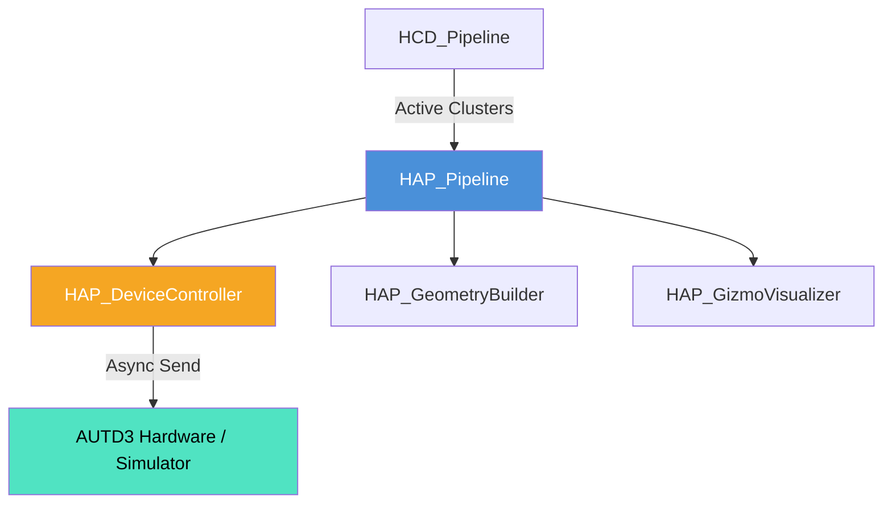

# 触覚フィードバック統合システム (Haptics System) 仕様書

> 📂 **親ノード**: [Wiki.md](./Wiki.md) | 🏷️ **種類**: 🏗️ システム設計書  
> [RealTimeOcclusion Wiki (ポータル)](./Wiki.md) に戻る  
> 📎 **関連ドキュメント**: [HapticsAlgorithmComparison.md](./HapticsAlgorithmComparison.md) | [HowToUseHaptics.md](./HowToUseHaptics.md)

本ドキュメントでは、空中超音波フェーズドアレイ (AUTD3) を用いてリアルタイムに触覚刺激（力覚・触覚フィードバック）を提示する「触覚フィードバック統合システム (`HAP`: Haptics System)」の設計思想、モジュール構成、使用手順、パラメータ詳細およびデバッグ方法について解説します。

---

## 1. 概要

本システムは、`HCD_Pipeline` (衝突判定システム) によって検出された 3D 接触点群・クラスタ情報を受け取り、AUTD3 超音波アレイを制御して空中焦点 (Focus Point) または時空間変調パターン (STM: Spatio-Temporal Modulation) をリアルタイムに提示する基盤です。

### 主な特徴

* **マルチアレイデバイス統括**: 複数の AUTD3 フェーズドアレイアレイの配置行列（ジオメトリ）を一括管理し、位相・振幅パターンを最適計算します。
* **非ブロッキング非同期送信**: AUTD3 SDK v31 / v0.3.0 の `async/await` 非同期クライアント通信を採用し、フレームレートの低下を防ぎます。
* **多様な変調パターン (STM)**: Focus ポイント提示のほか、円形・楕円・ランダムパターンによる広領域の触覚提示に対応しています。
* **安全停止機能**: アプリケーション終了時や例外発生時に自動的に超音波放射を完全停止する安全設計を備えています。

---

## 2. 設計思想・アーキテクチャ

### 2.1 生成ファイル・ディレクトリ構成

```text
Assets/Features/Haptics/
├── Prefabs/                           # 触覚デバイス・表示用プレハブ
└── Scripts/
    ├── Core/
    │   ├── HAP_Pipeline.cs            # 触覚処理・送信統括パイプライン
    │   ├── HAP_DeviceController.cs    # AUTD3 SDK クライアント接続・送信
    │   └── HAP_GeometryBuilder.cs     # 超音波アレイの空間配置構築
    ├── Debug/
    │   └── HAP_GizmoVisualizer.cs     # 触覚焦点・アレイ範囲の Scene 描画
    └── Editor/
        └── HAP_PipelineEditor.cs      # カスタム Inspector エディタ
```

### 2.2 クラス相関図



### 2.3 処理・データフロー

```text
[HCD_Pipeline] (クラスタ重心 & 接触強度 F)
       │
       ▼
[HAP_Pipeline] (STM 軌道 & 音圧振幅計算)
       │
       ▼
[HAP_DeviceController] (AUTD3 SDK async クライアント)
       │
       ▼
[AUTD3 超音波アレイ実機 / エミュレーター]
```

---

## 3. セットアップ・使用方法

### 3.1 クイックスタート手順

#### Step 1: コンポーネントのアタッチ

シーン内の管理オブジェクトに `HAP_Pipeline` をアタッチします。

#### Step 2: インスペクターパラメータ設定

| 設定項目 | 型 | 既定値 | 说明 |
|---|---|---|---|
| `deviceController` | `HAP_DeviceController` | `null` | AUTD3 接続コントローラー |
| `modulationFrequency` | `float` | `200.0f` | 触覚変調周波数 (Hz) |
| `gainIntensity` | `float` | `1.0f` | 音圧ゲイン強度 (0.0 〜 1.0) |
| `stmMode` | `HAP_STMMode` | `Focus` | 刺激提示モード (`Focus`, `Circle`, `Ellipse`, `Random`) |

#### Step 3: 実行

Play モードに入ると、`HAP_DeviceController` が AUTD3 へ接続を開始し、接触検出時に即座に触覚が提示されます。

---

## 4. 仕様・パラメータ詳細

### 4.1 数式モデル・理論的背景

<details>
<summary><b>📐 超音波焦点の音圧放射と変調の数理モデル（クリックで展開）</b></summary>

#### A. 音圧放射モデル

位置 $\mathbf{x}_{\text{focus}}$ に単一焦点を形成するための第 $j$ トランスデューサの位相 $\phi_j$ は、波長 $\lambda = c / f_0$ を用いて次式で計算されます。

$$
\phi_j = \frac{2\pi}{\lambda} \|\mathbf{x}_{\text{focus}} - \mathbf{x}_j\| \pmod{2\pi}
$$

| 記号 | 説明 | 単位 / 型 |
|---|---|---|
| $\mathbf{x}_{\text{focus}}$ | 提示する触覚焦点の 3D 空間座標 | `Vector3` |
| $\mathbf{x}_j$ | 第 $j$ 超音波振動子の 3D 空間位置 | `Vector3` |
| $\lambda$ | 音波の波長 (音速 $c \approx 340 \mathrm{m/s}$, 音響周波数 $f_0 = 40 \mathrm{kHz}$) | $\mathrm{m}$ (`float`) |

#### B. 振幅変調 (AM: Amplitude Modulation)

皮膚感覚受容器（パチニ体等）を強く刺激するため、変調周波数 $f_m = 200 \mathrm{Hz}$ の正弦波変調を重畳します。

$$
A(t) = A_0 \cdot \frac{1 + \sin(2\pi f_m t)}{2}
$$

</details>

---

## 5. デバッグ・留意事項

### 5.1 留意事項

* **長時間放射の保護**: 同一箇所への長時間放射を防ぐため、安全自動タイマーがバックグラウンドで作動します。
* **SDK バージョン依存**: AUTD3 SDK v31/v0.3.0 と旧 v38 の差異については [AUTD3_SDK_Transition.md](./AUTD3_SDK_Transition.md) を参照してください。

### 5.2 統制ログシステム (AppLogManager) との同期

HAP モジュールの動作ログには `[Haptics]` プレフィックスが付与されます。

* `[Haptics] HAP_DeviceController: AUTD3 サーバーへの非同期接続完了`
* `[Haptics] HAP_Pipeline: Focus 提示モードに切り替わりました。`

詳細な共通ログ仕様については [Logging.md](./Logging.md) を参照してください。
