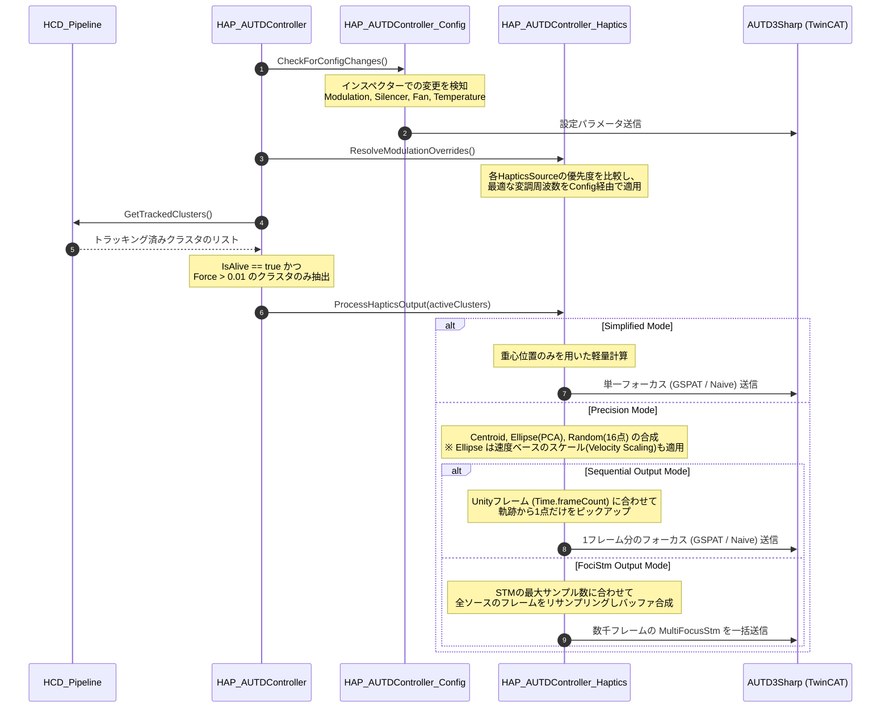

# 空中超音波ハプティクス（AUTD制御）システム

本モジュールは、`Collision.md`（接触判定およびクラスタリング）から出力された高精度な接触重心や法線、および接触強度（Force）データを受け取り、実際にハードウェア（AUTD3: Airborne Ultrasound Tactile Display）を駆動して空中超音波による触覚フィードバックを提示します。

## 1. モジュールの役割と位置づけ

システム全体におけるハプティクス処理は、責務分離の観点から「判定」と「出力」の2段階に分かれています。

1. **Haptics Collision (Collision.md)**:
   仮想オブジェクトと点群の衝突判定、クラスタリング（位置・法線）、トラッキング、および接触面積に基づく Force 計算までを担当します（「どこに」「どの程度の強さで」触れているかの推定）。
2. **Haptics AUTD Controller (本ドキュメント)**:
   Collision モジュールから確定したトラッキングデータを受け取り、それを音響ホログラフィ（GSPAT等）のソルバーに流し込み、TwinCAT 経由で物理的な超音波フェーズドアレイデバイスを駆動します。

> 💡 **ネイティブアルゴリズムとの比較について**
> 詳細ドキュメント **[HapticsAlgorithmComparison.md](./HapticsAlgorithmComparison.md)** を参照してください。

---

## 2. コアコンポーネント

### `AUTD3Device.cs`
物理的な AUTD3 デバイスの配置（トランスフォーム）と管理用IDを表すシンプルなマーカーコンポーネントです。
Unityシーン内に配置されたこのオブジェクトの位置と回転が、そのまま音響シミュレーションにおける超音波振動子の基準座標系となります。

### `HAP_AUTDController.cs`
ハプティクス出力のメインオーケストレーターです。`OperationMode` により、自動制御モードと手動制御モードを切り替えることができます。
役割を明確にするため、以下の `partial class` として3つのファイルに分割されています。
- `HAP_AUTDController.cs`: コアロジック（Inspector設定、Awake/Update/OnDestroy）
- `HAP_AUTDController_Config.cs`: ハードウェア設定の適用（Modulation, Silencer, Fan など）
- `HAP_AUTDController_Haptics.cs`: 接触クラスタからの触覚データ(STM/Sequential)生成

#### 動作モード (Operation Mode)

- **AutoHCD (自動追従モード)**
  毎フレーム `HCD_Pipeline.GetTrackedClusters()` を呼び出し、接触しているオブジェクトの座標に対して自動で音響ホログラフィ（GSPAT / Naive）やSTM（時空間変調）を用いてマルチフォーカス出力を生成し続けます。接触がなくなると自動で Null（停止）出力を送信します。

- **Manual (手動API制御モード)**
  `Update()` での自動上書きを停止し、外部のスクリプトから呼び出されるAPI（`SetFocusStm` など）による明示的な超音波出力を優先します。旧パッケージが持っていた複雑な機能を手動でトリガーしたい場合に使用します。

#### ハプティクス生成モード (Generation Mode)
AutoHCD モードでは、計算負荷と提示の表現力に応じて以下の2つの生成モードを切り替えることができます。

- **Simplified (簡易モード)**
  抽出された接触クラスタの「重心座標」に対して、単一の焦点（Focus）を生成する最速・最軽量のモードです。従来の単純な接触提示と同等に動作します。
- **Precision (精密モード)**
  クラスタごとにGPUで計算された「共分散行列」や「16点のランダムサンプル」を利用し、以下の高度なハプティクスソース (HapticsSources) を組み合わせて、面やノイズ感を表現する複雑な STM または Sequential 出力を合成します。

#### 触覚表現の拡張 (HapticsSources)
`Precision` モードでは、以下の3つのソース（Source）を組み合わせて触覚をデザインできます。各ソースは独立して有効/無効を切り替えられます。
1. **Centroid Source**: 
   クラスタの重心位置に焦点を提示し、`Force` (接触強度) から振幅(Amplitude)を決定する基本ソースです。`VectorSum` や `MagnitudeSum` など、法線ベクトルや接触点数を加味した多彩な振幅計算モードを備えています。
2. **Ellipse Source**: 
   接触面がどのように広がっているかを示す「共分散行列」からPCA（主成分分析）を行い、接触面の形状（主軸・副軸）にフィットした楕円軌道を描くフレームを生成します。手のひら全体で触れた際の「面をなぞるような感覚」を提示します。速度に応じた周波数・振幅スケーリング（Velocity Scaling）にも対応します。
3. **Random Source**: 
   GPU内でサンプリングされた接触面内のランダムな16個の座標を用いて、不規則に飛び回るフレームを生成します。ザラザラとしたノイズ状の触覚提示に利用できます。

#### 出力モード (Sequential vs FociStm)
Ellipse と Random ソースは、`HapticsOutputMode` によってフレーム生成手法を選択できます。
- **Sequential**: UnityのUpdateフレームごとに1点ずつピックアップして送信します。処理が非常に軽く、他のソースと共存しやすいため推奨設定です。
- **FociStm**: デバイス側のSTMバッファに最大数千フレームの軌跡を一括で流し込みます。非常に滑らかな動きを実現しますが、複数クラスタ存在時の計算負荷が高くなります。

---

## 3. 音響理論と数式モデル

本モジュールが内部で利用している（または AUTD3Sharp に委譲している）超音波制御の主要なアルゴリズムの数式モデルを以下に解説します。

### 3.1 単一焦点 (Focus / Naive)
空間内の特定の目標点 $\mathbf{p} \in \mathbb{R}^3$ に超音波を集束させるための最も基本的なアプローチです。
波長を $\lambda$ （音速 $c \approx 340\,\mathrm{m/s}$ 、周波数 $f = 40\,\mathrm{kHz}$ の場合 $\lambda \approx 8.5\,\mathrm{mm}$ ）、各トランスデューサ（超音波振動子）の位置を $\mathbf{r}_i$ としたとき、目標点で波の位相を揃えるために $i$ 番目のトランスデューサが放射すべき位相 $\phi_i$ は以下のように計算されます：
```math
\phi_i = -\frac{2\pi}{\lambda} \|\mathbf{p} - \mathbf{r}_i\| + \phi_0
```
ここで $\phi_0$ は系全体の基準位相オフセットです。この手法は計算コストが極めて低く、単一の焦点を作るのに適しています。

### 3.2 音響ホログラフィ (GSPAT: GS-PAT algorithm)
複数の目標点 $\mathbf{p}_j \ (j=1, \dots, M)$ に対して同時に指定した音圧振幅 $A_j$ を提示する場合、複雑な干渉波面を設計する必要があります。
空間の伝達関数（伝播による振幅減衰と位相遅れ）を $H_{ji}$ とすると、目標点 $j$ で得られる複素音圧 $p_j$ は以下のように表されます：
```math
p_j = \sum_{i=1}^N H_{ji} q_i \quad \left( H_{ji} = \frac{e^{-jk \|\mathbf{p}_j - \mathbf{r}_i\|}}{\|\mathbf{p}_j - \mathbf{r}_i\|} \right)
```
ここで $q_i = a_i e^{j\phi_i}$ は $i$ 番目のトランスデューサの出力（複素振幅）、 $k = \frac{2\pi}{\lambda}$ は波数です。
GSPAT（Gerchberg-Saxton phased array technique）は、目的の振幅 $|p_j| = A_j$ に近づけるため、固有値問題への帰着と反復計算（位相最適化）を並列処理で行い、高速に最適な位相パターン $\phi_i$ を算出するアルゴリズムです。

### 3.3 接触強度による動的振幅スケーリング (Dynamic Amplitude Scaling)
HCD_Pipeline から得られる接触強度（Force: $F \in [0, 1]$ ）を用いて、出力音圧を動的に調整します。基準となる最大出力音圧（`focusIntensityPascal`）を $P_{\mathrm{max}}$ としたとき、ターゲット音圧 $P_{\mathrm{target}}$ は線形にスケーリングされます：
```math
P_{\mathrm{target}} = P_{\mathrm{max}} \cdot F
```
これをホログラフィソルバーの目標振幅 $A_j$ として与えることで、物理的な押し込み量に比例した反力を超音波の放射圧として提示します。

### 3.4 振幅変調 (Amplitude Modulation)
$40\,\mathrm{kHz}$ の超音波は人間の皮膚の機械受容器（マイスナー小体やパチニ小体）の応答周波数（数十〜数百Hz）を大きく超えているため、そのままでは何も感じません。そのため、低周波の信号 $M(t)$（例: $150\,\mathrm{Hz}$ のサイン波）を包絡線として振幅変調（AM）をかけます。
出力される波形 $S_i(t)$ は以下のように表されます：
```math
S_i(t) = M(t) \cdot \sin(2\pi f_c t + \phi_i)
```
（ $f_c = 40\,\mathrm{kHz}$ ）
例えばサイン波変調（`SetSine`）の場合、変調信号 $M(t)$ は以下のようになります：
```math
M(t) = \frac{1}{2} (1 + \sin(2\pi f_m t)) \quad (M(t) \in [0, 1])
```

### 3.5 時空間変調 (Spatio-Temporal Modulation: STM)
多数の焦点座標 $\mathbf{p}_k$ のリストを高いサンプリング周波数 $f_s$ で順次切り替えることで、人間の皮膚の空間分解能と時間分解能の錯覚を利用し、面や線をなぞるような触覚を提示します。
$N$ 個の点からなる軌跡をループ再生する場合、その軌跡を1周する周期 $T$ および変調周波数 $f_{\mathrm{stm}}$ は次のように決まります：
```math
T = \frac{N}{f_s} \implies f_{\mathrm{stm}} = \frac{f_s}{N}
```
STMは、前述の振幅変調（AM）とは異なり、焦点そのものが動くことによる皮膚上の摩擦や連続的な刺激（Lateral Modulation）を引き起こす強力な提示手法です。

---

## 4. 全体アーキテクチャとデータフロー

ハプティクスモジュールにおける、設定の適用から実際のデバイス出力までの流れを以下のシーケンス図に示します。



---

## 5. 手動制御 API リファレンス (Manual モード用)

旧ネイティブパッケージが提供していたすべての高度なハプティクス制御機能を、純C#（AUTD3Sharp）で再構築したAPI群です。`OperationMode.Manual` 時の利用を推奨します。

### 基本出力
- `SetNull()` : すべての出力を停止します。
- `SetFocus(Vector3 position, float amplitude)` : 指定座標に単一の焦点を生成します。
- `SetHolo(IEnumerable<Vector3> positions, IEnumerable<float> amplitudes, HoloAlgorithm algorithm)` : 複数の焦点を同時に提示します。

### STM (Spatio-Temporal Modulation)
- `SetFocusStm(IEnumerable<Vector3> positions, float frequency, float amplitude)` : 高速で焦点を移動させることで、軌跡（線状・面状など）を描くような触感を提示します。
- `SetMultiFocusStm(...)` : 複数の焦点が同時に高速移動する高度なアニメーションを実現します。
- `SetGainStm(...)` : フレームごとに全く異なるホログラフィパターン（Gain）を切り替えます。

---

## 6. 関連ファイル構造

本システムに関わるスクリプト群の構造は以下の通りです。

```text
Assets/Features/Haptics/Scripts/
 ├── HAP_AUTDController.cs         # ハプティクス出力のメインオーケストレーター (自動制御・設定反映)
 ├── HAP_AUTDController_Config.cs  # ハードウェア設定反映 (partial)
 ├── HAP_AUTDController_Haptics.cs # HCD結果に基づく触覚出力生成ロジック (partial)
 ├── HAP_AUTDController_API.cs     # 手動制御・外部操作用API群 (partial)
 ├── HAP_AUTDEnums.cs              # 設定用の列挙型定義 (HoloAlgorithm, ModulationModeなど)
 ├── HAP_HapticsSources.cs         # Centroid / Ellipse / Random の各種ソース定義と形状生成
 ├── AUTD3Device.cs                # 空間内のデバイス配置・IDマーカー
 ├── HAP_AUTDTransformLoader.cs    # 複数のデバイス配置（トランスフォーム群）をJSONファイルから自動生成するユーティリティ
 └── Editor/
      └── HAP_AUTDTransformLoaderEditor.cs
```
