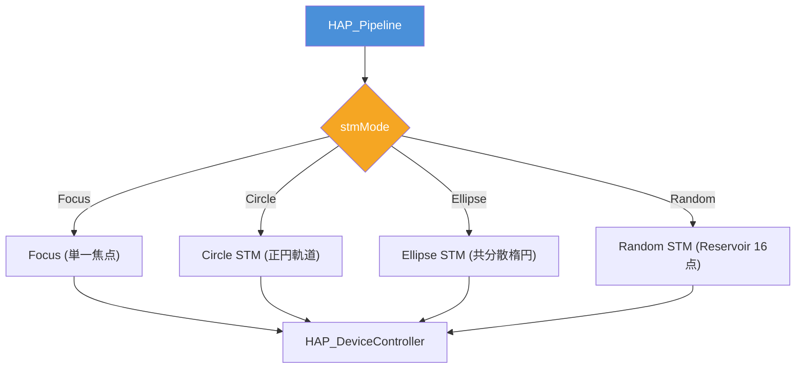

# 触覚提示アルゴリズム比較仕様書

> 📂 **親ノード**: [Haptics.md](./Haptics.md) | 🏷️ **種類**: 🔬 アルゴリズム比較  
> [RealTimeOcclusion Wiki (ポータル)](./Wiki.md) に戻る

本ドキュメントでは、本システムに実装されている各種空中超音波触覚提示アルゴリズム（Focus Point / 円形 STM / 楕円 STM / ランダム STM）の提示特性、音圧エネルギー分布、受容器刺激効果および選択指針について比較・解説します。

---

## 1. 概要

本ドキュメントは、点提示 (Focus) と時空間変調 (STM: Spatio-Temporal Modulation) の各種軌道アルゴリズムにおける物理音圧分布、主観的触覚強度、計算負荷および適用シーンの比較仕様を定義したテクニカルガイドです。

### 主な特徴

* **提示モードの動的切替**: 点提示から面状・輪郭状触覚提示へのリアルタイム切り替えをサポートします。
* **皮膚感覚受容器の最適刺激**: パチニ体 (FA-II) の感度ピーク (200Hz) に合わせた軌道高速周回アルゴリズムを採用しています。
* **エネルギー分散制御**: 点提示によるピンポイント刺激と、楕円・ランダム STM による広領域な「触れている感」を比較・選択可能です。

---

## 2. 設計思想・アルゴリズムの比較

### 2.1 関連モジュール構造

```text
Assets/Features/Haptics/Scripts/
├── Core/
│   ├── HAP_Pipeline.cs                # アルゴリズム分岐・軌道計算ディスパッチ
│   └── HAP_DeviceController.cs        # STM パケット構築・送信
```

### 2.2 提示アルゴリズム相関図



---

## 3. セットアップ・使用方法

1. `HAP_Pipeline` の Inspector から `stmMode` パラメータを変更します。
2. 詳細なセットアップ手順は [HowToUseHaptics.md](./HowToUseHaptics.md) を参照してください。

---

## 4. 仕様・パラメータ詳細

### 4.1 パラメータ・アルゴリズム特徴比較

| モード名 | 音圧集中度 | 提示面積 | 主な感覚効果 | 推奨用途 |
|---|---|---|---|---|
| **Focus** | 極めて高い | 点 (約 5mm) | 明確な針突刺し感・ピンポイント接触 | ボタン押し・細点接触 |
| **Circle** | 中程度 | 円状線 | リング状の輪郭感 | 円形オブジェクト接触 |
| **Ellipse** | クラスタ追従 | 楕円面 | 接触パッチにフィットする自然な圧迫感 | 面・ボディ接触 |
| **Random** | 低い（分散） | 領域全体 | ザラザラ感・面状テクスチャ感 | テクスチャ表現 |

### 4.2 数式モデル・理論的背景

<details>
<summary><b>📐 各種 STM 軌道および音圧エネルギー分布の計算式（クリックで展開）</b></summary>

#### A. 正円 STM 軌道計算式

半径 $R$、周回周波数 $f_{\text{stm}} = 200 \mathrm{Hz}$ における時刻 $t$ での焦点座標 $\mathbf{p}_{\text{circle}}(t)$ は次式で記述されます。

$$
\mathbf{p}_{\text{circle}}(t) = \mathbf{p}_{\text{center}} + R \cos(2\pi f_{\text{stm}} t) \mathbf{u} + R \sin(2\pi f_{\text{stm}} t) \mathbf{v}
$$

| 記号 | 説明 | 単位 / 型 |
|---|---|---|
| $\mathbf{p}_{\text{center}}$ | クラスタの接触重心 | `Vector3` |
| $\mathbf{u}, \mathbf{v}$ | 接触面法線に直交する正規化基底ベクトル | `Vector3` |
| $R$ | STM 軌道半径 | $\mathrm{m}$ (`float`) |

#### B. 共分散楕円 STM 軌道計算式

`HCD_SpatialClusteringProcessor` から得られた主軸ベクトル $\mathbf{e}_1, \mathbf{e}_2$ および標準偏差 $\sigma_1, \sigma_2$ に基づく楕円軌道：

$$
\mathbf{p}_{\text{ellipse}}(t) = \mathbf{p}_{\text{center}} + k \sigma_1 \cos(2\pi f_{\text{stm}} t) \mathbf{e}_1 + k \sigma_2 \sin(2\pi f_{\text{stm}} t) \mathbf{e}_2
$$

</details>

---

## 5. デバッグ・留意事項

### 5.1 留意事項

* 軌道周波数 $f_{\text{stm}}$ が高すぎる場合、ハードウェアの追従限界により音圧低下が発生するため $100 \sim 200 \mathrm{Hz}$ を推奨します。

### 5.2 統制ログシステム (AppLogManager) との同期

比較ログには `[Haptics]` タグが適用されます。詳細については [Logging.md](./Logging.md) を参照してください。
