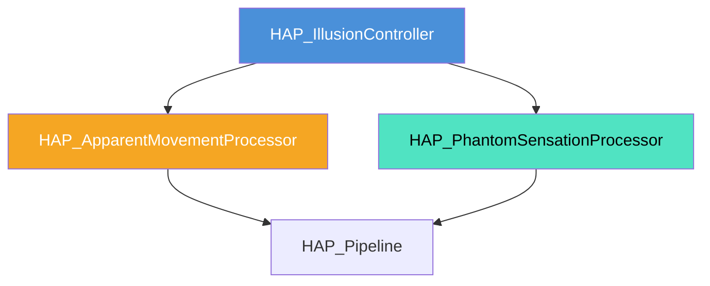

# 触覚錯覚 (Tactile Illusion) 生成システム 仕様書

> 📂 **親ノード**: [Haptics.md](./Haptics.md) | 🏷️ **種類**: 🏗️ システム設計書  
> [RealTimeOcclusion Wiki (ポータル)](./Wiki.md) に戻る

本ドキュメントでは、空中超音波刺激を用いて仮象運動（Apparent Movement）や幻触（Phantom Sensation）などの触覚錯覚現象を誘導する「触覚錯覚生成モジュール (`HAP_Illusion`)」の設計思想、数理モデル、パラメータ詳細および使用手順について解説します。

---

## 1. 概要

本システムは、人感皮膚受容器の心理物理学的な時空間結合特性を利用し、離散的な超音波焦点の間で連続的な「なぞられ感」や「引き伸ばし感」の錯覚を誘導するアルゴリズムです。

### 主な特徴

* **仮象運動 (Apparent Movement) 制御**: 2 点以上の焦点間でタイミングをずらして刺激を提示し、滑らかな連続移動感覚を錯覚させます。
* **幻触 (Phantom Sensation) 制御**: 離れた焦点間の振幅比率を変化させることで、刺激が存在しない中間にみかけの触覚を合成します。
* **周波数インターリーブ変調**: 刺激干渉（打ち消し合い）を防ぎつつ連続感を高める周波数分散変調を実装しています。

---

## 2. 設計思想・アーキテクチャ

### 2.1 生成ファイル・ディレクトリ構成

```text
Assets/Features/Haptics/Scripts/Illusion/
├── HAP_IllusionController.cs          # 錯覚生成・パラメータ制御統括
├── HAP_ApparentMovementProcessor.cs  # 仮象運動タイミング・軌道計算
└── HAP_PhantomSensationProcessor.cs   # 幻触振幅分配計算
```

### 2.2 クラス相関図



---

## 3. セットアップ・使用方法

### 3.1 クイックスタート手順

#### Step 1: コンポーネントのアタッチ

管理オブジェクトに `HAP_IllusionController` をアタッチします。

#### Step 2: インスペクターパラメータ設定

| 設定項目 | 型 | 既定値 | 説明 |
|---|---|---|---|
| `illusionType` | `IllusionType` | `ApparentMovement` | 錯覚タイプ (`ApparentMovement`, `PhantomSensation`) |
| `stimulusIntervalMs` | `float` | `50.0f` | 仮象運動の刺激提示間隔 (ms) |
| `overlapRatio` | `float` | `0.3f` | 刺激時間の重なり比率 (0.0 〜 0.5) |

---

## 4. 仕様・パラメータ詳細

### 4.1 数式モデル・理論的背景

<details>
<summary><b>📐 仮象運動および幻触合成の心理物理学数理モデル（クリックで展開）</b></summary>

#### A. 仮象運動 (Apparent Movement) の時間間隔モデル

刺激 1 から 刺激 2 への最適移動感覚を与える刺激時間幅 $D$ および刺激間時間差 $\Delta t$ の関係は、以下の心理物理学法則に従います。

$$
\Delta t = k \cdot D^a \cdot S^b
$$

| 記号 | 説明 | 単位 / 型 |
|---|---|---|
| $\Delta t$ | 刺激開始の時間差 (`stimulusIntervalMs`) | $\mathrm{ms}$ (`float`) |
| $D$ | 各焦点の刺激保持時間 | $\mathrm{ms}$ (`float`) |
| $S$ | 空間点間距離 | $\mathrm{mm}$ (`float`) |
| $k, a, b$ | 皮膚受容器パラメータ定数 | `float` |

#### B. 幻触 (Phantom Sensation) 振幅分配式

2 点 $\mathbf{x}_1, \mathbf{x}_2$ 間の相対位置 $\alpha \in [0, 1]$ に合成焦点を呈示する場合の振幅 $A_1, A_2$ 分配式：

$$
A_1 = A_0 \cdot \sqrt{1 - \alpha}, \quad A_2 = A_0 \cdot \sqrt{\alpha}
$$

</details>

---

## 5. デバッグ・留意事項

### 5.1 留意事項

* 個人差（皮膚の厚みや部位）によって最適刺激間隔 $\Delta t$ が異なるため、キャリブレーション UI での個別調整を推奨します。

### 5.2 統制ログシステム (AppLogManager) との同期

錯覚モジュールのログには `[Haptics]` タグが適用されます。詳細については [Logging.md](./Logging.md) を参照してください。
