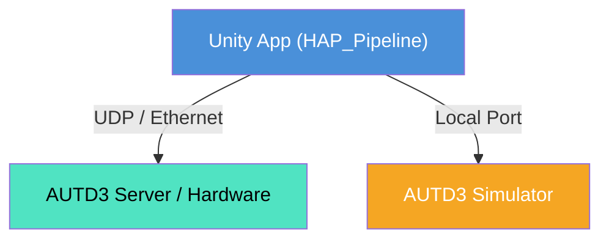

# 触覚機能セットアップ・使用手順ガイド Specifications

> 📂 **親ノード**: [Haptics.md](./Haptics.md) | 🏷️ **種類**: 📖 使用手順ガイド  
> [RealTimeOcclusion Wiki (ポータル)](./Wiki.md) に戻る

本ドキュメントでは、本システムで空中超音波触覚ディスプレイ (AUTD3) を導入・接続し、触覚フィードバックを提示するための環境構築手順、Inspector パラメータアサイン、および実装手順について解説します。

---

## 1. 概要

本ガイドは、開発者や実験担当者が実機 AUTD3 ディバイスまたは AUTD3 エミュレーター（シミュレーター）環境において、短時間で触覚システムを立ち上げるためのステップ・バイ・ステップのマニュアルです。

---

## 2. 設計思想・アーキテクチャ

### 2.1 関連コンポーネント構成

```text
Assets/Features/Haptics/
├── Scripts/
│   ├── Core/
│   │   ├── HAP_Pipeline.cs            # 触覚統括コンポーネント
│   │   ├── HAP_DeviceController.cs    # 接続・送信クライアント
│   │   └── HAP_GeometryBuilder.cs     # トランスデューサジオメトリ構築
│   └── Debug/
│       └── HAP_GizmoVisualizer.cs     # 焦点視覚化コンポーネント
```

### 2.2 システム接続相関図



---

## 3. セットアップ・使用方法

### 3.1 クイックスタート手順

#### Step 1: AUTD3 物理アレイ接続 / シミュレーター起動

1. **実機接続**: LAN ケーブルで AUTD3 コントローラーと PC を接続します。
2. **エミュレーター動作**: 実機がない場合は AUTD3 Simulator アプリケーションを同一 PC 上で起動します。

#### Step 2: シーンオブジェクトの配置

1. シーン内の管理オブジェクトに `HAP_DeviceController` および `HAP_Pipeline` をアタッチします。
2. `HAP_Pipeline` の `deviceController` フィールドに同オブジェクトをアサインします。

#### Step 3: Inspector パラメータの設定

| 設定項目 | 型 | 既定値 | 説明 |
|---|---|---|---|
| `serverIP` | `string` | `"127.0.0.1"` | AUTD3 サーバーの IP アドレス |
| `useEmulator` | `bool` | `true` | エミュレーターへの接続を使用するか |
| `gainIntensity` | `float` | `1.0f` | 音圧ゲイン強度 (0.0 〜 1.0) |
| `modulationFrequency` | `float` | `200.0f` | 触覚変調周波数 (Hz) |

#### Step 4: 実装例・C# コード呼び出し

```csharp
using UnityEngine;

public class HapticsExample : MonoBehaviour
{
    public HAP_Pipeline hapticsPipeline;

    void Update()
    {
        if (Input.GetKeyDown(KeyCode.H))
        {
            // 手動で Focus 提示位置を指定
            hapticsPipeline.TriggerFocus(new Vector3(0, 0.2f, 0.5f), 1.0f);
        }
    }
}
```

---

## 4. 仕様・パラメータ詳細

### 4.1 通信仕様・ネットワークポート

* **デフォルト接続ポート**: UDP Port `8080` / `8081`
* **タイムアウト設定**: 通信切断時は 3000ms で自動再接続を試行。

---

## 5. デバッグ・留意事項

### 5.1 留意事項

* Windows ファイアウォールにより UDP 通信がブロックされる場合があります。初回起動時は通信を許可してください。
* SDK の切替手順については [AUTD3_SDK_Transition.md](./AUTD3_SDK_Transition.md) を参照してください。

### 5.2 統制ログシステム (AppLogManager) との同期

動作ログには `[Haptics]` タグが適用されます。詳細については [Logging.md](./Logging.md) を参照してください。
