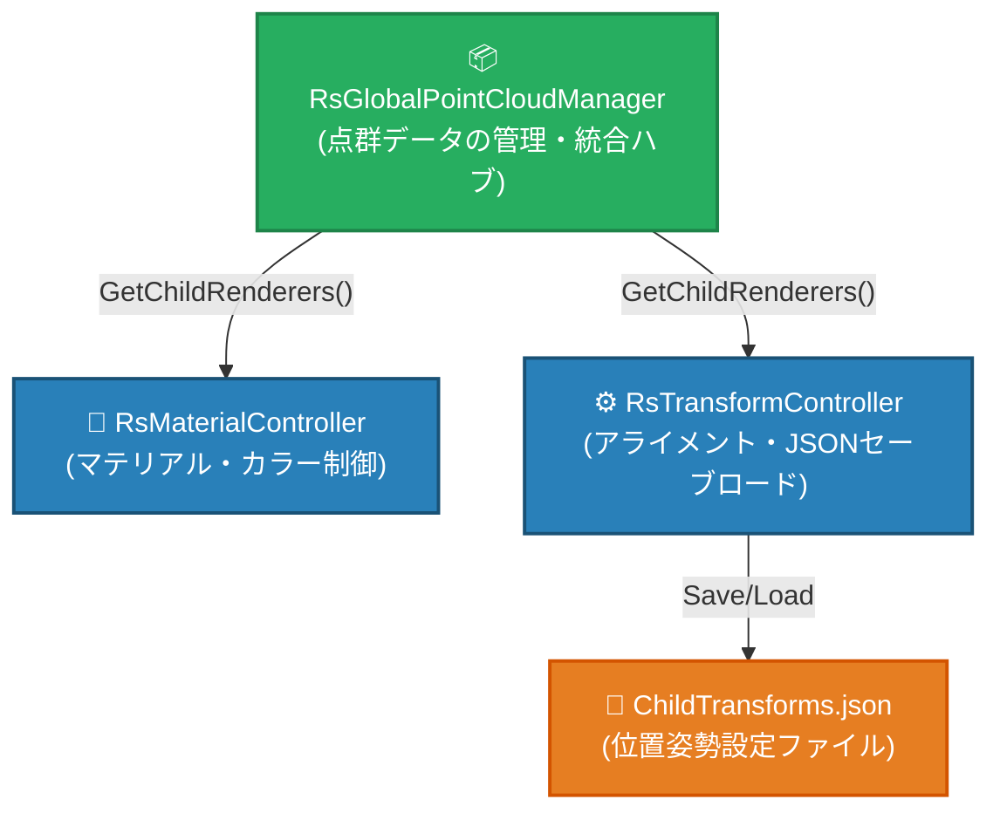
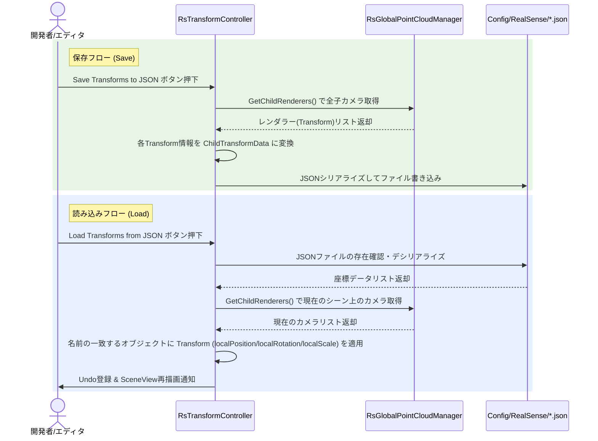

# ⚙️ 初期化とアライメント・キャリブレーションシステム (Initialization.md)

本ドキュメントでは、RealSense カメラから取得した点群データの初期化処理、および複数カメラ間のアライメント（位置合わせ）を行うキャリブレーションシステムについて解説します。

---

## 1. 概要と構成コンポーネント

本システムは、以下の 3 つの主要なコンポーネントが協調して動作することで、点群の統合、レンダリング用マテリアルの適用、およびキャリブレーション情報の保存・復元を実現しています。



### 1.1 `RsGlobalPointCloudManager`
- **役割**: 点群データの統合管理ハブ。
- **特徴**: 管理対象となる `RsPointCloudRenderer` (各RealSenseカメラの子オブジェクト) の参照リストを一元管理し、他のコンポーネントへイテレータ (`GetChildRenderers()`) 経由で提供します。

### 1.2 `RsMaterialController`
- **役割**: 各点群レンダラーへのマテリアル適用とカラーモード (Skin / Black / Blue / Custom) の制御。
- **特徴**: `RsGlobalPointCloudManager` から動的にレンダラーリストを取得してキャッシュするため、インスペクター側での個別アタッチが不要になり、一貫した描画設定を保証します。

### 1.3 `RsTransformController`
- **役割**: 複数カメラのアライメント調整用ガイド（キャリブレーションボックス）の表示、および各カメラの座標・回転・スケール（Transform）情報のファイル保存・読み込み。
- **特徴**: キャリブレーション設定はスロット（Slot 1〜3）ごとに保持可能で、調整後のカメラのローカル Transform は JSON ファイルとしてエクスポート / インポートできます。

---

## 2. アライメント・キャリブレーション手順

複数台の RealSense カメラの位置合わせ（アライメント）を行う手順は以下の通りです。

### 2.1 キャリブレーション・ガイドの配置
1. シーン上に配置された親オブジェクト（`RsGlobalPointCloudManager` / `RsTransformController` がアタッチされているオブジェクト）の Inspector で、**Show Calibration Guide** にチェックを入れます。
2. シーンビュー上に緑色のワイヤーフレームボックスと赤い球体（角のマーカー）が表示されます。
3. 位置調整の基準点（実世界のキャリブレーション基準物など）に合わせ、`Current Slot Settings` 内の **Origin** と **Box Size** を調整します。

### 2.2 各カメラの位置合わせ
1. `RsGlobalPointCloudManager` の配下にある各 RealSense カメラ（`RsPointCloudRenderer`）のオブジェクトを選択し、点群がガイドボックスと一致するようにそれぞれの `Transform`（Position / Rotation）を微調整します。

### 2.3 設定の保存 (Save)
1. 調整が完了したら、`RsTransformController` の Inspector にある **「Save Transforms to JSON」** ボタンをクリックします。
2. 調整された全カメラ（`GetChildRenderers()` から取得された子オブジェクト）の `localPosition`、`localRotation`、`localScale` が以下のパスに JSON 形式で保存されます。
   - 📂 **保存先パス**: `Assets/Config/RealSense/[saveFileName].json` (デフォルト名: `ChildTransforms.json`)
   - ※ `Assets/Config/RealSense` フォルダが存在しない場合は自動的に作成されます。

### 2.4 設定の復元 (Load)
1. エディタ再起動時や、設定を以前の状態に戻したい場合は、**「Load Transforms from JSON」** ボタンをクリックします。
2. 保存された JSON ファイルから各カメラの Transform が自動的に読み込まれ、シーン上のオブジェクトに適用されます。
3. エディタ上でのロード時は、Unity の **Undo (Ctrl + Z)** に対応しているため、誤ってロードした場合でも即座に変更を取り消すことができます。

### 2.5 3Dディスプレイ（SRDManager）の位置調整
ハーフミラーを利用した立体視を行う場合、RealSenseカメラのアライメントに加えて、立体視の基準となるディスプレイ位置の調整が必要です。
1. シーン内の `SRDManager`（Sony Spatial Reality Display SDK のコンポーネント）を選択します。
2. Sceneビューに表示される `SRDManager` の Gizmo（ディスプレイ面を表す枠）を移動・回転させ、現実のハーフミラー内に反射して見える **「ディスプレイの虚像」の位置・傾きと一致** させます。
3. 本プロジェクトでは、この位置を原点として描画空間全体をX軸反転させることで鏡面世界を構築しています。そのため、このGizmoの位置が実際の虚像位置とズレていると、立体視の視差（パララックス）やカリングが破綻します。詳細な理論は [Display3D.md](./Display3D.md) を参照してください。

---

## 3. JSON データ構造 (`ChildTransforms.json`)

エクスポートされる JSON ファイルは、Unity の `JsonUtility` を用いて以下のシリアライズ形式で記録されます。

```json
{
  "transforms": [
    {
      "name": "RealSense_Camera_1",
      "localPosition": {
        "x": 0.123,
        "y": -0.456,
        "z": 1.789
      },
      "localRotation": {
        "x": 0.0,
        "y": 0.7071068,
        "z": 0.0,
        "w": 0.7071068
      },
      "localScale": {
        "x": 1.0,
        "y": 1.0,
        "z": 1.0
      }
    },
    ...
  ]
}
```

---

## 4. クラス関係図とデータフロー


