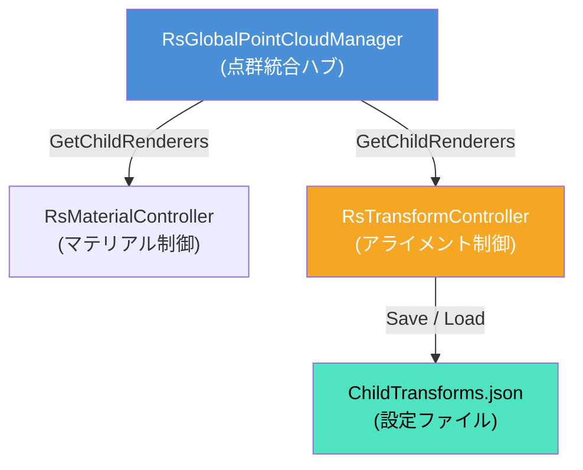
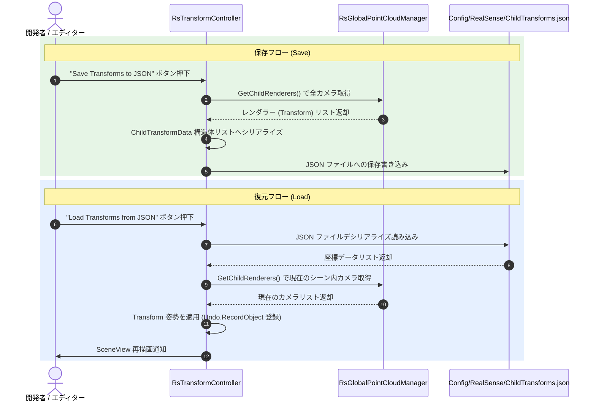

# 初期化とアライメント・キャリブレーションシステム 仕様書

> 📂 **親ノード**: [Wiki.md](./Wiki.md) | 🏷️ **種類**: 🏗️ システム設計書  
> [RealTimeOcclusion Wiki (ポータル)](./Wiki.md) に戻る

本ドキュメントでは、RealSense カメラから取得した点群データの初期化処理、描画マテリアルの自動適用、および複数カメラ間のアライメント（位置合わせ姿勢補正）を行う「初期化とアライメント・キャリブレーションシステム」の設計思想、モジュール構成、使用手順、パラメータ詳細およびデバッグ方法について解説します。

---

## 1. 概要

本システムは、複数台の RealSense カメラからリアルタイムに取得される点群データの統合アライメント処理、カラーモード制御、およびキャリブレーション情報 (`ChildTransforms.json`) の保存・復元を一貫管理する仕組みです。

### 主な特徴

* **マルチカメラアライメント機能**: 各 RealSense カメラの `Transform` 姿勢パラメータを JSON ファイルとして即座にセーブ／ロード保存可能です。
* **ガイドボックス表示機能**: Scene ビュー上に位置合わせ基準となるワイヤーフレーム（ガイドボックス）を可視化表示し、直感的なキャリブレーションをサポートします。
* **Undo / Redo 対応**: Unity エディタの Undo システムに完全対応し、アライメント設定ロード時の誤操作を安全にキャンセルできます。
* **動的マテリアル・カラーモード連動**: `RsMaterialController` により、全カメラの点群カラーモード (`Skin`, `Black`, `Blue`, `Custom`) をリアルタイム一括制御します。

---

## 2. 設計思想・アーキテクチャ

### 2.1 生成ファイル・ディレクトリ構成

```text
Assets/Features/PointCloud/
├── Settings/
│   └── Config/RealSense/
│       └── ChildTransforms.json        # 位置合わせキャリブレーションJSONファイル
└── Scripts/
    ├── Core/
    │   └── RsGlobalPointCloudManager.cs # 子カメラレンダラーの統合・管理ハブ
    ├── Filter/
    │   └── RsTransformController.cs    # アライメント位置合わせ・JSON入出力制御
    └── Material/
        └── RsMaterialController.cs     # 点群マテリアル・カラーモード制御
```

### 2.2 クラス相関図



### 2.3 キャリブレーション保存・復元シーケンス



---

## 3. セットアップ・使用方法

### 3.1 クイックスタート手順

#### Step 1: キャリブレーションガイドの表示

1. シーン内の管理 GameObject に `RsTransformController` をアタッチします。
2. Inspector 上で **Show Calibration Guide** にチェックを入れ、緑色のワイヤーフレームボックスをアライメント基準物理構造物に合わせます。

#### Step 2: 各カメラの位置合わせ調整

各 `RsPointCloudRenderer` の `Transform` (Position / Rotation) を微調整し、取得される点群がガイドボックスと幾何学的に一致するようにアライメントを行います。

#### Step 3: キャリブレーション情報の保存と復元

1. **保存**: **「Save Transforms to JSON」** ボタンを押下し、`Assets/Settings/Config/RealSense/ChildTransforms.json` に設定を出力します。
2. **復元**: **「Load Transforms from JSON」** ボタンを押下すると、Undo 履歴付きでアライメント設定がロード復元されます。

---

## 4. 仕様・パラメータ詳細

### 4.1 パラメータ・データフォーマット仕様

* `ChildTransforms.json` データ構造:

```json
{
  "transforms": [
    {
      "name": "RealSense_Camera_1",
      "localPosition": { "x": 0.123, "y": -0.456, "z": 1.789 },
      "localRotation": { "x": 0.0, "y": 0.7071068, "z": 0.0, "w": 0.7071068 },
      "localScale": { "x": 1.0, "y": 1.0, "z": 1.0 }
    }
  ]
}
```

---

## 5. デバッグ・留意事項

### 5.1 留意事項

* **3D ディスプレイ (`SRDManager`) との位置合わせ**: ハーフミラーを利用した立体視環境では、 RealSense カメラのアライメントに加えて `SRDManager` の Gizmo（ディスプレイ面枠）を現実のハーフミラーに映る虚像位置・傾きに正しく一致させる必要があります。詳細は [Display3D.md](./Display3D.md) を参照してください。

### 5.2 統制ログシステム (AppLogManager) との同期

動作ログには `[Initialization]` プレフィックスが付与されます。

* `[Initialization] RsTransformController: ChildTransforms.json への保存完了`
* `[Initialization] RsTransformController: ChildTransforms.json からの復元完了 (Undo 登録済み)`

詳細については [Logging.md](./Logging.md) を参照してください。
