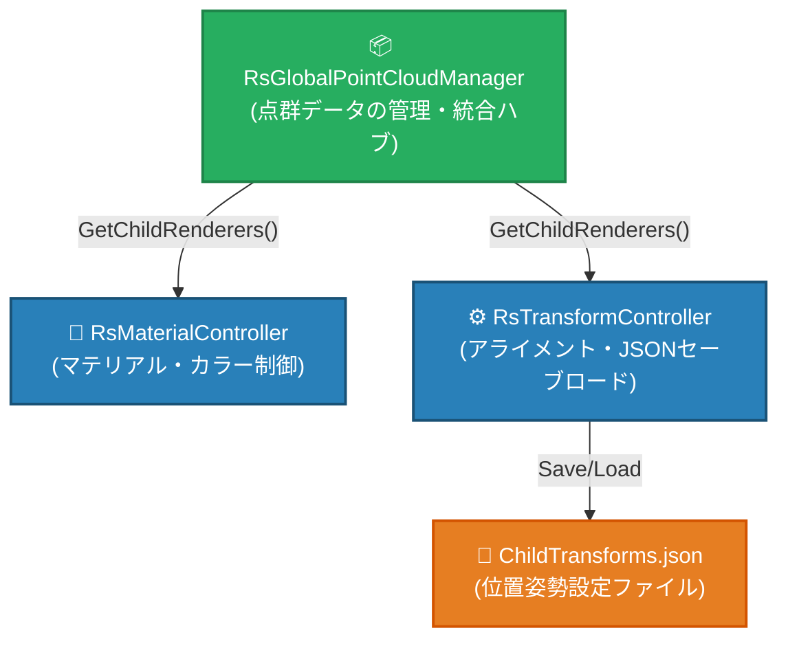
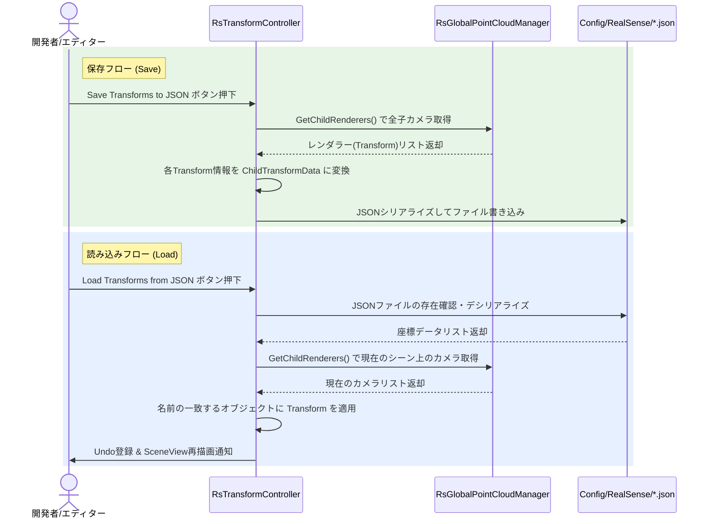

# 初期化とアライメント・キャリブレーションシステム 仕様書

> 📂 **親ノード**: [Wiki.md](./Wiki.md) | 🏷️ **種類**: 🏗️ システム設計書  
> [RealTimeOcclusion Wiki (ポータル)](./Wiki.md) に戻る

本ドキュメントでは、RealSense カメラから取得した点群データの初期化処理、および複数カメラ間のアライメント（位置合わせ）を行うキャリブレーションシステムについて解説します。

---

## 1. 概要

本システムは、複数台の RealSense カメラから取得される点群データの統合、描画用マテリアルの適用、およびキャリブレーション情報の保存・復元を一貫して管理します。

---

## 2. 設計思想・アーキテクチャ

### 2.1 構成コンポーネントとデータフロー





---

## 3. セットアップ・使用方法

### 3.1 アライメント・キャリブレーション手順

1. **キャリブレーション・ガイドの配置**:
   `RsTransformController` の Inspector で **Show Calibration Guide** にチェックを入れ、緑色のワイヤーフレームボックスをアライメント基準物に合わせます。
2. **各カメラの位置合わせ**:
   各 `RsPointCloudRenderer` の `Transform` を微調整し、点群がガイドボックスと一致するように調整します。
3. **設定の保存 (Save)**:
   `RsTransformController` の **「Save Transforms to JSON」** ボタンをクリックし、`Assets/Settings/Config/RealSense/ChildTransforms.json` に設定をエクスポートします。
4. **設定の復元 (Load)**:
   **「Load Transforms from JSON」** ボタンで保存設定をロード復元します（Unity の Ctrl + Z Undo に対応）。

---

## 4. 仕様・パラメータ詳細

### 4.1 主要コンポーネント

* `RsGlobalPointCloudManager`: 管理対象となる全 `RsPointCloudRenderer` の参照リストを一元管理し、イテレータ (`GetChildRenderers()`) 経由で提供。
* `RsMaterialController`: 動的にレンダラーリストを取得し、カラーモード (`Skin`, `Black`, `Blue`, `Custom`) を制御。
* `RsTransformController`: アライメントガイドの表示、スロット別保存・復元、JSON ファイル管理。

### 4.2 JSON データ構造 (`ChildTransforms.json`)

```json
{
  "transforms": [
    {
      "name": "RealSense_Camera_1",
      "localPosition": { "x": 0.123, "y": -0.456, "z": 1.789 },
      "localRotation": { "x": 0.0, "y": 0.7071068, "z": 0.0, "w": 0.7071068 },
      "localScale": { "x": 1.0, "y": 1.0, "z": 1.0 }
    }
  ]
}
```

---

## 5. デバッグ・留意事項

### 5.1 3Dディスプレイ (`SRDManager`) の位置調整
ハーフミラーを利用した立体視を行う場合、RealSense カメラのアライメントに加えて `SRDManager` の Gizmo（ディスプレイ面枠）を現実のハーフミラー内に反射して見える虚像位置・傾きに正しく一致させる必要があります。詳細は [Display3D.md](./Display3D.md) を参照してください。
