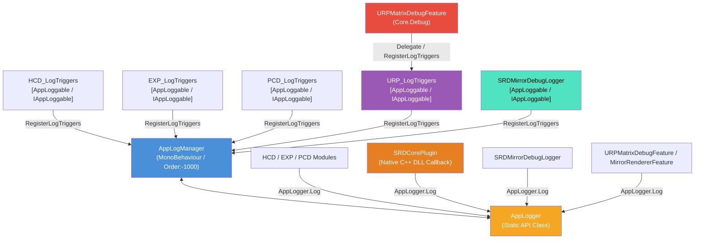

# 統制ログ管理システム (AppLogManager & AppLogger) 仕様書

> 📂 **親ノード**: [Wiki.md](./Wiki.md) | 🏷️ **種類**: 🏗️ システム設計書  
> [RealTimeOcclusion Wiki (ポータル)](./Wiki.md) に戻る

本ドキュメントでは、アプリケーション全体のデバッグログ出力を一元管理し、パフォーマンス低下を防ぎつつモジュール別・機能別のトグル制御を可能にする**統制ログ管理システム (`AppLogManager` & `AppLogger`)** の仕様および実装・利用手順について解説します。

---

## 1. 概要

リアルタイム処理（点群生成・オクルージョン描画・触覚衝突判定等）においては、`Update` や hot path での頻繁なログ出力や GC（Garbage Collection）の発生がパフォーマンス悪化に直結します。

本システムは、各コンポーネントの Inspector を汚すことなく、シーン内の主要モジュール（`HCD`, `RealSense`, `PCD`, `SRD`, `URP`, `Experiment`, `Haptics`, `PCV` 等）のログ出力を `AppLogManager` インスペクター上で一元かつ階層的に ON/OFF 制御する仕組みを提供します。

* **自動コンテキスト識別（複数アタッチ対応）**: 同一スクリプトが複数 GameObject にアタッチされている場合（例: 複数台の RealSense カメラ）、`AppLogger.Log(this, ...)` 呼び出しによってログプレフィックスが **`[型名: GameObject名]`**（例: `[RsDevice: RealSense_Front]`）へ自動拡張され、出力元オブジェクトを即座に識別可能です。
* **中央集中トグル管理**: モジュールカテゴリ（例: `HCD (Haptic Collision)`, `Experiment`, `PCV (PointCloudViewer)`, `PCD (Occlusion)`, `SRD Display (PCD/SRD)`, `URP / RenderPipelines`, `RealSense`）および個別サブトリガー（例: `[EXP_Manager]`, `[SRD_MirrorCamDebug]`, `[SRD_NativeLog]`, `[URP_MatrixDebug]`）単位でログ有効状態を切り替え可能です。
* **ネイティブ C++ DLL ログの一元統合**: Sony SRDisplay プラグインの内部 C++ DLL から出力されるネイティブデバッグログ (`[oz-debug-log]`) を `SRDCorePlugin` コールバック経由で `AppLogger` に集約し、`AppLogManager` のトグル操作で即座に遮断（ミュート）できます。
* **早期初期化保証 (`DefaultExecutionOrder(-1000)`)**: `AppLogManager` は最優先で起動されるため、`SRDManager.Awake()` などの各種マネージャーの初期化時に出力される早期ログであっても、設定した OFF トグルに従って漏れなく確実に制御されます。
* **メモリ上全アセットの自動スキャン**: `AppLogManager.ScanSceneComponents()` は、シーン内の `MonoBehaviour` に加えて、URP RenderFeature 等の `ScriptableObject` (`Resources.FindObjectsOfTypeAll`) もメモリ上から全自動で検索し `AppLogManager` へ登録します。
* **堅牢な引数順序自動補正 (`ResolveMessageAndSubTag`)**: `AppLogger.Log(context, message, subTag)` の呼び出し時、`message` と `subTag` の記述順序に関わらず、`AppLogManager` に登録された識別タグを自動認識して正しく評価・出力します。
* **Inspector の非汚染化**: 個別の `MonoBehaviour` や RenderFeature に `public bool enableDebugLog` や `public bool EnableLog` などのトグル変数を定義せず、全制御を `AppLogManager` に統一します。

---

## 2. 設計思想・アーキテクチャ

### 2.1 コンポーネント構成と役割分離

```text
Assets/Core/Scripts/
├── Logging/
│   ├── AppLogger.cs                   # モジュール非依存の静的ログ制御 API (`UnityEngine.Debug` 完全修飾対応)
│   └── AppLogManager.cs               # [DefaultExecutionOrder(-1000)] シーン/メモリ内の全ログトリガーを一元管理する MonoBehaviour
└── Debug/
    ├── URP_LogTriggers.cs             # [AppLoggable("URP / RenderPipelines")] URP モジュール用一元ログトリガー
    └── URPMatrixDebugFeature.cs       # `Core.Debug` 汎用 URP 行列診断 ScriptableRendererFeature
└── (各 Feature 配下)
    ├── HCD_LogTriggers.cs             # HCD モジュール用 AppLogManager 連動トリガー
    ├── EXP_LogTriggers.cs             # Experiment モジュール用 AppLogManager 連動トリガー
    ├── HAP_LogTriggers.cs             # Haptics モジュール用 AppLogManager 連動トリガー
    ├── DPC_LogTriggers.cs             # DPC (Dummy Point Cloud) モジュール用連動トリガー
    ├── PCV_LogTriggers.cs             # PointCloudViewer モジュール用 AppLogManager 連動トリガー
    ├── (SRD Display / 立体視 モジュール)
    │   ├── SRDCorePlugin.cs           # C++ Native DLL コールバック受領 & `AppLogger.Log("SRD_NativeLog")` 統合
    │   ├── SRDMirrorDebugLogger.cs    # [AppLoggable("SRD Display (PCD/SRD)")] SRD 鏡像デバッグ & `SRD_NativeLog` トリガー登録
    │   ├── MirrorRendererFeature.cs  # [AppLoggable("SRD Display (PCD/SRD)")] 2D 鏡像 Blit ログ管理
    │   └── SRD_LogTriggers.cs         # [Obsolete] SRDMirrorDebugLogger 継承ラッパー
    └── (PCD / 3DDisplay モジュール)
        ├── PCD_LogTriggers.cs                 # PCD モジュール用 AppLogManager 連動トリガー
        ├── PCDOcclusionPipelineController.cs # オクルージョン統括コントローラー
        └── PCDContextBuilder.cs               # 事前計算コンテキスト・URP入力ログ
```

### 2.2 クラス相関図



### 2.3 `[AppLoggable]` 属性と `IAppLoggable` の適用ルール

* **エントリポイント / ヘルパーコンポーネント / RenderFeature に適用**:
  `[AppLoggable("カテゴリー名")]` 属性および `IAppLoggable` インターフェースは、モジュールの窓口コンポーネント（例: `HCD_Pipeline`, `EXP_ExperimentManager`）、専用デバッグクラス（例: `SRDMirrorDebugLogger`）、およびパイプライン RenderFeature（例: `URPMatrixDebugFeature`, `MirrorRendererFeature`）に付与します。
* **機能実行コンポーネントからのデバッグ分離**:
  幾何変換や純粋なレンダリングを行う機能コンポーネント（例: `SRDMirrorCamera`, `SRDMirrorCullingFeature`）内にはデバッグログ出力を混在させず、独立したデバッグクラス（`SRDMirrorDebugLogger`）や診断 Feature（`URPMatrixDebugFeature`）へ責務を完全に分離します。

---

## 3. セットアップ・使用方法

### 3.1 既存モジュールでのログ出力方法

ログを出力したい C# スクリプトでは、`Core.Logging` 名前空間を `using` し、`Debug.Log` の代わりに `AppLogger` の静的メソッドを呼び出します。

```csharp
using UnityEngine;
using Core.Logging;
using SRD.Core;

public class MyComponent : MonoBehaviour
{
    private void Update()
    {
        // ターゲット (this) と定義済みサブタグを指定してログ出力
        if (Time.frameCount % 60 == 0)
        {
            AppLogger.Log(this, "処理実行中...", SRDMirrorDebugLogger.TagProjDetCheck);
        }
    }
}
```

### 3.2 新規モジュールでの `IAppLoggable` トリガー登録手順

#### Step 1: ログデバッグクラスの作成

`Assets/Features/<FeatureName>/Scripts/Debug/` 配下にデバッグクラスを作成し、`[AppLoggable("グループ名")]` 属性と `IAppLoggable` を実装します。

```csharp
using System.Collections.Generic;
using UnityEngine;
using Core.Logging;

namespace Features.MyFeature.Debug
{
    [AppLoggable("My Feature Group")]
    [DisallowMultipleComponent]
    public class MyFeature_DebugLogger : MonoBehaviour, IAppLoggable
    {
        public const string TagCore = "MyFeature_Core";

        public void RegisterLogTriggers(LogCategoryGroup group, HashSet<string> existingLabels)
        {
            AddSubTriggerIfNotExists(group, this, "[MyFeature] Core Manager", TagCore, existingLabels);
        }

        private void AddSubTriggerIfNotExists(LogCategoryGroup group, Object targetObj, string label, string tag, HashSet<string> existingLabels)
        {
            if (!existingLabels.Contains(label) && !existingLabels.Contains(tag))
            {
                group.entries.Add(new LogInstanceEntry
                {
                    label = label,
                    tag = tag,
                    target = targetObj,
                    enableInfo = true,
                    enableWarning = true,
                    enableError = true
                });
                existingLabels.Add(label);
                existingLabels.Add(tag);
            }
        }
    }
}
```

---

## 4. 仕様・パラメータ詳細

### 4.1 `AppLogger` API リファレンス

| 型 / メソッド名 | 引数 / 構造 | 説明 |
|---|---|---|
| `AppLogLevel` (enum) | `Info` (0), `Warning` (1), `Error` (2) | ログメッセージの重要度レベルを表す列挙型 |
| `IsEnabled` | `(Object context, string subTag = null)` | `Info` レベルで指定コンポーネント/サブタグのログが有効か判定 |
| `IsEnabled` | `(Object context, AppLogLevel level, string subTag = null)` | 指定ログレベルおよびコンポーネント/サブタグのログが有効か判定 |
| `IsEnabled` | `(string nameTag, AppLogLevel level = AppLogLevel.Info)` | 指定ログレベルおよび識別タグ名でログが有効か判定 (動的マネージャー検索対応) |
| `Log` | `(Object context, string message)` / `(Object context, string message, string subTag)` | `Info` レベルの通常情報ログを出力 (引数順序自動補正対応) |
| `Log` | `(string nameTag, string message, Object context = null)` | `Info` レベルの名前タグ指定情報ログを出力 |
| `LogWarning` | `(Object context, string message)` / `(Object context, string message, string subTag)` | `Warning` レベルの警告ログを出力 (引数順序自動補正対応) |
| `LogWarning` | `(string nameTag, string message, Object context = null)` | `Warning` レベルの名前タグ指定警告ログを出力 |
| `LogError` | `(Object context, string message)` / `(Object context, string message, string subTag)` | `Error` レベルのエラーログを出力 (引数順序自動補正対応) |
| `LogError` | `(string nameTag, string message, Object context = null)` | `Error` レベルの名前タグ指定エラーログを出力 |

### 4.2 `AppLogManager` パラメータ・仕様

| パラメータ名 | 型 | 既定値 | 説明 |
|---|---|---|---|
| `DefaultExecutionOrder` | `int` | `-1000` | 他の各種 Manager (`SRDManager` 等) の `Awake()` より優先起動を保証 |
| `globalEnableLogging` | `bool` | `true` | アプリケーション全体のログ出力を統括するマスター切替トグル |
| `categoryGroups` | `List<LogCategoryGroup>` | `-` | モジュールカテゴリー別にグループ化された各ログエントリーのリスト |

---

## 5. デバッグ・留意事項

### 5.1 実行時パフォーマンスと条件判定

`Update` などの hot path 内で文字列結合を含むログを出力する場合は、事前に `AppLogger.IsEnabled` でチェックを行うかフレーム数条件を併用します。

```csharp
if (AppLogger.IsEnabled(this, SRDMirrorDebugLogger.TagProjDetCheck) && Time.frameCount % 60 == 0)
{
    AppLogger.Log(this, $"Process Time: {elapsedTime:F2} ms", SRDMirrorDebugLogger.TagProjDetCheck);
}
```

### 5.2 SRD Display & URP デバッグトリガー一覧

`AppLogManager` のインスペクター上で一元制御可能な SRD および URP 関連のサブトリガー仕様は以下の通りです：

| カテゴリ | サブトリガー名 | 担当クラス | 説明 |
|---|---|---|---|
| `SRD Display (PCD/SRD)` | `[SRD_NativeLog]` | `SRDCorePlugin` / `SRDMirrorDebugLogger` | Sony SRDisplay C++ Native DLL コールバックデバッグログ (`[oz-debug-log]`) |
| `SRD Display (PCD/SRD)` | `[SRD_MirrorCamDebug]` | `SRDMirrorDebugLogger` | 鏡像視点 View/Proj 行列の分解診断および視差誤差計算 |
| `SRD Display (PCD/SRD)` | `[SRD_ProjDetCheck]` | `SRDMirrorDebugLogger` | 投影行列式(Det)および非対称性の検証ログ |
| `SRD Display (PCD/SRD)` | `[SRD_MirrorPassDebug]` | `MirrorRendererFeature` | 2D 画面空間 Blit パスの実行ログおよび視差ズレ検証 |
| `URP / RenderPipelines` | `[URP_MatrixDebug]` | `URP_LogTriggers` / `URPMatrixDebugFeature` | 汎用 URP パイプライン状態・View/Proj/CullingMatrix 全要素比較診断 |

### 5.3 SRDisplay ネイティブ C++ DLL ログ (`[oz-debug-log]`) の一元管理と初期化順序

Sony Spatial Reality Display (SRDisplay) プラグインの内部 C++ DLL から発せられる `[oz-debug-log]` などのネイティブログは、`SRDCorePlugin.cs` のコールバック関数から `AppLogger.Log("SRD_NativeLog", message)` 経由で統合管理されています。

```csharp
[AOT.MonoPInvokeCallback(typeof(XRRuntimeAPI.DebugLogDelegate))]
private static void RuntimeDebugLogCallback(string message, SrdXrLogLevels logLevel)
{
    switch (logLevel)
    {
        case SrdXrLogLevels.LOG_LEVELS_TRACE:
        case SrdXrLogLevels.LOG_LEVELS_DEBUG:
        case SrdXrLogLevels.LOG_LEVELS_INFO:
            if (AppLogger.IsEnabled(TagNativeLog, AppLogLevel.Info))
            {
                AppLogger.Log(TagNativeLog, message);
            }
            break;
        ...
    }
}
```

* **起動超初期化時のログ貫通防止**: `SRDManager.Awake()` などの第 0 フレーム段階でネイティブ DLL のセッション作成処理が呼ばれた場合でも、`AppLogManager` の `DefaultExecutionOrder(-1000)` および `AppLogger` の動的インスタンス検索・包含検索フォールバックにより、設定された `Log OFF` トグルに従って早期ログであっても漏れなく完全に遮断されます。
