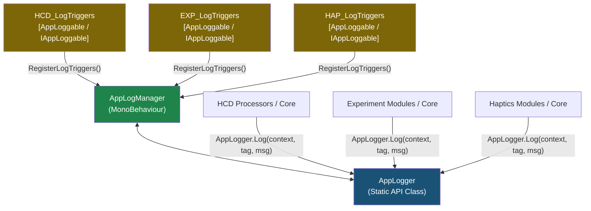

# 統制ログ管理システム (AppLogManager & AppLogger)

> 📂 **親ノード**: [Wiki.md](./Wiki.md) | 🏷️ **種類**: 🏗️ システム設計書  
> [RealTimeOcclusion Wiki (ポータル)](./Wiki.md) に戻る

本ドキュメントでは、アプリケーション全体のデバッグログ出力を一元管理し、パフォーマンス低下を防ぎつつモジュール別・機能別のトグル制御を可能にする**統制ログ管理システム (`AppLogManager` & `AppLogger`)** の仕様および実装・利用手順について解説します。

---

## 1. 概要

リアルタイム処理（点群生成・オクルージョン描画・触覚衝突判定等）においては、`Update` や hot path での頻繁なログ出力や GC（Garbage Collection）の発生がパフォーマンス悪化に直結します。
本システムは、各コンポーネントの Inspector を汚すことなく、シーン内の主要モジュール（`HCD`, `RealSense`, `PCD`, `Experiment`, `Haptics` 等）のログ出力を `AppLogManager` インスペクター上で一元かつ階層的に ON/OFF 制御する仕組みを提供します。

### 主な特徴
* **中央集中トグル管理**: モジュールカテゴリ（例: `HCD (Haptic Collision)`, `Experiment`）および個別サブトリガー（例: `[EXP_Manager]`, `[EXP_InputHandler]`）単位でログ有効状態を切り替え可能です。
* **Inspector の非汚染化**: 個別の `MonoBehaviour` に `public bool enableDebugLog` などのトグル変数を定義せず、全制御を `AppLogManager` に統一します。
* **自動スキャン・登録機能**: シーン内の `[AppLoggable]` 属性または `IAppLoggable` インターフェースを持つアクティブコンポーネントを全自動で検出・グループ化します。
* **サブトリガーによる詳細分類**: `IAppLoggable` インターフェースを介して、単一コンポーネントから複数の機能別サブログトリガーを `AppLogManager` へ登録できます。

---

## 2. 設計思想・アーキテクチャ

### 2.1 コンポーネント構成と役割分離

本ログシステムは、以下の 3 つの主要要素で構成されています。

```
Assets/Core/Scripts/Logging/
├── AppLogger.cs       # モジュール非依存の静的ログ制御 API
├── AppLogManager.cs   # シーン内の全ログトリガーを一元管理する MonoBehaviour マネージャー
└── (各 Feature 配下)
    ├── HCD_LogTriggers.cs # HCD モジュール用 AppLogManager 連動トリガー登録ヘルパー
    ├── EXP_LogTriggers.cs # Experiment モジュール用 AppLogManager 連動トリガー登録ヘルパー
    └── HAP_LogTriggers.cs # Haptics モジュール用 AppLogManager 連動トリガー登録ヘルパー
```

### 2.2 クラス関係図



### 2.3 `[AppLoggable]` 属性と `IAppLoggable` の適用ルール

二重登録や不要なエントリーの肥大化を防ぐため、以下の適用ルールを遵守します。

* **エントリポイント / ヘルパーコンポーネントのみに適用**:
  `[AppLoggable("カテゴリー名")]` 属性および `IAppLoggable` インターフェースは、モジュールの窓口コンポーネント（例: `HCD_Pipeline`, `EXP_ExperimentManager`）および専用のトリガー登録ヘルパー（例: `HCD_LogTriggers`, `EXP_LogTriggers`）にのみ付与します。
* **サブコンポーネントへの属性直接付与の禁止**:
  ログ出力を行うだけの内部コンポーネント（例: `EXP_InputHandler`, `EXP_DataRecorder` 等）には `[AppLoggable]` 属性を**付与しません**。親ターゲットと定義済みサブタグ（`EXP_LogTriggers.TagInputHandler` 等）を指定して `AppLogger.Log` を呼び出します。

---

## 3. セットアップ・使用方法

### 3.1 既存モジュールでのログ出力方法

ログを出力したい C# スクリプトでは、`Core.Logging` 名前空間を `using` し、`Debug.Log` の代わりに `AppLogger` の静的メソッドを呼び出します。

```csharp
using UnityEngine;
using Core.Logging;
using Features.Experiment.Debug;

public class EXP_InputHandler : MonoBehaviour
{
    private void Respond(string responseValue)
    {
        // ターゲット (this または manager) と定義済みサブタグを指定してログ出力
        AppLogger.Log(this, EXP_LogTriggers.TagInputHandler, $"Respond('{responseValue}') 発火");
    }
}
```

### 3.2 新規モジュールでの `IAppLoggable` トリガー登録手順

新規モジュールを作成し、複数のサブタグを `AppLogManager` のインスペクター上で管理したい場合は、以下の手順で登録ヘルパーを作成します。

1. **ログトリガーヘルパーの作成**:
   `Assets/Features/<FeatureName>/Scripts/Debug/` 配下に `LogTriggers` スクリプトを作成します。
   `[AppLoggable("グループ名")]` 属性と `IAppLoggable` インターフェースを実装します。

```csharp
using System.Collections.Generic;
using UnityEngine;
using Core.Logging;

namespace Features.MyFeature.Debug
{
    [AppLoggable("My Feature Group")]
    [DisallowMultipleComponent]
    public class MyFeature_LogTriggers : MonoBehaviour, IAppLoggable
    {
        public const string TagCore = "MyFeature_Core";
        public const string TagProcessor = "MyFeature_Processor";

        public void RegisterLogTriggers(LogCategoryGroup group, HashSet<string> existingLabels)
        {
            var manager = GetComponent<MyFeatureManager>() ?? FindFirstObjectByType<MyFeatureManager>();
            Object targetObj = manager != null ? (Object)manager : this;

            AddSubTriggerIfNotExists(group, targetObj, "[MyFeature] Core Manager", TagCore, existingLabels);
            AddSubTriggerIfNotExists(group, targetObj, "[MyFeature] Data Processor", TagProcessor, existingLabels);
        }

        private void AddSubTriggerIfNotExists(LogCategoryGroup group, Object targetObj, string label, string tag, HashSet<string> existingLabels)
        {
            if (!existingLabels.Contains(label))
            {
                group.entries.Add(new LogInstanceEntry
                {
                    label = label,
                    tag = tag,
                    target = targetObj,
                    enabled = true
                });
                existingLabels.Add(label);
            }
        }
    }
}
```

2. **メインマネージャーでの自動アタッチ**:
   メインの `MonoBehaviour` クラスの `Awake()` にて、ヘルパーコンポーネントを自動アタッチします。

```csharp
void Awake()
{
    if (GetComponent<MyFeature_LogTriggers>() == null)
    {
        gameObject.AddComponent<MyFeature_LogTriggers>();
    }
}
```

---

## 4. 仕様・パラメータ詳細

### 4.1 `AppLogger` API リファレンス

`AppLogger` 静的クラスが提供する主要メソッドは以下の通りです。

| メソッド名 | 引数 | 説明 |
|:---|:---|:---|
| `IsEnabled` | `(Object context, string subTag)` | 指定したコンポーネントインスタンスおよびサブタグでログが有効か判定します。 |
| `IsEnabled` | `(string nameTag)` | 指定した識別タグ名でログが有効か判定します。 |
| `Log` | `(Object context, string message)` | デフォルトタグで情報ログを出力します。 |
| `Log` | `(Object context, string subTag, string message)` | サブタグを指定して情報ログを出力します。 |
| `Log` | `(string nameTag, string message, Object context)` | 名前タグを指定して情報ログを出力します。 |
| `LogWarning` | `(Object context, string message)` / `(Object context, string subTag, string message)` | 警告ログを出力します。 |
| `LogError` | `(Object context, string message)` / `(Object context, string subTag, string message)` | エラーログを出力します。 |

### 4.2 `AppLogManager` パラメータ・仕様

`AppLogManager` の Inspector パラメータおよび内部動作仕様は以下の通りです。

| パラメータ名 | 型 | 既定値 | 説明 |
|:---|:---:|:---:|:---|
| `globalEnableLogging` | `bool` | `true` | アプリケーション全体のログ出力有無を統括するマスター切替トグルです。 |
| `categoryGroups` | `List<LogCategoryGroup>` | - | モジュールカテゴリー別にグループ化された各ログエントリーのリストです。 |

#### 自動スキャン動作仕様 (`ScanSceneComponents`)
* **検出対象**: シーン内のアクティブな `MonoBehaviour` のうち、`[AppLoggable]` 属性を付与されているクラス、または `IAppLoggable` インターフェースを実装しているクラスのみを対象とします。
* **非アクティブコンポーネントの除外**: `FindObjectsInactive.Exclude` により、非アクティブな GameObject およびコンポーネントは検出対象から除外します。
* **デフォルト有効**: 新規検出されたエントリーおよび未登録のタグは、デフォルトで `enabled = true` (ON) として初期化されます。

---

## 5. デバッグ・留意事項

### 5.1 実行時パフォーマンスと条件判定
`Update` などの hot path 内で文字列結合を含むログを出力する場合は、無駄な文字列アロケーションを防ぐため、事前に `AppLogger.IsEnabled` でチェックを行うかフレーム数条件を併用することを推奨します。

```csharp
// フレーム間隔制限と IsEnabled チェックによる負荷軽減例
if (AppLogger.IsEnabled(this, HCD_Pipeline.TagDistanceProcessor) && Time.frameCount % 120 == 0)
{
    AppLogger.Log(this, HCD_Pipeline.TagDistanceProcessor, $"Process Time: {elapsedTime:F2} ms");
}
```

### 5.2 注意点
* **Inspector トグル変数の個々追加禁止**: 個別の `MonoBehaviour` に `public bool enableDebugLog` などを定義することは禁止されています。必ず `AppLogManager` を経由してください。
* **直接 `Debug.Log` の使用禁止**: 各 Feature 内のプロダクションコードで直接 `Debug.Log` や `Debug.LogWarning` を呼び出すことは避け、必ず `AppLogger` を使用してください。
