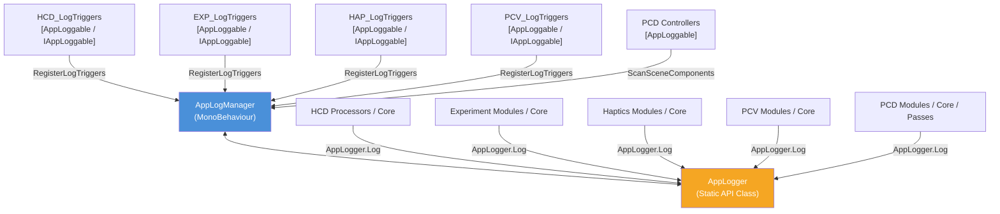

# 統制ログ管理システム (AppLogManager & AppLogger) 仕様書

> 📂 **親ノード**: [Wiki.md](./Wiki.md) | 🏷️ **種類**: 🏗️ システム設計書  
> [RealTimeOcclusion Wiki (ポータル)](./Wiki.md) に戻る

本ドキュメントでは、アプリケーション全体のデバッグログ出力を一元管理し、パフォーマンス低下を防ぎつつモジュール別・機能別のトグル制御を可能にする**統制ログ管理システム (`AppLogManager` & `AppLogger`)** の仕様および実装・利用手順について解説します。

---

## 1. 概要

リアルタイム処理（点群生成・オクルージョン描画・触覚衝突判定等）においては、`Update` や hot path での頻繁なログ出力や GC（Garbage Collection）の発生がパフォーマンス悪化に直結します。

本システムは、各コンポーネントの Inspector を汚すことなく、シーン内の主要モジュール（`HCD`, `RealSense`, `PCD`, `Experiment`, `Haptics`, `PCV` 等）のログ出力を `AppLogManager` インスペクター上で一元かつ階層的に ON/OFF 制御する仕組みを提供します。

* **自動コンテキスト識別（複数アタッチ対応）**: 同一スクリプトが複数 GameObject にアタッチされている場合（例: 複数台の RealSense カメラ）、`AppLogger.Log(this, ...)` 呼び出しによってログプレフィックスが **`[型名: GameObject名]`**（例: `[RsDevice: RealSense_Front]`）へ自動拡張され、出力元オブジェクトを即座に識別可能です。
* **中央集中トグル管理**: モジュールカテゴリ（例: `HCD (Haptic Collision)`, `Experiment`, `PCV (PointCloudViewer)`, `PCD (Occlusion)`, `RealSense`）および個別サブトリガー（例: `[EXP_Manager]`, `[PCV_Controller]`, `[RsDevice] RealSense_Front`）単位でログ有効状態を切り替え可能です。
* **ログ種別・重要度レベルによるフィルタリング**: グローバル最小ログレベル (`minLogLevel`) の指定、またはログ種別ごとの個別の有効/無効トグル (`enableInfoLogs`, `enableWarningLogs`, `enableErrorLogs`) により、「通常ログは非表示にし、警告 (`LogWarning`) とエラー (`LogError`) のみを表示する」といった高度なログ制御が可能です。
* **Inspector の非汚染化**: 個別の `MonoBehaviour` に `public bool enableDebugLog` や `public bool EnableLog` などのトグル変数を定義せず、全制御を `AppLogManager` に統一します。
* **自動スキャン・登録機能**: シーン内の `[AppLoggable]` 属性または `IAppLoggable` インターフェースを持つアクティブコンポーネントを全自動で検出・グループ化します。
* **サブトリガーによる詳細分類**: `IAppLoggable` インターフェースを介して、単一コンポーネントから複数の機能別サブログトリガーを `AppLogManager` へ登録できます。

---

## 2. 設計思想・アーキテクチャ

### 2.1 コンポーネント構成と役割分離

```text
Assets/Core/Scripts/Logging/
├── AppLogger.cs                       # モジュール非依存の静的ログ制御 API
├── AppLogManager.cs                   # シーン内の全ログトリガーを一元管理する MonoBehaviour
└── (各 Feature 配下)
    ├── HCD_LogTriggers.cs             # HCD モジュール用 AppLogManager 連動トリガー
    ├── EXP_LogTriggers.cs             # Experiment モジュール用 AppLogManager 連動トリガー
    ├── HAP_LogTriggers.cs             # Haptics モジュール用 AppLogManager 連動トリガー
    ├── DPC_LogTriggers.cs             # DPC (Dummy Point Cloud) モジュール用連動トリガー
    ├── PCV_LogTriggers.cs             # PointCloudViewer モジュール用 AppLogManager 連動トリガー
    ├── (RealSense / センサーデバイス モジュール)
    │   ├── RsDevice.cs                # [AppLoggable("RealSense (Device)")] カメラデバイス統括
    │   ├── RsDeviceController.cs      # [AppLoggable("RealSense (Device)")] デバイス設定コントローラー
    │   ├── RsGlobalPointCloudManager.cs # [AppLoggable("RealSense (Pipeline)")] 全カメラ統合バッファマネージャー
    │   ├── RsProcessingPipe.cs        # [AppLoggable("RealSense (Pipeline)")] フレームパイプライン統括
    │   └── RsIntegratedPointCloud.cs  # [AppLoggable("RealSense (Pipeline)")] 統合点群生成プロセッサ
    ├── (DPC / ダミー実測点群 モジュール)
    │   ├── RsDummyPointCloudProvider.cs # [AppLoggable("DPC (Dummy Point Cloud)")] ダミー点群供給プロバイダー
    │   ├── RsDummyPointCloudRenderer.cs # [AppLoggable("DPC (Dummy Point Cloud)")] GPU Dirty描画レンダラー
    │   └── RsDummyProcessingPipe.cs     # [AppLoggable("DPC (Dummy Point Cloud)")] ダミーフレームパイプライン
    └── (PCD / 3DDisplay モジュール)
        ├── PCDOcclusionPipelineController.cs # [AppLoggable("PCD (Occlusion)")] 属性を持つオクルージョン統括
        ├── PCDMeshRegistrarController.cs     # [AppLoggable("PCD (Occlusion)")] 属性を持つメッシュ登録統括
        ├── PCDPointBufferManager.cs          # AppLogger.Log 経由でログ出力するバッファマネージャー
        └── PCDDebugReadbackManager.cs        # AppLogger 経由でログ出力する AsyncReadback マネージャー
```

### 2.2 クラス相関図



### 2.3 `[AppLoggable]` 属性と `IAppLoggable` の適用ルール

* **エントリポイント / ヘルパーコンポーネントのみに適用**:
  `[AppLoggable("カテゴリー名")]` 属性および `IAppLoggable` インターフェースは、モジュールの窓口コンポーネント（例: `HCD_Pipeline`, `EXP_ExperimentManager`）および専用のトリガー登録ヘルパー（例: `HCD_LogTriggers`, `EXP_LogTriggers`）にのみ付与します。
* **サブコンポーネントへの属性直接付与の禁止**:
  内部コンポーネント（例: `EXP_InputHandler`, `EXP_DataRecorder` 等）には `[AppLoggable]` 属性を付与せず、親ターゲットと定義済みサブタグを指定して `AppLogger.Log` を呼び出します。

---

## 3. セットアップ・使用方法

### 3.1 既存モジュールでのログ出力方法

ログを出力したい C# スクリプトでは、`Core.Logging` 名前空間を `using` し、`Debug.Log` の代わりに `AppLogger` の静的メソッドを呼び出します。

```csharp
using UnityEngine;
using Core.Logging;
using Features.Experiment.Debug;

public class EXP_InputHandler : MonoBehaviour
{
    private void Respond(string responseValue)
    {
        // ターゲット (this または manager) と定義済みサブタグを指定してログ出力
        AppLogger.Log(this, EXP_LogTriggers.TagInputHandler, $"Respond('{responseValue}') 発火");
    }
}
```

### 3.2 新規モジュールでの `IAppLoggable` トリガー登録手順

#### Step 1: ログトリガーヘルパーの作成

`Assets/Features/<FeatureName>/Scripts/Debug/` 配下に `LogTriggers` スクリプトを作成し、`[AppLoggable("グループ名")]` 属性と `IAppLoggable` を実装します。

```csharp
using System.Collections.Generic;
using UnityEngine;
using Core.Logging;

namespace Features.MyFeature.Debug
{
    [AppLoggable("My Feature Group")]
    [DisallowMultipleComponent]
    public class MyFeature_LogTriggers : MonoBehaviour, IAppLoggable
    {
        public const string TagCore = "MyFeature_Core";
        public const string TagProcessor = "MyFeature_Processor";

        public void RegisterLogTriggers(LogCategoryGroup group, HashSet<string> existingLabels)
        {
            var manager = GetComponent<MyFeatureManager>() ?? FindFirstObjectByType<MyFeatureManager>();
            Object targetObj = manager != null ? (Object)manager : this;

            AddSubTriggerIfNotExists(group, targetObj, "[MyFeature] Core Manager", TagCore, existingLabels);
            AddSubTriggerIfNotExists(group, targetObj, "[MyFeature] Data Processor", TagProcessor, existingLabels);
        }

        private void AddSubTriggerIfNotExists(LogCategoryGroup group, Object targetObj, string label, string tag, HashSet<string> existingLabels)
        {
            if (!existingLabels.Contains(label))
            {
                group.entries.Add(new LogInstanceEntry
                {
                    label = label,
                    tag = tag,
                    target = targetObj,
                    enabled = true
                });
                existingLabels.Add(label);
            }
        }
    }
}
```

#### Step 2: メインマネージャーでの自動アタッチ

メインの `MonoBehaviour` クラスの `Awake()` にて、ヘルパーコンポーネントを自動アタッチします。

```csharp
void Awake()
{
    if (GetComponent<MyFeature_LogTriggers>() == null)
    {
        gameObject.AddComponent<MyFeature_LogTriggers>();
    }
}
```

---

## 4. 仕様・パラメータ詳細

### 4.1 `AppLogger` API リファレンス

| 型 / メソッド名 | 引数 / 構造 | 説明 |
|---|---|---|
| `AppLogLevel` (enum) | `Info` (0), `Warning` (1), `Error` (2) | ログメッセージの重要度レベルを表す列挙型 |
| `IsEnabled` | `(Object context, string subTag = null)` | `Info` レベルで指定コンポーネント/サブタグのログが有効か判定 |
| `IsEnabled` | `(Object context, AppLogLevel level, string subTag = null)` | 指定ログレベルおよびコンポーネント/サブタグのログが有効か判定 |
| `IsEnabled` | `(string nameTag, AppLogLevel level = AppLogLevel.Info)` | 指定ログレベルおよび識別タグ名でログが有効か判定 |
| `Log` | `(Object context, string message)` / `(Object context, string subTag, string message)` | `Info` レベルの通常情報ログを出力 |
| `Log` | `(string nameTag, string message, Object context = null)` | `Info` レベルの名前タグ指定情報ログを出力 |
| `LogWarning` | `(Object context, string message)` / `(Object context, string subTag, string message)` | `Warning` レベルの警告ログを出力 |
| `LogWarning` | `(string nameTag, string message, Object context = null)` | `Warning` レベルの名前タグ指定警告ログを出力 |
| `LogError` | `(Object context, string message)` / `(Object context, string subTag, string message)` | `Error` レベルのエラーログを出力 |
| `LogError` | `(string nameTag, string message, Object context = null)` | `Error` レベルの名前タグ指定エラーログを出力 |

### 4.2 `AppLogManager` パラメータ・仕様

| パラメータ名 | 型 | 既定値 | 説明 |
|---|---|---|---|
| `globalEnableLogging` | `bool` | `true` | アプリケーション全体のログ出力を統括するマスター切替トグル |
| `minLogLevel` | `AppLogLevel` | `Info` | 表示する最小ログレベル (`Info`: 全表示, `Warning`: Warning以上, `Error`: Errorのみ) |
| `enableInfoLogs` | `bool` | `true` | 通常情報ログ (`AppLogger.Log`) の表示有効/無効トグル |
| `enableWarningLogs` | `bool` | `true` | 警告ログ (`AppLogger.LogWarning`) の表示有効/無効トグル |
| `enableErrorLogs` | `bool` | `true` | エラーログ (`AppLogger.LogError`) の表示有効/無効トグル |
| `categoryGroups` | `List<LogCategoryGroup>` | `-` | モジュールカテゴリー別にグループ化された各ログエントリーのリスト |

---

## 5. デバッグ・留意事項

### 5.1 実行時パフォーマンスと条件判定

`Update` などの hot path 内で文字列結合を含むログを出力する場合は、無駄な文字列アロケーションを防ぐため、事前に `AppLogger.IsEnabled` でチェックを行うかフレーム数条件を併用することを推奨します。

```csharp
if (AppLogger.IsEnabled(this, HCD_Pipeline.TagDistanceProcessor) && Time.frameCount % 120 == 0)
{
    AppLogger.Log(this, HCD_Pipeline.TagDistanceProcessor, $"Process Time: {elapsedTime:F2} ms");
}
```

### 5.2 留意事項

* **Inspector トグル変数の個別追加禁止**: 個別の `MonoBehaviour` や C# クラスに `public bool enableDebugLog` や `public bool EnableLog` などを定義することは禁止されています。必ず `AppLogManager` および `AppLogger` を経由してください（PCD モジュールもこれに従い、`PCDPointBufferManager` の `EnableLog` 変数は廃止・一元管理化されました）。
* **直接 `Debug.Log` の使用禁止**: 各 Feature 内のプロダクションコードで直接 `Debug.Log` を呼び出すことは避け、必ず `AppLogger` を使用してください。
* **`IAppLoggable` インターフェース実装の徹底**: `[AppLoggable]` 属性を持つコンポーネントは必ず `IAppLoggable` インターフェースを実装し、各種トリガー定義クラス（例: `DPC_LogTriggers`）へ委譲・登録を行ってください。未実装の場合、`AppLogManager` のコンポーネント自動スキャン時に `[型名] GameObject名` 形式の不揃いなデフォルトエントリーが生成され、重複表示の原因となります。
* **統一ログプレフィックスの指定**: コンソールログ出力時にクラス名がプレフィックスとして冗長表示されるのを防ぐため、サブトリガーを持つコンポーネントでは `AppLogger.Log(DPC_LogTriggers.TagPipe, message, this)` のように識別タグ（`nameTag`）を第1引数に指定する形式を標準として使用してください。
