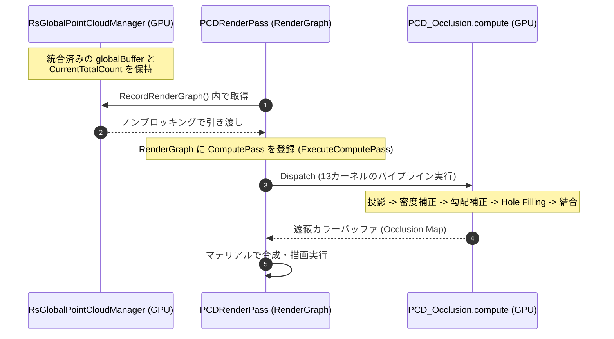

# 視覚オクルージョン・レンダリングシステム 仕様書

> 📂 **親ノード**: [Wiki.md](./Wiki.md) | 🏷️ **種類**: 🏗️ システム設計書  
> [RealTimeOcclusion Wiki (ポータル)](./Wiki.md) に戻る

本ドキュメントは、Intel RealSense 等のセンサーから取得したリアルタイム点群（Point Cloud）を URP RenderGraph パイプライン上でスクリーン空間に精密に投影し、Unity の仮想オブジェクトとの前後遮蔽（オクルージョン）を計算・描画する「視覚オクルージョン・レンダリングシステム」の設計思想、各モジュールの役割、関数構成、および GPU Compute Shader における各種アルゴリズムの詳細を網羅したテクニカルリファレンスです。

---

## 1. 概要

本システムは、実環境からリアルタイムに取得した点群をスクリーン空間に投影し、Unity の仮想 3D 空間に配置されたオブジェクトとの前後関係（オクルージョン）をリアルタイムに計算・遮蔽描画する仕組みです。

```text
[統合点群バッファ (_globalBuffer) / 静的メッシュバッファ]
        │ 
        │ (RecordRenderGraph でノンブロッキングにバッファと頂点数を引き渡し)
        ▼
   [PCDRenderPass (URP RenderGraph)]
        │ 
        │ (多段 Compute Shader カーネルディスパッチ)
        ▼
[PCD_Occlusion.compute]
        │ (Joint Bilateral / Pull-Push / モルフォロジー補間)
        ▼
  [オクルージョンマップ出力 (画面遮蔽描画)]
```

### 主な特徴

* **ゼロコピー高効率 GPU パイプライン**: CPU-GPU 間のデータ転送オーバーヘッドを排除し、深度情報から頂点バッファへの変換、姿勢変換、およびオクルージョン投影計算までを GPU Compute Buffer 上で一貫処理します。
* **RenderGraph 完全統合**: Unity 6 URP RenderGraph アーキテクチャに準拠し、描画パイプラインの途中に非同期オクルージョン計算パスを安全に挿入します。
* **堅牢な Hole Filling アルゴリズム**: エッジ保存型 Joint Bilateral フィルタ、およびマルチスケール解像度伝播を行う Pull-Push 法を GPU Compute Shader 上に完全実装しています。
* **タグベース最適化**: 物理点群、仮想オブジェクト、背景を識別し、セルフオクルージョンを防御しながら正確な遮蔽マスクを生成します。

---

## 2. 設計思想・アーキテクチャ

### 2.1 生成ファイル・ディレクトリ構成

```text
Assets/Features/PCD/
├── Materials/                         # オクルージョン遮蔽合成用マテリアル
├── Shaders/
│   ├── PCD_Occlusion.compute          # 投影・穴埋め・オクルージョン計算 Compute Shader
│   └── PCD_OcclusionBlit.shader       # 最終合成用 Blit Shader
└── Scripts/
    ├── Core/
    │   ├── PCDRendererFeature.cs      # URP ScriptableRendererFeature
    │   └── PCDRenderPass.cs           # URP RenderGraph パス統括
    ├── Pipeline/
    │   ├── PCDContextBuilder.cs       # カメラ行列・バッファ調停コンテキスト生成
    │   ├── PCDComputePassBuilder.cs   # Compute Shader パス構築 (AddUnsafePass)
    │   └── PCDBlitPassBuilder.cs      # 最終画面合成パス構築 (AddRasterRenderPass)
    └── Registrar/
        └── StaticMeshPCDRegistrar.cs  # 静的メッシュの自動登録コンポーネント
```

### 2.2 クラス相関図



### 2.3 `PCDRenderPass` ステージアーキテクチャ

`PCDRenderPass` はパイプライン・ステージアーキテクチャとして整理されており、処理を以下の 3 つの専用ビルダークラスへ委譲します。

1. **`PCDContextBuilder`**: カメラ行列の計算（ハーフミラー空間反転含む）、点群バッファ調停、描画スキップ判定を行い `PreComputeData` を生成します。
2. **`PCDComputePassBuilder`**: RenderGraph に対してオクルージョン計算用 Compute Shader パス (`AddUnsafePass`) を構築します。
3. **`PCDBlitPassBuilder`**: オクルージョン計算済みの結果マップをターゲットカラーテクスチャへ出力するパス (`AddRasterRenderPass`) を構築します。

---

## 3. セットアップ・使用方法

### 3.1 クイックスタート手順

#### Step 1: URP レンダラーアセット設定

1. Universal Render Pipeline (URP) の Universal Renderer Data アセットを開きます。
2. `Add Renderer Feature` から `PCDRendererFeature` を追加します。

#### Step 2: シーンコントローラー配置とパラメータ調整

1. シーン内の管理オブジェクトに `PCDOcclusionPipelineController` をアタッチします。
2. インスペクターからオクルージョン手法パラメータを調整します。

| 設定項目 | 型 | 既定値 | 説明 |
|---|---|---|---|
| `enableTagBasedOptimization` | `bool` | `true` | タグベースの最適化を有効化（セルフオクルージョン防止） |
| `enableTypeAwareDensity` | `bool` | `true` | 点群種別に応じた密度計算補正 |
| `enableSoftOcclusionFade` | `bool` | `true` | 境界ソフトフェード処理の有効化 |
| `holeFillingMethod` | `PCD_HoleFillingMethod` | `JointBilateral` | 穴埋め補間手法 (`None`, `JointBilateral`, `PullPush`, `Morphology_OC`, `Morphology_CO`) |
| `occlusionFadeWidth` | `float` | `0.2f` | フェード境界幅のパラメータ |

#### Step 3: 静的メッシュのオクルード登録

オクルージョン遮蔽の対象としたい静的 GameObject に `StaticMeshPCDRegistrar` をアタッチして自動登録を行います。

---

## 4. 仕様・パラメータ詳細

### 4.1 Compute Shader パイプライン仕様 (`PCD_Occlusion.compute`)

* **`ProjectPoints`**: 射影変換 $\mathbf{p}_{\text{clip}} = \mathbf{M}_{\text{VP}} \cdot \mathbf{p}_{\text{world}}$ を適用し、`InterlockedMin` で最前面頂点深度を `_DepthMap_RW` に記録。
* **`CalculateGridZMin` & `CalculateDensity`**: $8 \times 8$ グリッドで最小 Z 値および点群密度を計算。
* **`CalculateGridLevel` & `GridMedianFilter`**: 密度の疎密に応じた適応的探索レベル (LOD) の決定と $3 \times 3$ メディアンフィルタ平滑化。
* **`ApplyAdaptiveGradientCorrection`**: Sobel フィルタライクな差分演算でデプス急激境界（エッジ）を検出し、遮蔽が背景側へ漏れる現象（オクルージョン・リーク）を防止。
* **`ComputeOcclusion`**: 6 階層の深度ピラミッド (`BuildDepthPyramidL1` ~ `L6`) と点群深度を比較し、オクルージョン度 $0.0 \sim 1.0$ を書き込み。

### 4.2 数式モデル・理論的背景

<details>
<summary><b>📐 オクルージョン計算・Hole Filling アルゴリズムの数理モデル（クリックで展開）</b></summary>

#### A. 距離減衰と遮蔽力計算モデル

点群位置 $\mathbf{p}_i$ と仮想オブジェクトピクセル位置 $\mathbf{x}$ のスクリーン空間距離 $d_i = \|\mathbf{p}_i - \mathbf{x}\|$ に基づく遮蔽強度 $W(\mathbf{x})$ は、以下のガウスカーネル重み付けで計算されます。

$$
W(\mathbf{x}) = \sum_{i=1}^{N} \exp\left( -\frac{\|\mathbf{p}_i - \mathbf{x}\|^2}{2\sigma^2} \right) \cdot \Phi(z_{\text{virtual}} - z_i)
$$

$$
\Phi(\Delta z) = \begin{cases}
1 & (\Delta z > \epsilon) \\
1 - \frac{\epsilon - \Delta z}{\epsilon} & (0 \le \Delta z \le \epsilon) \\
0 & (\Delta z < 0)
\end{cases}
$$

| 記号 | 説明 | 単位 / 型 |
|---|---|---|
| $\mathbf{p}_i$ | 投影された第 $i$ 点群のスクリーン座標 | `Vector2` |
| $\mathbf{x}$ | 対象ピクセルのスクリーン座標 | `Vector2` |
| $\sigma$ | カーネル標準偏差（影響半径） | `float` |
| $z_{\text{virtual}}$ | 仮想オブジェクトのスクリーンデプス | `float` |
| $z_i$ | 点群のスクリーンデプス | `float` |
| $\epsilon$ | ソフトフェード幅 (`occlusionFadeWidth`) | `float` |

#### B. Joint Bilateral フィルタ補間式

穴埋め処理 `FillHoles` における Joint Bilateral 重み $W_{\text{JB}}(\mathbf{x}, \mathbf{y})$ は、空間距離とデプス差の積で表現されます。

$$
W_{\text{JB}}(\mathbf{x}, \mathbf{y}) = \exp\left( -\frac{\|\mathbf{x} - \mathbf{y}\|^2}{2\sigma_s^2} \right) \cdot \exp\left( -\frac{|z(\mathbf{x}) - z(\mathbf{y})|^2}{2\sigma_r^2} \right)
$$

| 記号 | 説明 | 単位 / 型 |
|---|---|---|
| $\mathbf{x}, \mathbf{y}$ | 注目ピクセルおよび近傍ピクセル座標 | `Vector2` |
| $\sigma_s$ | 空間フィルタ分散 | `float` |
| $\sigma_r$ | 範囲（デプス）フィルタ分散 | `float` |

</details>

---

## 5. デバッグ・留意事項

### 5.1 Unity 6 RenderGraph マイグレーションと留意事項

* **RTHandle 永続化による Texture Thrashing 防止**: 中間テクスチャの毎フレーム再生成を避けるため、40 以上のテクスチャを `PCDResourcePool` 内で RTHandle として永続保持し、オーバーヘッドを 1ms 未満に短縮しています。
* **生リソースのバインド**: `RenderGraph.ImportTexture()` 由来の暗黙キャスト例外を防ぐため、パス内部計算には生のリソースである RTHandle を直接バインドします。
* **DirectX / OpenGL Reversed-Z 補正**: DirectX (Reversed-Z) と OpenGL 正規空間の変換ギャップを補正するため、`ComputeShader` への `InverseProjectionMatrix` には `camera.projectionMatrix.inverse` を渡し `_IsReversedZ` を正しく評価します。

### 5.2 統制ログシステム (AppLogManager) との同期

オクルージョンパイプラインの動作ログには、プレフィックス `[OcclusionRendering]` が付与されます。

* `[OcclusionRendering] PCDRenderPass: RenderGraph パスの構築完了`
* `[OcclusionRendering] HoleFillingMethod が JointBilateral に変更されました。`

統制ログ仕様の詳細については [Logging.md](./Logging.md) を参照してください。
