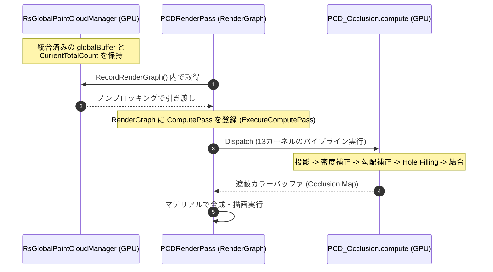

# 視覚オクルージョン・レンダリングシステム 仕様書

> 📂 **親ノード**: [Wiki.md](./Wiki.md) | 🏷️ **種類**: 🏗️ システム設計書  
> [RealTimeOcclusion Wiki (ポータル)](./Wiki.md) に戻る

本ドキュメントは、Intel RealSense 等のセンサーから取得したリアルタイム点群（Point Cloud）を URP RenderGraph パイプライン上でスクリーン空間に精密に投影し、Unity の仮想オブジェクトとの前後遮蔽（オクルージョン）を計算・描画する「視覚オクルージョン・レンダリングシステム」の設計思想、各モジュールの役割、関数構成、および GPU Compute Shader における各種アルゴリズムの詳細を網羅したテクニカルリファレンスです。

---

## 1. 概要

本システムは、実環境からリアルタイムに取得した点群をスクリーン空間に投影し、Unity の仮想 3D 空間に配置されたオブジェクトとの前後関係（オクルージョン）をリアルタイムに計算する仕組みです。

```text
[統合点群バッファ (_globalBuffer) / 静的メッシュバッファ]
        │ 
        │ (RecordRenderGraph でノンブロッキングにバッファと頂点数を引き渡し)
        ▼
   [PCDRenderPass (URP RenderGraph)]
        │ 
        │ (多段 Compute Shader カーネルディスパッチ)
        ▼
[PCD_Occlusion.compute]
        │ (Joint Bilateral / Pull-Push / モルフォロジー補間)
        ▼
 [オクルージョンマップ出力 (画面遮蔽描画)]
```

### 主な特徴と提供価値
* **ゼロコピーによる高効率転送**: CPU-GPU 間のボトルネックを排除し、深度情報から頂点バッファへの変換、姿勢推定、およびオクルージョン投影計算までを GPU Compute Buffer 上で一貫処理。
* **非同期 CommandBuffer マージ**: `Graphics.ExecuteCommandBuffer` による非同期キューイングにより、CPU メインスレッドを待たずに複数点群を GPU マージ。
* **RenderGraph 統合**: Unity 6 URP RenderGraph アーキテクチャに準拠し、描画パイプラインの途中に非同期オクルージョン計算パスを安全に挿入。
* **堅牢な Hole Filling**: エッジ保存型 Joint Bilateral フィルタ、およびマルチスケール解像度伝播の Pull-Push 法を GPU 上に完全実装。

---

## 2. 設計思想・アーキテクチャ

### 2.1 全体アーキテクチャとデータフロー



### 2.2 `PCDRenderPass` とステージアーキテクチャ

`PCDRenderPass` は「パイプライン・ステージ (Stage) アーキテクチャ」として整理され、以下の 3 つの専用ビルダークラスに処理を委譲します。

1. **`PCDContextBuilder`**: カメラ行列の計算（ハーフミラー空間反転含む）、点群バッファ調停、描画スキップ判定を行い `PreComputeData` を生成。
2. **`PCDComputePassBuilder`**: RenderGraph に対してオクルージョン計算用 Compute Shader パス (`AddUnsafePass`) を構築。
3. **`PCDBlitPassBuilder`**: オクルージョン計算済みの結果マップをターゲットカラーテクスチャへ出力するパス (`AddRasterRenderPass`) を構築。

---

## 3. セットアップ・使用方法

1. URP レンダラーデータアセットに `PCDRendererFeature` を追加します。
2. シーン内の管理オブジェクトに `PCDOcclusionPipelineController` をアタッチし、インスペクターから手法パラメータを調整します。
3. `StaticMeshPCDRegistrar` をシーンオブジェクトにアタッチして静的メッシュのオクルード対象自動登録を行います。

---

## 4. 仕様・パラメータ詳細

### 4.1 Compute Shader パイプライン仕様 (`PCD_Occlusion.compute`)

#### A. 前処理・投影フェーズ
* **`ProjectPoints`**: 射影変換 $\mathbf{p}_{\text{clip}} = \mathbf{M}_{\text{VP}} \cdot \mathbf{p}_{\text{world}}$ を適用し、`InterlockedMin` で最前面頂点深度を `_DepthMap_RW` に記録。
* **`CalculateGridZMin` & `CalculateDensity`**: $8 \times 8$ グリッドで最小 Z 値および点群密度を計算。
* **`CalculateGridLevel` & `GridMedianFilter`**: 密度の疎密に応じた適応的探索レベル (LOD) の決定と $3 \times 3$ メディアンフィルタ平滑化。

#### B. 適応的勾配補正フェーズ
* **`ApplyAdaptiveGradientCorrection`**: Sobel フィルタライクな差分演算でデプス急激境界（エッジ）を検出し、遮蔽が背景側へ漏れる現象（オクルージョン・リーク）を防止。

#### C. オクルージョン計算フェーズ
* **`ComputeOcclusion`**: 6 階層の深度ピラミッド (`BuildDepthPyramidL1` ~ `L6`) と点群深度を比較し、オクルージョン度 $0.0 \sim 1.0$ を書き込み。
* **タグベース最適化 (`EnableTagBasedOptimization`)**: 物理点群 (`0u`)、仮想オブジェクト (`1u`)、背景 (`2u`) を区別し、セルフオクルージョンを防御。

#### D. ホールフィリング (Hole Filling) 仕様
* **Joint Bilateral Filter (`FillHoles`)**: 局所最小深度 `minDepth` 探索後、空間ウェイトと深度ウェイトの合成重みで加重平均補間。
* **Pull-Push ピラミッド法 (`FillHolesPullPushInit` ~ `FillHolesPush`)**: $O(N)$ のマルチスケール解像度伝播により巨大な穴を高速補間。
* **数学的モルフォロジー演算 (`MorphologyErode` / `MorphologyDilate`)**: 孤立ノイズ除去とひび割れ結合。

---

## 5. デバッグ・留意事項

### 5.1 Unity 6 RenderGraph マイグレーションとトラブルシューティング

* **内部キャッシュの RTHandle 永続化**: 中間テクスチャの毎フレーム再生成 (Texture Thrashing) を避けるため、40 以上のテクスチャを PCDResourcePool 内で RTHandle として永続保持しオーバーヘッドを $< 1\mathrm{ms}$ に短縮。
* **UnsafePass 移行における TextureHandle 問題の回避**: `RenderGraph.ImportTexture()` 由来の暗黙キャスト例外を防ぐため、パス内部計算には生のリソースである RTHandle を直接バインド。
* **必須バインディングバッファの明確化**: `NeighborCountMap` 等の RW テクスチャをダミー/実体として常にバインド保持。
* **ハーフミラー空間反転における行列の考慮**: DirectX Reversed-Z と OpenGL 正規空間の変換ギャップを補正するため、`ComputeShader` への `InverseProjectionMatrix` には純粋な `camera.projectionMatrix.inverse` を渡し `_IsReversedZ` を正しく評価。
