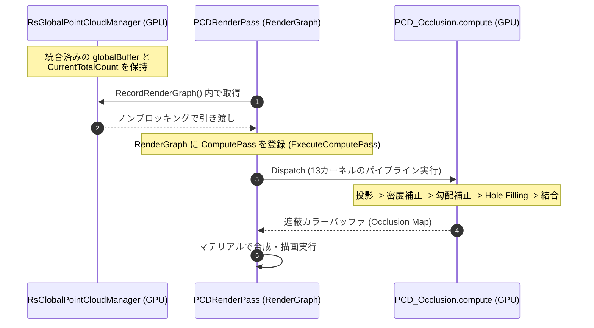
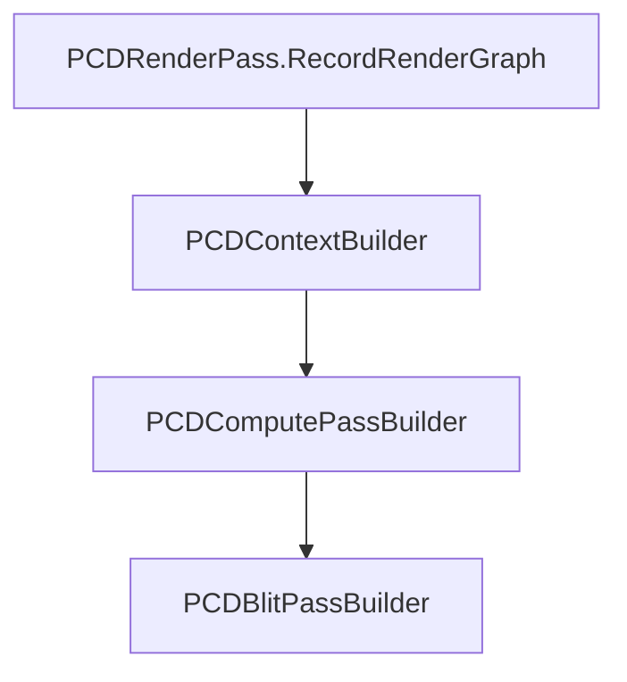

# RealTimeOcclusion 視覚オクルージョン・レンダリングシステム設計思想・関数仕様ドキュメント

本ドキュメントは、Intel RealSense 等のセンサーから取得したリアルタイム点群（Point Cloud）を URP RenderGraph パイプライン上でスクリーン空間に精密に投影し、Unity の仮想オブジェクトとの前後遮蔽（オクルージョン）を計算・描画する「視覚オクルージョン・レンダリングシステム」の設計思想、各モジュールの役割、関数構成、および GPU Compute Shader における各種アルゴリズムの詳細を網羅したテクニカルリファレンスです。

---

## 🔗 統合プロジェクトポータル

本システムは、プロジェクトのメインポータルである **[RealTimeOcclusion システム統合 Wiki (Wiki.md)](./Wiki.md)** の「視覚オクルージョンノード」として位置づけられています。

---

## 📑 目次
1. [システム概要と提供価値](#1-システム概要と提供価値)
2. [全体アーキテクチャとデータフロー](#2-全体アーキテクチャとデータフロー)
3. [主要フォルダ・ファイル構造](#3-主要フォルダ・ファイル構造)
4. [オクルージョン制御モジュール (Occlusion Core)](#4-オクルージョン制御モジュール-occlusion-core)
5. [Compute Shader パイプライン仕様](#5-compute-shader-パイプライン仕様)
6. [パフォーマンス最適化の工夫](#6-パフォーマンス最適化の工夫)
7. [動作検証 (Verification Plan)](#7-動作検証-verification-plan)
8. [Unity 6 RenderGraph マイグレーションとトラブルシューティング](#8-unity-6-rendergraph-マイグレーションとトラブルシューティング)

---

## 1. システム概要と提供価値

本システムは、実環境からリアルタイムに取得した点群をスクリーン空間に投影し、Unity の仮想3D空間に配置されたオブジェクトとの前後関係（オクルージョン）をリアルタイムに計算する仕組みです。

```text
[統合点群バッファ (_globalBuffer) / 静的メッシュバッファ]
        │ 
        │ (RecordRenderGraph でノンブロッキングにバッファと頂点数を引き渡し)
        ▼
   [PCDRenderPass (URP RenderGraph)]
        │ 
        │ (多段 Compute Shader カーネルディスパッチ)
        ▼
[PCD_Occlusion.compute]
        │ (Joint Bilateral / Pull-Push / モルフォロジー補間)
        ▼
 [オクルージョンマップ出力 (画面遮蔽描画)]
```

### 提供価値
*   **ゼロコピーによる高効率転送**: CPU-GPU間のボトルネックを完全に排除し、RealSense SDK からの深度情報から頂点バッファへの変換、姿勢推定、およびオクルージョン投影計算までを GPU Compute Buffer 上で一貫して処理します。
*   **非同期 CommandBuffer マージ**: `Graphics.ExecuteCommandBuffer` による非同期キューイングにより、CPU のメインスレッドを 1ミリ秒もブロッキングすることなく、複数点群を GPU 上でゼロコピーでマージ完了します。
*   **RenderGraph 統合による URP 最適化**: Unity 6 の Universal Render Pipeline (URP) RenderGraph アーキテクチャに完全準拠し、描画パイプラインの途中に非同期でオクルージョン計算パスを安全に挿入します。
*   **堅牢な Hole Filling**: 点群特有の「隙間」を補完するため、エッジ保存型の Joint Bilateral フィルタ、およびマルチスケール解像度伝播の Pull-Push 法を GPU 上に完全実装し、滑らかな遮蔽輪郭を提供します。

---

## 2. 全体アーキテクチャとデータフロー

システム全体のデータおよびバッファのライフサイクルは、実機入力（RealSense）またはデバッグシステム（PCV）からオクルージョン計算パスへと直列・並列に流れます。



---

## 3. 主要フォルダ・ファイル構造

ドキュメント内の各モジュールは、以下のリポジトリ構成と完全に対応しています。

階層が深いため、主要な機能カテゴリごとに分割して記載します。

---

### 3.1 視覚オクルージョンコア (`3DDisplay/Rendering/Occlusion`)

URP のレンダリングパイプラインに介入し、点群のオクルージョン計算を統括するコアモジュール群です。

* [ ] 基盤システム
* [ ] バッファ調停マネージャ (`PCDPointBufferManager`)
* [ ] オクルージョン描画パス (`PCDRenderPass`)

<details>
<summary>基盤システム</summary>

URPとの統合や設定、デバッグなどを担当するクラス群です。

* [PCDRendererFeature.cs](./Assets/Features/3DDisplay/Scripts/Rendering/Occlusion/PCDRendererFeature.cs) — URP レンダラーへのパス追加、シングルトンインスタンス管理
* [PCDSettingsBridge.cs](./Assets/Features/3DDisplay/Scripts/Rendering/Occlusion/PCDSettingsBridge.cs) — レンダリングパラメータの取得とフォールバックの仲介
* [PCDOcclusionPipelineController.cs](./Assets/Features/3DDisplay/Scripts/Rendering/Occlusion/PCDOcclusionPipelineController.cs) — インスペクターからの動的仲介
* [StaticMeshPCDRegistrar.cs](./Assets/Features/3DDisplay/Scripts/Rendering/Occlusion/StaticMeshPCDRegistrar.cs) — 空間内の静的/動的オブジェクトを自動検出・登録
* [PCDIntegratedDepthMapExporter.cs](./Assets/Features/3DDisplay/Scripts/Rendering/Occlusion/PCDIntegratedDepthMapExporter.cs) — 統合DepthMapエクスポート
* [PCDOcclusionDebugExporter.cs](./Assets/Features/3DDisplay/Scripts/Rendering/Occlusion/PCDOcclusionDebugExporter.cs) — 16色パレットPNG/CSV出力用デバッグユーティリティ

</details>

<details>
<summary>バッファ調停マネージャ (PCDPointBufferManager)</summary>

外部の点群バッファや静的メッシュの頂点データを調停・結合します。

* [PCDPointBufferManager.cs](./Assets/Features/3DDisplay/Scripts/Rendering/Occlusion/PCDPointBufferManager.cs) — メインクラス
* [PCDPointBufferManager_Mesh.cs](./Assets/Features/3DDisplay/Scripts/Rendering/Occlusion/PCDPointBufferManager_Mesh.cs) — 静的メッシュの登録・解除
* [PCDPointBufferManager_Merge.cs](./Assets/Features/3DDisplay/Scripts/Rendering/Occlusion/PCDPointBufferManager_Merge.cs) — 動的点群とメッシュの統合

</details>

---

#### PCDRenderPass とステージアーキテクチャ

This section describes the rendering pipeline and internal module structure of `PCDRenderPass`.
`PCDRenderPass` は非常に多岐にわたる処理を実行するため、保守性と拡張性を高める目的で **「パイプライン・ステージ（Stage）アーキテクチャ」** に分割・再構築されています。従来の `partial` クラスによる密結合を廃止し、明確な責務分けを行っています。

##### 1. Pipeline Flow (Builder Architecture)

`PCDRenderPass` は `RecordRenderGraph` の呼び出しにおいて、直接各種セットアップを行うのではなく、責務ごとに分割された3つの専用「ビルダークラス」に処理を委譲するオーケストレーターとして機能します。



1.  **`PCDContextBuilder`**: RenderGraph のパス登録前に、毎フレーム必要なカメラ行列の計算（ハーフミラー空間反転処理含む）、点群バッファの調停、描画スキップ判定などを事前に行い、`PreComputeData` を生成します。
2.  **`PCDComputePassBuilder`**: RenderGraph に対して、オクルージョン計算用の Compute Shader パス (`AddUnsafePass`) を構築します。テクスチャハンドルの登録や各 `IPCDPipelineStage` のループ実行スケジュールを行います。
3.  **`PCDBlitPassBuilder`**: オクルージョン計算済みの結果マップ（またはデバッグマップ）を、カメラのターゲットカラーテクスチャへ出力するパス (`AddRasterRenderPass`) を構築します。

##### 2. 基盤・データモジュール

`PCDRenderPass` が各ステージを呼び出す際に、状態やリソースを安全に引き回すための基盤クラス群です。

* [PCDPipelineContext.cs](./Assets/Features/3DDisplay/Scripts/Rendering/Occlusion/PCDPipelineContext.cs) — (Blackboard) パイプライン実行中のすべての状態、リソース参照、設定値を保持するデータコンテナです。
* [PCDResourcePool.cs](./Assets/Features/3DDisplay/Scripts/Rendering/Occlusion/PCDResourcePool.cs) — RenderGraph を跨いで永続化される GPU テクスチャ（`RTHandle`）やコンピュートバッファの確保とライフサイクル管理を中央集権的に行います。
* [PCDKernelRegistry.cs](./Assets/Features/3DDisplay/Scripts/Rendering/Occlusion/PCDKernelRegistry.cs) — Compute Shader の各カーネルインデックスを静的に解決・保持し、ディスパッチ時のオーバーヘッドをなくします。
* [IPCDPipelineStage.cs](./Assets/Features/3DDisplay/Scripts/Rendering/Occlusion/IPCDPipelineStage.cs) — パイプラインの各処理ステップが実装すべきインターフェースを定義します。

##### 3. ExecuteComputePass (Pipeline Stages)

GPU 上で Compute Shader のカーネルを順番に Dispatch するコアフェーズは、`IPCDPipelineStage` を実装する以下の5つの独立したステージクラスによって直列実行されます。

* [PCDPreProcessStage.cs](./Assets/Features/3DDisplay/Scripts/Rendering/Occlusion/PCDPreProcessStage.cs) — (Pre) マップクリア、カメラデプスの初期化、点群のスクリーン座標への投影、および密度・LOD の計算を行います。
* [PCDDepthPyramidStage.cs](./Assets/Features/3DDisplay/Scripts/Rendering/Occlusion/PCDDepthPyramidStage.cs) — (Depth) スクリーンスペースに投影された深度情報から、高速なオクルージョン参照のための深度ピラミッド（L1〜L6）を構築し、勾配補正を適用します。
* [PCDOcclusionStage.cs](./Assets/Features/3DDisplay/Scripts/Rendering/Occlusion/PCDOcclusionStage.cs) — (Occlusion) 構築されたピラミッド深度と現在の点群深度を比較し、メインとなるオクルージョン計算（遮蔽度推定）を実行します。
* [PCDHoleFillStage.cs](./Assets/Features/3DDisplay/Scripts/Rendering/Occlusion/PCDHoleFillStage.cs) — (HoleFill) 点群特有の隙間を埋めるため、エッジ保存型の Joint Bilateral フィルタや Pull-Push ピラミッド法などの画像空間ホールフィリングを実行します。
* [PCDPostProcessStage.cs](./Assets/Features/3DDisplay/Scripts/Rendering/Occlusion/PCDPostProcessStage.cs) — (Post) 最終的なモルフォロジー演算（膨張・収縮）、デバッグ出力（タグマップのルーティングなど）を行います。

##### 4. デバッグモジュール

* [PCDDebugReadbackManager.cs](./Assets/Features/3DDisplay/Scripts/Rendering/Occlusion/PCDDebugReadbackManager.cs) — 非同期の GPU Readback (`AsyncGPUReadback`) を用いて、GPU 上の各種演算結果マップ（OcclusionMap, DebugMap等）を CPU 側へストールなしに読み出し、PNG や CSV として保存する処理を担当します。

---


### 3.2 Compute Shader アルゴリズム (`ComputeShader/Rendering`)

実際のオクルージョン計算やホールフィリングを担う HLSL ファイル群です。

* [ ] メイン計算エントリポイント
* [ ] 前処理・深度ピラミッド
* [ ] オクルージョン計算
* [ ] 後処理・ホールフィリング

<details>
<summary>ファイル構成</summary>

* **メイン計算エントリポイント**
  * [PCD_Occlusion.compute](./Assets/Features/Rendering/ComputeShaders/Rendering/PCD_Occlusion.compute)
  * [PCD_Occlusion_Data.hlsl](./Assets/Features/Rendering/ComputeShaders/Rendering/PCD_Occlusion_Data.hlsl) / [PCD_Occlusion_Helpers.hlsl](./Assets/Features/Rendering/ComputeShaders/Rendering/PCD_Occlusion_Helpers.hlsl)
* **前処理・深度ピラミッド**
  * [PCD_Occlusion_Kernels_Preprocess.hlsl](./Assets/Features/Rendering/ComputeShaders/Rendering/PCD_Occlusion_Kernels_Preprocess.hlsl) — 投影・最小Z生成・密度計算
  * [PCD_Occlusion_Kernels_DepthPyramid.hlsl](./Assets/Features/Rendering/ComputeShaders/Rendering/PCD_Occlusion_Kernels_DepthPyramid.hlsl) — 深度ピラミッド L1～L6 構築
* **オクルージョン計算**
  * [PCD_Occlusion_Kernels_Occlusion.hlsl](./Assets/Features/Rendering/ComputeShaders/Rendering/PCD_Occlusion_Kernels_Occlusion.hlsl) — メインオクルージョン計算
  * [PCD_Occlusion_Kernels_Occlusion_Discrete*.hlsl] — 3, 6, 8, Single 方向サンプリング分岐
* **後処理・ホールフィリング**
  * [PCD_Occlusion_Kernels_Post.hlsl](./Assets/Features/Rendering/ComputeShaders/Rendering/PCD_Occlusion_Kernels_Post.hlsl) — タグ・マップ最終出力
  * [PCD_Occlusion_Kernels_FillHoles.hlsl](./Assets/Features/Rendering/ComputeShaders/Rendering/PCD_Occlusion_Kernels_FillHoles.hlsl) — Joint Bilateral / Pull-Push / モルフォロジー

</details>
  


---

## 4. オクルージョン制御モジュール (Occlusion Core)

### 1. `PCDRendererFeature`
*   **設計思想**: URP に対するオクルージョン描画パスの追加を行うエントリポイントです。シングルトンパターンを実装し、PCVデバッグシステム等の外部クラスから動的に点群データバッファを登録できるインターフェースを提供します。
*   **主要な変更点**:
    従来このクラスに直接定義されていた 25 個のパラメータ管理プロパティは、結合度低減と肥大化防止の観点から新設された `PCDSettingsBridge` へと移譲されました。本クラスは `settings` プロパティを通じてこれらのパラメータ変更要求のブリッジ（中継）を行います。

### 2. `PCDSettingsBridge`
*   **設計思想**: `PCDRendererFeature` のプロパティ肥大化を防ぎ、関心の分離（Separation of Concerns）を推進するために設計された軽量ブリッジクラスです。
*   **機能と役割**:
    *   **二重化ルーティング**: 実行時に動的な `PCDOcclusionPipelineController` インスタンスが存在する場合はその設定プロパティへと処理をルーティングし、存在しない場合は内部のローカルなデフォルト値構造体 `_fallbackSettings` へと自動フォールバックします。
    *   **値の検証 (Validation)**: `OnValidate()` メソッドにて、オクルージョン閾値 (`occlusionThreshold`) に適合するようソフトオクルージョンフェード幅 (`occlusionFadeWidth`) のクランプを適切に行います。
    *   **パラメータ一覧**: `kernelType`, `binningMethod`, `directionCount`, `exponentAlpha`, `densityThreshold_e`, `neighborhoodParam_p_prime`, `enableGradientCorrection`, `gradientThreshold_g_th`, `occlusionThreshold`, `occlusionFadeWidth`, `enablePixelTagMap`, `enableOcclusionMap`, `recordOcclusionDebugMap`, `recordPixelTagMap`, `recordIntegratedDepthMap`, `recordNeighborhoodMap`, `recordNeighborCountMap`, `enableVirtualDepthIntegration`, `enableTagBasedOptimization`, `enableTypeAwareDensity`, `enableSoftOcclusionFade`, `holeFillingMethod`, `morphKernelHalfSize`, `morphErodeIterations`, `morphDilateIterations`

### 3. `PCDOcclusionPipelineController`
*   **設計思想**: レンダリングパラメーターをインスペクター上で一元管理する MonoBehaviour です。インスペクター上の値が変更されたことを検知し、一時オブジェクトを生成することなく `PCDRenderPass` の定数バッファへ値を転送するための仲介役として機能します。

### 4. `PCDPointBufferManager`
*   **設計思想**: 複数の点群ソース（RealSense共有バッファ、静的登録オブジェクト、ボーンアニメーションオブジェクト）をマージするためのバッファ調停者です。GC 発生を防ぐため、バッファサイズの変更がない限り `ComputeBuffer` を再利用します。
*   **主要関数**:
    *   `UpdateBuffers(...)`: 静的/動的オブジェクトの頂点を走査し、Compute Buffer の確保と更新を行います。
    *   `Release()`: アセンブリリロード時やオブジェクト破棄時に全バッファを確実に解放します。

### 5. `StaticMeshPCDRegistrar`
*   **設計思想**: 空間内に存在するメッシュを自動的に検出し、点群計算対象として登録するコンポーネントです。オブジェクトが非アクティブになった場合や削除された場合の動的変更検知を備えています。

### 6. `PCDRenderPass`
*   **設計思想**: URP RenderGraph の規約に沿ったレンダリングパスです。`ExecuteComputePass` を通じて、Compute Shader の13以上の多段カーネルを最適な順序で Dispatch し、パイプラインの同期とリソースの読み書きバリアを制御します。

---

## 5. Compute Shader パイプライン仕様

点群の投影から遮蔽推定、そして高度な画像空間ホールフィリング（穴埋め）までを実行する `PCD_Occlusion.compute` および付属 HLSL カーネルの動作仕様とアルゴリズムの数理的・技術的詳細です。

### A. 前処理・投影フェーズ

#### 1. スクリーン空間への投影と深度記録 (`ProjectPoints`)
入力された点群バッファ内の各頂点 `p_world = (x, y, z, 1)^T` に対し、カメラのビュー・プロジェクション行列（`_PCDViewProjMatrix`）を適用し、クリップ空間を経てスクリーン座標にマッピングします。

1.  **射影変換**:

    ```math
    \mathbf{p}_{\text{clip}} = \mathbf{M}_{\text{VP}} \cdot \mathbf{p}_{\text{world}}
    ```

    ```math
    \mathbf{p}_{\text{ndc}} = \frac{\mathbf{p}_{\text{clip}}.xyz}{\mathbf{p}_{\text{clip}}.w}
    ```

    ```math
    \mathbf{p}_{\text{screen}} = \left( \frac{\mathbf{p}_{\text{ndc}}.xy + \mathbf{1.0}}{2.0} \right) \cdot \mathbf{v}_{\text{ScreenSize}}
    ```

2.  **超並列深度アトミック書き込み**:
    投影された座標 `(x_screen, y_screen)` が画面内にある場合、頂点深度 `z_ndc` をスケーリングし、アトミック最小演算 `InterlockedMin` を用いて深度テクスチャ `_DepthMap_RW` に記録します。これによって、複数頂点が同一ピクセルに重なった際に「最も手前にある（カメラに最も近い）頂点」のみが確実に記録されます。

    ```math
    \text{DepthUint} = \text{clamp}\left( z_{\text{ndc}} \times D_{\text{max}}, 0, D_{\text{max}} \right)
    ```


    (ここで `D_max` は最大深度定数 `DEPTH_MAX_UINT` を表します)

    `_DepthMap_RW` への記録は以下のように GPU アトミック操作で行われます。
    ```hlsl
    InterlockedMin(_DepthMap_RW[uv], DepthUint);
    ```

#### 2. グリッド深度削減と密度推定 (`CalculateGridZMin`, `CalculateDensity`)
*   **`CalculateGridZMin`**: 画面を $8 \times 8$ ピクセルのグリッドに分割し、ブロック内の有効デプスの最小値（`Z_min`）を計算します。これにより、スパースな点群の深度を低解像度にまとめ上げ、オクルージョン比較の効率を高めます。
*   **`CalculateDensity`**: グリッド内に投影された点群の個数をカウントし、局所的な「点群の密集度（密度）」を算出します。

#### 3. 適応的探索レベルの決定 (`CalculateGridLevel`, `GridMedianFilter`, `CalculateNeighborhoodSize`)
*   **`CalculateGridLevel`**: 点群密度が低い領域（カメラから離れている、または実機スキャンが不鮮明な領域）では、点群間の隙間を埋めるための「探索レベル（LOD/半径）」を動的に大きくします。
*   **`GridMedianFilter`**: 探索レベルの急激な変化によるチラつきを防ぐため、グリッド間で $3 \times 3$ メディアンフィルタを適用し、探索レベルマップを滑らかに平滑化します。
*   **`CalculateNeighborhoodSize`**: 最終的にピクセル単位の近傍サイズ（オクルージョン探索半径）を決定し、次のオクルージョン計算に渡します。

---

### B. 適応的勾配補正フェーズ

#### 1. 深度勾配に基づく探索半径の補正 (`ApplyAdaptiveGradientCorrection`)
オクルージョン計算時に単純な探索半径を用いると、物体の輪郭（デプスの急激な境界）を超えて遮蔽判定が背景側に「はみ出す」現象（オクルージョン・リーク）が発生します。
これを防ぐため、隣接ピクセル間の深度勾配（傾き）を Sobel フィルタライクな差分演算で検出します。
*   **アルゴリズム**:
    対象ピクセルから隣接ピクセルへの深度差 `delta d` が閾値を超える（境界エッジを検出する）場合、その方向への探索半径を適応的に縮小します。これにより、オクルージョンマップの輪郭が現実のオブジェクト境界に完全に張り付くようになります。

---

### C. オクルージョン計算フェーズ

#### 1. ピラミッド深度比較オクルージョン判定 (`ComputeOcclusion`)
点群深度マップと、並列構築された $6$ 階層の低解像度深度ピラミッド（`BuildDepthPyramidL1` ~ `L6`）を比較します。
*   各ピクセルにおいて、そのピクセルを中心とする適応的探索半径内の深度情報をピラミッドテクスチャから高効率（キャッシュ最適）にサンプリングします。
*   サンプリングした背景オブジェクトの深度が点群の深度より奥にある場合、遮蔽度（オクルージョン度）を算出して `_OcclusionResultMap` に $0.0 \sim 1.0$ の値として書き込みます。

#### 2. タグベース最適化 (`EnableTagBasedOptimization`) とオクルーダー制御
本システムでは、仮想オブジェクト（`1u`）、物理点群（`0u`）、背景（`2u`）というタグ（`OriginType`）を用いて、演算の最適化とアーティファクトの排除を行っています。

*   **ON の場合（推奨設定）**:
    *   **ピラミッド構築時のフィルタリング**: Level 1 の構築段階（`ZMinPhysicalDownsample`）で、`originType == 0u` の点のみを抽出し、それ以外はセンチネル値（`1e9`）として棄却します。これにより、Level 1〜6 からフェッチされる近傍点は **100%確実に物理点群であることが保証** され、仮想オブジェクト同士が互いに遮蔽し合う誤作動（セルフオクルージョン）を完全に防ぎます。
    *   **Level 0 (フル解像度) の制御**: 極めて近距離の高密度領域などで探索レベルが 0（ピラミッドを使わずフル解像度の `_ViewPositionMap` を直接フェッチする）になった場合、そこには仮想オブジェクトも混在しています。そのため、フェッチ直後に `_OriginTypeMap` を確認し、物理点群以外であればスキップする厳密な制御を行っています。
*   **OFF の場合（ナイーブフォールバック）**:
    *   タグを一切無視し、純粋に「一番手前にある深度（Min-Z）」を採用してダウンサンプリングおよびオクルージョン計算を行います。仮想オブジェクトも遮蔽物（オクルーダー）として機能してしまうため、主にピュアなデプスベース手法とのアルゴリズム比較検証目的で使用します。

#### 3. D3D11 SRV/UAV 同時バインドハザードの回避設計
DirectX 11 環境下では、同一の Compute Shader カーネル内で同じテクスチャリソースを **SRV（読み込み専用）** と **UAV（読み書き両用）** の両方にバインドするとハザード検知により SRV 側が強制的に `NULL` (読み取り値 `0`) となる制約があります。
*   これにより、すべての点が `0u`（物理点群）として誤認され、画面全体が緑色（スキップ判定）に塗りつぶされる不具合が発生し得ます。
*   これを防ぐため、`_OriginTypeMap` などを読み書きするカーネル（`ComputeOcclusion` や `FillHolesPullPushFinalize`）では、SRV バインドを C# 側で徹底的に排除し、HLSL 側では `RWTexture2D` (`_OriginTypeMap_RW`) から直接読み取りと書き込みを行う設計を徹底しています。
*   デバッグ可視化時（`EnablePixelTagMap`）は、最適化のON/OFFに関わらず、このバッファに適切にタグ情報（実点群は `-3.0` (緑)、背景は `-1.0` (白)）をルーティングし、純粋な判定可視化を行えるように設計しています。

---

### D. ホールフィリング (Hole Filling) 仕様

点群特有の「隙間」を自然に補完するために実装されている、3つの高度なアルゴリズムの内部仕様です。

#### 1. Joint Bilateral Filter (`FillHoles`)
点群が投影されなかった（オクルージョンが未計算の）隙間ピクセルを対象に、カラー（オクルージョン値）および深度の類似度に基づいてエッジ保存補間を行います。

##### 【二段階実行ロジック】
1.  **Pass 1: 局所最小深度の探索**
    対象ピクセルの周囲 `13 * 13` 領域（`fillRadius = 6`）を走査し、既に点群が投影されている近傍ピクセルのうち、最もカメラに近い最小深度（`minDepth`）を探索します。
    > [!IMPORTANT]
    > 仮想オブジェクトが存在する場合、その深度マップ（`_VirtualDepthMap`）から取得した深度値を探索の上限閾値（`thresholdDepth`）とし、仮想オブジェクトより奥にある無関係な点群が手前に漏れて補間されるのを防止します。
2.  **Pass 2: 双方向加重平均（Bilateral Weight）の適用**
    発見した `minDepth` に近い深度を持つ近傍点のみを抽出し、以下の空間距離ウェイト（`spatialWeight`）と深度差ウェイト（`depthWeight`）を乗算した合成重みを算出して加重平均を取ります。

    *   深度許容差（`depthTolerance`）の定義:

        ```math
        \text{depthTolerance} = \frac{D_{\text{max}}}{1000} + (d_{\text{min}} \times 0.02)
        ```

        (ここで `D_max` は `DEPTH_MAX_UINT`、`d_min` は `minDepth` を表します)

    *   空間ウェイト（距離の二乗による減衰）:

        ```math
        \text{spatialWeight} = \frac{1}{1.0 + \text{distSq} \times 0.5}
        ```

    *   深度ウェイト（`minDepth` から離れるほど急速に減衰）:

        ```math
        \text{depthWeight} = 1.0 - \text{smoothstep}\left(0.0, 1.0, \frac{d_n - d_{\text{min}}}{\text{depthTolerance}}\right)
        ```

        (ここで `d_n` は `nDepth` を表します)

    *   合成重みによる加重平均:

        ```math
        \text{Occlusion}_{\text{final}} = \frac{\sum (\text{Color}_i \times \text{Weight}_i)}{\sum \text{Weight}_i}
        ```

        ```math
        \text{Weight}_i = \text{spatialWeight}_i \times \text{depthWeight}_i
        ```

#### 2. Pull-Push ピラミッド法 (`FillHolesPullPushInit` ~ `FillHolesPush`)
多スケール（ピラミッド階層）表現を用いて、どれほど広大で巨大な点群の穴でも計算負荷 $O(N)$ のまま滑らかに穴埋めする画像補間アルゴリズムです。

```
[Level 0 (等倍)]  ──(Pull: 4px平均)──>  [Level 1 (1/2)]  ──(Pull)──>  [Level 2 (1/4)]
       │                                     │                              │
[Level 0 (復元)]  <──(Push: バイリニア)───  [Level 1 (補間)]  <──(Push)─── [Level 2 (平滑化)]
```

##### 【各カーネルのアルゴリズム】
1.  **`FillHolesPullPushInit` (初期化)**:
    入力ピクセル情報をもとに、オクルージョン計算済みのピクセルは `weight = 1.0`、穴の部分は `weight = 0.0` とした 4成分ベクトル `v = (r * w, g * w, b * w, w)^T` をピラミッド最下層（Level 0）に構築します。
2.  **`FillHolesPull` (アップサンプリング/縮小)**:
    解像度を段階的に `1/2` に縮小しながらピラミッドを登ります。各ピクセルは、対応する下位レイヤーの `2 * 2` ブロックの単純平均を算出し、ウェイトとカラーを累積します。

    ```math
    \mathbf{v}_{\text{parent}} = \frac{\mathbf{v}_{00} + \mathbf{v}_{10} + \mathbf{v}_{01} + \mathbf{v}_{11}}{4.0}
    ```

3.  **`FillHolesPush` (ダウンサンプリング/拡大復元)**:
    ピラミッドを降りながら解像度を拡大し、等倍に戻します。
    下位の粗い階層からバイリニア補間（`frac` および `lerp`）で拡大した補間値 `v_interp` を取得します。
    現在のピクセルのウェイト（`w_current = v_current.a`）が不完全（`1.0` 未満）な箇所について、拡大された補間値をウェイトの残量に基づいてブレンドします。

    ```math
    \mathbf{v}_{\text{blended}} = \mathbf{v}_{\text{current}} + (1.0 - w_{\text{current}}) \cdot \mathbf{v}_{\text{interp}}
    ```

4.  **`FillHolesPullPushFinalize` (最終結果書き戻し)**:
    等倍解像度に戻ったピラミッドの最下層から、累積されたオクルージョンカラーを書き戻します。

    ```math
    \text{Color}_{\text{final}} = \frac{\mathbf{v}_{\text{blended}}.rgb}{\mathbf{v}_{\text{blended}}.a} \quad (\text{if } \mathbf{v}_{\text{blended}}.a > 0.0001)
    ```

#### 3. 数学的モルフォロジー演算 (`MorphologyErode` / `MorphologyDilate`)
カラー画像および点群存在フラグマップ（`_MorphTypeIn`）に対し、二値画像の数学的モルフォロジー（膨張・収縮）をグレースケールカラーと連動させて実行します。
*   **`MorphologyErode` (収縮)**:
    有効な点群ピクセル（`type == 0`）の周囲 $\pm \text{kernelHalfSize}$ 内に、点群が存在しない無効なピクセル（`type != 0`）が1つでもある場合、境界付近の不安定な孤立ノイズとみなして自身を無効化（`type = 1`, `color = (0,0,0,1)`）します。
*   **`MorphologyDilate` (膨張)**:
    無効ピクセル（`type != 0`）の周囲に有効点群がある場合、その周囲の有効ピクセルの平均カラーを算出し、自身を有効な判定として埋めます（`type = 0`）。これにより、点群オクルージョン領域の「ひび割れ」を滑らかに結合します。

### E. ポストプロセス・ユーティリティ
*   **`Interpolate`**: オクルージョンの輪郭の最終的なチラつきを抑制するため、さらに1ピクセル単位の細かな膨張（Dilation）による隙間閉塞を行います。
*   **`MergeBuffer`**: 複数の `ComputeBuffer`（RealSenseから取得した動的バッファや、静的オブジェクトから抽出したバッファ）を GPU 上でアトミックにマージ・結合します。
*   **`VisualizeOcclusionDebug`**: オクルージョン計算結果をデバッグ用に6色（またはカラーグラデーション）にマッピングし、デバッグマップへと出力します。

---

## 6. パフォーマンス最適化の工夫

1.  **GC の徹底的排除**:
    *   Unity C# における毎フレームのメモリ確保（`new`）は GC によるヒープ破砕とカクつきを誘発します。
    *   `PCDPointBufferManager` や `RsPointCloudRenderer` では、毎フレーム再確保を行わず、前フレームのバッファサイズと比較して不足している場合のみリサイズして再利用する「キャッシュマネージャーパターン」が実装されています。
2.  **GPU ゼロコピー転送**:
    *   RealSense から出力された頂点バッファ（`ComputeBuffer`）をメインメモリ（RAM）へコピーバックすることなく、GPU 側の `GetPCDSourceBuffer()` を介して直接 `PCDRenderPass` の Compute Shader 定数バッファに入力します。
    *   CPU-GPU 間を往復する重い転送処理を 100% 排除することで、超高速なオクルージョン計算を両立させています。

---

## 7. 動作検証 (Verification Plan)

### A. 静的検証
*   本ドキュメントに記載されたクラス・構造体・関数名が、実際のスクリプト（例: `RsPointCloudRenderer.cs`）の宣言と完全一致していることを相互チェックしてください。
*   各種 Compute Shader カーネル名（`ProjectPoints`, `FillHoles` 等）が、`PCD_Occlusion.compute` の `#pragma kernel` 定義および `PCD_RenderPass_Execute.cs` の `FindKernel` 指定と整合していることを確認してください。

### B. 動的テスト（デバッグ時）
*   パラメータの動的変更（Hole Filling 手法の切り替えや、PCV での Source 変更）を行った際に、コンソールに `[PCV] Switched to ...` のログが出力され、メモリリークを伴わずに画面上の遮蔽表現が切り替わることを確認してください。


---

## 8. Unity 6 RenderGraph マイグレーションとトラブルシューティング

Unity 6 で導入された新しい RenderGraph アーキテクチャ (UnsafePass 含む) への完全対応と、その過程で解決された特有のエッジケースに関する技術的ナレッジです。

### A. 内部キャッシュの RenderGraph 管理脱却と RTHandle 永続化
*   **課題**: 以前のコードでは、RenderGraph の `builder.UseTexture` や `enderGraph.CreateTexture` を多用して中間バッファを毎フレーム生成・破棄していました。これは Unity エディタの Scene ビューと Game ビューの解像度差異によるテクスチャ再生成（Texture Thrashing）を引き起こし、毎フレーム 3.7ms もの甚大なパフォーマンステールネックを生んでいました。
*   **設計変更**: 40以上の全ての中間・内部テクスチャを、RenderGraph の管理外となる永続的な RTHandle (PCDPointBufferManager に集約) へと移行しました。これにより、RenderGraph 内部の PassData に対する無駄なアロケーションが完全に排除され、オーバーヘッドが < 1ms へと劇的に改善されました。

### B. UnsafePass 移行における TextureHandle 暗黙キャスト問題の回避
*   **課題**: URP RenderGraph の AddUnsafePass を利用する際、外部のテクスチャを `enderGraph.ImportTexture()` して得られる TextureHandle を、パス内で使用するためのデータクラス（ComputePassData）内の RTHandle 型フィールドへ代入しようとすると、RenderGraph の実行パス外（SetRenderFunc のクロージャ外）で暗黙のキャスト評価が走り、InvalidOperationException: Current Render Graph Resource Registry is not set が発生してクラッシュします。
*   **対応方針**: UnsafePass においては、RenderGraph がトラッキングするための TextureHandle は（外部のパスとの同期が必要な最終結果テクスチャ等を除き）パス内部の計算には渡しません。代わりに、生のリソースである RTHandle そのものを直接 ComputePassData に格納し、HLSL へのバインド（cmd.SetComputeTextureParam）に用いる設計を徹底しています。

### C. 必須バインディングバッファの明確化 (NeighborCountMap 等)
*   **課題**: 開発中、NeighborCountMap など一部のバッファが「デバッグ時のみ使用される可視化マップ」と誤認され、最適化時に確保処理（Alloc）から除外されましたが、Compute Shader 側では RWTexture2D としてバインドが必須定義されていたため、Property at kernel index is not set となり処理がサイレントに失敗・描画ループがクラッシュする事態となりました。
*   **対応方針**: Compute Shader の処理パイプライン（特に穴埋め等の後処理）に組み込まれている RW テクスチャは、出力の有効/無効にかかわらずダミーまたは実体としての RTHandle アロケーションとバインディングが必須です。これらのマップは PCD_RenderPass_Allocation 内で常に永続的に確保するよう再設計されています。

### E. ZBinningJob 等の二次災害クラッシュ
*   **課題**: RenderGraph 内で上記のような例外（キャスト失敗やバインド漏れ）が発生した場合、URP 側の描画ループが途中で強制終了します。その結果、直前のライティングパス等で発行されたジョブ（例: ZBinningJob）が完了（Complete()）しないまま放置され、次のフレームまたは別カメラの描画時に InvalidOperationException: The previously scheduled job ZBinningJob writes to the Unity.Collections.NativeArray... という二次災害的な例外が発生します。
*   **対応方針**: この種のエラーは単なる「巻き込みクラッシュ」の症状であるため、直前に出力されている RenderGraph 起因のエラー（根本原因）を解決することで自動的に解消されます。

### F. 半透明処理とハーフミラー空間反転における行列の罠
*   **課題**: ハーフミラー利用時、X軸方向の視差を反転させるため `ViewMatrix` に反転行列を乗算していますが、それに伴い仮想オブジェクトのスクリーン座標（`InverseProjectionMatrix` で復元された座標）が狂い、オクルージョン計算がスキップされる不具合が発生しました。
*   **根本原因**: DirectX 等のモダン API 環境において、`GL.GetGPUProjectionMatrix` は深度範囲を `0 ~ 1` 等へ API 専用に変換（Reversed-Z 等）して出力します。しかし、Compute Shader 内の `InitFromCamera` では標準的な OpenGL 空間（`-1 ~ 1`）を前提とした数式 `cameraDepth * 2.0 - 1.0` をハードコードしているため、API変換済みの GPU 逆行列を適用すると座標が破綻（Z値が宇宙の彼方へ飛ぶなど）します。
*   **対応方針**:
    1.  `ComputeShader` への `InverseProjectionMatrix` のバインドには、常に純粋な `camera.projectionMatrix.inverse`（OpenGL 標準空間用）を使用します。
    2.  `_IsReversedZ` パラメータを環境に応じて正しく判定し（`SystemInfo.usesReversedZBuffer`）、シェーダー内部で深度値を正規空間へ安全にデコードする処理を復活させました。これにより仮想オブジェクトと実点群の座標系が寸分違わず一致し、正確な遮蔽関係が再構築されます。
