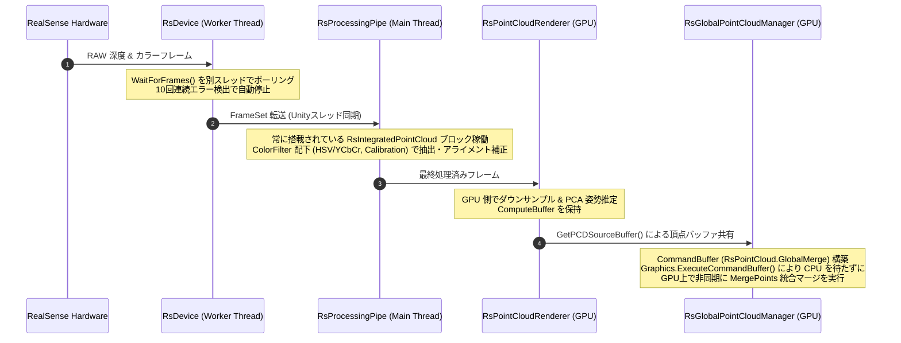

# RealTimeOcclusion 点群ストリーミング・統合パイプライン設計思想

本ドキュメントは、Intel RealSense 等のセンサーから取得したリアルタイム点群（Point Cloud）を CPU/GPU で効率よくストリーミング・フィルタリングし、複数の点群を非同期でマージする「点群ストリーミング・統合パイプライン」の設計思想およびモジュール仕様を記載しています。

視覚オクルージョンのレンダリングパスについては、[OCCLUSION_RENDERING.md](./OCCLUSION_RENDERING.md) を参照してください。

---

## 🔗 統合プロジェクトポータル

本システムは、プロジェクトのメインポータルである **[RealTimeOcclusion システム統合 Wiki (WIKI.md)](./WIKI.md)** の一部です。

---

## 📑 目次
1. [システム概要とデータフロー](#1-システム概要とデータフロー)
2. [主要フォルダ・ファイル構造](#2-主要フォルダ・ファイル構造)
3. [RealSense ストリーミングパイプラインと ColorFilter 事前処理](#3-realsense-ストリーミングパイプラインと-colorfilter-事前処理)
4. [非同期点群マージ＆データパッシング](#4-非同期点群マージデータパッシング)

---

## 1. システム概要とデータフロー

本パイプラインは、実機入力（RealSense）やデバッグシステムからフレームをキャプチャし、CPU負荷を最小限に抑えながら GPU 上でノイズ除去・アライメント補正・統合マージを行う直列・並列データフローです。

```text
[RealSense カメラ / 再生ファイル]
        │ 
        │ (非同期スレッドフレームキャプチャ: Worker Thread)
        ▼
   [RsDevice]
        │ 
        │ (常に搭載された RsIntegratedPointCloud フィルタパイプライン / ColorFilter)
        │ ├─ RsColorBasedDepthCulling (HSV/YCbCr 色閾値カリング)
        │ ├─ RsDepthToColorCalibration (幾何アライメント補正)
        │ └─ RsUnityMainThreadDispatcher (非同期ディスパッチ転送)
        ▼
[RsProcessingPipe] ──> (GPU Direct Mode: RsPointCloudInitializer)
        │
        ▼ (ゼロコピー GPU 転送 / ComputeBuffer 共有)
[RsPointCloudRenderer] 
        │
        │ (GetPCDSourceBuffer() による個別頂点バッファ共有)
        ▼
[RsGlobalPointCloudManager] 
        │ 
        │ (★ CommandBuffer "RsPointCloud.GlobalMerge" 構築)
        │ (★ Graphics.ExecuteCommandBuffer により GPU 上で非同期に MergePoints 実行)
        ▼ 
[_globalBuffer へのマージ完了 (以降の描画パイプラインへ)]
```

### データフロー詳細 (Sequence Diagram)



---

## 2. 主要フォルダ・ファイル構造

### 1.1 RealSense デバイス制御・統合パイプライン (`RealSense`)

センサーからのデータ取得、事前フィルタリング、および頂点バッファへの変換を行います。

* [ ] 基盤・デバイス管理 (`Device`)
* [ ] プロセッシングブロック (`ProcessingBlocks`)
* [ ] 点群マネージャ (`PointCloud`)

<details>
<summary>基盤・デバイス管理</summary>

デバイスとの通信やスレッド管理を行います。

* [RsConfiguration.cs](./Assets/Scripts/RealSense/RsConfiguration.cs) / [RsDeviceInspector.cs](./Assets/Scripts/RealSense/RsDeviceInspector.cs) / [RsProcessingPipe.cs](./Assets/Scripts/RealSense/RsProcessingPipe.cs) など基盤クラス
* [RsDevice.cs](./Assets/Scripts/RealSense/Device/RsDevice.cs) / [RsDeviceController.cs](./Assets/Scripts/RealSense/Device/RsDeviceController.cs) — 実際のデバイスポーリングとエラー制御

</details>

<details>
<summary>プロセッシングブロック (ProcessingBlocks)</summary>

RealSense のフレームに対して適用する各種フィルタ群です。

* 各種標準フィルタ群 (`RsAlign.cs`, `RsSpatialFilter.cs` 等)
* **ColorFilter (オクルージョン特化事前処理)**
  * [RsIntegratedPointCloud.cs](./Assets/Scripts/RealSense/ProcessingBlocks/ColorFilter/RsIntegratedPointCloud.cs) — GPU Direct 統合処理ブロック
  * [RsColorBasedDepthCulling.cs](./Assets/Scripts/RealSense/ProcessingBlocks/ColorFilter/RsColorBasedDepthCulling.cs) — HSV/YCbCr 深度カリング
  * [RsDepthToColorCalibration.cs](./Assets/Scripts/RealSense/ProcessingBlocks/ColorFilter/RsDepthToColorCalibration.cs) — 幾何アライメント補正

</details>

<details>
<summary>点群マネージャ (PointCloud)</summary>

GPU上で点群を管理・マージするためのシステムです。

* [RsPointCloudRenderer.cs](./Assets/Scripts/RealSense/PointCloud/RsPointCloudRenderer.cs) — 点群の初期化・ライフサイクル制御
* [RsPointCloudInitializer.cs](./Assets/Scripts/RealSense/PointCloud/RsPointCloudInitializer.cs) — 実機/統合点群の初期化切り替え
* **RsGlobalPointCloudManager (ゼロコピー・非同期マージ)**
  * [RsGlobalPointCloudManager.cs](./Assets/Scripts/RealSense/PointCloud/RsGlobalPointCloudManager.cs)
  * [RsGlobalPointCloudManager.Merge.cs](./Assets/Scripts/RealSense/PointCloud/RsGlobalPointCloudManager.Merge.cs) — GPU 非同期マージ実装
  * [RsGlobalPointCloudManager.PCA.cs](./Assets/Scripts/RealSense/PointCloud/RsGlobalPointCloudManager.PCA.cs) — PCA 中心姿勢推定
* その他フィルタ・変換制御クラス (`RsTransformController.cs`, `RsPointCloudCompute.cs` 等)

</details>

---

## 3. RealSense ストリーミングパイプラインと ColorFilter 事前処理

オクルージョン計算の前段階として、センサーデータの取得からノイズフィルタリング、アライメント補正、特定領域の抽出までを CPU/GPU 連携で実行するパイプライン設計です。

### A. デバイスポーリングとエラーハンドリング (`RsDevice.cs`)
RealSense からのフレームキャプチャは、パフォーマンス要求に応じて 2つの処理モードを選択可能です。
*   **マルチスレッド・モード (`Multithread`)**:
    描画フレームレートの低下に影響されず、RealSense SDK の `WaitForFrames()` を別スレッド（Worker Thread）でループ処理します。メインスレッド側の負荷を削減し、データの取りこぼしを防ぎます。
*   **ユニティスレッド・モード (`UnityThread`)**:
    `Update()` 内で同期的かつスレッド安全に `PollForFrames()` を呼び出します。
*   **安全停止閾値 (エラーリカバリ)**:
    バス帯域不足やカメラ切断が発生した場合に備え、連続エラー検出回数が 10回 (`maxConsecutiveErrors = 10`) に達した段階で、デッドロックを防ぐためスレッドパイプラインを自動的に安全停止します。

### B. ネイティブメモリ管理の徹底 (`RsProcessingPipe.cs`)
RealSense SDK が提供する `Frame` 構造体は、C++ ネイティブメモリへのポインタをラップした C# 表現です。
GC で回収されないため、フレームワーク側で明示的に解放しないと一瞬でメインメモリおよび GPU メモリがリークします。
*   **対策**: `RsProcessingPipe` では、フィルタ処理を直列に適用する際、一時バッファを含め `using` ブロックおよび `try-finally` による確実な `frame.Dispose()` を徹底しています。

### C. パイプラインに常時搭載される `RsIntegratedPointCloud` の役割
[RsIntegratedPointCloud.cs](./Assets/Scripts/RealSense/ProcessingBlocks/ColorFilter/RsIntegratedPointCloud.cs) は、`RsProcessingPipe` のフィルタパイプライン内に**常に搭載されている**極めて重要なコアブロック（カスタム `RsProcessingBlock`）です。

1.  **GPU Direct Mode への自動移行**:
    `RsPointCloudInitializer.cs` は初期化時に、パイプラインのアクティブなフィルタ群から `RsIntegratedPointCloud` を自動検出します。検出されると `UseIntegratedPointCloud` フラグが有効になり、頂点バッファ処理が GPU 上で完結する「GPU Direct Mode」へと動的にシフトします。
2.  **リアルタイム姿勢行列の適用**:
    カメラのキャリブレーション姿勢変換行列（`Matrix4x4`）を `RsIntegratedPointCloud.UpdateTransformMatrix(matrix)` 経由で毎フレーム更新し、`RsIntegratedPointCloudProcessor` を介して直接 GPU 側の座標変換に適用します。
3.  **マルチスレッド・ディスパッチ転送**:
    非同期スレッドからキャプチャした RAW 画像バッファは、アンマネージド領域から C# キャッシュバッファへと高速に `Marshal.Copy` されます。その後、メインスレッド用のディスパッチャである `RsUnityMainThreadDispatcher` を介して `ProcessPendingFrame` が駆動され、GPU（Compute Shader および `Texture2D.LoadRawTextureData`）へ非同期転送・並列処理されます。

### D. `ProcessingBlocks/ColorFilter/` 配下の役割と設計仕様
手の形状抽出や背景カットといった特定の切り出し（カリング）や、カラー-深度センサー間の位置補正を高速に行うための事前処理フィルタ群です。

*   **`RsColorBasedDepthCulling.cs`**:
    特定の肌色やマーカー色など、指定された HSV または YCbCr 色空間の閾値に基づいて、範囲外ピクセルに対応する深度値を `0`（無効）に書き換える post-processing filter です。手の点群のみを抽出し、背景や腕の点群をパイプラインの最上流で高速カリングします。
*   **`RsGpuCullingProcessor.cs`**:
    上記のカリング判定を GPU 上で並列実行するためのディスパッチャーです。テクスチャのロード、並列スレッドの設定、Compute Shader カーネルの Dispatch を統制します。
*   **`RsDepthToColorCalibration.cs`**:
    深度カメラとカラーカメラ間のピクセルアライメント（幾何学的アライメント補正）を行います。`VideoStreamProfile` から取得した深度カメラの内参（Intrinsics）、カラーカメラの内参、および両カメラ間の外参（Extrinsics - 回転・平行移動行列）を用いて、深度座標系からカラー座標系への精密な 3D 逆射影・座標変換・2D 再投影（`MapDepthToColor`）の数理演算をリアルタイムで実行します。
*   **`RsHsvConverter.cs` / `RsYCbCrConverter.cs`**:
    RGB カラーをそれぞれ HSV（Hue, Saturation, Value）および YCbCr（Luminance, Chrominance Blue, Chrominance Red、ITU-R BT.601 規格）へ高速変換する数学ユーティリティです。
*   **`RsCullingDebugExporter.cs`**:
    閾値チューニングを支援する強力なデバッグエクスポート機能です。`SaveDebugFrames` が有効になると、現在のフレームから「元のカラー画像」「各色成分ごとの階調可視化画像」「フィルタ適用後の切り抜き画像」など計5枚のビットマップ（BMP）画像をローカルディレクトリ（`Assets/RealSenseDebug/`）へ即時に非同期で保存し、調整用の視覚的フィードバックを提供します。

---

## 4. 非同期点群マージ＆データパッシング

本システムは、CPU の処理を一切ブロッキングしない「GPU 完結型の非同期マージ＆データパッシングフロー」を確立しています。

```
[各 RsPointCloudRenderer] (個別頂点 ComputeBuffer 保持)
           │
           │ (GetPCDSourceBuffer() による GPU メモリ参照)
           ▼
[RsGlobalPointCloudManager] ─── (最大 300万点の _globalBuffer を確保)
   │
   ├─ 1. CommandBuffer "RsPointCloud.GlobalMerge" を新規構築
   ├─ 2. mergeComputeShader の MergePoints カーネルパラメータを設定
   ├─ 3. cmd.DispatchCompute により GPU コピー命令をスタック
   ├─ 4. Graphics.ExecuteCommandBuffer(cmd) で GPU キューに即時投入 (非同期・CPU待機ゼロ)
   └─ 5. cmd.Release() でメモリを確実に解放
           │
           ▼ (GPU上で非同期に globalBuffer へのマージ完了)
[PCDRenderPass.RecordRenderGraph]
   │
   ├─ 1. URP RenderGraph のフレームパス登録フェーズ
   ├─ 2. GlobalBufferMode が有効な場合、GlobalManager から globalBuffer 参照を取得
   ├─ 3. 最新の点の総数 CurrentTotalCount を取得
   ├─ 4. _bufferManager.SetExternalBuffer(globalBuffer, globalCount) を実行 (ノンブロッキング)
   └─ 5. RenderGraph 内の ComputePass にて GPU 実行バリアとともに引き渡され、多段計算へ
```

### A. GPU ゼロコピー・非同期マージ (`RsGlobalPointCloudManager.Merge.cs`)
複数または単一の RealSense カメラの頂点バッファを、CPU のメインメモリにコピーバックすることなく、GPU メモリ上で直接、単一のグローバル頂点バッファ（`_globalBuffer`、最大 300万点）へ結合・マージします。

1.  **個別頂点バッファの共有**:
    各カメラに対応する `RsPointCloudRenderer` から `GetPCDSourceBuffer()` および `GetPCDSourceCount()` を介して個別の `ComputeBuffer` を直接参照します。
2.  **CommandBuffer を用いた非同期ディスパッチ (`Graphics.ExecuteCommandBuffer`)**:
    マージ処理（Compute Shader `mergeComputeShader` の `MergePoints` カーネル実行）は、CPU をブロッキングする同期的呼び出しを行わず、`CommandBuffer` (名称 `"RsPointCloud.GlobalMerge"`) を構築してそこに処理をコマンドとして登録し、`Graphics.ExecuteCommandBuffer(cmd)` を介して即座に GPU 側のコマンドキューに流し込みます。
    これによって CPU のメインスレッドは GPU 側のコピー完了を 1ミリ秒たりとも待つ（ブロッキングする）必要がなく、完全に非同期で GPU 上で並列にマージ処理がスケジュールされます。
3.  **安全なバッファ解放**:
    `Graphics.ExecuteCommandBuffer` 実行後、即座に `cmd.Release()` を呼び出すことで、描画スレッドでの CommandBuffer インスタンスの累積を防ぎ、GC の発生を防止します。

### B. URP RenderGraph へのノンブロッキング・データパッシング
毎フレームの `PCDRenderPass.RecordRenderGraph` 実行時に、描画パイプラインへバッファを安全かつノンブロッキングで受け渡します。

1.  **外部バッファの動的セット**:
    `PCDRendererFeature` の `IsGlobalBufferMode` が有効な場合、`RsGlobalPointCloudManager.Instance` からグローバル統合バッファ参照（`GetGlobalBuffer()`）と現在の有効な頂点総数（`CurrentTotalCount`）を直接取得します。
2.  **ノンブロッキング・バッファパッシング**:
    取得したバッファと頂点数を `_bufferManager.SetExternalBuffer(globalBuffer, globalCount)` に直接引き渡します。
    CPU 側のスレッド待機や同期ズレを完全に排除し、GPU 内の実行順序（マージ処理から描画パスへの依存関係）のみで整合性を担保するため、極めて低いオーバーヘッドで URP の `PCDRenderPass`（ComputePass）へとバッファが非同期でパッシングされます。

---

