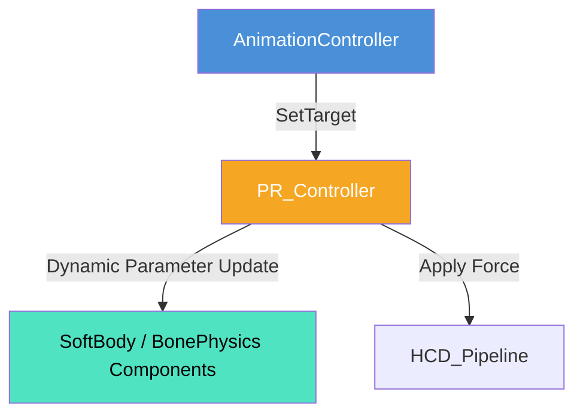

# 物理応答パラメータ制御 (PhysicalResponse) 仕様書

> 📂 **親ノード**: [Wiki.md](./Wiki.md) | 🏷️ **種類**: 🏗️ システム設計書  
> [RealTimeOcclusion Wiki (ポータル)](./Wiki.md) に戻る  
> 📎 **関連ドキュメント**: [PhysicalResponseLiftController.md](./PhysicalResponseLiftController.md)

本ドキュメントでは、Midair Haptics Unity Core における各種物理応答（Physics Response）コンポーネントのパラメータを、実行時に一括調整・管理する `PR_Controller` スクリプトについて解説します。

---

## 1. 概要

`PR_Controller` は、インスペクターやスクリプト経由で対象オブジェクト（Fox 等）の物理パラメータ（Stiffness, Damping, Force 等）を一括操作する制御コンポーネントです。

### 主な特徴

* **リアルタイム一括調整**: 実行時にインスペクターからオブジェクト全体の物理硬さ・減衰力パラメータを即座に変更・チューニング可能です。
* **外部 API 制御**: 触覚刺激イベントや実験パラメータ変更のタイミングで、プログラムから直接反発力や柔らかさを制御できます。
* **物理階層の自動検出**: ターゲットオブジェクトが切り替えられた際、対応する物理階層（`FoxBonePhysics` や `FoxSoftBody`）を自動的に検出してリンクバインドします。

---

## 2. 設計思想・アーキテクチャ

### 2.1 生成ファイル・関連構造

```text
Assets/Features/Animation/Scripts/
├── PR_Controller.cs                   # 物理パラメータ動的切り替え統括
├── PR_HcdBoneApplier.cs               # 接触ボーンへの力加算アプライヤー
└── PR_LiftController.cs               # 手の点群による持ち上げ追従制御
```

### 2.2 クラス相関図



---

## 3. セットアップ・使用方法

### 3.1 クイックスタート手順

#### Step 1: コンポーネントのアタッチ

管理オブジェクト（`AnimationController` と同一オブジェクト等）に `PR_Controller` をアタッチします。

#### Step 2: インスペクター参照の設定

`AnimationController` の `PRController` フィールドに本コンポーネントの参照をセットします。

#### Step 3: Play モードでのパラメータ調整

Play モード中、`PR_Controller` の Inspector UI から Stiffness や Damping をリアルタイム変更し、物理挙動をテストします。

---

## 4. 仕様・パラメータ詳細

### 4.1 パラメータ・連携仕様

* **主要パラメータ**:
  * `stiffnessScale`: 全体剛性（硬さ）の倍率。
  * `dampingScale`: 全体減衰率（揺れの収まりやすさ）の倍率。
  * `forceMultiplier`: 外力に対する反発力スケール。

### 4.2 意図的な連携除外仕様

設計上の理由から、以下の静的設定は一括変更対象から除外されています。
1. **ボーンごとの個別設定 (`BonePhysicsInfo`)**: 個別ボーンのスケール設定を維持するため。
2. **アセットおよび Renderer への静的参照**: 初期アサイン用データのため。
3. **`PhysicsSolver` への登録処理**: `InteractionOrchestrator` 側でライフサイクルを管理するため。

---

## 5. デバッグ・留意事項

### 5.1 留意事項

* シミュレーションステップ数や `MoveToStartPosApplier` のノイズフォース等の微調整は、`PR_Controller` の詳細パラメータ群から制御可能です。

### 5.2 統制ログシステム (AppLogManager) との同期

動作ログには `[PhysicalResponse]` プレフィックスが付与されます。詳細については [Logging.md](./Logging.md) を参照してください。
