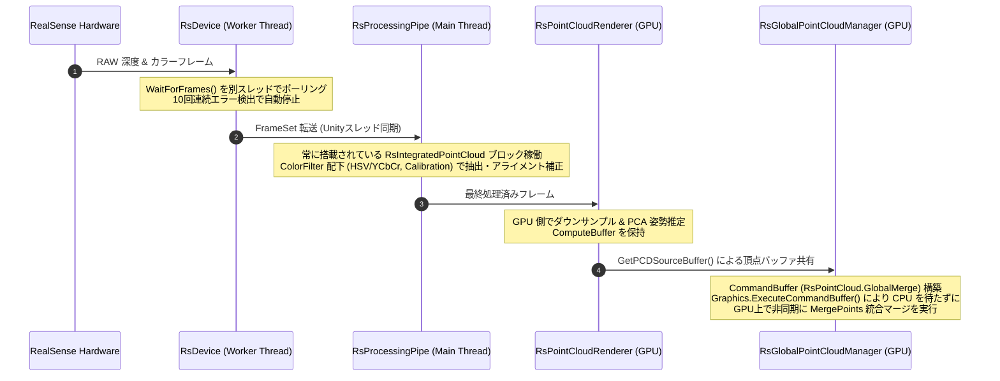

# 点群ストリーミング・統合パイプライン 仕様書

> 📂 **親ノード**: [Wiki.md](./Wiki.md) | 🏷️ **種類**: 🏗️ システム設計書  
> [RealTimeOcclusion Wiki (ポータル)](./Wiki.md) に戻る

本ドキュメントは、Intel RealSense 等のセンサーから取得したリアルタイム点群（Point Cloud）を CPU/GPU で効率よくストリーミング・フィルタリングし、複数の点群を非同期でマージする「点群ストリーミング・統合パイプライン」の設計思想およびモジュール仕様を記載しています。

視覚オクルージョンのレンダリングパスについては [OcclusionRendering.md](./OcclusionRendering.md) を参照してください。

---

## 1. 概要

本パイプラインは、実機入力（RealSense）やデバッグシステムからフレームをキャプチャし、CPU 負荷を最小限に抑えながら GPU 上でノイズ除去・アライメント補正・統合マージを行う直列・並列データフローです。

---

## 2. 設計思想・アーキテクチャ

### 2.1 全体アーキテクチャとデータフロー

```text
[RealSense カメラ / 再生ファイル]
        │ 
        │ (非同期スレッドフレームキャプチャ: Worker Thread)
        ▼
   [RsDevice]
        │ 
        │ (常に搭載された RsIntegratedPointCloud フィルタパイプライン / ColorFilter)
        │ ├─ RsColorBasedDepthCulling (HSV/YCbCr 色閾値カリング)
        │ ├─ RsDepthToColorCalibration (幾何アライメント補正)
        │ └─ RsUnityMainThreadDispatcher (非同期ディスパッチ転送)
        ▼
[RsProcessingPipe] ──> (GPU Direct Mode: RsPointCloudInitializer)
        │
        ▼ (ゼロコピー GPU 転送 / ComputeBuffer 共有)
[RsPointCloudRenderer] 
        │
        │ (GetPCDSourceBuffer() による個別頂点バッファ共有)
        ▼
[RsGlobalPointCloudManager] 
        │ 
        │ (★ CommandBuffer "RsPointCloud.GlobalMerge" 構築)
        │ (★ Graphics.ExecuteCommandBuffer により GPU 上で非同期に MergePoints 実行)
        ▼ 
[_globalBuffer へのマージ完了 (以降の描画パイプラインへ)]
```

### 2.2 データフローシーケンス



---

## 3. セットアップ・使用方法

1. シーン内に `RsDevice` および `RsGlobalPointCloudManager` を配置します。
2. カメラアライメント・JSON 設定のロードについては [Initialization.md](./Initialization.md) を参照してください。
3. デバッグ用に PLY/TXT ファイルを可視化したい場合は [DebugPCV.md](./DebugPCV.md) を使用します。

---

## 4. 仕様・パラメータ詳細

### 4.1 RealSense ストリーミングパイプラインと ColorFilter 事前処理

#### A. デバイスポーリングとエラーハンドリング (`RsDevice.cs`)
* `Multithread` モード: `WaitForFrames()` を別スレッドで非同期ループ処理。
* `UnityThread` モード: `Update()` 内でスレッド安全に `PollForFrames()` を呼び出し。
* エラーリカバリ: 連続 10 回のエラー検出 (`maxConsecutiveErrors = 10`) で安全自動停止。

#### B. ネイティブメモリ管理 (`RsProcessingPipe.cs`)
`Frame` の Dispose を `using` / `try-finally` で徹底しメモリリークを回避。

#### C. `RsIntegratedPointCloud` (GPU Direct Mode)
* `RsPointCloudInitializer.cs` で自動検出され「GPU Direct Mode」へシフト。
* キャリブレーション姿勢変換行列 (`Matrix4x4`) を毎フレーム更新適用。
* `YUYV` (16bit) カラーフォーマットサポートにより、USB および PCIe PCIe 転送帯域幅を 33% 削減。

#### D. `ColorFilter` 事前処理モジュール
* `RsColorBasedDepthCulling.cs`: HSV / YCbCr 色空間閾値による背景・腕の点群カリング。
* `RsDepthToColorCalibration.cs`: カメラ内参・外参を用いた 3D 逆射影・再投影位置補正。
* `RsCullingDebugExporter.cs`: デバッグ用画像 (BMP) の非同期ローカル保存。

---

## 5. デバッグ・留意事項

### 5.1 非同期点群マージ (`RsGlobalPointCloudManager.Merge.cs`)
* `_globalBuffer` (最大 300 万点) へのマージは CommandBuffer (`"RsPointCloud.GlobalMerge"`) を構築し `Graphics.ExecuteCommandBuffer` で GPU キューに投入されるため、CPU のブロッキングは発生しません。
* マージ完了後、URP RenderGraph の `PCDRenderPass.RecordRenderGraph` にて `SetExternalBuffer` が呼び出され、ノンブロッキングでオクルージョン計算パスへパッシングされます。
