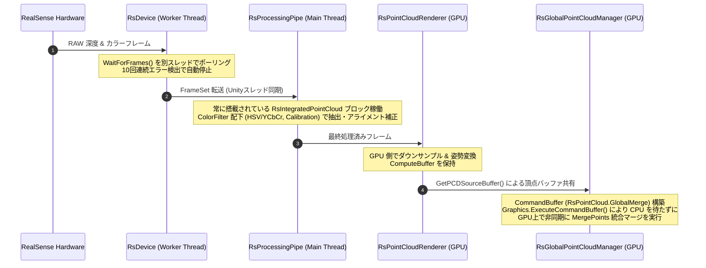

# 点群ストリーミング・統合パイプライン 仕様書

> 📂 **親ノード**: [Wiki.md](./Wiki.md) | 🏷️ **種類**: 🏗️ システム設計書  
> [RealTimeOcclusion Wiki (ポータル)](./Wiki.md) に戻る

本ドキュメントは、Intel RealSense 等のセンサーから取得したリアルタイム点群（Point Cloud）を CPU/GPU で効率よくストリーミング・フィルタリングし、複数の点群を非同期でマージする「点群ストリーミング・統合パイプライン」の設計思想、モジュール構成、データフロー、パラメータ詳細およびデバッグ手順について解説します。

視覚オクルージョンの描画パスについては [OcclusionRendering.md](./OcclusionRendering.md) を参照してください。

---

## 1. 概要

本パイプラインは、実機センサー（RealSense）やデバッグシステムからフレームをリアルタイムに取得し、CPU メインスレッドの負荷を極小化しながら GPU 上でノイズ除去・アライメント補正・複数センサ統合マージを一貫して行うデータストリーミングアーキテクチャです。

### 主な特徴

* **非同期スレッドフレームキャプチャ**: `RsDevice` の Worker Thread において `WaitForFrames()` を非同期ポーリングし、10回連続エラー検出時の自動リカバリ機構を搭載しています。
* **ColorFilter によるインライン事前処理**: `RsColorBasedDepthCulling` (HSV/YCbCr 色閾値カリング) および `RsDepthToColorCalibration` (キャリブレーション姿勢アライメント補正) により、腕や背景の不要点群を早期除去します。
* **GPU Direct モード & 帯域削減**: `RsProcessingPipe` および `RsPointCloudInitializer` によるゼロコピー GPU 転送と、`YUYV` 16bit カラーフォーマットによる転送帯域幅 33% 削減を実現しています。
* **非同期 CommandBuffer マージ**: `RsGlobalPointCloudManager` が `Graphics.ExecuteCommandBuffer` 経由で `"RsPointCloud.GlobalMerge"` を発行し、CPU をブロックせずに複数点群バッファ (`_globalBuffer`) を GPU 上で非同期統合します。

---

## 2. 設計思想・アーキテクチャ

### 2.1 生成ファイル・ディレクトリ構成

```text
Assets/Features/PointCloud/
├── Materials/                         # 点群表示用マテリアル
├── Prefabs/                           # RealSense・点群パイプラインプレハブ
├── Shaders/                           # 点群描画・マージ用 Shader / Compute Shader
└── Scripts/
    ├── Core/
    │   ├── RsDevice.cs                # RealSense デバイスポーリング & フレーム取得
    │   ├── RsProcessingPipe.cs        # フレーム処理パイプライン & メモリ管理
    │   ├── RsPointCloudRenderer.cs    # 個別点群の GPU レンダリング & バッファ保持
    │   └── RsGlobalPointCloudManager.cs # 全点群バッファの GPU 非同期マージ統括
    └── Filter/
        ├── RsColorBasedDepthCulling.cs # HSV / YCbCr 色空間背景カリング
        └── RsDepthToColorCalibration.cs # カメラ内外参再投影補正
```

### 2.2 クラス相関図



### 2.3 処理・データ転送フロー

```text
[RealSense カメラ / 再生ファイル]
        │ 
        │ (非同期 Worker Thread フレームキャプチャ)
        ▼
   [RsDevice]
        │ 
        │ (RsIntegratedPointCloud フィルタパイプライン / ColorFilter)
        │ ├─ RsColorBasedDepthCulling (HSV/YCbCr 色閾値カリング)
        │ ├─ RsDepthToColorCalibration (幾何アライメント補正)
        │ └─ RsUnityMainThreadDispatcher (スレッド安全転送)
        ▼
[RsProcessingPipe] ──> (GPU Direct Mode: RsPointCloudInitializer)
        │
        ▼ (ゼロコピー GPU 転送 / ComputeBuffer 共有)
[RsPointCloudRenderer] 
        │
        │ (GetPCDSourceBuffer() による個別頂点バッファ共有)
        ▼
[RsGlobalPointCloudManager] 
        │ 
        │ (★ CommandBuffer "RsPointCloud.GlobalMerge" 構築)
        │ (★ Graphics.ExecuteCommandBuffer により GPU 上で非同期マージ)
        ▼ 
[_globalBuffer へのマージ完了 (以降の RenderGraph オクルージョンパスへ)]
```

---

## 3. セットアップ・使用方法

### 3.1 クイックスタート手順

#### Step 1: シーンオブジェクト配置

1. シーン内に `RsDevice` コンポーネントを持つ GameObject を配置します。
2. グローバル統合管理スクリプト `RsGlobalPointCloudManager` を配置します。

#### Step 2: インスペクターパラメータ設定

| 設定項目 | 型 | 既定値 | 説明 |
|---|---|---|---|
| `mode` | `WorkerMode` | `Multithread` | フレームキャプチャの実行モード (`Multithread` / `UnityThread`) |
| `maxConsecutiveErrors` | `int` | `10` | 連続エラー検出時の自動停止閾値 |
| `maxPointCount` | `int` | `3000000` | `RsGlobalPointCloudManager` の最大統合点群数上限 |
| `enableColorCulling` | `bool` | `true` | HSV/YCbCr 色空間による不要領域カリングの有効化 |

#### Step 3: 実行と動作確認

1. Play モードに入ると、`RsDevice` が自動的に RealSense ハードウェアを検出・ストリーミングを開始します。
2. マージされた点群データは `RsGlobalPointCloudManager._globalBuffer` に格納され、URP レンダラーパスへ引き渡されます。

---

## 4. 仕様・パラメータ詳細

### 4.1 RealSense ストリーミングパイプライン仕様

#### A. デバイスポーリングとエラーハンドリング (`RsDevice.cs`)
* `Multithread` モード: `WaitForFrames()` を別スレッドで非同期ループ処理し、メインスレッドのフレームタイムを圧迫しません。
* `UnityThread` モード: `Update()` 内でスレッド安全に `PollForFrames()` を呼び出します。
* **エラーリカバリ機能**: 連続 10 回のエラー検出 (`maxConsecutiveErrors = 10`) で安全にストリーミングを自動停止します。

#### B. ネイティブメモリ管理 (`RsProcessingPipe.cs`)
RealSense SDK のネイティブ `Frame` インスタンスは、`using` ステートメントおよび `try-finally` 節で毎フレーム確実に Dispose 処理され、アンマネージドメモリリークを抑止します。

#### C. `RsIntegratedPointCloud` (GPU Direct Mode)
* `RsPointCloudInitializer.cs` で初期化時に自動検出され「GPU Direct Mode」へ移行します。
* キャリブレーション姿勢変換行列 (`Matrix4x4`) を毎フレーム Compute Shader へバインド更新します。
* `YUYV` (16bit) カラーフォーマットのサポートにより、USB / PCIe 転送帯域幅を 33% 削減します。

#### D. `ColorFilter` 事前処理モジュール
* `RsColorBasedDepthCulling.cs`: HSV / YCbCr 色空間閾値判定により、人物の腕や背景の不要点群を早期カリングします。
* `RsDepthToColorCalibration.cs`: カメラ内部・外部パラメータを用いて 3D 逆射影・再投影位置補正を実行します。

---

## 5. デバッグ・留意事項

### 5.1 非同期点群マージ (`RsGlobalPointCloudManager`)

* `_globalBuffer` および `_occlusionBuffer` (最大 300 万点) への統合マージは、CommandBuffer (`"RsPointCloud.GlobalMerge"`, `"RsPointCloud.OcclusionMerge"`) を構築して `Graphics.ExecuteCommandBuffer` により GPU キューに直接投入されます。そのため CPU 側の同期待ちが発生しません。
* **自動レンダラー探索機能**: `GetChildRenderers()` は `renderers` リストや直下階層にレンダラーが見つからない場合、シーン全体の全 `RsPointCloudRenderer` / `RsDummyPointCloudRenderer` を自動検出・統合します。
* **PCD パイプライン自動連携**: マージ完了後、`PCDContextBuilder` が `RsGlobalPointCloudManager.Instance` の存在を安全に検出し、オクルージョン計算パスへ自動的に `GetOcclusionGlobalBuffer()` を `SetExternalBuffer` 経由で供給します。

### 5.2 統制ログシステム (AppLogManager) との同期

本モジュールの動作ログには、プレフィックス `[PointCloudPipeline]` が付加され、`AppLogManager` 上で制御されます。

* `[PointCloudPipeline] RsDevice: RealSense ストリーミングを開始しました。`
* `[PointCloudPipeline] RsGlobalPointCloudManager: _globalBuffer (点数: ...) への非同期マージ完了`

詳細な共通ログルールについては [Logging.md](./Logging.md) を参照してください。
