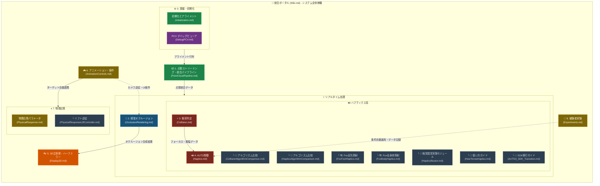

# RealTimeOcclusion システム統合 Wiki (ポータル)

本プロジェクトは、Intel RealSense 等のセンサーから取得したリアルタイム点群（Point Cloud）を基盤とし、**「視覚的な遮蔽処理（オクルージョン）」**と**「物理的な接触判定・触覚提示（ハプティクス）」**という 2つのサブシステムを軸に構成されています。

本ドキュメントは、プロジェクト全体の構造を俯瞰し、各サブシステムの詳細ドキュメントへナビゲーションする統合ポータルです。

---

## 1. システム全体図

---

## 2. ドキュメントナビゲーション

### ドキュメント種類の凡例
| アイコン | 種類 | 説明 |
|:---:|:---|:---|
| 🏗️ | システム設計書 | コアアーキテクチャ・アルゴリズム詳細 |
| 🔬 | アルゴリズム比較 | 旧実装 vs 新実装の深堀り資料 |
| 📖 | How-To / リファレンス | 使い方ガイド・操作一覧 |
| 🔧 | SDK移行ガイド | SDK バージョン切り替え手順 |
| 🧪 | 実験フレームワーク | 心理物理実験パラダイム・データ収集 |

### 全ドキュメント一覧

| # | 種類 | ドキュメント | 概要 |
|:---|:---:|:---|:---|
| **0** | 🏗️ | [Initialization.md](./Initialization.md) | 複数カメラのアライメント・キャリブレーション |
| | 🏗️ | [DebugPCV.md](./DebugPCV.md) | 点群データのリアルタイムプレビュー・デバッグビューア |
| **1** | 🏗️ | [PointCloudPipeline.md](./PointCloudPipeline.md) | RealSense 点群取得 → GPU 非同期マージ |
| | 🏗️ | └── [DummyPointCloud.md](./DummyPointCloud.md) | Unity 3Dモデルからのダミー点群生成・法線ノイズ・外れ値付与 |
| **2** | 🏗️ | [OcclusionRendering.md](./OcclusionRendering.md) | URP RenderGraph 上の点群オクルージョン処理 |
| **3** | 🏗️ | [Collision.md](./Collision.md) | GPU 衝突判定・クラスタリング (HCD Pipeline) |
| | 🔬 | └── [CollisionAlgorithmComparison.md](./CollisionAlgorithmComparison.md) | Native C++ vs GPU の数理モデル比較 |
| **4** | 🏗️ | [Haptics.md](./Haptics.md) | AUTD3 超音波ハプティクス出力制御 |
| | 🔬 | └── [HapticsAlgorithmComparison.md](./HapticsAlgorithmComparison.md) | Native C++ vs Pure C# のアルゴリズム比較 |
| | 🏗️ | └── [FoxFootHaptics.md](./FoxFootHaptics.md) | キツネ足先・尻尾ハプティクス仕様 + カスタム拡張 |
| | 🏗️ | └── [FoxBodyHaptics.md](./FoxBodyHaptics.md) | キツネ全身体（頭・耳・四肢・尻尾）ハプティクス仕様 |
| | 🔬 | └── [HapticsIllusion.md](./HapticsIllusion.md) | 独立多重単焦点による触覚錯覚・保持感検証モジュール |
| | 📖 | └── [HowToUseHaptics.md](./HowToUseHaptics.md) | ハプティクスの初回セットアップ〜使い方ガイド |
| | 🔧 | └── [AUTD3_SDK_Transition.md](./AUTD3_SDK_Transition.md) | AUTD3 SDK 新旧仕様比較と切り替え方法 |
| **5** | 🏗️ | [Display3D.md](./Display3D.md) | SRDisplay 視線追跡 + ハーフミラー鏡像制御 |
| **6** | 📖 | [AnimationControls.md](./AnimationControls.md) | キーボード操作対応表・デバッグ用ショートカット |
| **7** | 🏗️ | [PhysicalResponse.md](./PhysicalResponse.md) | Softbody/BonePhysics パラメータ一括制御 |
| | 🏗️ | └── [PhysicalResponseLiftController.md](./PhysicalResponseLiftController.md) | 手の点群でキャラクターをリフト追従 |
| **8** | 🧪 | [Experiments.md](./Experiments.md) | 被験者実験フレームワーク (2AFC / ABX / 調整法 / データ出力) |
| **9** | 🏗️ | [Logging.md](./Logging.md) | 統制ログ管理システム (AppLogManager & AppLogger) |

---

## 3. 各サブシステム概要

### ⚙️ 0. 基盤・初期化
複数 RealSense カメラの位置合わせ（キャリブレーション）と、JSON ベースのアライメント設定の保存・復元を管理します。PCV デバッグビューアにより、点群データの即座のプレビューと GPU/CPU 描画ソースの切り替えが可能です。また、統制ログ管理システム (`AppLogManager` & `AppLogger`) により全モジュールのログトグルを一元制御します。

📎 詳細: [Initialization.md](./Initialization.md) / [DebugPCV.md](./DebugPCV.md) / [Logging.md](./Logging.md)

---

### 📦 1. 点群ストリーミング・統合パイプライン
RealSense からの非同期データ取得、HSV/YCbCr カラーフィルタリング（肌色抽出等）、および GPU ゼロコピー CommandBuffer マージを行います。統合された点群バッファは、オクルージョンとハプティクスの両パイプラインのデータ源として機能します。また、実機カメラなし環境向けに 3D オブジェクトからのダミー点群生成および法線方向ノイズ・外れ値付与機能 (`DummyPointCloud`) も提供します。

📎 詳細: [PointCloudPipeline.md](./PointCloudPipeline.md) / [DummyPointCloud.md](./DummyPointCloud.md)

---

### 🎨 2. 視覚オクルージョン・レンダリングシステム
URP RenderGraph 上で点群をスクリーン空間に投影し、仮想オブジェクトとの前後遮蔽を計算します。多段 Compute Shader（Joint Bilateral 補間、Pull-Push 補完、モルフォロジー演算）により、エッジ保存型の滑らかな Hole Filling を実現しています。

📎 詳細: [OcclusionRendering.md](./OcclusionRendering.md)

---

### ⚡ 3. 衝突判定・クラスタリング
統合点群と仮想オブジェクトの接触を GPU で並列計算します。Voxel Grid による高速枝切り、Möller-Trumbore レイキャストによる厳密な内外判定、空間ハッシュによるクラスタリングを経て、安定したトラッキングデータを出力します（処理時間: 0.05ms）。

📎 詳細: [Collision.md](./Collision.md) | 📎 比較: [CollisionAlgorithmComparison.md](./CollisionAlgorithmComparison.md)

---

### 🔊 4. 超音波ハプティクス出力
衝突判定からの接触データを元に、GSPAT 等の音響ホログラフィを適用し AUTD3 ハードウェアを駆動します。完全な C# ネイティブ設計で旧ネイティブパッケージを置き換え、手動API（STM、GainGroup等）や触覚錯覚検証用独立多重焦点モデル（HapticsIllusion）も完備しています。

📎 詳細: [Haptics.md](./Haptics.md) | 📖 使い方: [HowToUseHaptics.md](./HowToUseHaptics.md)
📎 比較: [HapticsAlgorithmComparison.md](./HapticsAlgorithmComparison.md) | 🔧 SDK: [AUTD3_SDK_Transition.md](./AUTD3_SDK_Transition.md)
📎 Fox足照射: [FoxFootHaptics.md](./FoxFootHaptics.md) | 📎 Fox全身照射: [FoxBodyHaptics.md](./FoxBodyHaptics.md)
📎 触覚錯覚モジュール: [HapticsIllusion.md](./HapticsIllusion.md)

---

### 👓 5. 3D立体視・ハーフミラー制御
SDK標準トラッキングを完全活用し、描画空間をディスプレイ中心でX軸反転することでハーフミラー越しの正しい視差を実現します。投影行列の改変なしに鏡面世界を構築する、シンプルで堅牢なアーキテクチャです。

📎 詳細: [Display3D.md](./Display3D.md)

---

### 🎮 6. アニメーション・操作キーシステム
デモ・実験時のキーボードショートカット（撮影、オブジェクト切り替え、オクルージョン手法の Ablation 切り替え）およびキャラクターの視点追従制御を提供します。

📎 詳細: [AnimationControls.md](./AnimationControls.md)

---

### 🌀 7. 物理応答パラメータ制御
Midair Haptics の物理応答コンポーネント（Softbody, BonePhysics 等）のパラメータをインスペクターで一括調整します。キャラクターリフト機能により、手の点群でキャラクターを持ち上げるインタラクションも実現しています。

📎 詳細: [PhysicalResponse.md](./PhysicalResponse.md) | [PhysicalResponseLiftController.md](./PhysicalResponseLiftController.md)

---

### 🧪 8. 被験者実験フレームワーク
心理物理学実験（2AFC, ABX, 単一刺激法, 調整法）を統一的に管理・実行するフレームワークです。教示・練習・本試行・休憩の自動進行、キーボード / ゲームパッド応答受付、および物理パラメータ・反応時間の CSV / JSON 自動記録を提供します。

📎 詳細: [Experiments.md](./Experiments.md)

---

## 4. 全体システムの最適化思想と共有価値

本プロジェクトは、1秒間に数万〜数十万点の点群データをリアルタイムに処理するため、以下の最適化思想をすべての機能ノードで共通して貫いています。

1.  **CPU-GPU ゼロコピー転送 & 非同期 CommandBuffer マージ**:
    RealSense 等から出力されたバッファは CPU にコピーバックせず GPU 上で保持し、さらに CommandBuffer を用いて CPU を全くブロックせずに GPU のみで非同期に統合マージを完了します。URP の RenderGraph パスへもノンブロッキングで引き渡され、徹底したハイパフォーマンスを担保します。
2.  **徹底的な GC（Garbage Collection）排除**:
    毎フレームの配列確保や一時オブジェクト生成を完全に排除し、バッファリサイズ時のキャッシュ＆再利用、構造体プール等を徹底しています。
3.  **アンマネージドネイティブ参照の厳密なライフサイクル管理**:
    C++ ネイティブ参照のメモリリークを確実に防止するため、`using` や `Dispose()` による速やかな解放を徹底し、高頻度動作時でも安定したパフォーマンスを維持します。
