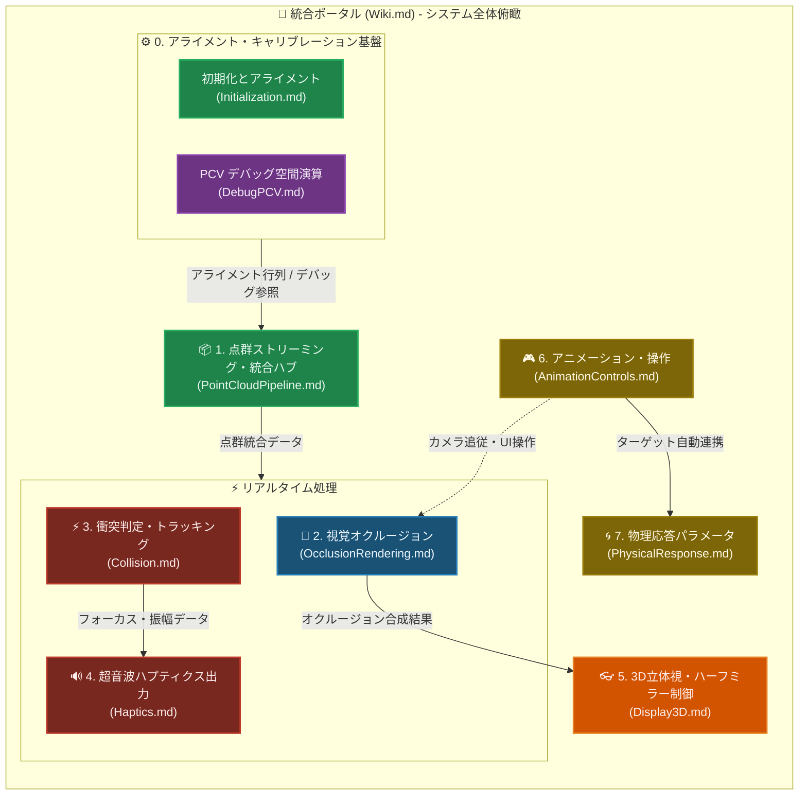

# RealTimeOcclusion システム統合 Wiki (ポータル)

本プロジェクトは、Intel RealSense 等のセンサーから取得したリアルタイム点群（Point Cloud）を基盤とし、**「視覚的な遮蔽処理（レンダリング・オクルージョン）」**と**「物理的な接触判定・触覚提示（ハプティクス）」**という 2つのサブシステムを軸に構成されています。

本ドキュメントは、プロジェクト全体の設計思想・関数仕様を一元管理する統合ポータル（ハブ）です。詳細な機能やアルゴリズムの解説は、以下の専用機能ノード（詳細ドキュメント）に分離されて構成されています。

---

## 1. プロジェクト構造とノード依存関係

各ノードは、データソースであるグローバル点群マネージャー（`RsGlobalPointCloudManager`）をデータハブとし、完全に独立したモジュールとして連携しています。

---

## 2. 各ノード（サブシステム）へのナビゲーション

それぞれの機能やアルゴリズムの詳細、関数構成、Compute Shader 仕様、最適化ポリシーは以下の詳細 Wiki をご参照ください。

### ⚙️ 0. [初期化とアライメント・キャリブレーション](./Initialization.md) / [PCV デバッグビューア](./DebugPCV.md)
*   **目的**: 実世界のセンサー（RealSense）と仮想空間のアライメント（位置合わせ）を管理し、三次元点群空間を素早くプレビューしてキャリブレーションを行う基盤です。
*   **コアモジュールと主要設計特徴**:
    *   **JSONベースの設定保存・復元**: 各カメラのローカル位置・回転情報を `ChildTransforms.json` にエクスポートおよびインポート。
    *   **エディタのUndo対応**: 誤操作を防ぐための Undo/Redo (Ctrl+Z) 履歴登録と、エディタ画面の即時更新。
    *   **レンダリングソース切り替え**: PCV ファイル（CPU読込）と RealSense 統合点群（GPU Buffer）の描画ソースを瞬時に切り替え可能。
*   **詳細はこちら ──> [Initialization.md](./Initialization.md) / [DebugPCV.md](./DebugPCV.md) を読む**

---

### 📸 1. [点群ストリーミング・統合パイプライン](./PointCloudPipeline.md)
*   **目的**: RealSense からのデータ取得、事前フィルタリング、および複数点群の GPU 非同期マージを行います。
*   **コアモジュールと主要設計特徴**:
    *   **常時搭載の `RsIntegratedPointCloud` (GPU Direct Mode)**:
        `RsProcessingPipe` パイプライン内に常時組み込まれ、非同期スレッドから Marshal.Copy されたデータを `RsUnityMainThreadDispatcher` 経由で GPU 上でダイレクト処理し、CPU負荷を最小化。
    *   **`ColorFilter/` 事前処理**:
        HSV/YCbCr 空間閾値に基づく肌色等の抽出カリング (`RsColorBasedDepthCulling` / `RsGpuCullingProcessor`)、幾何学的アライメント補正 (`RsDepthToColorCalibration`)、およびパラメータ調整支援 (`RsCullingDebugExporter`) を統合。
    *   **GPU ゼロコピー・非同期 CommandBuffer マージ**:
        `RsGlobalPointCloudManager` (GlobalManager) 内で、CommandBuffer (名称 `"RsPointCloud.GlobalMerge"`) を構築し、`Graphics.ExecuteCommandBuffer` により CPU 待機時間ゼロで GPU 上で点群をマージ。
*   **詳細はこちら ──> [PointCloudPipeline.md](./PointCloudPipeline.md) を読む**

---

### 🎨 2. [視覚オクルージョン・レンダリングシステム](./OcclusionRendering.md)
*   **目的**: 実環境の点群と Unity 仮想オブジェクトの前後遮蔽（オクルージョン）を URP RenderGraph 上で超高速に計算し、エッジ保存型の Hole Filling（穴埋め）を施して滑らかに描画します。
*   **コアモジュールと主要設計特徴**:
    *   **常時搭載の `RsIntegratedPointCloud` (GPU Direct Mode)**:
        `RsProcessingPipe` パイプライン内に常時組み込まれ、非同期スレッドから Marshal.Copy されたデータを `RsUnityMainThreadDispatcher` 経由で GPU 上でダイレクト処理し、CPU負荷を最小化。
    *   **`ColorFilter/` 事前処理**:
        HSV/YCbCr 空間閾値に基づく肌色等の抽出カリング (`RsColorBasedDepthCulling` / `RsGpuCullingProcessor`)、幾何学的アライメント補正 (`RsDepthToColorCalibration`)、およびパラメータ調整支援 (`RsCullingDebugExporter`) を統合。
    *   **GPU ゼロコピー・非同期 CommandBuffer マージ**:
        `RsGlobalPointCloudManager` (GlobalManager) 内で、CommandBuffer (名称 `"RsPointCloud.GlobalMerge"`) を構築し、`Graphics.ExecuteCommandBuffer` により CPU 待機時間ゼロで GPU 上で点群をマージ。
    *   **URP RenderGraph へのノンブロッキング・データパッシング**:
        `PCDRenderPass.RecordRenderGraph` 内で、外部バッファ参照と点数を引き渡すことで、CPU を一切ブロックせずに URP の描画フローへシームレスに組み込み。
    *   **多段 Compute Shader カーネル (`PCD_Occlusion.compute`)**:
        Joint Bilateral 補間、Pull-Push 補完、モルフォロジー演算などの多段演算を GPU 側で実行。また、タグベースのオクルージョン最適化 (`EnableTagBasedOptimization`) による仮想オブジェクト同士のセルフオクルージョン防止制御や、D3D11 環境における SRV/UAV 同時バインドハザードを回避する堅牢なアーキテクチャを採用しています。
*   **詳細はこちら ──> [OcclusionRendering.md](./OcclusionRendering.md) を読む**

---

### ⚡ 3. [空中超音波ハプティクス（衝突判定・トラッキング）](./Collision.md)
*   **目的**: 統合点群と Unity 上の動的な仮想オブジェクトとの物理的な衝突判定を GPU で並列計算し、ハプティクス提示の座標・法線・強度をトラッキングします。
*   **コアモジュールと特徴**:
    *   `HapCollisionDetectors.cs`: C# 衝突オーケストレーター、BakeMesh による GC 対策。
    *   `HapCollisionDetectors.compute`: Broad-Phase AABB 枝切り、Narrow-Phase サンプリング、アトミック衝突調停。
*   **詳細はこちら ──> [Collision.md](./Collision.md) を読む**

---

### 🔊 4. [空中超音波ハプティクス出力システム](./Haptics.md)
*   **目的**: 衝突判定モジュールから出力された接触重心や強度データを元に音響ホログラフィアルゴリズム（GSPAT）を適用し、AUTD3ハードウェアを駆動して超音波触覚を提示します。また、外部スクリプトからの直接制御（STMやカスタム波形など）の窓口としても機能します。
*   **コアモジュールと特徴**:
    *   **完全な C# ネイティブ設計**: 旧来の独自ネイティブパッケージへの依存を完全に排除し、公式 `AUTD3Sharp` パッケージのみを用いてフルスクラッチで再構築されました。
    *   `AUTD3Device.cs`: Unity上の物理的なAUTD3アレイデバイスの配置・ID管理。
    *   `HAP_AUTDController.cs`: TwinCATリンク管理、トラッキングデータに基づく自動マルチフォーカス出力、接触強度（Force）に応じた動的振幅制御。さらに、旧パッケージ相当の高度な手動API（STM、GainGroup、カスタム変調等）を完備。
*   **詳細はこちら ──> [Haptics.md](./Haptics.md) を読む**

---

### 👓 5. [3D立体視・ハーフミラー制御システム](./Display3D.md)
*   **目的**: 物理的な視線トラッキングセンサー（SRDisplay等）が取得した座標と、ハーフミラーを用いた鏡面世界（光学配置）の視差を完全に一致させます。
*   **コアモジュールと特徴**:
    *   **SDK標準トラッキングの完全活用**: 独自の座標計算やカメラ同期（`StereoCameraController` 等）を廃止し、SDKの標準カメラ機能（`Use Direct GPU Image Buffer = OFF`）をそのまま活用することで、トラッキング精度とパフォーマンスを最大化。
    *   **空間の鏡像反転 (`PCD_RenderPass_BindParams`)**: 
        ハーフミラー越しの正しい視差（パララックス）を得るため、カメラ側の投影行列（フラスタム）は一切いじりません。代わりに、描画対象である点群データをコンピュートシェーダーへ送る直前に、ディスプレイ中心（`CameraAdjuster` の `displayTransform`）を基準としたローカルX軸反転を ViewMatrix に適用します。
    *   **仮想オブジェクトの同期**: 点群の鏡面世界と空間を一致させるため、Unity上の仮想オブジェクト（例：狐など）は親TransformのスケールXを `-1` に設定するだけで、カリング（裏返り）の破綻なく正しい視差で描画されます。
*   **詳細はこちら ──> [Display3D.md](./Display3D.md) を読む**

---

### 🎮 6. [アニメーション・操作キーシステム](./AnimationControls.md)
*   **目的**: デモや実験時の評価を効率化するために、撮影やオブジェクト切り替え、オクルージョン手法のパラメータ切り替え、およびキャラクターの操作と視点（カメラ）への追従制御を行います。
*   **コアモジュールと特徴**:
    *   **キャラクターの視点追従**: `F` キーで切り替え可能。`Camera.main`（視点）へ向けてキャラクターをY軸回転で自動的かつ滑らかに追従させます。
    *   **デバッグ・評価用キャプチャ機能**: `Enter`/`Return` キーによる複数デバッグマップ（オクルージョン、ピクセルタグ、統合デプス、近傍）と現在視点カメラ画像の同期保存。
    *   **リアルタイムパラメータ操作**: 提案手法の一括/個別切り替え（Ablation）、滑らかさ幅（Fade Width）、カーネル関数や分割方向数の切り替えによるインタラクティブな評価。
*   **詳細はこちら ──> [AnimationControls.md](./AnimationControls.md) を読む**

---

### 🌀 7. [物理応答パラメータ制御システム](./PhysicalResponse.md)
*   **目的**: Midair Haptics Unity Core における各種物理応答（PhysicsProfile, Softbody等）コンポーネントのパラメータを、実行時に一括で調整・管理します。
*   **コアモジュールと特徴**:
    *   **SkinnedMesh 階層の自動検出**: Fox などのターゲットを指定するだけで、自動生成された Softbody や BonePhysics 階層をシーンから見つけ出して自動的にリンクします。
    *   **リアルタイムパラメータ制御**: Stiffness（硬さ）、Damping（減衰）、Force（反発力）などのパラメータを、インスペクターのスライダー操作で動的かつ一括で管理します。
*   **詳細はこちら ──> [PhysicalResponse.md](./PhysicalResponse.md) を読む**

---

## 3. 全体システムの最適化思想と共有価値

本プロジェクトは、1秒間に数万〜数十万点の点群データをリアルタイムに処理するため、以下の最適化思想をすべての機能ノードで共通して貫いています。

1.  **CPU-GPU ゼロコピー転送 & 非同期 CommandBuffer マージ**:
    RealSense 等から出力されたバッファは CPU にコピーバックせず GPU 上で保持し、さらに CommandBuffer を用いて CPU を全くブロックせずに GPU のみで非同期に統合マージを完了します。URP の RenderGraph パスへもノンブロッキングで引き渡され、徹底したハイパフォーマンスを担保します。
2.  **徹底的な GC（Garbage Collection）排除**:
    毎フレームの配列確保や一時オブジェクト生成を完全に排除し、バッファリサイズ時のキャッシュ＆再利用、構造体プール等を徹底しています。
3.  **アンマネージドネイティブ参照の厳密なライフサイクル管理**:
    C++ ネイティブ参照のメモリリークを確実に防止するため、`using` や `Dispose()` による速やかな解放を徹底し、高頻度動作時でも安定したパフォーマンスを維持します。
