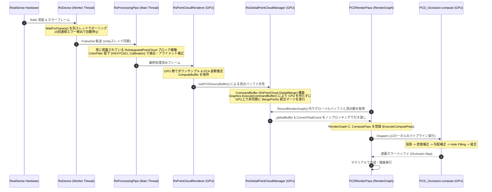

# RealTimeOcclusion 視覚オクルージョン・レンダリングシステム設計思想・関数仕様ドキュメント

本ドキュメントは、Intel RealSense 等のセンサーから取得したリアルタイム点群（Point Cloud）を URP RenderGraph パイプライン上でスクリーン空間に精密に投影し、Unity の仮想オブジェクトとの前後遮蔽（オクルージョン）を計算・描画する「視覚オクルージョン・レンダリングシステム」の設計思想、各モジュールの役割、関数構成、および GPU Compute Shader における各種アルゴリズムの詳細を網羅したテクニカルリファレンスです。

---

## 🔗 統合プロジェクトポータル

本システムは、プロジェクトのメインポータルである **[RealTimeOcclusion システム統合 Wiki (WIKI.md)](./WIKI.md)** の「視覚オクルージョンノード」として位置づけられています。

---

## 📑 目次
1. [システム概要と提供価値](#1-システム概要と提供価値)
2. [全体アーキテクチャとデータフロー](#2-全体アーキテクチャとデータフロー)
3. [主要フォルダ・ファイル構造](#3-主要フォルダ・ファイル構造)
4. [RealSense ストリーミングパイプラインと ColorFilter 事前処理](#4-realsense-ストリーミングパイプラインと-colorfilter-事前処理)
5. [非同期点群マージ＆データパッシング](#5-非同期点群マージデータパッシング)
6. [オクルージョン制御モジュール (Occlusion Core)](#6-オクルージョン制御モジュール-occlusion-core)
7. [Compute Shader パイプライン仕様](#7-compute-shader-パイプライン仕様)
8. [パフォーマンス最適化の工夫](#8-パフォーマンス最適化の工夫)
9. [動作検証 (Verification Plan)](#9-動作検証-verification-plan)

---

## 1. システム概要と提供価値

本システムは、実環境からリアルタイムに取得した点群（あるいはデバッグ用の合成データ）をスクリーン空間に投影し、Unity の仮想3D空間に配置されたオブジェクトとの前後関係（オクルージョン）をリアルタイムに計算する仕組みです。

```
[RealSense カメラ / 再生ファイル]
        │ 
        │ (非同期スレッドフレームキャプチャ: Worker Thread)
        ▼
   [RsDevice]
        │ 
        │ (常に搭載された RsIntegratedPointCloud フィルタパイプライン / ColorFilter)
        │ ├─ RsColorBasedDepthCulling (HSV/YCbCr 色閾値カリング)
        │ ├─ RsDepthToColorCalibration (幾何アライメント補正)
        │ └─ RsUnityMainThreadDispatcher (非同期ディスパッチ転送)
        ▼
[RsProcessingPipe] ──> (GPU Direct Mode: RsPointCloudInitializer)
        │
        ▼ (ゼロコピー GPU 転送 / ComputeBuffer 共有)
[RsPointCloudRenderer] 
        │
        │ (GetPCDSourceBuffer() による個別頂点バッファ共有)
        ▼
[RsGlobalPointCloudManager] 
        │ 
        │ (★ CommandBuffer "RsPointCloud.GlobalMerge" 構築)
        │ (★ Graphics.ExecuteCommandBuffer により GPU 上で非同期に MergePoints 実行)
        ▼ (CPUブロッキングゼロで _globalBuffer へのマージ完了)
  [PCDRenderPass (URP RenderGraph)]
        │ 
        │ (RecordRenderGraph でノンブロッキングにバッファと頂点数を引き渡し)
        │ (多段 Compute Shader カーネルディスパッチ)
        ▼
[PCD_Occlusion.compute]
        │ (Joint Bilateral / Pull-Push / モルフォロジー補間)
        ▼
 [オクルージョンマップ出力 (画面遮蔽描画)]
```

### 提供価値
*   **ゼロコピーによる高効率転送**: CPU-GPU間のボトルネックを完全に排除し、RealSense SDK からの深度情報から頂点バッファへの変換、姿勢推定、およびオクルージョン投影計算までを GPU Compute Buffer 上で一貫して処理します。
*   **非同期 CommandBuffer マージ**: `Graphics.ExecuteCommandBuffer` による非同期キューイングにより、CPU のメインスレッドを 1ミリ秒もブロッキングすることなく、複数点群を GPU 上でゼロコピーでマージ完了します。
*   **RenderGraph 統合による URP 最適化**: Unity 6 の Universal Render Pipeline (URP) RenderGraph アーキテクチャに完全準拠し、描画パイプラインの途中に非同期でオクルージョン計算パスを安全に挿入します。
*   **堅牢な Hole Filling**: 点群特有の「隙間」を補完するため、エッジ保存型の Joint Bilateral フィルタ、およびマルチスケール解像度伝播の Pull-Push 法を GPU 上に完全実装し、滑らかな遮蔽輪郭を提供します。

---

## 2. 全体アーキテクチャとデータフロー

システム全体のデータおよびバッファのライフサイクルは、実機入力（RealSense）またはデバッグシステム（PCV）からオクルージョン計算パスへと直列・並列に流れます。



---

## 3. 主要フォルダ・ファイル構造

ドキュメント内の各モジュールは、以下のリポジトリ構成と完全に対応しています。

`c:\Users\hongo\Documents\tsutsumi\RealTimeOcclusion` (プロジェクトルート)  
├── [Assets](./Assets)  
│   ├── [Scripts](./Assets/Scripts)  
│   │   ├── [ParallaxBarrier/Rendering/Occlusion](./Assets/Scripts/ParallaxBarrier/Rendering/Occlusion)  
│   │   │   ├── [PCDRendererFeature.cs](./Assets/Scripts/ParallaxBarrier/Rendering/Occlusion/PCDRendererFeature.cs) — URP レンダラーへのパス追加、シングルトンインスタンス管理  
│   │   │   ├── [PCDSettingsBridge.cs](./Assets/Scripts/ParallaxBarrier/Rendering/Occlusion/PCDSettingsBridge.cs) — レンダリングパラメータの取得とフォールバックの仲介 (肥大化対策ブリッジ)  
│   │   │   ├── [PCDOcclusionPipelineController.cs](./Assets/Scripts/ParallaxBarrier/Rendering/Occlusion/PCDOcclusionPipelineController.cs) — インスペクターパラメータから実行パラメータへの動的仲介  
│   │   │   ├── [PCDPointBufferManager.cs](./Assets/Scripts/ParallaxBarrier/Rendering/Occlusion/PCDPointBufferManager.cs) — 外部バッファ・静的メッシュ・アニメーションメッシュの調停と結合  
│   │   │   ├── [StaticMeshPCDRegistrar.cs](./Assets/Scripts/ParallaxBarrier/Rendering/Occlusion/StaticMeshPCDRegistrar.cs) — 空間内の静的/動的オブジェクトを自動検出・登録  
│   │   │   ├── [PCDRenderPass.cs](./Assets/Scripts/ParallaxBarrier/Rendering/Occlusion/PCDRenderPass.cs) — オクルージョン描画パスのメイン処理・初期化・実行ライフサイクル管理  
│   │   │   ├── [PCD_RenderPass_Allocation.cs](./Assets/Scripts/ParallaxBarrier/Rendering/Occlusion/PCD_RenderPass_Allocation.cs) — レンダーグラフ内での各種デプステクスチャやピラミッドなどのバッファリソース確保  
│   │   │   ├── [PCD_RenderPass_BindParams.cs](./Assets/Scripts/ParallaxBarrier/Rendering/Occlusion/PCD_RenderPass_BindParams.cs) — 各 Compute Shader カーネルの引数、バッファ、定数等のバインド設定  
│   │   │   ├── [PCD_RenderPass_Execute.cs](./Assets/Scripts/ParallaxBarrier/Rendering/Occlusion/PCD_RenderPass_Execute.cs) — 13段階の Compute Shader カーネルの多段ディスパッチ処理制御  
│   │   │   ├── [PCD_RenderPass_RenderGraph.cs](./Assets/Scripts/ParallaxBarrier/Rendering/Occlusion/PCD_RenderPass_RenderGraph.cs) — URP RenderGraph への各 Compute/Raster パスの登録とバリアの構築  
│   │   │   ├── [PCD_RenderPass_Debug.cs](./Assets/Scripts/ParallaxBarrier/Rendering/Occlusion/PCD_RenderPass_Debug.cs) — デバッグ画像のディスクエクスポートや非同期 GPU Readback の制御  
│   │   │   ├── [PCDIntegratedDepthMapExporter.cs](./Assets/Scripts/ParallaxBarrier/Rendering/Occlusion/PCDIntegratedDepthMapExporter.cs) — 統合DepthMap (R32_UInt) の可逆生データ(.raw32)および可視化PNGのエクスポート  
│   │   │   └── [PCDOcclusionDebugExporter.cs](./Assets/Scripts/ParallaxBarrier/Rendering/Occlusion/PCDOcclusionDebugExporter.cs) — オクルージョン結果、近傍数などの16色パレットPNG/CSV出力用デバッグユーティリティ  
│   │   └── [RealSense](./Assets/Scripts/RealSense)  
│   │       ├── [Device](./Assets/Scripts/RealSense/Device)  
│   │       │   ├── [RsDevice.cs](./Assets/Scripts/RealSense/Device/RsDevice.cs) — Pipeline をラップしたストリーム管理・エラーハンドリング (別スレッドポーリング、エラー自動リカバリ)  
│   │       │   └── [RsDeviceController.cs](./Assets/Scripts/RealSense/Device/RsDeviceController.cs) — カメラの接続確認および起動制御  
│   │       ├── [Debug](./Assets/Scripts/RealSense/Debug)  
│   │       │   └── [RsAsyncStatsLogger.cs](./Assets/Scripts/RealSense/Debug/RsAsyncStatsLogger.cs) — 点群処理パフォーマンスなどの非同期ログ出力制御  
│   │       ├── [RsConfiguration.cs](./Assets/Scripts/RealSense/RsConfiguration.cs) — RealSense カメラのストリーム構成 (解像度・フォーマット・FPS) 設定  
│   │       ├── [RsDeviceInspector.cs](./Assets/Scripts/RealSense/RsDeviceInspector.cs) — 接続デバイス情報や詳細パラメータのインスペクション・デバッグ表示  
│   │       ├── [RsFrameProvider.cs](./Assets/Scripts/RealSense/RsFrameProvider.cs) — フレームデータを提供するプロバイダーインターフェース  
│   │       ├── [RsPoseStreamTransformer.cs](./Assets/Scripts/RealSense/RsPoseStreamTransformer.cs) — IMU(姿勢/加速度/角速度)データの変換および反映処理  
│   │       ├── [RsProcessingPipe.cs](./Assets/Scripts/RealSense/RsProcessingPipe.cs) — フィルタパイプラインの構築、ネイティブフレームメモリの Dispose 管理  
│   │       ├── [RsProcessingBlock.cs](./Assets/Scripts/RealSense/RsProcessingBlock.cs) — 各種処理ブロック (RsProcessingBlock) の基底クラス定義  
│   │       ├── [RsUnityMainThreadDispatcher.cs](./Assets/Scripts/RealSense/RsUnityMainThreadDispatcher.cs) — 非同期スレッドから Unity メインスレッドでのアクション実行の調停  
│   │       ├── [RsVideoStreamRequest.cs](./Assets/Scripts/RealSense/RsVideoStreamRequest.cs) — 特定の映像ストリームの要求パラメータ管理  
│   │       ├── [ProcessingBlocks](./Assets/Scripts/RealSense/ProcessingBlocks)  
│   │       │   ├── [CustomProcessingBlock.cs](./Assets/Scripts/RealSense/ProcessingBlocks/CustomProcessingBlock.cs) — カスタム処理ブロックの基本実装テンプレート  
│   │       │   ├── [DepthCutoff.cs](./Assets/Scripts/RealSense/ProcessingBlocks/DepthCutoff.cs) — 深度の指定範囲カリング処理  
│   │       │   ├── [RsAlign.cs](./Assets/Scripts/RealSense/ProcessingBlocks/RsAlign.cs) — 深度とカラー画像のアライメント処理  
│   │       │   ├── [RsColorizer.cs](./Assets/Scripts/RealSense/ProcessingBlocks/RsColorizer.cs) — 深度値をカラー画像にマッピングするカラーライザー  
│   │       │   ├── [RsDecimationFilter.cs](./Assets/Scripts/RealSense/ProcessingBlocks/RsDecimationFilter.cs) — 深度画像の解像度を段階的に低減するフィルタ  
│   │       │   ├── [RsDisparityTransform.cs](./Assets/Scripts/RealSense/ProcessingBlocks/RsDisparityTransform.cs) — 深度値と視差値 (Disparity) の相互変換処理  
│   │       │   ├── [RsHoleFillingFilter.cs](./Assets/Scripts/RealSense/ProcessingBlocks/RsHoleFillingFilter.cs) — RealSense SDK 標準の穴埋めフィルタ  
│   │       │   ├── [RsPointCloud.cs](./Assets/Scripts/RealSense/ProcessingBlocks/RsPointCloud.cs) — 深度画像から 3D 座標への変換および頂点バッファ構築  
│   │       │   ├── [RsProcessingProfile.cs](./Assets/Scripts/RealSense/ProcessingBlocks/RsProcessingProfile.cs) — フィルタパイプライン設定プロファイルの保存・管理  
│   │       │   ├── [RsSpatialFilter.cs](./Assets/Scripts/RealSense/ProcessingBlocks/RsSpatialFilter.cs) — エッジ保存型の空間平滑化フィルタ  
│   │       │   ├── [RsTemporalFilter.cs](./Assets/Scripts/RealSense/ProcessingBlocks/RsTemporalFilter.cs) — フレーム間の時間平均によるノイズ低減フィルタ  
│   │       │   ├── [RsThresholdFilter.cs](./Assets/Scripts/RealSense/ProcessingBlocks/RsThresholdFilter.cs) — 深度の最小・最大しきい値フィルタ  
│   │       │   └── [ColorFilter](./Assets/Scripts/RealSense/ProcessingBlocks/ColorFilter)  
│   │       │       ├── [RsIntegratedPointCloud.cs](./Assets/Scripts/RealSense/ProcessingBlocks/ColorFilter/RsIntegratedPointCloud.cs) — GPU Direct 統合処理ブロック (常時搭載コア)  
│   │       │       ├── [RsIntegratedPointCloudProcessor.cs](./Assets/Scripts/RealSense/ProcessingBlocks/ColorFilter/RsIntegratedPointCloudProcessor.cs) — GPU 投影・射影演算プロセッサ  
│   │       │       ├── [RsColorBasedDepthCulling.cs](./Assets/Scripts/RealSense/ProcessingBlocks/ColorFilter/RsColorBasedDepthCulling.cs) — HSV/YCbCr 色空間閾値に基づく深度カリング  
│   │       │       ├── [RsGpuCullingProcessor.cs](./Assets/Scripts/RealSense/ProcessingBlocks/ColorFilter/RsGpuCullingProcessor.cs) — カリング用 Compute Shader 並列ディスパッチャー  
│   │       │       ├── [RsDepthToColorCalibration.cs](./Assets/Scripts/RealSense/ProcessingBlocks/ColorFilter/RsDepthToColorCalibration.cs) — 内参・外参を利用した深度-カラー幾何アライメント補正  
│   │       │       ├── [RsHsvConverter.cs](./Assets/Scripts/RealSense/ProcessingBlocks/ColorFilter/RsHsvConverter.cs) / [RsYCbCrConverter.cs](./Assets/Scripts/RealSense/ProcessingBlocks/ColorFilter/RsYCbCrConverter.cs) — 高速色空間変換ユーティリティ  
│   │       │       └── [RsCullingDebugExporter.cs](./Assets/Scripts/RealSense/ProcessingBlocks/ColorFilter/RsCullingDebugExporter.cs) — カリング検証用 BMP 非同期エクスポート  
│   │       └── [PointCloud](./Assets/Scripts/RealSense/PointCloud)  
│   │           ├── [RsPointCloudRenderer.cs](./Assets/Scripts/RealSense/PointCloud/RsPointCloudRenderer.cs) — 個別点群の初期化・ライフサイクル制御、バッファ提供  
│   │           ├── [RsPointCloudInitializer.cs](./Assets/Scripts/RealSense/PointCloud/RsPointCloudInitializer.cs) — 実機/合成データ/統合点群の初期化切り替え  
│   │           ├── [RsGlobalPointCloudManager.cs](./Assets/Scripts/RealSense/PointCloud/RsGlobalPointCloudManager.cs) — グローバル統合点群管理 (GlobalManager)  
│   │           ├── [RsGlobalPointCloudManager.Merge.cs](./Assets/Scripts/RealSense/PointCloud/RsGlobalPointCloudManager.Merge.cs) — GPU CommandBuffer 非同期マージ実装  
│   │           ├── [RsGlobalPointCloudManager.PCA.cs](./Assets/Scripts/RealSense/PointCloud/RsGlobalPointCloudManager.PCA.cs) — 統合点群の主成分分析 (PCA) による簡易中心姿勢推定  
│   │           ├── [RsGlobalPointCloudManager.Stats.cs](./Assets/Scripts/RealSense/PointCloud/RsGlobalPointCloudManager.Stats.cs) — 統合点群の有効点数やバウンディングボックス等の統計情報計算  
│   │           ├── [RsComputeStats.cs](./Assets/Scripts/RealSense/PointCloud/RsComputeStats.cs) — 単体点群用の統計値計算 Compute Shader インターフェース  
│   │           ├── [RsDataProvider.cs](./Assets/Scripts/RealSense/PointCloud/RsDataProvider.cs) — 頂点/カラーデータの供給インターフェース  
│   │           ├── [RsFilterPassExecutor.cs](./Assets/Scripts/RealSense/PointCloud/RsFilterPassExecutor.cs) — 点群に対する追加フィルタパスのスケジューラ  
│   │           ├── [RsFilterShaderDispatcher.cs](./Assets/Scripts/RealSense/PointCloud/RsFilterShaderDispatcher.cs) — 汎用点群フィルタ用 Compute Shader のディスパッチャー  
│   │           ├── [RsGpuProfiler.cs](./Assets/Scripts/RealSense/PointCloud/RsGpuProfiler.cs) — 各点群パスの GPU 実行時間のプロファイリング管理  
│   │           ├── [RsMaterialController.cs](./Assets/Scripts/RealSense/PointCloud/RsMaterialController.cs) — 点群のサイズやブレンドなど、マテリアルの動的制御  
│   │           ├── [RsPerformanceLogger.cs](./Assets/Scripts/RealSense/PointCloud/RsPerformanceLogger.cs) — 点群処理のスループットやレンダリング性能を計測・記録  
│   │           ├── [RsPointCloudAsyncReadback.cs](./Assets/Scripts/RealSense/PointCloud/RsPointCloudAsyncReadback.cs) — ComputeBuffer から CPU 配列への非同期読み戻し (AsyncGPUReadback)  
│   │           ├── [RsPointCloudCapturer.cs](./Assets/Scripts/RealSense/PointCloud/RsPointCloudCapturer.cs) — 点群フレームのバイナリキャプチャ・保存・再生用マネージャー  
│   │           ├── [RsPointCloudCompute.cs](./Assets/Scripts/RealSense/PointCloud/RsPointCloudCompute.cs) — 頂点生成およびノイズ除去フィルタ用 Compute Shader 制御  
│   │           ├── [RsPointCloudFrameProcessor.cs](./Assets/Scripts/RealSense/PointCloud/RsPointCloudFrameProcessor.cs) — フレーム単位の点群データ加工・フロー制御  
│   │           ├── [RsPointCloudPCA.cs](./Assets/Scripts/RealSense/PointCloud/RsPointCloudPCA.cs) — 個別点群に対する PCA (主成分分析) 実行クラス  
│   │           ├── [RsPointCloudSyntheticData.cs](./Assets/Scripts/RealSense/PointCloud/RsPointCloudSyntheticData.cs) — デバッグ・検証用の合成点群 (球、直方体等) の生成  
│   │           ├── [RsPointCloudVisualization.cs](./Assets/Scripts/RealSense/PointCloud/RsPointCloudVisualization.cs) — Point Cloud のトポロジーや簡易ワイヤーフレーム表示制御  
│   │           └── [RsTransformController.cs](./Assets/Scripts/RealSense/PointCloud/RsTransformController.cs) — 各カメラのトランスフォーム変更の動的同期・適用  
│   └── [Shader&Material/Shader/ComputeShader/Rendering](./Assets/Shader&Material/Shader/ComputeShader/Rendering)  
│       ├── [PCD_Occlusion.compute](./Assets/Shader&Material/Shader/ComputeShader/Rendering/PCD_Occlusion.compute) — メインオクルージョン計算エントリポイント  
│       ├── [PCD_Occlusion_Data.hlsl](./Assets/Shader&Material/Shader/ComputeShader/Rendering/PCD_Occlusion_Data.hlsl) — 定数・バッファ・各種パラメータ定義  
│       ├── [PCD_Occlusion_Helpers.hlsl](./Assets/Shader&Material/Shader/ComputeShader/Rendering/PCD_Occlusion_Helpers.hlsl) — 3D射影、距離・深度比較用の汎用ヘルパ関数  
│       ├── [PCD_Occlusion_Kernels_Preprocess.hlsl](./Assets/Shader&Material/Shader/ComputeShader/Rendering/PCD_Occlusion_Kernels_Preprocess.hlsl) — 点群投影・最小Zバッファ生成・密度・近傍サイズ計算カーネル  
│       ├── [PCD_Occlusion_Kernels_DepthPyramid.hlsl](./Assets/Shader&Material/Shader/ComputeShader/Rendering/PCD_Occlusion_Kernels_DepthPyramid.hlsl) — 深度ピラミッド L1～L6 構築およびタグON時の物理点群フィルタリングカーネル  
│       ├── [PCD_Occlusion_Kernels_Occlusion.hlsl](./Assets/Shader&Material/Shader/ComputeShader/Rendering/PCD_Occlusion_Kernels_Occlusion.hlsl) — 適応的勾配補正およびオクルージョン(遮蔽度)メイン計算カーネル  
│       ├── [PCD_Occlusion_Kernels_Occlusion_Discrete3.hlsl](./Assets/Shader&Material/Shader/ComputeShader/Rendering/PCD_Occlusion_Kernels_Occlusion_Discrete3.hlsl) — 3方向離散レイサンプリングによる高速オクルージョン計算カーネル  
│       ├── [PCD_Occlusion_Kernels_Occlusion_Discrete6.hlsl](./Assets/Shader&Material/Shader/ComputeShader/Rendering/PCD_Occlusion_Kernels_Occlusion_Discrete6.hlsl) — 6方向離散レイサンプリングによるオクルージョン計算カーネル  
│       ├── [PCD_Occlusion_Kernels_Occlusion_Discrete8.hlsl](./Assets/Shader&Material/Shader/ComputeShader/Rendering/PCD_Occlusion_Kernels_Occlusion_Discrete8.hlsl) — 8方向離散レイサンプリングによる高精度オクルージョン計算カーネル  
│       ├── [PCD_Occlusion_Kernels_Occlusion_SingleDirection.hlsl](./Assets/Shader&Material/Shader/ComputeShader/Rendering/PCD_Occlusion_Kernels_Occlusion_SingleDirection.hlsl) — 1方向（直線状）のみを探索する軽量オクルージョン計算カーネル  
│       ├── [PCD_Occlusion_Kernels_Post.hlsl](./Assets/Shader&Material/Shader/ComputeShader/Rendering/PCD_Occlusion_Kernels_Post.hlsl) — ポストプロセス補間、デバッグ可視化用のPixelTagMap・オクルージョンマップ最終出力生成カーネル  
│       └── [PCD_Occlusion_Kernels_FillHoles.hlsl](./Assets/Shader&Material/Shader/ComputeShader/Rendering/PCD_Occlusion_Kernels_FillHoles.hlsl) — Joint Bilateral / Pull-Push / モルフォロジーによる画像空間ホールフィリングカーネル  
  


---

## 4. RealSense ストリーミングパイプラインと ColorFilter 事前処理

オクルージョン計算の前段階として、センサーデータの取得からノイズフィルタリング、アライメント補正、特定領域の抽出までを CPU/GPU 連携で実行するパイプライン設計です。

### A. デバイスポーリングとエラーハンドリング (`RsDevice.cs`)
RealSense からのフレームキャプチャは、パフォーマンス要求に応じて 2つの処理モードを選択可能です。
*   **マルチスレッド・モード (`Multithread`)**:
    描画フレームレートの低下に影響されず、RealSense SDK の `WaitForFrames()` を別スレッド（Worker Thread）でループ処理します。メインスレッド側の負荷を削減し、データの取りこぼしを防ぎます。
*   **ユニティスレッド・モード (`UnityThread`)**:
    `Update()` 内で同期的かつスレッド安全に `PollForFrames()` を呼び出します。
*   **安全停止閾値 (エラーリカバリ)**:
    バス帯域不足やカメラ切断が発生した場合に備え、連続エラー検出回数が 10回 (`maxConsecutiveErrors = 10`) に達した段階で、デッドロックを防ぐためスレッドパイプラインを自動的に安全停止します。

### B. ネイティブメモリ管理の徹底 (`RsProcessingPipe.cs`)
RealSense SDK が提供する `Frame` 構造体は、C++ ネイティブメモリへのポインタをラップした C# 表現です。
GC で回収されないため、フレームワーク側で明示的に解放しないと一瞬でメインメモリおよび GPU メモリがリークします。
*   **対策**: `RsProcessingPipe` では、フィルタ処理を直列に適用する際、一時バッファを含め `using` ブロックおよび `try-finally` による確実な `frame.Dispose()` を徹底しています。

### C. パイプラインに常時搭載される `RsIntegratedPointCloud` の役割
[RsIntegratedPointCloud.cs](./Assets/Scripts/RealSense/ProcessingBlocks/ColorFilter/RsIntegratedPointCloud.cs) は、`RsProcessingPipe` のフィルタパイプライン内に**常に搭載されている**極めて重要なコアブロック（カスタム `RsProcessingBlock`）です。

1.  **GPU Direct Mode への自動移行**:
    `RsPointCloudInitializer.cs` は初期化時に、パイプラインのアクティブなフィルタ群から `RsIntegratedPointCloud` を自動検出します。検出されると `UseIntegratedPointCloud` フラグが有効になり、頂点バッファ処理が GPU 上で完結する「GPU Direct Mode」へと動的にシフトします。
2.  **リアルタイム姿勢行列の適用**:
    カメラのキャリブレーション姿勢変換行列（`Matrix4x4`）を `RsIntegratedPointCloud.UpdateTransformMatrix(matrix)` 経由で毎フレーム更新し、`RsIntegratedPointCloudProcessor` を介して直接 GPU 側の座標変換に適用します。
3.  **マルチスレッド・ディスパッチ転送**:
    非同期スレッドからキャプチャした RAW 画像バッファは、アンマネージド領域から C# キャッシュバッファへと高速に `Marshal.Copy` されます。その後、メインスレッド用のディスパッチャである `RsUnityMainThreadDispatcher` を介して `ProcessPendingFrame` が駆動され、GPU（Compute Shader および `Texture2D.LoadRawTextureData`）へ非同期転送・並列処理されます。

### D. `ProcessingBlocks/ColorFilter/` 配下の役割と設計仕様
手の形状抽出や背景カットといった特定の切り出し（カリング）や、カラー-深度センサー間の位置補正を高速に行うための事前処理フィルタ群です。

*   **`RsColorBasedDepthCulling.cs`**:
    特定の肌色やマーカー色など、指定された HSV または YCbCr 色空間の閾値に基づいて、範囲外ピクセルに対応する深度値を `0`（無効）に書き換える post-processing filter です。手の点群のみを抽出し、背景や腕の点群をパイプラインの最上流で高速カリングします。
*   **`RsGpuCullingProcessor.cs`**:
    上記のカリング判定を GPU 上で並列実行するためのディスパッチャーです。テクスチャのロード、並列スレッドの設定、Compute Shader カーネルの Dispatch を統制します。
*   **`RsDepthToColorCalibration.cs`**:
    深度カメラとカラーカメラ間のピクセルアライメント（幾何学的アライメント補正）を行います。`VideoStreamProfile` から取得した深度カメラの内参（Intrinsics）、カラーカメラの内参、および両カメラ間の外参（Extrinsics - 回転・平行移動行列）を用いて、深度座標系からカラー座標系への精密な 3D 逆射影・座標変換・2D 再投影（`MapDepthToColor`）の数理演算をリアルタイムで実行します。
*   **`RsHsvConverter.cs` / `RsYCbCrConverter.cs`**:
    RGB カラーをそれぞれ HSV（Hue, Saturation, Value）および YCbCr（Luminance, Chrominance Blue, Chrominance Red、ITU-R BT.601 規格）へ高速変換する数学ユーティリティです。
*   **`RsCullingDebugExporter.cs`**:
    閾値チューニングを支援する強力なデバッグエクスポート機能です。`SaveDebugFrames` が有効になると、現在のフレームから「元のカラー画像」「各色成分ごとの階調可視化画像」「フィルタ適用後の切り抜き画像」など計5枚のビットマップ（BMP）画像をローカルディレクトリ（`Assets/RealSenseDebug/`）へ即時に非同期で保存し、調整用の視覚的フィードバックを提供します。

---

## 5. 非同期点群マージ＆データパッシング

本システムは、CPU の処理を一切ブロッキングしない「GPU 完結型の非同期マージ＆データパッシングフロー」を確立しています。

```
[各 RsPointCloudRenderer] (個別頂点 ComputeBuffer 保持)
           │
           │ (GetPCDSourceBuffer() による GPU メモリ参照)
           ▼
[RsGlobalPointCloudManager] ─── (最大 300万点の _globalBuffer を確保)
   │
   ├─ 1. CommandBuffer "RsPointCloud.GlobalMerge" を新規構築
   ├─ 2. mergeComputeShader の MergePoints カーネルパラメータを設定
   ├─ 3. cmd.DispatchCompute により GPU コピー命令をスタック
   ├─ 4. Graphics.ExecuteCommandBuffer(cmd) で GPU キューに即時投入 (非同期・CPU待機ゼロ)
   └─ 5. cmd.Release() でメモリを確実に解放
           │
           ▼ (GPU上で非同期に globalBuffer へのマージ完了)
[PCDRenderPass.RecordRenderGraph]
   │
   ├─ 1. URP RenderGraph のフレームパス登録フェーズ
   ├─ 2. GlobalBufferMode が有効な場合、GlobalManager から globalBuffer 参照を取得
   ├─ 3. 最新の点の総数 CurrentTotalCount を取得
   ├─ 4. _bufferManager.SetExternalBuffer(globalBuffer, globalCount) を実行 (ノンブロッキング)
   └─ 5. RenderGraph 内の ComputePass にて GPU 実行バリアとともに引き渡され、多段計算へ
```

### A. GPU ゼロコピー・非同期マージ (`RsGlobalPointCloudManager.Merge.cs`)
複数または単一の RealSense カメラの頂点バッファを、CPU のメインメモリにコピーバックすることなく、GPU メモリ上で直接、単一のグローバル頂点バッファ（`_globalBuffer`、最大 300万点）へ結合・マージします。

1.  **個別頂点バッファの共有**:
    各カメラに対応する `RsPointCloudRenderer` から `GetPCDSourceBuffer()` および `GetPCDSourceCount()` を介して個別の `ComputeBuffer` を直接参照します。
2.  **CommandBuffer を用いた非同期ディスパッチ (`Graphics.ExecuteCommandBuffer`)**:
    マージ処理（Compute Shader `mergeComputeShader` の `MergePoints` カーネル実行）は、CPU をブロッキングする同期的呼び出しを行わず、`CommandBuffer` (名称 `"RsPointCloud.GlobalMerge"`) を構築してそこに処理をコマンドとして登録し、`Graphics.ExecuteCommandBuffer(cmd)` を介して即座に GPU 側のコマンドキューに流し込みます。
    これによって CPU のメインスレッドは GPU 側のコピー完了を 1ミリ秒たりとも待つ（ブロッキングする）必要がなく、完全に非同期で GPU 上で並列にマージ処理がスケジュールされます。
3.  **安全なバッファ解放**:
    `Graphics.ExecuteCommandBuffer` 実行後、即座に `cmd.Release()` を呼び出すことで、描画スレッドでの CommandBuffer インスタンスの累積を防ぎ、GC の発生を防止します。

### B. URP RenderGraph へのノンブロッキング・データパッシング
毎フレームの `PCDRenderPass.RecordRenderGraph` 実行時に、描画パイプラインへバッファを安全かつノンブロッキングで受け渡します。

1.  **外部バッファの動的セット**:
    `PCDRendererFeature` の `IsGlobalBufferMode` が有効な場合、`RsGlobalPointCloudManager.Instance` からグローバル統合バッファ参照（`GetGlobalBuffer()`）と現在の有効な頂点総数（`CurrentTotalCount`）を直接取得します。
2.  **ノンブロッキング・バッファパッシング**:
    取得したバッファと頂点数を `_bufferManager.SetExternalBuffer(globalBuffer, globalCount)` に直接引き渡します。
    CPU 側のスレッド待機や同期ズレを完全に排除し、GPU 内の実行順序（マージ処理から描画パスへの依存関係）のみで整合性を担保するため、極めて低いオーバーヘッドで URP の `PCDRenderPass`（ComputePass）へとバッファが非同期でパッシングされます。

---

## 6. オクルージョン制御モジュール (Occlusion Core)

### 1. `PCDRendererFeature`
*   **設計思想**: URP に対するオクルージョン描画パスの追加を行うエントリポイントです。シングルトンパターンを実装し、PCVデバッグシステム等の外部クラスから動的に点群データバッファを登録できるインターフェースを提供します。
*   **主要な変更点**:
    従来このクラスに直接定義されていた 25 個のパラメータ管理プロパティは、結合度低減と肥大化防止の観点から新設された `PCDSettingsBridge` へと移譲されました。本クラスは `settings` プロパティを通じてこれらのパラメータ変更要求のブリッジ（中継）を行います。

### 2. `PCDSettingsBridge`
*   **設計思想**: `PCDRendererFeature` のプロパティ肥大化を防ぎ、関心の分離（Separation of Concerns）を推進するために設計された軽量ブリッジクラスです。
*   **機能と役割**:
    *   **二重化ルーティング**: 実行時に動的な `PCDOcclusionPipelineController` インスタンスが存在する場合はその設定プロパティへと処理をルーティングし、存在しない場合は内部のローカルなデフォルト値構造体 `_fallbackSettings` へと自動フォールバックします。
    *   **値の検証 (Validation)**: `OnValidate()` メソッドにて、オクルージョン閾値 (`occlusionThreshold`) に適合するようソフトオクルージョンフェード幅 (`occlusionFadeWidth`) のクランプを適切に行います。
    *   **パラメータ一覧**: `kernelType`, `binningMethod`, `directionCount`, `exponentAlpha`, `densityThreshold_e`, `neighborhoodParam_p_prime`, `enableGradientCorrection`, `gradientThreshold_g_th`, `occlusionThreshold`, `occlusionFadeWidth`, `enablePixelTagMap`, `enableOcclusionMap`, `recordOcclusionDebugMap`, `recordPixelTagMap`, `recordIntegratedDepthMap`, `recordNeighborhoodMap`, `recordNeighborCountMap`, `enableVirtualDepthIntegration`, `enableTagBasedOptimization`, `enableTypeAwareDensity`, `enableSoftOcclusionFade`, `holeFillingMethod`, `morphKernelHalfSize`, `morphErodeIterations`, `morphDilateIterations`

### 3. `PCDOcclusionPipelineController`
*   **設計思想**: レンダリングパラメーターをインスペクター上で一元管理する MonoBehaviour です。インスペクター上の値が変更されたことを検知し、一時オブジェクトを生成することなく `PCDRenderPass` の定数バッファへ値を転送するための仲介役として機能します。

### 4. `PCDPointBufferManager`
*   **設計思想**: 複数の点群ソース（RealSense共有バッファ、静的登録オブジェクト、ボーンアニメーションオブジェクト）をマージするためのバッファ調停者です。GC 発生を防ぐため、バッファサイズの変更がない限り `ComputeBuffer` を再利用します。
*   **主要関数**:
    *   `UpdateBuffers(...)`: 静的/動的オブジェクトの頂点を走査し、Compute Buffer の確保と更新を行います。
    *   `Release()`: アセンブリリロード時やオブジェクト破棄時に全バッファを確実に解放します。

### 5. `StaticMeshPCDRegistrar`
*   **設計思想**: 空間内に存在するメッシュを自動的に検出し、点群計算対象として登録するコンポーネントです。オブジェクトが非アクティブになった場合や削除された場合の動的変更検知を備えています。

### 6. `PCDRenderPass`
*   **設計思想**: URP RenderGraph の規約に沿ったレンダリングパスです。`ExecuteComputePass` を通じて、Compute Shader の13以上の多段カーネルを最適な順序で Dispatch し、パイプラインの同期とリソースの読み書きバリアを制御します。

---

## 7. Compute Shader パイプライン仕様

点群の投影から遮蔽推定、そして高度な画像空間ホールフィリング（穴埋め）までを実行する `PCD_Occlusion.compute` および付属 HLSL カーネルの動作仕様とアルゴリズムの数理的・技術的詳細です。

### A. 前処理・投影フェーズ

#### 1. スクリーン空間への投影と深度記録 (`ProjectPoints`)
入力された点群バッファ内の各頂点 `p_world = (x, y, z, 1)^T` に対し、カメラのビュー・プロジェクション行列（`_PCDViewProjMatrix`）を適用し、クリップ空間を経てスクリーン座標にマッピングします。

1.  **射影変換**:
$$
\mathbf{p}_{\text{clip}} = \mathbf{M}_{\text{VP}} \cdot \mathbf{p}_{\text{world}}
$$
$$
\mathbf{p}_{\text{ndc}} = \frac{\mathbf{p}_{\text{clip}}.xyz}{\mathbf{p}_{\text{clip}}.w}
$$
$$
\mathbf{p}_{\text{screen}} = \left( \frac{\mathbf{p}_{\text{ndc}}.xy + \mathbf{1.0}}{2.0} \right) \cdot \mathbf{v}_{\text{ScreenSize}}
$$

2.  **超並列深度アトミック書き込み**:
    投影された座標 `(x_screen, y_screen)` が画面内にある場合、頂点深度 `z_ndc` をスケーリングし、アトミック最小演算 `InterlockedMin` を用いて深度テクスチャ `_DepthMap_RW` に記録します。これによって、複数頂点が同一ピクセルに重なった際に「最も手前にある（カメラに最も近い）頂点」のみが確実に記録されます。
$$
\text{DepthUint} = \text{clamp}\left( z_{\text{ndc}} \times D_{\text{max}}, 0, D_{\text{max}} \right)
$$
    (ここで `D_max` は最大深度定数 `DEPTH_MAX_UINT` を表します)

    `_DepthMap_RW` への記録は以下のように GPU アトミック操作で行われます。
    ```hlsl
    InterlockedMin(_DepthMap_RW[uv], DepthUint);
    ```

#### 2. グリッド深度削減と密度推定 (`CalculateGridZMin`, `CalculateDensity`)
*   **`CalculateGridZMin`**: 画面を $8 \times 8$ ピクセルのグリッドに分割し、ブロック内の有効デプスの最小値（`Z_min`）を計算します。これにより、スパースな点群の深度を低解像度にまとめ上げ、オクルージョン比較の効率を高めます。
*   **`CalculateDensity`**: グリッド内に投影された点群の個数をカウントし、局所的な「点群の密集度（密度）」を算出します。

#### 3. 適応的探索レベルの決定 (`CalculateGridLevel`, `GridMedianFilter`, `CalculateNeighborhoodSize`)
*   **`CalculateGridLevel`**: 点群密度が低い領域（カメラから離れている、または実機スキャンが不鮮明な領域）では、点群間の隙間を埋めるための「探索レベル（LOD/半径）」を動的に大きくします。
*   **`GridMedianFilter`**: 探索レベルの急激な変化によるチラつきを防ぐため、グリッド間で $3 \times 3$ メディアンフィルタを適用し、探索レベルマップを滑らかに平滑化します。
*   **`CalculateNeighborhoodSize`**: 最終的にピクセル単位の近傍サイズ（オクルージョン探索半径）を決定し、次のオクルージョン計算に渡します。

---

### B. 適応的勾配補正フェーズ

#### 1. 深度勾配に基づく探索半径の補正 (`ApplyAdaptiveGradientCorrection`)
オクルージョン計算時に単純な探索半径を用いると、物体の輪郭（デプスの急激な境界）を超えて遮蔽判定が背景側に「はみ出す」現象（オクルージョン・リーク）が発生します。
これを防ぐため、隣接ピクセル間の深度勾配（傾き）を Sobel フィルタライクな差分演算で検出します。
*   **アルゴリズム**:
    対象ピクセルから隣接ピクセルへの深度差 `delta d` が閾値を超える（境界エッジを検出する）場合、その方向への探索半径を適応的に縮小します。これにより、オクルージョンマップの輪郭が現実のオブジェクト境界に完全に張り付くようになります。

---

### C. オクルージョン計算フェーズ

#### 1. ピラミッド深度比較オクルージョン判定 (`ComputeOcclusion`)
点群深度マップと、並列構築された $6$ 階層の低解像度深度ピラミッド（`BuildDepthPyramidL1` ~ `L6`）を比較します。
*   各ピクセルにおいて、そのピクセルを中心とする適応的探索半径内の深度情報をピラミッドテクスチャから高効率（キャッシュ最適）にサンプリングします。
*   サンプリングした背景オブジェクトの深度が点群の深度より奥にある場合、遮蔽度（オクルージョン度）を算出して `_OcclusionResultMap` に $0.0 \sim 1.0$ の値として書き込みます。

#### 2. タグベース最適化 (`EnableTagBasedOptimization`) とオクルーダー制御
本システムでは、仮想オブジェクト（`1u`）、物理点群（`0u`）、背景（`2u`）というタグ（`OriginType`）を用いて、演算の最適化とアーティファクトの排除を行っています。

*   **ON の場合（推奨設定）**:
    *   **ピラミッド構築時のフィルタリング**: Level 1 の構築段階（`ZMinPhysicalDownsample`）で、`originType == 0u` の点のみを抽出し、それ以外はセンチネル値（`1e9`）として棄却します。これにより、Level 1〜6 からフェッチされる近傍点は **100%確実に物理点群であることが保証** され、仮想オブジェクト同士が互いに遮蔽し合う誤作動（セルフオクルージョン）を完全に防ぎます。
    *   **Level 0 (フル解像度) の制御**: 極めて近距離の高密度領域などで探索レベルが 0（ピラミッドを使わずフル解像度の `_ViewPositionMap` を直接フェッチする）になった場合、そこには仮想オブジェクトも混在しています。そのため、フェッチ直後に `_OriginTypeMap` を確認し、物理点群以外であればスキップする厳密な制御を行っています。
*   **OFF の場合（ナイーブフォールバック）**:
    *   タグを一切無視し、純粋に「一番手前にある深度（Min-Z）」を採用してダウンサンプリングおよびオクルージョン計算を行います。仮想オブジェクトも遮蔽物（オクルーダー）として機能してしまうため、主にピュアなデプスベース手法とのアルゴリズム比較検証目的で使用します。

#### 3. D3D11 SRV/UAV 同時バインドハザードの回避設計
DirectX 11 環境下では、同一の Compute Shader カーネル内で同じテクスチャリソースを **SRV（読み込み専用）** と **UAV（読み書き両用）** の両方にバインドするとハザード検知により SRV 側が強制的に `NULL` (読み取り値 `0`) となる制約があります。
*   これにより、すべての点が `0u`（物理点群）として誤認され、画面全体が緑色（スキップ判定）に塗りつぶされる不具合が発生し得ます。
*   これを防ぐため、`_OriginTypeMap` などを読み書きするカーネル（`ComputeOcclusion` や `FillHolesPullPushFinalize`）では、SRV バインドを C# 側で徹底的に排除し、HLSL 側では `RWTexture2D` (`_OriginTypeMap_RW`) から直接読み取りと書き込みを行う設計を徹底しています。
*   デバッグ可視化時（`EnablePixelTagMap`）は、最適化のON/OFFに関わらず、このバッファに適切にタグ情報（実点群は `-3.0` (緑)、背景は `-1.0` (白)）をルーティングし、純粋な判定可視化を行えるように設計しています。

---

### D. ホールフィリング (Hole Filling) 仕様

点群特有の「隙間」を自然に補完するために実装されている、3つの高度なアルゴリズムの内部仕様です。

#### 1. Joint Bilateral Filter (`FillHoles`)
点群が投影されなかった（オクルージョンが未計算の）隙間ピクセルを対象に、カラー（オクルージョン値）および深度の類似度に基づいてエッジ保存補間を行います。

##### 【二段階実行ロジック】
1.  **Pass 1: 局所最小深度の探索**
    対象ピクセルの周囲 `13 * 13` 領域（`fillRadius = 6`）を走査し、既に点群が投影されている近傍ピクセルのうち、最もカメラに近い最小深度（`minDepth`）を探索します。
    > [!IMPORTANT]
    > 仮想オブジェクトが存在する場合、その深度マップ（`_VirtualDepthMap`）から取得した深度値を探索の上限閾値（`thresholdDepth`）とし、仮想オブジェクトより奥にある無関係な点群が手前に漏れて補間されるのを防止します。
2.  **Pass 2: 双方向加重平均（Bilateral Weight）の適用**
    発見した `minDepth` に近い深度を持つ近傍点のみを抽出し、以下の空間距離ウェイト（`spatialWeight`）と深度差ウェイト（`depthWeight`）を乗算した合成重みを算出して加重平均を取ります。

    *   深度許容差（`depthTolerance`）の定義:
$$
\text{depthTolerance} = \frac{D_{\text{max}}}{1000} + (d_{\text{min}} \times 0.02)
$$
        (ここで `D_max` は `DEPTH_MAX_UINT`、`d_min` は `minDepth` を表します)

    *   空間ウェイト（距離の二乗による減衰）:
$$
\text{spatialWeight} = \frac{1}{1.0 + \text{distSq} \times 0.5}
$$

    *   深度ウェイト（`minDepth` から離れるほど急速に減衰）:
$$
\text{depthWeight} = 1.0 - \text{smoothstep}\left(0.0, 1.0, \frac{d_n - d_{\text{min}}}{\text{depthTolerance}}\right)
$$
        (ここで `d_n` は `nDepth` を表します)

    *   合成重みによる加重平均:
$$
\text{Occlusion}_{\text{final}} = \frac{\sum (\text{Color}_i \times \text{Weight}_i)}{\sum \text{Weight}_i}
$$
$$
\text{Weight}_i = \text{spatialWeight}_i \times \text{depthWeight}_i
$$

#### 2. Pull-Push ピラミッド法 (`FillHolesPullPushInit` ~ `FillHolesPush`)
多スケール（ピラミッド階層）表現を用いて、どれほど広大で巨大な点群の穴でも計算負荷 $O(N)$ のまま滑らかに穴埋めする画像補間アルゴリズムです。

```
[Level 0 (等倍)]  ──(Pull: 4px平均)──>  [Level 1 (1/2)]  ──(Pull)──>  [Level 2 (1/4)]
       │                                     │                              │
[Level 0 (復元)]  <──(Push: バイリニア)───  [Level 1 (補間)]  <──(Push)─── [Level 2 (平滑化)]
```

##### 【各カーネルのアルゴリズム】
1.  **`FillHolesPullPushInit` (初期化)**:
    入力ピクセル情報をもとに、オクルージョン計算済みのピクセルは `weight = 1.0`、穴の部分は `weight = 0.0` とした 4成分ベクトル `v = (r * w, g * w, b * w, w)^T` をピラミッド最下層（Level 0）に構築します。
2.  **`FillHolesPull` (アップサンプリング/縮小)**:
    解像度を段階的に `1/2` に縮小しながらピラミッドを登ります。各ピクセルは、対応する下位レイヤーの `2 * 2` ブロックの単純平均を算出し、ウェイトとカラーを累積します。
$$
\mathbf{v}_{\text{parent}} = \frac{\mathbf{v}_{00} + \mathbf{v}_{10} + \mathbf{v}_{01} + \mathbf{v}_{11}}{4.0}
$$
3.  **`FillHolesPush` (ダウンサンプリング/拡大復元)**:
    ピラミッドを降りながら解像度を拡大し、等倍に戻します。
    下位の粗い階層からバイリニア補間（`frac` および `lerp`）で拡大した補間値 `v_interp` を取得します。
    現在のピクセルのウェイト（`w_current = v_current.a`）が不完全（`1.0` 未満）な箇所について、拡大された補間値をウェイトの残量に基づいてブレンドします。
$$
\mathbf{v}_{\text{blended}} = \mathbf{v}_{\text{current}} + (1.0 - w_{\text{current}}) \cdot \mathbf{v}_{\text{interp}}
$$
4.  **`FillHolesPullPushFinalize` (最終結果書き戻し)**:
    等倍解像度に戻ったピラミッドの最下層から、累積されたオクルージョンカラーを書き戻します。
$$
\text{Color}_{\text{final}} = \frac{\mathbf{v}_{\text{blended}}.rgb}{\mathbf{v}_{\text{blended}}.a} \quad (\text{if } \mathbf{v}_{\text{blended}}.a > 0.0001)
$$

#### 3. 数学的モルフォロジー演算 (`MorphologyErode` / `MorphologyDilate`)
カラー画像および点群存在フラグマップ（`_MorphTypeIn`）に対し、二値画像の数学的モルフォロジー（膨張・収縮）をグレースケールカラーと連動させて実行します。
*   **`MorphologyErode` (収縮)**:
    有効な点群ピクセル（`type == 0`）の周囲 $\pm \text{kernelHalfSize}$ 内に、点群が存在しない無効なピクセル（`type != 0`）が1つでもある場合、境界付近の不安定な孤立ノイズとみなして自身を無効化（`type = 1`, `color = (0,0,0,1)`）します。
*   **`MorphologyDilate` (膨張)**:
    無効ピクセル（`type != 0`）の周囲に有効点群がある場合、その周囲の有効ピクセルの平均カラーを算出し、自身を有効な判定として埋めます（`type = 0`）。これにより、点群オクルージョン領域の「ひび割れ」を滑らかに結合します。

### E. ポストプロセス・ユーティリティ
*   **`Interpolate`**: オクルージョンの輪郭の最終的なチラつきを抑制するため、さらに1ピクセル単位の細かな膨張（Dilation）による隙間閉塞を行います。
*   **`MergeBuffer`**: 複数の `ComputeBuffer`（RealSenseから取得した動的バッファや、静的オブジェクトから抽出したバッファ）を GPU 上でアトミックにマージ・結合します。
*   **`VisualizeOcclusionDebug`**: オクルージョン計算結果をデバッグ用に6色（またはカラーグラデーション）にマッピングし、デバッグマップへと出力します。

---

## 8. パフォーマンス最適化の工夫

1.  **GC の徹底的排除**:
    *   Unity C# における毎フレームのメモリ確保（`new`）は GC によるヒープ破砕とカクつきを誘発します。
    *   `PCDPointBufferManager` や `RsPointCloudRenderer` では、毎フレーム再確保を行わず、前フレームのバッファサイズと比較して不足している場合のみリサイズして再利用する「キャッシュマネージャーパターン」が実装されています。
2.  **GPU ゼロコピー転送**:
    *   RealSense から出力された頂点バッファ（`ComputeBuffer`）をメインメモリ（RAM）へコピーバックすることなく、GPU 側の `GetPCDSourceBuffer()` を介して直接 `PCDRenderPass` の Compute Shader 定数バッファに入力します。
    *   CPU-GPU 間を往復する重い転送処理を 100% 排除することで、超高速なオクルージョン計算を両立させています。

---

## 9. 動作検証 (Verification Plan)

### A. 静的検証
*   本ドキュメントに記載されたクラス・構造体・関数名が、実際のスクリプト（例: `RsPointCloudRenderer.cs`）の宣言と完全一致していることを相互チェックしてください。
*   各種 Compute Shader カーネル名（`ProjectPoints`, `FillHoles` 等）が、`PCD_Occlusion.compute` の `#pragma kernel` 定義および `PCD_RenderPass_Execute.cs` の `FindKernel` 指定と整合していることを確認してください。

### B. 動的テスト（デバッグ時）
*   パラメータの動的変更（Hole Filling 手法の切り替えや、PCV での Source 変更）を行った際に、コンソールに `[PCV] Switched to ...` のログが出力され、メモリリークを伴わずに画面上の遮蔽表現が切り替わることを確認してください。
