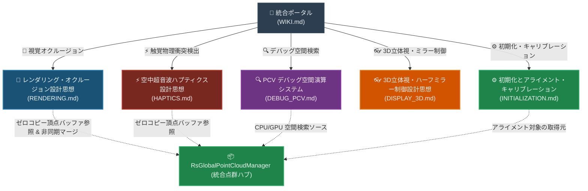

# RealTimeOcclusion システム統合 Wiki (ポータル)

本プロジェクトは、Intel RealSense 等のセンサーから取得したリアルタイム点群（Point Cloud）を基盤とし、**「視覚的な遮蔽処理（レンダリング・オクルージョン）」**と**「物理的な接触判定・触覚提示（ハプティクス）」**という 2つの高度なサブシステムを軸に構成されています。

本ドキュメントは、プロジェクト全体の設計思想・関数仕様を一元管理する統合ポータル（ハブ）です。詳細な機能やアルゴリズムの解説は、以下の専用機能ノード（詳細ドキュメント）に分離されて構成されています。

---

## 1. プロジェクト構造とノード依存関係

各ノードは、データソースであるグローバル点群マネージャー（`RsGlobalPointCloudManager`）をデータハブとし、完全に独立したモジュールとして連携しています。

---

## 2. 各ノード（サブシステム）へのナビゲーション

それぞれの機能やアルゴリズムの詳細、関数構成、Compute Shader 仕様、最適化ポリシーは以下の詳細 Wiki をご参照ください。

### ⚙️ 0. [初期化とアライメント・キャリブレーションシステム](./INITIALIZATION.md)
*   **目的**: 複数台の RealSense カメラの初期化および位置合わせ（アライメント）を管理し、調整した Transform 情報を JSON ファイルとして保存・復元します。
*   **コアモジュールと主要設計特徴**:
    *   **共通データハブとの連携**: `RsGlobalPointCloudManager` が提供するレンダラーリストを元に動作し、`RsMaterialController` とも共通のカメラ参照を共有。
    *   **JSONベースの設定保存・復元**: 各カメラのローカル位置・回転・スケール情報を `Assets/Config/RealSense/ChildTransforms.json` にエクスポートおよびインポート。
    *   **エディタのUndo対応**: JSONからのロード時、誤操作を防ぐための Undo/Redo (Ctrl+Z) 履歴登録と、エディタ画面の即時更新。
*   **詳細はこちら ──> [INITIALIZATION.md](./INITIALIZATION.md) を読む**

---

### 🎨 1. [視覚オクルージョン・レンダリングシステム](./RENDERING.md)
*   **目的**: 実環境の点群と Unity 仮想オブジェクトの前後遮蔽（オクルージョン）を URP RenderGraph 上で超高速に計算し、エッジ保存型の Hole Filling（穴埋め）を施して滑らかに描画します。
*   **コアモジュールと主要設計特徴**:
    *   **常時搭載の `RsIntegratedPointCloud` (GPU Direct Mode)**:
        `RsProcessingPipe` パイプライン内に常時組み込まれ、非同期スレッドから Marshal.Copy されたデータを `RsUnityMainThreadDispatcher` 経由で GPU 上でダイレクト処理し、CPU負荷を最小化。
    *   **`ColorFilter/` 事前処理**:
        HSV/YCbCr 空間閾値に基づく肌色等の抽出カリング (`RsColorBasedDepthCulling` / `RsGpuCullingProcessor`)、幾何学的アライメント補正 (`RsDepthToColorCalibration`)、およびパラメータ調整支援 (`RsCullingDebugExporter`) を統合。
    *   **GPU ゼロコピー・非同期 CommandBuffer マージ**:
        `RsGlobalPointCloudManager` (GlobalManager) 内で、CommandBuffer (名称 `"RsPointCloud.GlobalMerge"`) を構築し、`Graphics.ExecuteCommandBuffer` により CPU 待機時間ゼロで GPU 上で点群をマージ。
    *   **URP RenderGraph へのノンブロッキング・データパッシング**:
        `PCDRenderPass.RecordRenderGraph` 内で、外部バッファ参照と点数を引き渡すことで、CPU を一切ブロックせずに URP の描画フローへシームレスに組み込み。
    *   **多段 Compute Shader カーネル (`PCD_Occlusion.compute`)**:
        Joint Bilateral 補間、Pull-Push 補完、モルフォロジー演算などの多段演算を GPU 側で実行。また、タグベースのオクルージョン最適化 (`EnableTagBasedOptimization`) による仮想オブジェクト同士のセルフオクルージョン防止制御や、D3D11 環境における SRV/UAV 同時バインドハザードを回避する堅牢なアーキテクチャを採用しています。
*   **詳細はこちら ──> [RENDERING.md](./RENDERING.md) を読む**

---

### ⚡ 2. [空中超音波ハプティクス（触覚提示）システム](./HAPTICS.md)
*   **目的**: 統合点群と Unity 上の動的な仮想オブジェクトとの物理的な衝突判定を GPU で並列計算し、空中超音波触覚ディスプレイ（AUTD3等）と連携してリアルタイムに触覚フィードバックを提示します。
*   **コアモジュールと特徴**:
    *   `HapCollisionDetectors.cs`: C# 衝突オーケストレーター、BakeMesh による GC 対策。
    *   `HapCollisionDetectors.compute`: Broad-Phase AABB 枝切り、Narrow-Phase サンプリング、アトミック衝突調停。
*   **詳細はこちら ──> [HAPTICS.md](./HAPTICS.md) を読む**

---

### 🔍 3. [PCV デバッグ空間演算システム](./DEBUG_PCV.md)
*   **目的**: 点群データのリアルタイム可視化、CPU/GPU によるスパース点群の高速近傍検索、および空間情報のフィルタリングをサポートするデバッグ基盤です。
*   **コアモジュールと特徴**:
    *   `PCV_Controller` & `PCV_DataManager`: アセンブリリロード時のバッファ解放制御および姿勢補正アライメント同期。
    *   `PCV_VoxelGrid`: CPU 側 26 近傍 $O(1)$ 検索ハッシュ。
    *   `PCV_GpuVoxelGrid`: `RsVoxelGridBuilder.compute` を用いた GPU 空間ハッシュ・アトミックチェーン・アトミックバケットソート並列構築。
*   **詳細はこちら ──> [DEBUG_PCV.md](./DEBUG_PCV.md) を読む**

---

### 👓 4. [3D立体視・ハーフミラー制御システム](./DISPLAY_3D.md)
*   **目的**: 物理的な視線トラッキングセンサー（SRDisplay等）が取得した座標を、ハーフミラーを用いた光学配置に合わせて正確に補正し、現実と1ミリの狂いもなく同期する仮想カメラ制御を行います。
*   **コアモジュールと特徴**:
    *   `StereoCameraController.cs`: 物理センサーと虚像ディスプレイ間の空間オフセット（Z軸ギャップ）を完全に吸収する「仮想空間マトリックス合成」。
    *   ハーフミラー空間特有の反転に対応するための「鏡像化＆クロススワップ処理」。
*   **詳細はこちら ──> [DISPLAY_3D.md](./DISPLAY_3D.md) を読む**

---

## 3. 全体システムの最適化思想と共有価値

本プロジェクトは、1秒間に数万〜数十万点の点群データをリアルタイムに処理するため、以下の最適化思想をすべての機能ノードで共通して貫いています。

1.  **CPU-GPU ゼロコピー転送 & 非同期 CommandBuffer マージ**:
    RealSense 等から出力されたバッファは CPU にコピーバックせず GPU 上で保持し、さらに CommandBuffer を用いて CPU を全くブロックせずに GPU のみで非同期に統合マージを完了します。URP の RenderGraph パスへもノンブロッキングで引き渡され、徹底したハイパフォーマンスを担保します。
2.  **徹底的な GC（Garbage Collection）排除**:
    毎フレームの配列確保や一時オブジェクト生成を完全に排除し、バッファリサイズ時のキャッシュ＆再利用、構造体プール等を徹底しています。
3.  **アンマネージドネイティブ参照の厳密なライフサイクル管理**:
    C++ ネイティブ参照のメモリリークを確実に防止するため、`using` や `Dispose()` による速やかな解放を徹底し、高頻度動作時でも安定したパフォーマンスを維持します。
